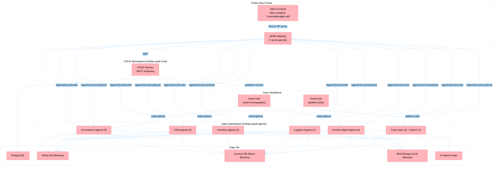

# Agent E2E Validation: Full-Stack Behavioral Testing

## Purpose

Simulate real user and operator behavior against every deployed agent service to validate that the full agentic retail platform works end-to-end. This is **not** automated unit/integration testing — it is a structured manual exploration where each agent is treated as an independent solution, exercised through its public HTTP endpoints, asynchronous Event Hub triggers, and MCP tool surface.

## When To Use

Use this skill when you need to:
- Validate all 26 agents are reachable and responding correctly after deployment.
- Run behavioral prompts of varying complexity against each agent domain.
- Verify Event Hub async processing chains are firing and completing.
- Test MCP tool calls between agents through APIM routing.
- Perform pre-demo or post-deployment confidence checks on the full platform.
- Diagnose issues across the distributed agent mesh.

**Trigger phrases**: "run e2e validation", "test all agents", "validate deployment", "agent smoke test", "behavioral test suite", "validate agent endpoints".

## MANDATORY: Pre-Flight Infrastructure Recovery

> **ALWAYS start here. Do not skip this section. Every validation session begins with infrastructure recovery.**

The dev environment is subject to MCAPSGov nightly automation that stops PostgreSQL, disables Entra AD auth, and shuts down the AKS cluster. The CRUD service (and by extension every agent that depends on it) will be completely down until recovery completes.

### Step 0: Run the Start-Dev-Environment Script

```powershell
./scripts/start-dev-environment.ps1
```

**What it does (in order)**:
1. Starts PostgreSQL Flexible Server (AKS pods depend on it being ready first)
2. Polls until PostgreSQL reports `Ready` state (up to 30 attempts, 10s each)
3. Re-enables Entra AD authentication if MCAPSGov disabled it
4. Re-registers the CRUD service managed identity as PostgreSQL Entra admin if dropped
5. Starts the AKS cluster if stopped
6. Detects unready CRUD pods and forces a rollout restart to acquire fresh Entra tokens

**Verify script completed successfully** — look for `Dev environment ready.` at the end.

### Step 0.1: Verify Core Connectivity

After the script completes, verify these endpoints respond before proceeding:

| Check | Command | Expected |
|-------|---------|----------|
| CRUD health | `curl -s $APIM_BASE/api/health` | `{"status": "ok"}` |
| CRUD readiness | `curl -s $APIM_BASE/api/ready` | `{"status": "ready", ...}` (DB + Redis + Event Hub) |
| Product listing | `curl -s "$APIM_BASE/api/products?limit=1"` | JSON array with at least 1 product |
| Agent health (any) | `curl -s $APIM_BASE/agents/ecommerce-catalog-search/health` | `{"status": "ok"}` |

Where `$APIM_BASE` is resolved from:
1. `azd env get-values` → `APIM_GATEWAY_URL` (preferred)
2. Computed: `https://<projectName>-<environment>-apim.azure-api.net`
3. **Fallback**: Use the SWA proxy at `https://blue-meadow-00fcb8810.4.azurestaticapps.net/api` (routes through Next.js API proxy → APIM)

### Step 0.2: Deep Investigation Protocol

If **any** pre-flight check fails, do NOT proceed to agent testing. Instead:

1. **Check AKS pod status**: `kubectl get pods -n holiday-peak-crud --no-headers` and `kubectl get pods -n holiday-peak-agents --no-headers`
2. **Check pod logs**: `kubectl logs -n holiday-peak-crud deployment/crud-service-crud-service --tail=50`
3. **Check Event Hub connectivity**: `kubectl logs -n holiday-peak-agents deployment/<agent-name> --tail=30 | grep -i "event.*hub\|consumer\|partition"`
4. **Check Redis**: `kubectl exec -n holiday-peak-crud deployment/crud-service-crud-service -- python -c "import redis; r=redis.from_url('$REDIS_URL'); print(r.ping())"`
5. **Check Cosmos DB**: verify `COSMOS_ACCOUNT_URI` is reachable via `curl -s "$COSMOS_ACCOUNT_URI" -o /dev/null -w "%{http_code}"`
6. **Check APIM proxy**: `curl -sv $APIM_BASE/api/health 2>&1 | grep "< HTTP"`
7. **Re-run the recovery script** if infrastructure was partially recovered
8. **Document every failure** with timestamp, endpoint, HTTP status, and response body before retrying

## Non-Functional Requirements

### Sync Agents (11 — real-time, user-facing)

Agents: ecommerce-catalog-search, ecommerce-cart-intelligence, ecommerce-checkout-support, ecommerce-order-status, ecommerce-product-detail-enrichment, crm-profile-aggregation, crm-support-assistance, inventory-reservation-validation, logistics-eta-computation, logistics-carrier-selection, logistics-returns-support.

| Requirement | Target | Validation |
|---|---|---|
| Agent health response | < 2 seconds | `GET /agents/{service}/health` |
| Invoke response P95 | < 8 seconds (5s pipeline + 3s HTTP overhead) | `POST /agents/{service}/invoke` |
| Streaming response (SSE) | First token < 3 seconds | `POST /agents/{service}/invoke/stream` |
| MCP tool call | < 5 seconds round-trip | `POST /agents/{service}/mcp/{tool}` |
| CRUD REST operations | < 500ms for reads, < 1s for writes | Standard REST calls |

### Async Agents (15 — background, event-driven)

Agents: crm-campaign-intelligence, crm-segmentation-personalization, inventory-alerts-triggers, inventory-health-check, inventory-jit-replenishment, logistics-route-issue-detection, product-management-acp-transformation, product-management-assortment-optimization, product-management-consistency-validation, product-management-normalization-classification, search-enrichment-agent, truth-ingestion, truth-enrichment, truth-hitl, truth-export.

| Requirement | Target | Validation |
|---|---|---|
| Agent health response | < 2 seconds | `GET /agents/{service}/health` |
| Event Hub processing | Event consumed within 30 seconds | Check agent logs after CRUD event publish |
| Consumer lag | < 10 minutes behind head | Event Hubs consumer group lag metric |
| Throughput (batch window) | Process ≥ 95% of events per 15-min window | Log Analytics query on processed vs received |
| MCP tool call | < 5 seconds round-trip | `POST /agents/{service}/mcp/{tool}` |

> **Note:** Async agents do NOT have an invoke latency SLA. Their `/invoke` endpoint (if present) is used for manual testing only and is not subject to the 8-second target.

## Architecture Overview



## Endpoint Reference

### Standard Agent Endpoints (all 26 agents)

Every agent built with `create_standard_app()` exposes:

| Endpoint | Method | Purpose |
|----------|--------|---------|
| `/health` | GET | Liveness check |
| `/ready` | GET | Readiness (memory tiers, Foundry bindings) |
| `/invoke` | POST | Synchronous agent invocation |
| `/invoke/stream` | POST | SSE streaming invocation |
| `/integrations` | GET | List connected integrations |
| `/self-healing/status` | GET | Self-healing kernel status |
| `/agent/traces` | GET | Recent trace data |
| `/agent/metrics` | GET | Agent performance metrics |
| `/mcp/{tool_name}` | POST | MCP tool call (agent-to-agent) |

### APIM Routing Convention

```
APIM Gateway
├── /api/*                              → CRUD Service (REST)
├── /agents/{service-name}/invoke       → Agent POST /invoke
├── /agents/{service-name}/health       → Agent GET /health
├── /agents/{service-name}/mcp/{tool}   → Agent POST /mcp/{tool}
└── /agents/{service-name}/invoke/stream → Agent POST /invoke/stream
```

### Public Endpoint Resolution

Use this priority order to determine the base URL:

1. **`APIM_GATEWAY_URL`** from `azd env get-values` (production-grade, direct to APIM)
2. **Computed APIM URL**: `https://{projectName}-{env}-apim.azure-api.net`
3. **SWA proxy** (fallback): `https://blue-meadow-00fcb8810.4.azurestaticapps.net/api` — routes through Next.js `[...path]/route.ts` → APIM

---

## Testing Plan: Agent-by-Agent Behavioral Validation

Each agent is tested independently as a standalone solution. Tests are grouped by domain and graded by complexity.

### Complexity Scale

| Level | Label | Description |
|-------|-------|-------------|
| 0 | **None** | Health check, simple GET, no AI reasoning |
| 1 | **Low** | Single-intent query, deterministic response expected |
| 2 | **Medium** | Multi-attribute query, requires context aggregation |
| 3 | **High** | Multi-step reasoning, cross-domain, ambiguous intent |

### Call Type Legend

| Type | Symbol | Description |
|------|--------|-------------|
| HTTP Sync | `[HTTP]` | `POST /agents/{svc}/invoke` with JSON payload |
| HTTP Stream | `[SSE]` | `POST /agents/{svc}/invoke/stream` with SSE response |
| Event Hub Async | `[EH]` | Trigger via CRUD action that publishes to Event Hub; verify agent consumed event |
| MCP Tool | `[MCP]` | `POST /agents/{svc}/mcp/{tool}` structured data call |
| CRUD REST | `[REST]` | Direct CRUD REST endpoint call (supports agent testing) |

---

### Domain 1: eCommerce (5 agents)

#### 1.1 ecommerce-catalog-search

APIM path: `/agents/ecommerce-catalog-search`

| # | Complexity | Type | Prompt / Action | Expected Behavior | Validation |
|---|------------|------|-----------------|-------------------|------------|
| 1 | None | `[HTTP]` | `POST /invoke` with `{"query": "ping", "limit": 1, "mode": "keyword"}` | Returns response with `results` array and `mode` field | HTTP 200, response < 2s |
| 2 | Low | `[HTTP]` | `{"query": "red running shoes", "limit": 5, "mode": "intelligent"}` | Returns athletic footwear results | Results contain shoe/footwear items, < 5s |
| 3 | Medium | `[HTTP]` | `{"query": "I'm traveling to Russia next month, which clothes should I get?", "limit": 5, "mode": "intelligent"}` | Intent classification identifies cold-weather clothing | `result_type` is not `degraded_fallback`, results are contextually relevant |
| 4 | Medium | `[SSE]` | Same as #3 but via `/invoke/stream` | Progressive token streaming | First token < 3s, no flash-of-full-content |
| 5 | High | `[HTTP]` | `{"query": "I'm buying a new house, 140 square meters, I need furniture and I like modern stuff", "limit": 10, "mode": "intelligent"}` | Multi-intent: furniture + modern style + size context | Sub-query fan-out, results span furniture categories |
| 6 | High | `[HTTP]` | `{"query": "My dog ate his collar, help me out", "limit": 5, "mode": "intelligent"}` | Understands implicit need (replacement pet collar) | Returns pet supplies, not random results |
| 7 | Medium | `[MCP]` | `POST /mcp/search_products` with `{"query": "winter boots", "limit": 3}` | Structured product results for downstream agent | Returns dict with product list |
| 8 | Low | `[EH]` | Create a product via `POST /api/products` (CRUD) → publishes `product-events` | catalog-search agent receives and indexes the event | Verify via agent logs or search the new product |
| 9 | High | `[HTTP]` | `{"query": "What's the best gear for a week-long hike in the Swiss Alps?", "limit": 8, "mode": "intelligent"}` | Multi-category: hiking boots, jackets, backpacks, accessories | Results span multiple categories |
| 10 | High | `[HTTP]` | `{"query": "Help me pick a stylish but comfortable outfit for a music festival weekend", "limit": 8, "mode": "intelligent"}` | Balances comfort + style, casual wear | Subjective intent handled, results are fashion-relevant |

#### 1.2 ecommerce-cart-intelligence

APIM path: `/agents/ecommerce-cart-intelligence`

| # | Complexity | Type | Prompt / Action | Expected Behavior | Validation |
|---|------------|------|-----------------|-------------------|------------|
| 1 | None | `[HTTP]` | `GET /health` | Health OK | HTTP 200 |
| 2 | Low | `[HTTP]` | `POST /invoke` with `{"query": "What should I add to my cart?", "user_id": "test-user-1"}` | Cart recommendations based on user context | Returns product suggestions |
| 3 | Medium | `[HTTP]` | `{"query": "I have running shoes in my cart, what else do I need for marathon training?"}` | Complementary product suggestions | Returns socks, water bottles, shorts, etc. |
| 4 | Medium | `[MCP]` | `POST /mcp/get_cart_recommendations` with `{"user_id": "test-user-1"}` | Structured recommendation payload | Dict with recommended product IDs |
| 5 | High | `[HTTP]` | `{"query": "I'm hosting a dinner party for 8, what do I need from my cart perspective?"}` | Cross-category: kitchen, dining, food, decor | Multi-domain reasoning |
| 6 | Low | `[EH]` | Place an order via `POST /api/orders` → publishes `order-events` | cart-intelligence receives order event and updates recommendations | Check agent logs for event processing |
| 7 | High | `[HTTP]` | `{"query": "My budget is $200, optimize my cart for best value"}` | Budget-aware filtering and prioritization | Respects price constraint |
| 8 | Medium | `[EH]` | Update inventory via `PATCH /api/inventory/{sku}` → publishes `inventory-events` | Agent updates cart suggestions based on stock changes | Event consumed within 30s |
| 9 | Low | `[HTTP]` | `{"query": "Remove duplicates from my suggestions"}` | De-duplication logic | No repeated products in response |
| 10 | High | `[SSE]` | `{"query": "Compare the items in my cart and suggest upgrades for each"}` via `/invoke/stream` | Streaming comparison analysis | Progressive tokens, structured comparison |

#### 1.3 ecommerce-checkout-support

APIM path: `/agents/ecommerce-checkout-support`

| # | Complexity | Type | Prompt / Action | Expected Behavior | Validation |
|---|------------|------|-----------------|-------------------|------------|
| 1 | None | `[HTTP]` | `GET /health` | Health OK | HTTP 200 |
| 2 | Low | `[HTTP]` | `POST /invoke` with `{"query": "Can I check out now?", "session_id": "test-session"}` | Checkout eligibility assessment | Returns validation result |
| 3 | Medium | `[HTTP]` | `{"query": "I want to split payment between two cards"}` | Payment method guidance | Explains payment options or limitations |
| 4 | Medium | `[MCP]` | `POST /mcp/validate_checkout_allocation` with `{"session_id": "test-session"}` | Structured allocation check | Dict with allocation status per item |
| 5 | High | `[HTTP]` | `{"query": "I have 3 items from different warehouses, what's the fastest way to get everything?"}` | Multi-warehouse checkout optimization | Considers shipping consolidation |
| 6 | Low | `[EH]` | Reserve inventory via `POST /api/inventory/reservations` → publishes `inventory-events` | Agent validates reservation allocation | Event consumed, allocation tracked |
| 7 | High | `[HTTP]` | `{"query": "Apply my loyalty discount, use gift card for $50, and pay the rest with credit card"}` | Multi-payment-method orchestration | Handles complex payment splitting |
| 8 | Medium | `[HTTP]` | `{"query": "One item is backordered, should I wait or ship what's available?"}` | Partial fulfillment decision support | Provides options with trade-offs |
| 9 | Low | `[HTTP]` | `{"query": "What's my order total with tax?"}` | Tax calculation summary | Returns computed total |
| 10 | High | `[SSE]` | `{"query": "Walk me through the entire checkout process step by step"}` via `/invoke/stream` | Guided checkout walkthrough | Streaming multi-step guidance |

#### 1.4 ecommerce-order-status

APIM path: `/agents/ecommerce-order-status`

| # | Complexity | Type | Prompt / Action | Expected Behavior | Validation |
|---|------------|------|-----------------|-------------------|------------|
| 1 | None | `[HTTP]` | `GET /health` | Health OK | HTTP 200 |
| 2 | Low | `[HTTP]` | `POST /invoke` with `{"query": "Where is my order?", "order_id": "ORD-001"}` | Order tracking information | Returns status and location |
| 3 | Medium | `[HTTP]` | `{"query": "My order was supposed to arrive yesterday, what happened?"}` | Delay explanation with context | Identifies delay reason |
| 4 | Medium | `[MCP]` | `POST /mcp/get_order_tracking` with `{"order_id": "ORD-001"}` | Structured tracking data | Dict with carrier, status, ETA |
| 5 | High | `[HTTP]` | `{"query": "I have 5 pending orders, which one will arrive first?"}` | Multi-order comparison with ETA ranking | Sorted by expected delivery |
| 6 | Low | `[EH]` | Trigger shipment via CRUD → publishes `shipment-events` | order-status agent receives shipment update | Event consumed, status updated |
| 7 | High | `[HTTP]` | `{"query": "My package shows delivered but I never received it, what should I do?"}` | Missing package resolution flow | Escalation guidance, support ticket suggestion |
| 8 | Medium | `[HTTP]` | `{"query": "Can I change the delivery address for order ORD-001?"}` | Address change feasibility check | Returns whether modification is possible |
| 9 | Low | `[HTTP]` | `{"query": "Track order ORD-001"}` | Simple tracking | Direct status response |
| 10 | High | `[SSE]` | `{"query": "Give me a detailed timeline of everything that happened with order ORD-001"}` via `/invoke/stream` | Full order lifecycle narrative | Streaming event history |

#### 1.5 ecommerce-product-detail-enrichment

APIM path: `/agents/ecommerce-product-detail-enrichment`

| # | Complexity | Type | Prompt / Action | Expected Behavior | Validation |
|---|------------|------|-----------------|-------------------|------------|
| 1 | None | `[HTTP]` | `GET /health` | Health OK | HTTP 200 |
| 2 | Low | `[HTTP]` | `POST /invoke` with `{"query": "Enrich product SKU-001", "entity_id": "SKU-001"}` | Product detail enrichment | Returns enriched attributes |
| 3 | Medium | `[HTTP]` | `{"query": "What attributes are missing for product SKU-001?"}` | Gap analysis for product | Lists missing UCP attributes |
| 4 | Medium | `[MCP]` | `POST /mcp/get_enrichment_metadata` with `{"entity_id": "SKU-001"}` | Structured enrichment status | Dict with completeness score, gaps |
| 5 | High | `[HTTP]` | `{"query": "Enrich all products in the electronics category with ACP metadata"}` | Batch enrichment orchestration | Processes multiple products |
| 6 | Low | `[EH]` | Update product via CRUD → publishes `product-events` | Agent triggers enrichment pipeline | Event consumed, enrichment started |
| 7 | High | `[HTTP]` | `{"query": "Generate SEO-optimized descriptions for all products missing them"}` | Content generation with SEO focus | Produces keyword-rich descriptions |
| 8 | Medium | `[HTTP]` | `{"query": "Compare enrichment quality between AI-generated and human-written descriptions"}` | Quality comparison analysis | Confidence score comparison |
| 9 | Low | `[HTTP]` | `{"query": "Show enrichment status for SKU-001"}` | Simple status check | Returns current enrichment state |
| 10 | High | `[SSE]` | `{"query": "Run full enrichment on SKU-001 and explain each step as you go"}` via `/invoke/stream` | Streaming enrichment walkthrough | Progressive step-by-step output |

---

### Domain 2: CRM (4 agents)

#### 2.1 crm-campaign-intelligence

APIM path: `/agents/crm-campaign-intelligence`

| # | Complexity | Type | Prompt / Action | Expected Behavior | Validation |
|---|------------|------|-----------------|-------------------|------------|
| 1 | None | `[HTTP]` | `GET /health` | Health OK | HTTP 200 |
| 2 | Low | `[HTTP]` | `POST /invoke` with `{"query": "What campaigns are running?"}` | Active campaign list | Returns campaign summaries |
| 3 | Medium | `[HTTP]` | `{"query": "Which campaign had the best conversion rate last month?"}` | Campaign performance analysis | Ranked by conversion metrics |
| 4 | Medium | `[MCP]` | `POST /mcp/get_campaign_orchestration` with `{"campaign_id": "CAMP-001"}` | Structured campaign data | Dict with targeting, performance, status |
| 5 | High | `[HTTP]` | `{"query": "Design a Black Friday campaign targeting high-value customers who bought electronics last year"}` | Campaign generation with segmentation | Multi-criteria targeting strategy |
| 6 | Low | `[EH]` | Process payment via `POST /api/payments` → publishes `payment-events` | campaign-intelligence updates campaign attribution | Event consumed, attribution tracked |
| 7 | High | `[HTTP]` | `{"query": "Compare the ROI of email vs push notification campaigns for Q4"}` | Cross-channel campaign analysis | ROI comparison with recommendations |
| 8 | Medium | `[EH]` | Create order via `POST /api/orders` → publishes `order-events` | Agent updates campaign metrics from order | Event consumed within 30s |
| 9 | Low | `[HTTP]` | `{"query": "Show me campaign CAMP-001 details"}` | Single campaign lookup | Returns campaign record |
| 10 | High | `[SSE]` | `{"query": "Generate a full holiday season campaign strategy with timeline, segments, and channel allocation"}` via `/invoke/stream` | Complex multi-step campaign plan | Streaming strategic document |

#### 2.2 crm-profile-aggregation

APIM path: `/agents/crm-profile-aggregation`

| # | Complexity | Type | Prompt / Action | Expected Behavior | Validation |
|---|------------|------|-----------------|-------------------|------------|
| 1 | None | `[HTTP]` | `GET /health` | Health OK | HTTP 200 |
| 2 | Low | `[HTTP]` | `POST /invoke` with `{"query": "Get profile for user-1"}` | User profile aggregation | Returns unified profile |
| 3 | Medium | `[HTTP]` | `{"query": "What are the purchase patterns for user-1 over the last 6 months?"}` | Temporal purchase analysis | Pattern identification |
| 4 | Medium | `[MCP]` | `POST /mcp/get_profile_context` with `{"user_id": "user-1"}` | Structured profile context | Dict with demographics, preferences, history |
| 5 | High | `[HTTP]` | `{"query": "Build a 360-degree customer view combining orders, support tickets, and browsing behavior"}` | Cross-domain profile synthesis | Aggregates multiple data sources |
| 6 | Low | `[EH]` | Update user profile via `PATCH /api/users/me` → publishes `user-events` | profile-aggregation updates cached profile | Event consumed, profile refreshed |
| 7 | High | `[HTTP]` | `{"query": "Predict churn risk for customers who haven't ordered in 90 days"}` | Churn prediction analysis | Risk scores with reasoning |
| 8 | Medium | `[EH]` | Place order via `POST /api/orders` → publishes `order-events` | Agent incorporates new order into profile | Profile updated with latest order |
| 9 | Low | `[HTTP]` | `{"query": "Show preferences for user-1"}` | Simple preference lookup | Returns stored preferences |
| 10 | High | `[SSE]` | `{"query": "Generate a comprehensive customer lifetime value report for user-1"}` via `/invoke/stream` | CLV analysis with purchase history | Streaming analytical report |

#### 2.3 crm-segmentation-personalization

APIM path: `/agents/crm-segmentation-personalization`

| # | Complexity | Type | Prompt / Action | Expected Behavior | Validation |
|---|------------|------|-----------------|-------------------|------------|
| 1 | None | `[HTTP]` | `GET /health` | Health OK | HTTP 200 |
| 2 | Low | `[HTTP]` | `POST /invoke` with `{"query": "What segments exist?"}` | List of customer segments | Returns segment definitions |
| 3 | Medium | `[HTTP]` | `{"query": "Which segment has the highest average order value?"}` | Segment ranking by AOV | Ranked segment list |
| 4 | Medium | `[MCP]` | `POST /mcp/get_segmentation` with `{"criteria": "high_value"}` | Structured segment data | Dict with member count, criteria, metrics |
| 5 | High | `[HTTP]` | `{"query": "Create a new segment for customers who buy both electronics and pet supplies"}` | Cross-category segment creation | New segment definition with rules |
| 6 | Low | `[HTTP]` | `{"query": "How many customers are in the VIP segment?"}` | Simple count query | Returns member count |
| 7 | High | `[HTTP]` | `{"query": "Personalize the homepage for a returning customer who browsed winter coats but didn't buy"}` | Personalization strategy | Content recommendations for abandoned browse |
| 8 | Medium | `[HTTP]` | `{"query": "Compare engagement rates between the 'new customers' and 'loyal customers' segments"}` | Segment comparison analysis | Side-by-side metrics |
| 9 | Low | `[HTTP]` | `{"query": "Show segment VIP details"}` | Single segment lookup | Returns segment record |
| 10 | High | `[SSE]` | `{"query": "Design a personalization strategy for each of our top 5 segments with channel-specific content"}` via `/invoke/stream` | Multi-segment personalization plan | Streaming strategic output |

#### 2.4 crm-support-assistance

APIM path: `/agents/crm-support-assistance`

| # | Complexity | Type | Prompt / Action | Expected Behavior | Validation |
|---|------------|------|-----------------|-------------------|------------|
| 1 | None | `[HTTP]` | `GET /health` | Health OK | HTTP 200 |
| 2 | Low | `[HTTP]` | `POST /invoke` with `{"query": "I need help with my order"}` | Support ticket initiation | Acknowledgment with ticket ID |
| 3 | Medium | `[HTTP]` | `{"query": "My product arrived damaged, I want a replacement"}` | Damage claim processing | Returns resolution options (replace, refund) |
| 4 | Medium | `[MCP]` | `POST /mcp/create_support_ticket` with `{"issue": "damaged_product", "order_id": "ORD-001"}` | Structured ticket creation | Dict with ticket ID, priority, assignee |
| 5 | High | `[HTTP]` | `{"query": "I've had 3 issues with my last 3 orders, I'm considering canceling my membership"}` | Escalation with retention strategy | Identifies pattern, suggests retention actions |
| 6 | Low | `[EH]` | Initiate return via `POST /api/returns` → publishes `return-events` | support-assistance receives return event | Event consumed, ticket auto-created |
| 7 | High | `[HTTP]` | `{"query": "I ordered a gift, it arrived late, and the recipient already bought the same thing. Can I return it even though it's past the window?"}` | Complex exception handling | Evaluates return policy edge case |
| 8 | Medium | `[HTTP]` | `{"query": "What's the status of my support ticket TICKET-001?"}` | Ticket status inquiry | Returns ticket state and updates |
| 9 | Low | `[HTTP]` | `{"query": "I want to speak to a human agent"}` | Escalation to human | Escalation path triggered |
| 10 | High | `[SSE]` | `{"query": "Review my entire interaction history and suggest how to prevent issues like these in the future"}` via `/invoke/stream` | Full interaction analysis with recommendations | Streaming analytical response |

---

### Domain 3: Inventory (4 agents)

#### 3.1 inventory-alerts-triggers

APIM path: `/agents/inventory-alerts-triggers`

| # | Complexity | Type | Prompt / Action | Expected Behavior | Validation |
|---|------------|------|-----------------|-------------------|------------|
| 1 | None | `[HTTP]` | `GET /health` | Health OK | HTTP 200 |
| 2 | Low | `[HTTP]` | `POST /invoke` with `{"query": "Are there any active inventory alerts?"}` | Active alert list | Returns current alerts |
| 3 | Medium | `[HTTP]` | `{"query": "Which products are below their reorder threshold?"}` | Threshold breach analysis | List of products below threshold |
| 4 | Medium | `[MCP]` | `POST /mcp/dispatch_alert` with `{"sku": "SKU-001", "alert_type": "low_stock"}` | Structured alert dispatch | Dict with alert ID, severity, actions |
| 5 | High | `[HTTP]` | `{"query": "Predict which products will hit zero stock in the next 7 days based on current velocity"}` | Predictive stock-out analysis | Velocity-based forecasting |
| 6 | Low | `[EH]` | Update inventory via CRUD → publishes `inventory-events` | alerts-triggers evaluates threshold | Event consumed, alert generated if breached |
| 7 | High | `[HTTP]` | `{"query": "Create an alert strategy for the holiday season with dynamic thresholds based on demand forecasts"}` | Dynamic threshold planning | Season-aware alert configuration |
| 8 | Medium | `[HTTP]` | `{"query": "Show me all alerts triggered in the last 24 hours"}` | Recent alert history | Time-filtered alert list |
| 9 | Low | `[HTTP]` | `{"query": "Check stock level for SKU-001"}` | Simple stock check | Returns current stock |
| 10 | High | `[SSE]` | `{"query": "Analyze our entire inventory alert history and recommend threshold adjustments per category"}` via `/invoke/stream` | Category-level threshold optimization | Streaming analytical report |

#### 3.2 inventory-health-check

APIM path: `/agents/inventory-health-check`

| # | Complexity | Type | Prompt / Action | Expected Behavior | Validation |
|---|------------|------|-----------------|-------------------|------------|
| 1 | None | `[HTTP]` | `GET /health` | Health OK | HTTP 200 |
| 2 | Low | `[HTTP]` | `POST /invoke` with `{"query": "How is our inventory health?"}` | Overall health summary | Returns health metrics |
| 3 | Medium | `[HTTP]` | `{"query": "Which categories have the worst stock turn ratio?"}` | Category-level turn analysis | Ranked by efficiency |
| 4 | Medium | `[MCP]` | `POST /mcp/get_health_metrics` with `{"category": "electronics"}` | Structured health metrics | Dict with stock levels, turn ratio, aging |
| 5 | High | `[HTTP]` | `{"query": "Identify dead stock across all categories and recommend clearance strategies"}` | Dead stock identification + clearance plan | Multi-category analysis |
| 6 | Low | `[EH]` | Inventory event from CRUD → publishes `inventory-events` | health-check updates health metrics | Event consumed, metrics recalculated |
| 7 | High | `[HTTP]` | `{"query": "Compare our inventory health this month vs last month and highlight the biggest changes"}` | Month-over-month comparison | Trend analysis with deltas |
| 8 | Medium | `[HTTP]` | `{"query": "What's the average days-on-hand for our top 20 selling products?"}` | Days-on-hand calculation | Per-product metric |
| 9 | Low | `[HTTP]` | `{"query": "Inventory health summary"}` | Quick summary | Condensed health report |
| 10 | High | `[SSE]` | `{"query": "Generate a full inventory health report with recommendations for Q1 planning"}` via `/invoke/stream` | Comprehensive health report | Streaming analytical output |

#### 3.3 inventory-jit-replenishment

APIM path: `/agents/inventory-jit-replenishment`

| # | Complexity | Type | Prompt / Action | Expected Behavior | Validation |
|---|------------|------|-----------------|-------------------|------------|
| 1 | None | `[HTTP]` | `GET /health` | Health OK | HTTP 200 |
| 2 | Low | `[HTTP]` | `POST /invoke` with `{"query": "What needs to be reordered?"}` | Reorder recommendations | Returns items needing replenishment |
| 3 | Medium | `[HTTP]` | `{"query": "Calculate optimal reorder quantities for electronics category"}` | Category-specific reorder plan | Quantities based on velocity and lead time |
| 4 | Medium | `[MCP]` | `POST /mcp/get_replenishment_plan` with `{"sku": "SKU-001"}` | Structured replenishment data | Dict with quantity, supplier, lead time |
| 5 | High | `[HTTP]` | `{"query": "Design a just-in-time replenishment strategy for the holiday peak season, considering 3x normal demand"}` | Peak season JIT strategy | Demand multiplier + supplier capacity |
| 6 | Low | `[EH]` | Order placed via `POST /api/orders` → publishes `order-events` | JIT recalculates replenishment needs | Event consumed, reorder quantities updated |
| 7 | High | `[HTTP]` | `{"query": "One of our suppliers has a 2-week delay, redistribute orders across alternative suppliers"}` | Supplier disruption response | Multi-supplier rebalancing |
| 8 | Medium | `[EH]` | Inventory update → publishes `inventory-events` | JIT adjusts replenishment based on new stock levels | Event consumed within 30s |
| 9 | Low | `[HTTP]` | `{"query": "What's the reorder point for SKU-001?"}` | Simple reorder point lookup | Returns calculated ROP |
| 10 | High | `[SSE]` | `{"query": "Generate a 30-day replenishment forecast for all categories considering seasonal demand patterns"}` via `/invoke/stream` | Multi-category forecast | Streaming forecast report |

#### 3.4 inventory-reservation-validation

APIM path: `/agents/inventory-reservation-validation`

| # | Complexity | Type | Prompt / Action | Expected Behavior | Validation |
|---|------------|------|-----------------|-------------------|------------|
| 1 | None | `[HTTP]` | `GET /health` | Health OK | HTTP 200 |
| 2 | Low | `[HTTP]` | `POST /invoke` with `{"query": "Validate reservation RES-001"}` | Reservation validation | Returns validation status |
| 3 | Medium | `[HTTP]` | `{"query": "Are there any expired reservations that need cleanup?"}` | Reservation audit | Lists stale reservations |
| 4 | Medium | `[MCP]` | `POST /mcp/check_reservation` with `{"reservation_id": "RES-001"}` | Structured reservation check | Dict with status, expiry, allocated quantity |
| 5 | High | `[HTTP]` | `{"query": "We have 50 units of SKU-001 but 60 units reserved across all checkouts, resolve the over-reservation"}` | Over-reservation conflict resolution | Priority-based allocation strategy |
| 6 | Low | `[EH]` | Create reservation via `POST /api/inventory/reservations` → publishes `inventory-events` | Agent validates the reservation | Event consumed, validation performed |
| 7 | High | `[HTTP]` | `{"query": "Analyze reservation patterns and identify products that consistently over-reserve"}` | Reservation pattern analysis | Historical over-reservation trends |
| 8 | Medium | `[HTTP]` | `{"query": "How many active reservations do we have, and what's the total committed quantity?"}` | Reservation summary metrics | Aggregated counts |
| 9 | Low | `[HTTP]` | `{"query": "Release reservation RES-001"}` | Simple release | Confirmation of release |
| 10 | High | `[SSE]` | `{"query": "Model the impact of reducing reservation TTL from 30 to 15 minutes on stock availability"}` via `/invoke/stream` | TTL impact simulation | Streaming analysis |

---

### Domain 4: Logistics (4 agents)

#### 4.1 logistics-carrier-selection

APIM path: `/agents/logistics-carrier-selection`

| # | Complexity | Type | Prompt / Action | Expected Behavior | Validation |
|---|------------|------|-----------------|-------------------|------------|
| 1 | None | `[HTTP]` | `GET /health` | Health OK | HTTP 200 |
| 2 | Low | `[HTTP]` | `POST /invoke` with `{"query": "Which carrier should I use for a package to São Paulo?"}` | Carrier recommendation | Returns ranked carriers |
| 3 | Medium | `[HTTP]` | `{"query": "Compare FedEx vs DHL for international shipment of fragile electronics, 2kg"}` | Multi-criteria carrier comparison | Cost, speed, reliability comparison |
| 4 | Medium | `[MCP]` | `POST /mcp/get_carrier_routing` with `{"destination": "São Paulo, Brazil", "weight_kg": 2}` | Structured carrier data | Dict with carrier options, costs, ETAs |
| 5 | High | `[HTTP]` | `{"query": "Optimize carrier selection for 500 holiday orders going to 12 different countries, minimize cost while ensuring delivery before December 24"}` | Bulk carrier optimization | Multi-destination, deadline-constrained routing |
| 6 | Low | `[EH]` | CRUD publishes `shipment-events` on shipment creation | carrier-selection receives shipment | Event consumed, carrier assigned |
| 7 | High | `[HTTP]` | `{"query": "A carrier just announced a strike, reroute all pending shipments to alternatives"}` | Emergency carrier rerouting | Disruption handling with alternatives |
| 8 | Medium | `[HTTP]` | `{"query": "What's the cheapest carrier for next-day delivery within the US?"}` | Filtered carrier search | Cost-optimized with speed constraint |
| 9 | Low | `[HTTP]` | `{"query": "List available carriers for domestic shipments"}` | Simple carrier list | Returns domestic carriers |
| 10 | High | `[SSE]` | `{"query": "Generate a carrier performance report for last quarter with recommendations for contract renegotiation"}` via `/invoke/stream` | Carrier performance analytics | Streaming performance report |

#### 4.2 logistics-eta-computation

APIM path: `/agents/logistics-eta-computation`

| # | Complexity | Type | Prompt / Action | Expected Behavior | Validation |
|---|------------|------|-----------------|-------------------|------------|
| 1 | None | `[HTTP]` | `GET /health` | Health OK | HTTP 200 |
| 2 | Low | `[HTTP]` | `POST /invoke` with `{"query": "ETA for shipment SHIP-001"}` | Delivery estimate | Returns computed ETA |
| 3 | Medium | `[HTTP]` | `{"query": "If I order now, when will it arrive in São Paulo considering customs clearance?"}` | ETA with customs factor | Includes customs delay estimate |
| 4 | Medium | `[MCP]` | `POST /mcp/calculate_eta` with `{"shipment_id": "SHIP-001"}` | Structured ETA data | Dict with ETA, confidence, factors |
| 5 | High | `[HTTP]` | `{"query": "Compute ETAs for 100 pending shipments and flag any that won't meet their promised delivery date"}` | Batch ETA with SLA risk | At-risk shipments highlighted |
| 6 | Low | `[EH]` | Shipment event published to `shipment-events` | ETA agent receives and computes estimate | Event consumed, ETA calculated |
| 7 | High | `[HTTP]` | `{"query": "A hurricane is approaching the Southeast US, recalculate all ETAs for affected shipments"}` | Weather-disruption ETA adjustment | Revised ETAs with weather factor |
| 8 | Medium | `[EH]` | Order placed via `POST /api/orders` → publishes `order-events` | ETA pre-computed for new order | Event consumed, initial ETA set |
| 9 | Low | `[HTTP]` | `{"query": "Average delivery time to New York?"}` | Simple average lookup | Returns historical average |
| 10 | High | `[SSE]` | `{"query": "Analyze delivery performance trends over the last 6 months and predict next month's on-time rate"}` via `/invoke/stream` | Delivery trend analysis | Streaming predictive report |

#### 4.3 logistics-returns-support

APIM path: `/agents/logistics-returns-support`

| # | Complexity | Type | Prompt / Action | Expected Behavior | Validation |
|---|------------|------|-----------------|-------------------|------------|
| 1 | None | `[HTTP]` | `GET /health` | Health OK | HTTP 200 |
| 2 | Low | `[HTTP]` | `POST /invoke` with `{"query": "I want to return my order"}` | Return initiation | Returns process and label info |
| 3 | Medium | `[HTTP]` | `{"query": "What's the most cost-effective return method for a large furniture item?"}` | Return logistics optimization | Considers item size and carrier options |
| 4 | Medium | `[MCP]` | `POST /mcp/get_return_logistics` with `{"return_id": "RET-001"}` | Structured return logistics | Dict with carrier, label, pickup schedule |
| 5 | High | `[HTTP]` | `{"query": "Process 50 returns from a product recall, optimize reverse logistics for warehouse sorting"}` | Batch recall return processing | Multi-item reverse logistics plan |
| 6 | Low | `[EH]` | Return initiated via `POST /api/returns` → publishes `return-events` | returns-support processes return logistics | Event consumed, return routed |
| 7 | High | `[HTTP]` | `{"query": "Customer is in a remote area with no carrier pickup, suggest alternative return methods"}` | Non-standard return handling | Drop-off locations, postal service alternatives |
| 8 | Medium | `[HTTP]` | `{"query": "Track return RET-001 from customer to warehouse"}` | Return tracking | Returns current location and status |
| 9 | Low | `[HTTP]` | `{"query": "Generate return label for order ORD-001"}` | Label generation | Returns label data/URL |
| 10 | High | `[SSE]` | `{"query": "Analyze our return rates by category and recommend packaging improvements to reduce damage-related returns"}` via `/invoke/stream` | Return analytics with recommendations | Streaming analytical report |

#### 4.4 logistics-route-issue-detection

APIM path: `/agents/logistics-route-issue-detection`

| # | Complexity | Type | Prompt / Action | Expected Behavior | Validation |
|---|------------|------|-----------------|-------------------|------------|
| 1 | None | `[HTTP]` | `GET /health` | Health OK | HTTP 200 |
| 2 | Low | `[HTTP]` | `POST /invoke` with `{"query": "Any route issues today?"}` | Active route issue list | Returns current issues |
| 3 | Medium | `[HTTP]` | `{"query": "Shipment SHIP-001 hasn't moved in 48 hours, is there a route problem?"}` | Stale shipment analysis | Identifies potential route issue |
| 4 | Medium | `[MCP]` | `POST /mcp/detect_route_anomaly` with `{"shipment_id": "SHIP-001"}` | Structured anomaly detection | Dict with anomaly type, severity, recommendation |
| 5 | High | `[HTTP]` | `{"query": "Detect all shipments currently stuck at a specific hub and recommend rerouting options"}` | Hub bottleneck detection | Identifies congestion, suggests alternatives |
| 6 | Low | `[EH]` | Shipment event via `shipment-events` | Agent monitors for route anomalies | Event consumed, anomaly check performed |
| 7 | High | `[HTTP]` | `{"query": "A bridge collapse has blocked Route 95, identify all affected shipments and reroute them"}` | Infrastructure disruption response | Mass rerouting with impact assessment |
| 8 | Medium | `[HTTP]` | `{"query": "Show me the top 5 route issues by severity this week"}` | Weekly issue summary | Ranked by severity |
| 9 | Low | `[HTTP]` | `{"query": "Check route for shipment SHIP-001"}` | Simple route check | Returns route status |
| 10 | High | `[SSE]` | `{"query": "Build a route reliability heat map across all our shipping corridors"}` via `/invoke/stream` | Corridor reliability analysis | Streaming geographical analysis |

---

### Domain 5: Product Management (4 agents)

#### 5.1 product-management-acp-transformation

APIM path: `/agents/product-management-acp-transformation`

| # | Complexity | Type | Prompt / Action | Expected Behavior | Validation |
|---|------------|------|-----------------|-------------------|------------|
| 1 | None | `[HTTP]` | `GET /health` | Health OK | HTTP 200 |
| 2 | Low | `[HTTP]` | `POST /invoke` with `{"query": "Transform product SKU-001 to ACP format"}` | ACP transformation | Returns ACP-formatted product |
| 3 | Medium | `[HTTP]` | `{"query": "What ACP fields are missing for products in the electronics category?"}` | Category-level ACP gap analysis | Lists missing fields per product |
| 4 | Medium | `[MCP]` | `POST /mcp/transform_to_acp` with `{"entity_id": "SKU-001"}` | Structured ACP transformation | Dict with ACP attributes |
| 5 | High | `[HTTP]` | `{"query": "Batch transform all 200 products to ACP format, prioritizing products with the most gaps"}` | Prioritized batch transformation | Processes in gap-severity order |
| 6 | Low | `[EH]` | Product update via CRUD → publishes `product-events` | Agent triggers ACP transformation | Event consumed, transformation started |
| 7 | High | `[HTTP]` | `{"query": "The ACP schema for apparel just changed, identify all products that need re-transformation"}` | Schema migration impact analysis | Lists affected products |
| 8 | Medium | `[HTTP]` | `{"query": "Compare ACP completeness across all categories"}` | Cross-category completeness | Category-level metrics |
| 9 | Low | `[HTTP]` | `{"query": "ACP status for SKU-001"}` | Simple status check | Returns transformation state |
| 10 | High | `[SSE]` | `{"query": "Generate an ACP readiness report for marketplace onboarding"}` via `/invoke/stream` | Marketplace readiness assessment | Streaming compliance report |

#### 5.2 product-management-assortment-optimization

APIM path: `/agents/product-management-assortment-optimization`

| # | Complexity | Type | Prompt / Action | Expected Behavior | Validation |
|---|------------|------|-----------------|-------------------|------------|
| 1 | None | `[HTTP]` | `GET /health` | Health OK | HTTP 200 |
| 2 | Low | `[HTTP]` | `POST /invoke` with `{"query": "How is our product assortment?"}` | Assortment overview | Returns assortment metrics |
| 3 | Medium | `[HTTP]` | `{"query": "Which categories are over-represented and which are under-represented?"}` | Category balance analysis | Identifies gaps and overlaps |
| 4 | Medium | `[MCP]` | `POST /mcp/get_assortment_analytics` with `{"category": "electronics"}` | Structured assortment data | Dict with SKU count, depth, breadth |
| 5 | High | `[HTTP]` | `{"query": "Optimize our assortment for the holiday season based on last year's sales data and trending items"}` | Season-aware assortment optimization | Add/remove/rebalance recommendations |
| 6 | Low | `[EH]` | Product event from CRUD → publishes `product-events` | Agent updates assortment analytics | Event consumed, metrics recalculated |
| 7 | High | `[HTTP]` | `{"query": "We're entering the pet supplies market, design an initial assortment with 50 SKUs"}` | New category assortment design | Brand, price, and feature diversity plan |
| 8 | Medium | `[HTTP]` | `{"query": "Show me the top 10 products cannibalizing each other's sales"}` | Cannibalization analysis | Product pairs with overlap |
| 9 | Low | `[HTTP]` | `{"query": "How many SKUs do we have in electronics?"}` | Simple count | Returns SKU count |
| 10 | High | `[SSE]` | `{"query": "Create a full assortment strategy for next fiscal year with budget allocation by category"}` via `/invoke/stream` | Annual assortment plan | Streaming strategic document |

#### 5.3 product-management-consistency-validation

APIM path: `/agents/product-management-consistency-validation`

| # | Complexity | Type | Prompt / Action | Expected Behavior | Validation |
|---|------------|------|-----------------|-------------------|------------|
| 1 | None | `[HTTP]` | `GET /health` | Health OK | HTTP 200 |
| 2 | Low | `[HTTP]` | `POST /invoke` with `{"query": "Validate consistency for SKU-001"}` | Consistency validation | Returns validation result |
| 3 | Medium | `[HTTP]` | `{"query": "Find all products with inconsistent pricing between retail and wholesale channels"}` | Cross-channel price consistency | Lists pricing mismatches |
| 4 | Medium | `[MCP]` | `POST /mcp/check_consistency` with `{"entity_id": "SKU-001"}` | Structured consistency check | Dict with violations, severity |
| 5 | High | `[HTTP]` | `{"query": "Run a full consistency audit across all product data, including image URLs, descriptions, and attribute completeness"}` | Full catalog consistency audit | Multi-dimension validation |
| 6 | Low | `[EH]` | `completeness-jobs` event from truth-ingestion | Agent runs consistency check on new data | Event consumed, validation performed |
| 7 | High | `[HTTP]` | `{"query": "Products imported from the ERP have different naming conventions, normalize and validate all imported products"}` | Import normalization + validation | Identifies and fixes naming inconsistencies |
| 8 | Medium | `[HTTP]` | `{"query": "Show me the top consistency issues by category"}` | Category-level issue ranking | Ranked violations |
| 9 | Low | `[HTTP]` | `{"query": "Is SKU-001 consistent?"}` | Simple boolean check | Returns pass/fail |
| 10 | High | `[SSE]` | `{"query": "Generate a data quality scorecard for the entire catalog with remediation priorities"}` via `/invoke/stream` | Quality scorecard | Streaming quality report |

#### 5.4 product-management-normalization-classification

APIM path: `/agents/product-management-normalization-classification`

| # | Complexity | Type | Prompt / Action | Expected Behavior | Validation |
|---|------------|------|-----------------|-------------------|------------|
| 1 | None | `[HTTP]` | `GET /health` | Health OK | HTTP 200 |
| 2 | Low | `[HTTP]` | `POST /invoke` with `{"query": "Classify product SKU-001"}` | Product classification | Returns category/subcategory |
| 3 | Medium | `[HTTP]` | `{"query": "We have 20 products with missing categories, auto-classify them based on their descriptions"}` | Batch auto-classification | Category assignment with confidence |
| 4 | Medium | `[MCP]` | `POST /mcp/normalize_product` with `{"entity_id": "SKU-001"}` | Structured normalization | Dict with normalized attributes |
| 5 | High | `[HTTP]` | `{"query": "Reclassify our entire catalog using the new taxonomy that splits 'electronics' into 'computers', 'mobile', 'home electronics', and 'accessories'"}` | Taxonomy migration | Mass reclassification with mapping |
| 6 | Low | `[EH]` | Product event from CRUD → publishes `product-events` | Agent normalizes and classifies new product | Event consumed, classification applied |
| 7 | High | `[HTTP]` | `{"query": "Products from our new supplier use a different attribute schema, map their fields to our standard and normalize values"}` | Schema mapping + normalization | Cross-schema attribute mapping |
| 8 | Medium | `[HTTP]` | `{"query": "Show me products with low classification confidence that need human review"}` | Low-confidence queue | Products needing manual review |
| 9 | Low | `[HTTP]` | `{"query": "What category is SKU-001 in?"}` | Simple lookup | Returns current category |
| 10 | High | `[SSE]` | `{"query": "Analyze classification accuracy across all categories and recommend taxonomy improvements"}` via `/invoke/stream` | Taxonomy quality analysis | Streaming analytical output |

---

### Domain 6: Truth Layer + Search (5 agents)

#### 6.1 truth-ingestion

APIM path: `/agents/truth-ingestion`

| # | Complexity | Type | Prompt / Action | Expected Behavior | Validation |
|---|------------|------|-----------------|-------------------|------------|
| 1 | None | `[HTTP]` | `GET /health` | Health OK | HTTP 200 |
| 2 | Low | `[HTTP]` | `POST /ingest/bulk` with JSON array of products | Bulk ingestion | Returns ingestion receipt with count |
| 3 | Medium | `[HTTP]` | `POST /ingest/bulk` with 50+ products, mixed quality | Ingestion with validation | Rejects malformed, accepts valid |
| 4 | Medium | `[HTTP]` | `{"query": "Ingest product from connector webhook", "source": "erp"}` | Connector-sourced ingestion | Handles ERP format transformation |
| 5 | High | `[HTTP]` | Ingest 200 products from CSV → verify downstream `completeness-jobs` events fire | Full pipeline trigger | truth-ingestion → completeness-jobs → consistency-validation |
| 6 | Low | `[HTTP]` | `POST /ingest/bulk` with 1 product | Single item ingestion | Event published to `completeness-jobs` |
| 7 | High | `[HTTP]` | Ingest products with intentionally incomplete data → verify gap detection | Incomplete data handling | Gaps identified, scored, routed |
| 8 | Medium | `[HTTP]` | Re-ingest same product → verify idempotency | Idempotent re-ingestion | No duplicates, updated timestamps |
| 9 | Low | `[HTTP]` | `GET /ready` | Readiness check | Returns ready status |
| 10 | High | `[HTTP]` | Ingest products spanning all 11 categories → verify category-specific schemas applied | Multi-category ingestion | Per-category UCP schema binding |

#### 6.2 truth-enrichment

APIM path: `/agents/truth-enrichment`

| # | Complexity | Type | Prompt / Action | Expected Behavior | Validation |
|---|------------|------|-----------------|-------------------|------------|
| 1 | None | `[HTTP]` | `GET /health` | Health OK | HTTP 200 |
| 2 | Low | `[EH]` | Publish `enrichment-jobs` event for one product | Single product enrichment | Agent processes and writes proposed attributes |
| 3 | Medium | `[EH]` | Publish `enrichment-jobs` for product with 5+ attribute gaps | Multi-gap enrichment | Each gap filled with confidence score |
| 4 | Medium | `[HTTP]` | `POST /invoke` with `{"query": "Enrich product SKU-001"}` | Direct enrichment invocation | Returns enrichment result |
| 5 | High | `[EH]` | Publish 20 `enrichment-jobs` events simultaneously | Concurrent batch processing | All 20 processed within 2 minutes |
| 6 | Low | `[EH]` | Publish event for product with all attributes present | No-gap enrichment | Agent detects no gaps, marks complete |
| 7 | High | `[EH]` | Enrich product with low-confidence results → verify `hitl-jobs` event fires | HITL routing | Low confidence (< 0.95) routes to HITL |
| 8 | Medium | `[HTTP]` | Query enrichment status for a previously enriched product | Enrichment status check | Returns proposed attributes + confidence |
| 9 | Low | `[HTTP]` | `GET /ready` | Readiness check | Returns ready status |
| 10 | High | `[EH]` | Full pipeline: enrichment → search-enrichment-jobs event → search agent indexes | End-to-end bridge | truth-enrichment → search-enrichment-agent chain |

#### 6.3 truth-hitl

APIM path: `/agents/truth-hitl`

| # | Complexity | Type | Prompt / Action | Expected Behavior | Validation |
|---|------------|------|-----------------|-------------------|------------|
| 1 | None | `[HTTP]` | `GET /health` | Health OK | HTTP 200 |
| 2 | Low | `[HTTP]` | `POST /invoke` with `{"query": "Show pending reviews"}` | Review queue | Returns items awaiting HITL review |
| 3 | Medium | `[HTTP]` | `{"query": "Approve all proposed attributes for SKU-001 with confidence > 0.90"}` | Conditional batch approval | Approves qualifying attributes |
| 4 | Medium | `[EH]` | `hitl-jobs` event from truth-enrichment | Agent queues item for review | Event consumed, item in review queue |
| 5 | High | `[HTTP]` | `{"query": "Review all pending items, auto-approve those above 0.90 confidence, flag the rest for human review with reasons"}` | Smart review triage | Two-tier decision making |
| 6 | Low | `[HTTP]` | `POST /invoke` with `{"query": "How many items are in the review queue?"}` | Queue depth | Returns pending count |
| 7 | High | `[HTTP]` | `{"query": "For the rejected attributes, explain why each was rejected and suggest improvements"}` | Rejection analysis | Detailed feedback per rejection |
| 8 | Medium | `[HTTP]` | `{"query": "Show me the items that have been in the queue longest"}` | Queue aging | Sorted by wait time |
| 9 | Low | `[HTTP]` | `GET /ready` | Readiness check | Returns ready status |
| 10 | High | `[SSE]` | `{"query": "Generate a HITL reviewer productivity report with approval rates, average review time, and quality metrics"}` via `/invoke/stream` | Reviewer performance analytics | Streaming report |

#### 6.4 truth-export

APIM path: `/agents/truth-export`

| # | Complexity | Type | Prompt / Action | Expected Behavior | Validation |
|---|------------|------|-----------------|-------------------|------------|
| 1 | None | `[HTTP]` | `GET /health` | Health OK | HTTP 200 |
| 2 | Low | `[HTTP]` | `POST /invoke` with `{"query": "Export approved truth for SKU-001"}` | Single product export | Returns export payload |
| 3 | Medium | `[HTTP]` | `{"query": "Export all approved products in the electronics category as CSV"}` | Category-filtered bulk export | CSV output with approved attributes |
| 4 | Medium | `[HTTP]` | `{"query": "Export to blob storage for downstream consumption"}` | Blob export | Data written to cold storage |
| 5 | High | `[HTTP]` | `{"query": "Export all approved truth data, push to AI Search index, and writeback to PIM system"}` | Multi-destination export | Blob + AI Search + PIM writeback |
| 6 | Low | `[HTTP]` | `POST /invoke` with `{"query": "Export status"}` | Export status | Returns last export metadata |
| 7 | High | `[HTTP]` | `{"query": "Incremental export: only products approved since last export run"}` | Delta export | Timestamp-based filtering |
| 8 | Medium | `[HTTP]` | `{"query": "Validate exported data against UCP schema before publishing"}` | Pre-export validation | Schema compliance check |
| 9 | Low | `[HTTP]` | `GET /ready` | Readiness check | Returns ready status |
| 10 | High | `[SSE]` | `{"query": "Run full export pipeline with progress tracking and error reporting for each destination"}` via `/invoke/stream` | Full export with real-time progress | Streaming progress report |

#### 6.5 search-enrichment-agent

APIM path: `/agents/search-enrichment-agent`

| # | Complexity | Type | Prompt / Action | Expected Behavior | Validation |
|---|------------|------|-----------------|-------------------|------------|
| 1 | None | `[HTTP]` | `GET /health` | Health OK | HTTP 200 |
| 2 | Low | `[EH]` | Publish `search-enrichment-jobs` event for one product | Single product search enrichment | use_cases, keywords, enriched_description generated |
| 3 | Medium | `[EH]` | Publish event for complex product (long description, many features) | Complex enrichment | Model-assisted enrichment path used |
| 4 | Medium | `[HTTP]` | `POST /invoke` with `{"query": "Enrich SKU-001 for search"}` | Direct search enrichment | Returns enriched search fields |
| 5 | High | `[EH]` | Publish 10 events → verify all appear in AI Search index | Batch indexing | All products queryable via hybrid search |
| 6 | Low | `[EH]` | Publish event for simple product (short description) | Deterministic enrichment | Fast path, no model call |
| 7 | High | `[EH]` | Enrich product → query via catalog-search → verify enriched fields improve results | End-to-end search quality | Better results with enrichment vs without |
| 8 | Medium | `[HTTP]` | `{"query": "Show enrichment status for SKU-001"}` | Enrichment status | Returns enriched fields and scores |
| 9 | Low | `[HTTP]` | `GET /ready` | Readiness check | Returns ready status |
| 10 | High | `[EH]` | Re-enrich product with updated truth data → verify AI Search index updated | Re-enrichment + index update | Index reflects latest enriched data |

---

## Cross-Domain Integration Tests

After individual agent validation, run these cross-domain scenarios that exercise the full choreography:

| # | Scenario | Agents Involved | Trigger | Verification |
|---|----------|----------------|---------|--------------|
| 1 | **Customer Order Flow** | cart-intelligence → checkout-support → CRUD orders → order-status → carrier-selection → eta-computation | `POST /api/cart/items` → `POST /api/checkout/sessions` → `POST /api/orders` | Order created, carrier assigned, ETA computed |
| 2 | **Product Enrichment Pipeline** | truth-ingestion → truth-enrichment → truth-hitl → truth-export → search-enrichment → catalog-search | CSV upload to truth-ingestion | Product searchable via intelligent search |
| 3 | **Inventory Alert Chain** | CRUD inventory update → alerts-triggers → jit-replenishment → health-check | `PATCH /api/inventory/{sku}` (set stock to 1) | Alert generated, replenishment calculated, health updated |
| 4 | **Return Processing Flow** | CRUD returns → support-assistance → returns-support → inventory update | `POST /api/returns` | Return processed, logistics arranged, stock updated |
| 5 | **Campaign Attribution Loop** | CRUD order → campaign-intelligence → profile-aggregation → segmentation-personalization | `POST /api/orders` | Campaign attribution updated, profile refreshed, segment recalculated |

## SSE Streaming Validation

SSE (Server-Sent Events) streaming validates that agents can deliver progressive token output for long-form responses. This is critical for UX responsiveness — users see incremental results rather than waiting for a full response.

### SSE Routing Architecture

```
Client → APIM /agents/{svc}/invoke/stream → Agent /invoke/stream → SSE text/event-stream
```

> **Known limitation**: APIM must have an explicit operation defined for `/agents/{service-name}/invoke/stream` per agent. If the APIM API definition only covers `/invoke`, the `/invoke/stream` route will return 502.

### SSE Test Matrix

Test SSE on at least one agent per domain. The following agents are the primary SSE targets:

| Agent | Test Prompt | Expected Behavior |
|-------|-------------|-------------------|
| ecommerce-catalog-search | `{"query": "Best gear for a week-long Swiss Alps hike", "limit": 8, "mode": "intelligent"}` | Progressive product results + reasoning |
| crm-support-assistance | `{"query": "Review my entire interaction history and suggest improvements"}` | Streaming analytical response |
| inventory-health-check | `{"query": "Generate a full inventory health report with Q1 recommendations"}` | Streaming report sections |
| logistics-eta-computation | `{"query": "Analyze delivery trends over 6 months and predict next month on-time rate"}` | Streaming predictive analysis |
| product-management-normalization-classification | `{"query": "Analyze classification accuracy and recommend taxonomy improvements"}` | Streaming taxonomy analysis |
| truth-hitl | `{"query": "Generate a HITL reviewer productivity report"}` | Streaming metrics report |

### SSE Validation Script

```powershell
$APIM_BASE = $env:APIM_BASE
$sseTests = @(
    @{svc="ecommerce-catalog-search"; body='{"query":"Best hiking gear for Swiss Alps","limit":8,"mode":"intelligent"}'}
    @{svc="crm-support-assistance"; body='{"query":"Review interaction history and suggest improvements"}'}
    @{svc="inventory-health-check"; body='{"query":"Full inventory health report with Q1 recommendations"}'}
    @{svc="logistics-eta-computation"; body='{"query":"Delivery trends over 6 months, predict next month"}'}
    @{svc="product-management-normalization-classification"; body='{"query":"Classification accuracy and taxonomy improvements"}'}
    @{svc="truth-hitl"; body='{"query":"HITL reviewer productivity report"}'}
)

foreach ($test in $sseTests) {
    $sw = [System.Diagnostics.Stopwatch]::StartNew()
    try {
        $req = [System.Net.HttpWebRequest]::Create("$APIM_BASE/agents/$($test.svc)/invoke/stream")
        $req.Method = "POST"
        $req.ContentType = "application/json"
        $req.Timeout = 15000
        $bytes = [System.Text.Encoding]::UTF8.GetBytes($test.body)
        $reqStream = $req.GetRequestStream()
        $reqStream.Write($bytes, 0, $bytes.Length)
        $reqStream.Close()
        $resp = $req.GetResponse()
        $sw.Stop()
        $contentType = $resp.ContentType
        $resp.Close()
        if ($contentType -like "*event-stream*") {
            Write-Host "[OK] $($test.svc) SSE: $($sw.ElapsedMilliseconds)ms" -ForegroundColor Green
        } else {
            Write-Host "[WARN] $($test.svc) SSE: $($sw.ElapsedMilliseconds)ms - ContentType=$contentType (expected text/event-stream)" -ForegroundColor Yellow
        }
    } catch {
        $sw.Stop()
        Write-Host "[FAIL] $($test.svc) SSE: $($sw.ElapsedMilliseconds)ms - $($_.Exception.Message)" -ForegroundColor Red
    }
}
```

### SSE Acceptance Criteria

- [ ] `Content-Type: text/event-stream` returned (not `application/json`)
- [ ] First byte received within 3 seconds (first token SLA)
- [ ] Response streams incrementally (not buffered as a single chunk)
- [ ] HTTP 200 status (not 502 Bad Gateway)
- [ ] At least 1 agent per domain successfully streams

### SSE Failure Investigation

| Symptom | Likely Cause | Fix |
|---------|-------------|-----|
| 502 Bad Gateway | APIM route for `/invoke/stream` not defined for this agent | Add operation to APIM API definition |
| Timeout (no response) | Agent SSE handler not implemented or Foundry streaming disabled | Check `FOUNDRY_STREAM` env var, verify agent supports streaming |
| Full response in single chunk | APIM or reverse proxy buffering | Check APIM policy for `forward-request` buffer settings |
| 200 but `application/json` | Agent returning sync response on stream endpoint | Check agent code — `invoke/stream` route may be falling back to sync |

---

## MCP Tool Validation

MCP (Model Context Protocol) tools enable structured agent-to-agent communication. Each agent can expose typed tool endpoints that return structured data (dicts) for downstream consumption by other agents.

### MCP Routing Architecture

```
Calling Agent → APIM /agents/{svc}/mcp/{tool_name} → Target Agent POST /mcp/{tool_name} → Structured dict response
```

### MCP Prerequisites

1. **Agent must register integrations** — check via `GET /agents/{svc}/integrations`
   - If `integrations_registered: 0`, MCP tools are not deployed for that agent
2. **APIM must route `/mcp/*`** — wildcard routing to the agent's MCP endpoints
3. **Tool names must be known** — each agent documents its available MCP tools in its README

### MCP Test Matrix

One MCP tool call per domain:

| Agent | Tool | Payload | Expected Response |
|-------|------|---------|------------------|
| ecommerce-catalog-search | `search_products` | `{"query": "winter boots", "limit": 3}` | Dict with `products` array, each with `id`, `title`, `score` |
| ecommerce-cart-intelligence | `get_cart_recommendations` | `{"user_id": "test-user-1"}` | Dict with `recommendations` array of product IDs |
| crm-profile-aggregation | `get_profile_context` | `{"user_id": "user-1"}` | Dict with `demographics`, `preferences`, `history` |
| crm-support-assistance | `create_support_ticket` | `{"issue": "damaged_product", "order_id": "ORD-001"}` | Dict with `ticket_id`, `priority`, `assignee` |
| inventory-alerts-triggers | `dispatch_alert` | `{"sku": "SKU-001", "alert_type": "low_stock"}` | Dict with `alert_id`, `severity`, `actions` |
| inventory-reservation-validation | `check_reservation` | `{"reservation_id": "RES-001"}` | Dict with `status`, `expiry`, `allocated_quantity` |
| logistics-carrier-selection | `get_carrier_routing` | `{"destination": "São Paulo, Brazil", "weight_kg": 2}` | Dict with `carriers` array, each with `name`, `cost`, `eta` |
| logistics-eta-computation | `calculate_eta` | `{"shipment_id": "SHIP-001"}` | Dict with `eta`, `confidence`, `factors` |
| product-management-acp-transformation | `transform_to_acp` | `{"entity_id": "SKU-001"}` | Dict with ACP-formatted attributes |
| product-management-consistency-validation | `check_consistency` | `{"entity_id": "SKU-001"}` | Dict with `violations`, `severity` |

### MCP Validation Script

```powershell
$APIM_BASE = $env:APIM_BASE
$mcpTests = @(
    @{svc="ecommerce-catalog-search"; tool="search_products"; body='{"query":"winter boots","limit":3}'}
    @{svc="ecommerce-cart-intelligence"; tool="get_cart_recommendations"; body='{"user_id":"test-user-1"}'}
    @{svc="crm-profile-aggregation"; tool="get_profile_context"; body='{"user_id":"user-1"}'}
    @{svc="crm-support-assistance"; tool="create_support_ticket"; body='{"issue":"damaged_product","order_id":"ORD-001"}'}
    @{svc="inventory-alerts-triggers"; tool="dispatch_alert"; body='{"sku":"SKU-001","alert_type":"low_stock"}'}
    @{svc="inventory-reservation-validation"; tool="check_reservation"; body='{"reservation_id":"RES-001"}'}
    @{svc="logistics-carrier-selection"; tool="get_carrier_routing"; body='{"destination":"Sao Paulo, Brazil","weight_kg":2}'}
    @{svc="logistics-eta-computation"; tool="calculate_eta"; body='{"shipment_id":"SHIP-001"}'}
    @{svc="product-management-acp-transformation"; tool="transform_to_acp"; body='{"entity_id":"SKU-001"}'}
    @{svc="product-management-consistency-validation"; tool="check_consistency"; body='{"entity_id":"SKU-001"}'}
)

foreach ($test in $mcpTests) {
    $url = "$APIM_BASE/agents/$($test.svc)/mcp/$($test.tool)"
    $sw = [System.Diagnostics.Stopwatch]::StartNew()
    try {
        $r = Invoke-RestMethod -Uri $url -Method POST -Body $test.body -ContentType "application/json" -TimeoutSec 10
        $sw.Stop()
        Write-Host "[OK] $($test.svc)/$($test.tool): $($sw.ElapsedMilliseconds)ms" -ForegroundColor Green
    } catch {
        $sw.Stop()
        $status = $_.Exception.Response.StatusCode.value__
        Write-Host "[FAIL] $($test.svc)/$($test.tool): $($sw.ElapsedMilliseconds)ms - HTTP $status" -ForegroundColor Red
    }
}
```

### MCP Acceptance Criteria

- [ ] At least 2 MCP tool calls succeed per domain (10 total minimum)
- [ ] All successful responses return structured dicts (not plain text)
- [ ] Response time < 5 seconds per call
- [ ] No 500 errors (indicates tool handler crash)
- [ ] Integrations endpoint reports `integrations_registered > 0` for agents with MCP tools

### MCP Failure Investigation

| Symptom | Likely Cause | Fix |
|---------|-------------|-----|
| 404 Not Found | MCP tool not registered or APIM route missing | Check `GET /integrations` → if `integrations_registered: 0`, MCP not deployed |
| 500 Internal Server Error | Tool handler crash | Check agent pod logs for stack trace |
| 502 Bad Gateway | APIM cannot reach agent MCP endpoint | Verify APIM backend config and AKS service routing |
| Timeout (> 10s) | Tool performing expensive operation | Check if tool depends on external service (Foundry, Cosmos) that is slow |
| Empty response `{}` | Tool executed but returned no data | Likely no matching data in store; verify test data exists |

### MCP Readiness Check

Before running MCP tests, verify which agents have tools registered:

```powershell
$APIM_BASE = $env:APIM_BASE
$agents = @(
    "ecommerce-catalog-search", "ecommerce-cart-intelligence",
    "crm-profile-aggregation", "crm-support-assistance",
    "inventory-alerts-triggers", "inventory-reservation-validation",
    "logistics-carrier-selection", "logistics-eta-computation",
    "product-management-acp-transformation", "product-management-consistency-validation"
)

foreach ($agent in $agents) {
    try {
        $r = Invoke-RestMethod -Uri "$APIM_BASE/agents/$agent/integrations" -TimeoutSec 5
        $count = if ($r.integrations_registered) { $r.integrations_registered } else { 0 }
        $color = if ($count -gt 0) { "Green" } else { "Yellow" }
        Write-Host "[$count tools] $agent" -ForegroundColor $color
    } catch {
        Write-Host "[ERROR] $agent - $($_.Exception.Message)" -ForegroundColor Red
    }
}
```

> **If all agents report `integrations_registered: 0`**, MCP tools are not deployed in this environment. Document this finding and file a GitHub issue (see Defect Tracking section below).

---

## Execution Workflow

### Phase 1: Infrastructure (mandatory, 5-10 min)

```powershell
# Step 1: Recover infrastructure
./scripts/start-dev-environment.ps1

# Step 2: Resolve APIM base URL
$azdVars = azd env get-values | ConvertFrom-StringData
$APIM_BASE = if ($azdVars.APIM_GATEWAY_URL) { $azdVars.APIM_GATEWAY_URL.TrimEnd('/') } else { "https://holidaypeakhub405-dev-apim.azure-api.net" }

# Step 3: Verify core connectivity
curl -s "$APIM_BASE/api/health"
curl -s "$APIM_BASE/api/ready"
curl -s "$APIM_BASE/api/products?limit=1"
```

### Phase 2: Agent Health Sweep (2-3 min)

Run health checks on all 26 agents:

```powershell
$agents = @(
  "ecommerce-cart-intelligence", "ecommerce-catalog-search", "ecommerce-checkout-support",
  "ecommerce-order-status", "ecommerce-product-detail-enrichment",
  "crm-campaign-intelligence", "crm-profile-aggregation",
  "crm-segmentation-personalization", "crm-support-assistance",
  "inventory-alerts-triggers", "inventory-health-check",
  "inventory-jit-replenishment", "inventory-reservation-validation",
  "logistics-carrier-selection", "logistics-eta-computation",
  "logistics-returns-support", "logistics-route-issue-detection",
  "product-management-acp-transformation", "product-management-assortment-optimization",
  "product-management-consistency-validation", "product-management-normalization-classification",
  "search-enrichment-agent",
  "truth-ingestion", "truth-enrichment", "truth-hitl", "truth-export"
)

foreach ($agent in $agents) {
    $url = "$APIM_BASE/agents/$agent/health"
    try {
        $resp = Invoke-RestMethod -Uri $url -TimeoutSec 5
        Write-Host "[OK] $agent" -ForegroundColor Green
    } catch {
        Write-Host "[FAIL] $agent - $($_.Exception.Message)" -ForegroundColor Red
    }
}
```

### Phase 3: Domain-by-Domain Testing (30-60 min)

Execute the testing plan tables above, domain by domain:
1. eCommerce (5 agents × 10 prompts = 50 tests)
2. CRM (4 agents × 10 prompts = 40 tests)
3. Inventory (4 agents × 10 prompts = 40 tests)
4. Logistics (4 agents × 10 prompts = 40 tests)
5. Product Management (4 agents × 10 prompts = 40 tests)
6. Truth Layer + Search (5 agents × 10 prompts = 50 tests)

**Total: 260 individual test cases**

### Phase 4: SSE Streaming Validation (5-10 min)

Run the SSE Streaming Validation script (see section above). Target: at least 1 agent per domain returns `text/event-stream` with first byte < 3s.

### Phase 5: MCP Tool Validation (5-10 min)

1. Run the MCP Readiness Check to confirm which agents have tools registered.
2. Run the MCP Validation Script against all registered agents.
3. Skip agents reporting `integrations_registered: 0` — document as an environment gap.

### Phase 6: Cross-Domain Integration (15-20 min)

Execute the 5 cross-domain integration scenarios listed above.

### Phase 7: Results Summary

For each agent, record:

| Agent | Health | Invoke (sync) | Stream (SSE) | MCP | Event Hub | Notes |
|-------|--------|---------------|--------------|-----|-----------|-------|
| ecommerce-catalog-search | OK/FAIL | latency_ms | first_token_ms | OK/FAIL | consumed_s | |
| ... | | | | | | |

## Quality Gate Checklist

- [ ] Infrastructure recovery script completed successfully
- [ ] All 26 agents respond to `/health` within 2 seconds
- [ ] CRUD `/api/ready` reports all subsystems healthy (DB, Redis, Event Hub)
- [ ] At least 1 product exists in the catalog (`/api/products?limit=1`)
- [ ] All "None" complexity tests pass (basic health/connectivity)
- [ ] All "Low" complexity tests return valid responses within SLA
- [ ] All "Medium" complexity tests demonstrate context awareness
- [ ] All "High" complexity tests demonstrate multi-step reasoning
- [ ] At least 3 Event Hub async chains verified end-to-end
- [ ] At least 2 MCP tool calls verified per domain (or documented as deployment gap)
- [ ] At least 1 SSE streaming response per domain verified (first token < 3s)
- [ ] MCP readiness check run — `integrations_registered` documented per agent
- [ ] SSE `Content-Type: text/event-stream` confirmed on at least 1 agent per domain
- [ ] All 5 cross-domain integration scenarios completed
- [ ] No `degraded_fallback` responses from catalog-search
- [ ] Results summary table completed for all agents
- [ ] All failures documented with timestamp, endpoint, status, and response body
- [ ] GitHub issues created for all P1/P2 failures found during validation
- [ ] GitHub issues created for P3/P4 gaps (SSE routing, MCP deployment) if applicable

## Investigation Playbook

When a test fails, follow this escalation path:

### Level 1: Surface Diagnostics (1-2 min)
```bash
# Check pod status
kubectl get pods -n holiday-peak-agents -l app={agent-name}
# Check recent logs
kubectl logs -n holiday-peak-agents deployment/{agent-name} --tail=30
# Check APIM proxy
curl -sv "$APIM_BASE/agents/{agent-name}/health" 2>&1 | grep "< HTTP"
```

### Level 2: Dependency Diagnosis (3-5 min)
```bash
# Check Foundry connectivity
kubectl logs -n holiday-peak-agents deployment/{agent-name} --tail=50 | grep -i "foundry\|model\|timeout"
# Check memory tier connectivity
kubectl logs -n holiday-peak-agents deployment/{agent-name} --tail=50 | grep -i "redis\|cosmos\|blob"
# Check Event Hub consumer
kubectl logs -n holiday-peak-agents deployment/{agent-name} --tail=50 | grep -i "event.*hub\|partition\|consumer"
```

### Level 3: Deep Investigation (5-15 min)
```bash
# Full pod describe (events, resource limits, scheduling)
kubectl describe pod -n holiday-peak-agents -l app={agent-name}
# Resource utilization
kubectl top pods -n holiday-peak-agents -l app={agent-name}
# Network connectivity test
kubectl exec -n holiday-peak-agents deployment/{agent-name} -- python -c "import httpx; print(httpx.get('http://crud-service.holiday-peak-crud.svc.cluster.local:8000/api/health').status_code)"
# Self-healing kernel status
curl -s "$APIM_BASE/agents/{agent-name}/self-healing/status"
```

### Level 4: Infrastructure Recovery
If multiple agents fail, return to the Pre-Flight Infrastructure Recovery section and re-run the full recovery script. If the issue persists after recovery, check:
1. AKS node pool health: `kubectl get nodes`
2. PostgreSQL state: `az postgres flexible-server show -g $RG -n $PG --query "state"`
3. Event Hub namespace health: Azure Portal → Event Hubs → Activity log
4. APIM health: Azure Portal → APIM → API health

---

## Defect Tracking: Creating GitHub Issues

When a validation run discovers a problem, **always** create a tracked GitHub issue. Do not rely on chat logs or notes — the issue is the canonical record of the defect.

### Mandatory: Deep Investigation Before Filing

**Do NOT create an issue based solely on an HTTP error code.** Before filing, you MUST complete the Investigation Playbook escalation path:

1. **Level 1 — Surface Diagnostics**: Confirm the failure is reproducible. Capture pod status, recent logs, and APIM proxy response.
2. **Level 2 — Dependency Diagnosis**: Determine whether the failure originates in the agent, a downstream dependency (Foundry, Redis, Cosmos, Event Hub), or the APIM gateway.
3. **Level 3 — Deep Investigation** (for P1/P2): Gather full pod describe, resource utilization, network connectivity test results, and self-healing status.
4. **Level 4 — Infrastructure Recovery** (if multiple agents fail simultaneously): Attempt recovery before filing. If recovery resolves the issue, no issue is needed — document it in the results summary instead.

**Minimum evidence required per severity:**

| Severity | Minimum Investigation Level | Required Evidence in Issue |
|----------|----------------------------|----------------------------|
| **P1** | Level 3 complete | Pod logs, describe output, root cause hypothesis, failed recovery attempt (if applicable) |
| **P2** | Level 2 complete | Pod logs, dependency diagnosis, reproduction steps with exact payloads |
| **P3** | Level 1 complete | HTTP status + response body, pod status confirmation, basic log snippet |
| **P4** | Level 1 complete | HTTP status + response body, expected vs actual behavior |

> **Rationale**: Issues without investigation evidence get triaged slower and often require the same diagnostic steps the validator already had access to. Front-loading investigation saves the team 15-30 minutes per issue.

### When to Create an Issue

| Condition | Action |
|-----------|--------|
| Agent returns 500 on invoke | File as **bug** with `P1` or `P2` severity |
| Agent returns 502 on SSE or MCP | File as **bug** if agent-side; **chore** if APIM routing gap |
| Agent timeout exceeds SLA (> 8s sync, > 5s MCP) | File as **bug** with `performance` label |
| MCP tools not registered (`integrations_registered: 0`) | File as **chore** — deployment gap |
| Event Hub event not consumed within 30s | File as **bug** — consumer connectivity |
| CRUD endpoint not reachable (non-auth failure) | File as **bug** with `P1` severity |
| Degraded fallback in catalog-search | File as **bug** — AI pipeline issue |
| Any agent health check fails | File as **bug** with `P1` severity |

### Issue Template

Use this structure when creating issues via `gh issue create`:

```markdown
## Summary
[One sentence describing the defect]

## Environment
- **Validation date**: YYYY-MM-DD
- **APIM base**: [URL]
- **AKS cluster state**: Running / Recovered
- **Affected agent(s)**: [list]

## Reproduction Steps
1. [Exact endpoint called]
2. [Exact payload sent]
3. [Response received]

## Expected Behavior
[What should have happened per the E2E validation skill NFRs]

## Actual Behavior
[What actually happened — include HTTP status, response body, and latency]

## Evidence
- **HTTP status**: [code]
- **Response body** (truncated if large):
```json
[paste response]
```
- **Agent logs** (if accessible):
```
[paste relevant log lines]
```
- **Latency**: [ms]

## Classification
- **Severity**: P1 / P2 / P3 / P4
- **Category**: agent-invoke / sse-streaming / mcp-tool / event-hub / infrastructure / apim-routing
- **Agent class**: sync / async (per ADR-024 Part 4)

## Suggested Fix
[Optional — if root cause is obvious from logs, suggest the fix direction]
```

### Issue Creation Command

```powershell
# Single-agent failure (e.g., crm-campaign-intelligence 500)
gh issue create `
  --title "bug: crm-campaign-intelligence returns 500 on invoke (NonRecordingSpan)" `
  --label "bug,P1,agent-invoke,crm" `
  --body @issue-body.md

# APIM routing gap (e.g., SSE 502 for non-catalog agents)
gh issue create `
  --title "chore: APIM missing /invoke/stream route for non-catalog agents" `
  --label "chore,P3,apim-routing,sse-streaming" `
  --body @issue-body.md

# MCP deployment gap
gh issue create `
  --title "chore: MCP tools not registered (integrations_registered=0) across all agents" `
  --label "chore,P3,mcp-tool,deployment" `
  --body @issue-body.md
```

### Severity Guidelines

| Severity | Criteria | Response Time |
|----------|----------|---------------|
| **P1** | Agent completely non-functional (500, crash loop) | Fix within 24h |
| **P2** | Agent partially degraded (intermittent failures, SLA breach > 2x) | Fix within 3 days |
| **P3** | Feature gap (SSE/MCP not routed, non-critical path) | Fix within sprint |
| **P4** | Minor (cosmetic, documentation mismatch, cold-start delay) | Backlog |

### Label Taxonomy

| Label | Meaning |
|-------|---------|
| `bug` | Defect in existing functionality |
| `chore` | Infrastructure/deployment/config gap |
| `P1` through `P4` | Priority/severity |
| `agent-invoke` | `/invoke` endpoint failure |
| `sse-streaming` | `/invoke/stream` endpoint failure |
| `mcp-tool` | `/mcp/{tool}` endpoint failure |
| `event-hub` | Async event processing failure |
| `apim-routing` | APIM gateway misconfiguration |
| `infrastructure` | AKS, PostgreSQL, Redis, Cosmos infrastructure |
| `performance` | SLA breach without functional failure |
| Domain labels: `crm`, `ecommerce`, `inventory`, `logistics`, `product-management`, `truth-layer` | Domain scope |

### Post-Issue Workflow

1. **Create issue** with the template above
2. **Assign** to the appropriate domain team (use issue label to signal)
3. **Link to ADR** if applicable (e.g., ADR-024 Part 4 for mode-related issues)
4. **Branch naming**: `bug/{issue-id}-short-description` or `chore/{issue-id}-short-description`
5. **PR must reference** the issue number (e.g., `Closes #NNN`)
6. **Re-validate** after fix is deployed — re-run the specific failing test from this skill
7. **Close issue** only after re-validation passes

### Batch Issue Creation After Full Validation

After completing a full validation run, create issues for ALL failures found:

```powershell
# Example: Batch create from validation results
$failures = @(
    @{title="bug: crm-campaign-intelligence 500 on invoke"; labels="bug,P1,agent-invoke,crm"; body="NonRecordingSpan.attributes error..."}
    @{title="chore: APIM /invoke/stream returns 502 for 24/26 agents"; labels="chore,P3,apim-routing,sse-streaming"; body="Only catalog-search has SSE route..."}
    @{title="chore: MCP integrations_registered=0 across all agents"; labels="chore,P3,mcp-tool,deployment"; body="No agent reports registered MCP tools..."}
)

foreach ($f in $failures) {
    gh issue create --title $f.title --label $f.labels --body $f.body
    Start-Sleep -Seconds 2  # Rate limit courtesy
}
```
