# Issue Engineering Workflows

## When To Use

Use this skill when you need to:
- Create issue backlogs from architectural or platform recommendations.
- Correct low-quality issues that are missing acceptance criteria or traceability.
- Improve existing issues with dependencies, risks, and sizing.
- Define new feature issues with explicit delivery boundaries.
- Generate top-risk issues from reconnaissance findings.
- Enforce issue-first execution, branch-per-issue implementation, and PR-first validation.

## Inputs

Provide the following context before execution:
- Requested changes or recommendation set.
- Current behavior evidence with file and function references.
- Business impact and risk appetite.
- Constraints (timeline, non-functional requirements, sequencing).
- Any related issues, ADRs, or runbook links.

## Ownership Model

| Step | Primary owner | Supporting owner |
|---|---|---|
| Code-first reconnaissance | TechLeadOrchestrator | PlatformEngineer |
| Platform and governance impact check | PlatformEngineer | TechLeadOrchestrator |
| Atomic itemization and sizing | TechLeadOrchestrator | SystemArchitect |
| Issue quality gate and labels | PlatformEngineer | TechLeadOrchestrator |
| Branch and PR workflow execution | TechLeadOrchestrator | PlatformEngineer |

## Workflow

1. Run code-first reconnaissance and collect evidence.
2. Build atomic items with: current behavior, required change, affected components, risks, and effort.
3. Select the matching issue flow template:
- [Create issue template](./assets/create-issue-template.md)
- [Issue correction template](./assets/issue-correction-template.md)
- [Issue improvement template](./assets/issue-improvement-template.md)
- [New feature issue template](./assets/new-feature-issue-template.md)
- [Top-risk issue template](./assets/top-risk-issue-template.md)
4. Open one GitHub issue per atomic item before implementation.
5. Execute branch-per-issue from main using repository naming convention.
6. Open PR, validate checks, fix in-branch, merge to main, monitor workflows.
7. Close issue with merge evidence and clean up remote/local branches.

## Mandatory Issue Body Sections

Every issue created with this skill must include:
- Problem statement
- Acceptance criteria checklist
- Risks and dependencies
- Evidence links
- BPMN process section using Mermaid with repository theme:

```mermaid
%%{init: {'theme':'base', 'themeVariables': {
  'primaryColor':'#FFB3BA',
  'primaryTextColor':'#000',
  'primaryBorderColor':'#FF8B94',
  'lineColor':'#BAE1FF',
  'secondaryColor':'#BAE1FF',
  'tertiaryColor':'#FFFFFF'
}}}%%
flowchart LR
  A[Analyze Current Code] --> B[Design Change]
  B --> C[Implement on Issue Branch]
  C --> D[Open PR]
  D --> E[Validation and Fixes]
  E --> F[Merge to Main]
  F --> G[Monitor Workflows]
  G --> H[Close Issue and Cleanup]
```

## Quality Gate Checklist

- [ ] One issue per atomic change item
- [ ] BPMN section included and theme-compliant
- [ ] Priority, type, and component labels assigned
- [ ] Dependencies and blockers explicitly listed
- [ ] Branch and PR mapped to issue number
- [ ] Post-merge monitoring outcome recorded
