## Title
[P1] <component>: 

## Problem statement
Describe current behavior and why it is insufficient.

## Current behavior evidence
- <file/function/log reference 1>
- <file/function/log reference 2>

## Required change
Describe expected behavior and boundaries.

## Acceptance criteria
- [ ] <criterion 1>
- [ ] <criterion 2>
- [ ] <tests or verification>

## Risks and dependencies
- Risk: <risk>
- Dependency: <dependency>

## Labels
- priority:<p0|p1|p2|p3|p4>
- type:<backend|frontend|docs|devops|tech-debt|bug>
- component:<component-name>

## BPMN process

```mermaid
%%{init: {'theme':'base', 'themeVariables': {
  'primaryColor':'#FFB3BA',
  'primaryTextColor':'#000',
  'primaryBorderColor':'#FF8B94',
  'lineColor':'#BAE1FF',
  'secondaryColor':'#BAE1FF',
  'tertiaryColor':'#FFFFFF'
}}}%%
flowchart LR
  A[Analyze Current Code] --> B[Design Change]
  B --> C[Implement on Issue Branch]
  C --> D[Open PR]
  D --> E[Validation and Fixes]
  E --> F[Merge to Main]
  F --> G[Monitor Workflows]
  G --> H[Close Issue and Cleanup]
```

