## Title
[P1] <component>: correct <issue or behavior>

## Problem statement
Describe the defect in the existing issue definition or implementation scope.

## Reproduction or evidence
- <failing test or behavior>
- <logs or contract mismatch>

## Correction scope
List only what is corrected and what remains out of scope.

## Acceptance criteria
- [ ] Root cause identified with evidence
- [ ] Corrected issue text or implementation plan is atomic
- [ ] Dependencies and owners are explicit
- [ ] Validation approach is defined

## Risks and dependencies
- Risk: <risk>
- Dependency: <dependency>

## BPMN process

```mermaid
%%{init: {'theme':'base', 'themeVariables': {
  'primaryColor':'#FFB3BA',
  'primaryTextColor':'#000',
  'primaryBorderColor':'#FF8B94',
  'lineColor':'#BAE1FF',
  'secondaryColor':'#BAE1FF',
  'tertiaryColor':'#FFFFFF'
}}}%%
flowchart LR
  A[Audit Existing Issue] --> B[Validate Evidence]
  B --> C[Write Correction Scope]
  C --> D[Open/Update Issue]
  D --> E[Branch and PR]
  E --> F[Validation]
  F --> G[Merge and Close]
```

