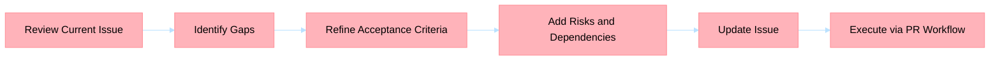

## Title
[P2] <component>: improve <issue quality or process>

## Problem statement
Explain what is incomplete or ambiguous in the current issue and why improvement is needed.

## Improvement goals
- Better acceptance criteria
- Stronger dependency mapping
- Clear owner and sequencing

## Acceptance criteria
- [ ] Issue has measurable acceptance checklist
- [ ] Risks and dependencies are explicit
- [ ] Effort sizing and ownership are defined
- [ ] BPMN section is present

## Risks and dependencies
- Risk: <risk>
- Dependency: <dependency>

## BPMN process

