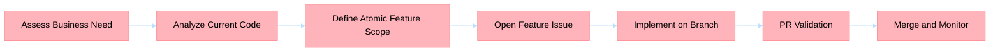

## Title
[P1] <domain>: feature 

## Business context
Describe user outcome, business value, and urgency.

## Scope
- In scope: <items>
- Out of scope: <items>

## Current behavior evidence
- <reference 1>
- <reference 2>

## Acceptance criteria
- [ ] Functional behavior is defined
- [ ] Non-functional constraints are defined
- [ ] Tests and verification path are defined
- [ ] Rollout and rollback expectations are defined

## Risks and dependencies
- Risk: <risk>
- Dependency: <dependency>

## BPMN process

