## Title
[P1] <component>: mitigate top risk 

## Risk statement
Describe the risk, trigger conditions, and potential impact.

## Evidence
- <production signal, test gap, or architecture drift>
- <file/function/log reference>

## Mitigation scope
Describe mitigation strategy and boundaries.

## Acceptance criteria
- [ ] Risk has owner and mitigation steps
- [ ] Detection and verification steps are defined
- [ ] Escalation and rollback conditions are explicit

## Dependencies
- <dependency 1>
- <dependency 2>

## BPMN process

```mermaid
%%{init: {'theme':'base', 'themeVariables': {
  'primaryColor':'#FFB3BA',
  'primaryTextColor':'#000',
  'primaryBorderColor':'#FF8B94',
  'lineColor':'#BAE1FF',
  'secondaryColor':'#BAE1FF',
  'tertiaryColor':'#FFFFFF'
}}}%%
flowchart LR
  A[Identify Top Risk] --> B[Gather Evidence]
  B --> C[Define Mitigation]
  C --> D[Open Risk Issue]
  D --> E[Branch and PR]
  E --> F[Validate Mitigation]
  F --> G[Merge and Monitor]
```

