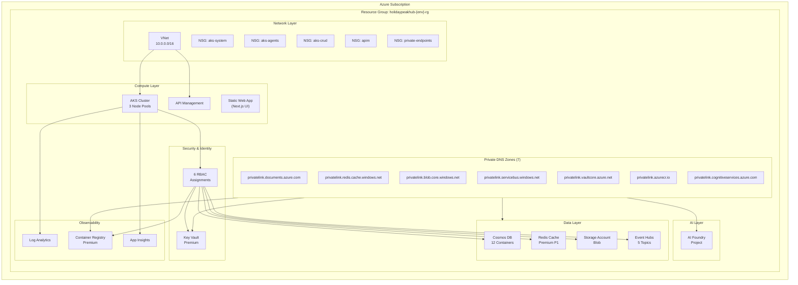
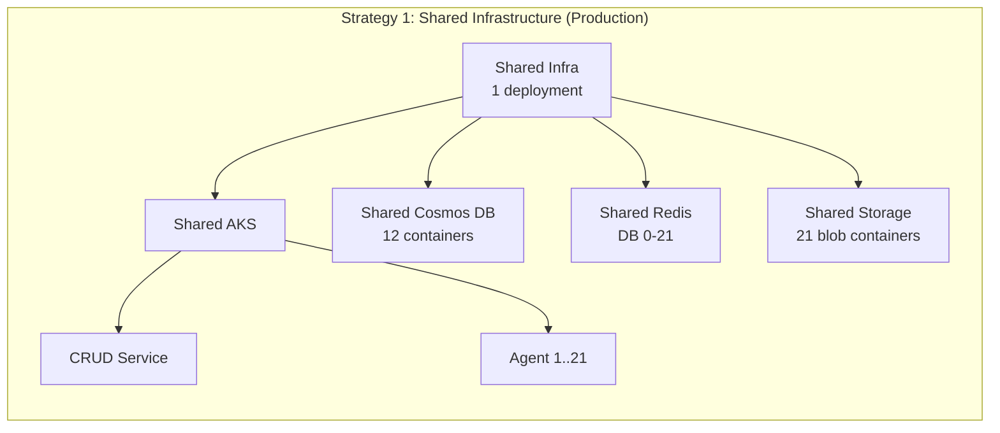
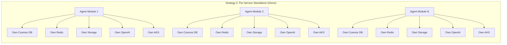
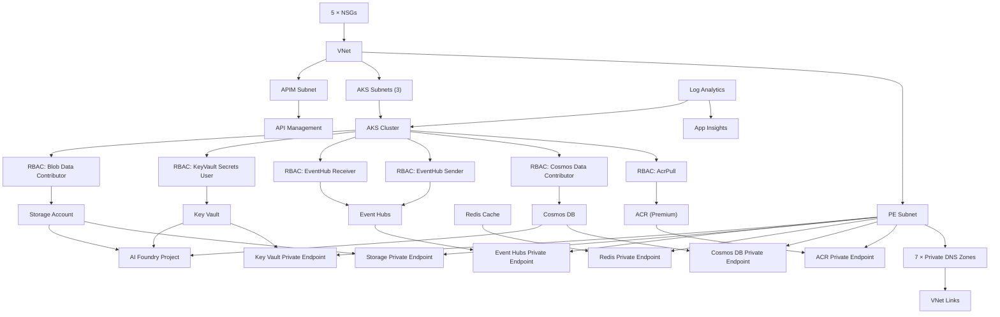
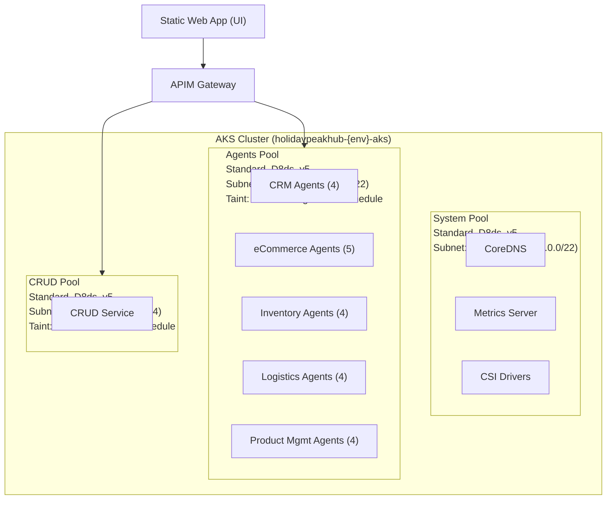
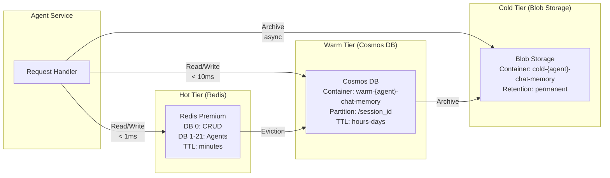
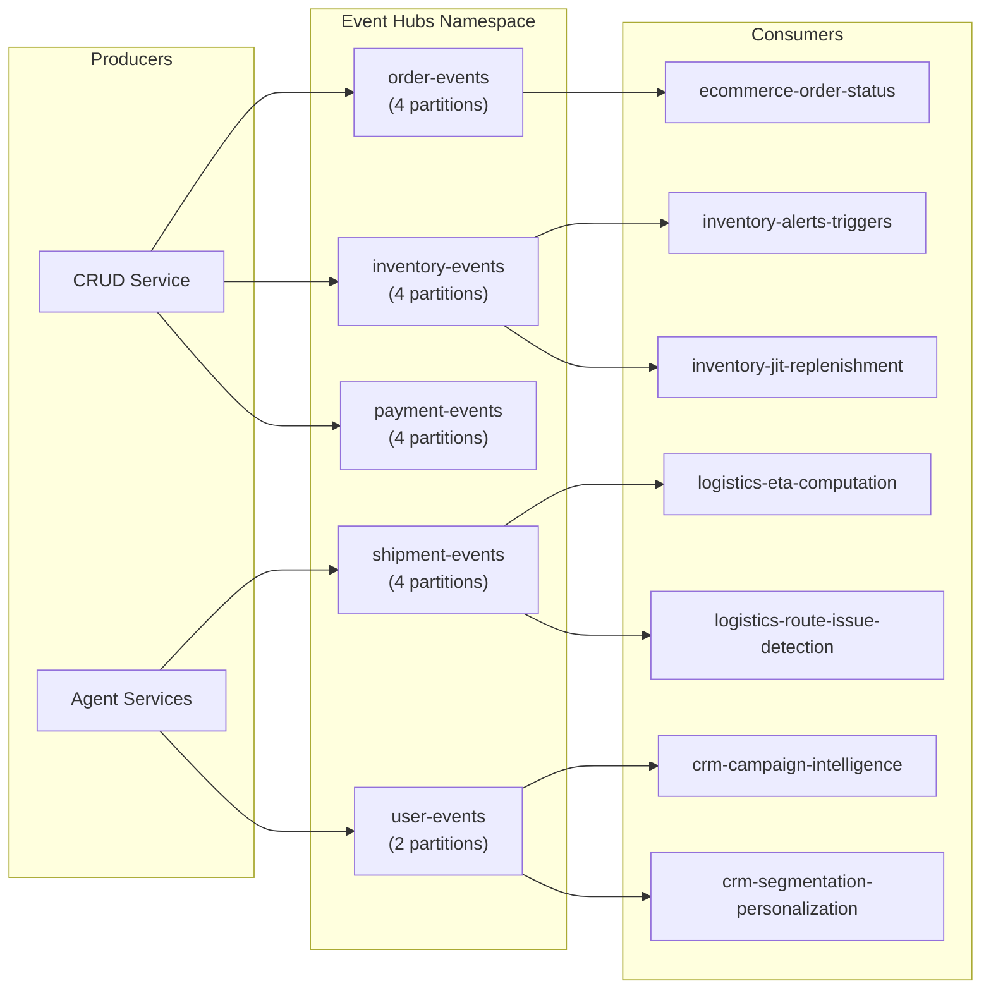
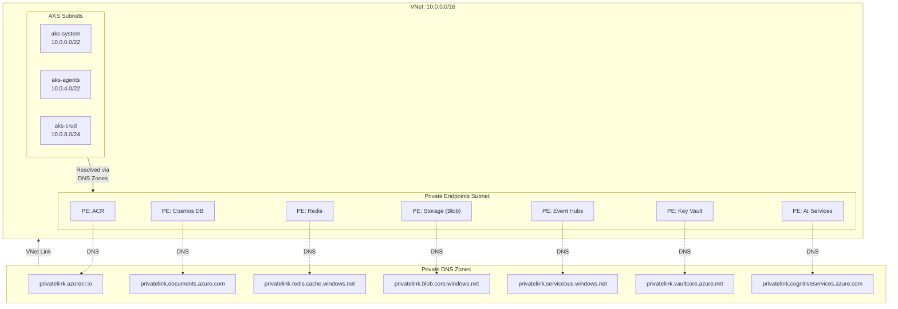

# Infrastructure Summary

Architecture decisions, deployment relationships, and implementation details for Holiday Peak Hub.

---

## Deployment Architecture

### High-Level Overview

---

## Deployment Strategies

### Strategy Comparison

---

## Shared Infrastructure Module

### Resource Dependency Graph

---

## AKS Cluster Architecture

---

## Three-Tier Memory Architecture

---

## Event-Driven Communication

---

## Private Endpoint Topology

---

## AVM Module Inventory

All infrastructure uses [Azure Verified Modules](https://azure.github.io/Azure-Verified-Modules/).

| Module | Version | Resource Type |
|--------|---------|---------------|
| `avm/res/network/network-security-group` | 0.5.2 | `Microsoft.Network/networkSecurityGroups` |
| `avm/res/network/virtual-network` | 0.7.2 | `Microsoft.Network/virtualNetworks` |
| `avm/res/network/private-dns-zone` | 0.8.0 | `Microsoft.Network/privateDnsZones` |
| `avm/res/operational-insights/workspace` | 0.15.0 | `Microsoft.OperationalInsights/workspaces` |
| `avm/res/insights/component` | 0.7.1 | `Microsoft.Insights/components` |
| `avm/res/container-registry/registry` | 0.9.3 | `Microsoft.ContainerRegistry/registries` |
| `avm/res/document-db/database-account` | 0.18.0 | `Microsoft.DocumentDB/databaseAccounts` |
| `avm/res/cache/redis` | 0.16.4 | `Microsoft.Cache/Redis` |
| `avm/res/storage/storage-account` | 0.31.0 | `Microsoft.Storage/storageAccounts` |
| `avm/res/event-hub/namespace` | 0.14.0 | `Microsoft.EventHub/namespaces` |
| `avm/res/key-vault/vault` | 0.13.3 | `Microsoft.KeyVault/vaults` |
| `avm/ptn/ai-ml/ai-foundry` | 0.6.0 | `Microsoft.CognitiveServices/accounts` + ML workspace |
| `avm/res/container-service/managed-cluster` | 0.12.0 | `Microsoft.ContainerService/managedClusters` |
| `avm/res/api-management/service` | 0.14.0 | `Microsoft.ApiManagement/service` |

**Total**: 14 AVM modules — zero raw resource declarations in shared infrastructure.

---

## Architecture Decisions

### ADR-1: Hybrid Provisioning Strategy

**Context**: 26 agent services + 1 CRUD service + 1 UI need infrastructure. Per-service isolation maximizes independence but is cost-prohibitive.

**Decision**: Shared infrastructure for production, per-service standalone for demos.

**Consequences**: ~85% cost reduction. Services share Cosmos, Redis, Storage, Event Hubs but maintain logical isolation via distinct containers, databases, and blob containers.

### ADR-2: AVM-Only Policy

**Context**: Raw Bicep resources are error-prone and lack security defaults.

**Decision**: All resources use Azure Verified Modules (AVM). No raw `resource` declarations in shared infrastructure.

**Consequences**: Consistent security posture, automatic best-practice enforcement, reduced maintenance.

### ADR-3: Private Endpoints Everywhere

**Context**: Data services (`publicNetworkAccess: 'Disabled'`) are unreachable without private endpoints.

**Decision**: Deploy private endpoints + Private DNS zones for all data services (Cosmos DB, Redis, Storage, Event Hubs, Key Vault, ACR, AI Services).

**Consequences**: Full network isolation. AKS pods resolve service endpoints to private IPs via VNet-linked Private DNS zones.

### ADR-4: AI Foundry as Project Instance

**Context**: The AI Foundry AVM pattern module creates both a hub and a project. The deployment creates a project instance for model management, not a standalone hub.

**Decision**: Name and document the resource as a "Foundry Project" to reflect the actual deployment topology.

**Consequences**: Clearer documentation. The project inherits from the hub created by the pattern module internally.

### ADR-5: eastus2 as Default Region

**Context**: Multiple modules previously defaulted to different regions (eastus, eastus2).

**Decision**: Standardize all deployments to `eastus2`.

**Consequences**: Simplified deployment commands. No cross-region latency between shared resources and Static Web Apps.

### ADR-6: Three-Tier Memory

**Context**: Agents need fast context retrieval (recent conversations) and long-term storage (historical interactions).

**Decision**: Hot (Redis) → Warm (Cosmos DB) → Cold (Blob Storage) memory tiers, isolated per agent.

**Consequences**: Sub-millisecond hot reads, consistent warm reads, cost-effective cold archival. Each agent gets its own Redis DB, Cosmos container, and blob container.
