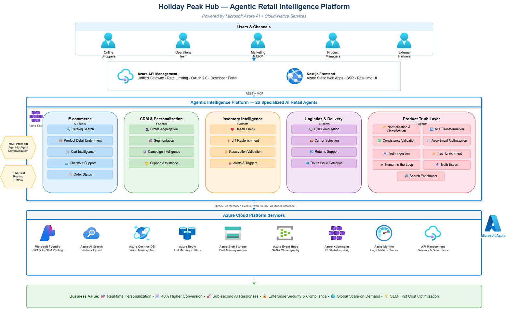

# Holiday Peak Hub

> **Last Updated**: 2026-04-30

Agent-driven retail accelerator for building and operating intelligent, cloud-native retail services with a shared framework and domain-focused apps. **26 AI agents** orchestrate retail operations — from product discovery to returns — using Microsoft Agent Framework, Azure AI Foundry, and three-tier memory, all deployed on AKS with Flux GitOps.

[](https://github.com/Azure-Samples/holiday-peak-hub/releases)
[](https://github.com/Azure-Samples/holiday-peak-hub/releases/tag/v2.1.0-unstable.0)
[](https://github.com/Azure-Samples/holiday-peak-hub/actions/workflows/ci.yml)
[](htmlcov/index.html)
[](https://github.com/psf/black)
[](https://www.python.org/)
[](https://www.typescriptlang.org/)
[](docs/project-status.md)
[](LICENSE)

---

## What Is This?

Holiday Peak Hub demonstrates how **AI agents replace static microservice logic** in retail platforms. Instead of hard-coded business rules, domain-specific agents reason over context, adapt to real-time signals, and collaborate through event choreography — delivering personalization, optimization, and intelligence that traditional architectures cannot match.

| Dimension | Traditional Microservices | Holiday Peak Hub (Agentic) |
|-----------|--------------------------|---------------------------|
| Decision making | Static conditionals | Context-aware reasoning via LLM/SLM |
| Personalization | Rule-based segments | Real-time 1:1 personalization |
| Cross-domain coordination | Orchestrator or REST chains | Event choreography + MCP agent-to-agent |
| Adaptability | Code changes → deploy cycle | Prompt/knowledge updates + adaptive routing |

## Architecture



### Platform at a Glance

| Layer | Technology | Purpose |
|-------|-----------|---------|
| **Agents (26)** | Python 3.13, FastAPI, MAF >=1.0.1 | Domain intelligence (CRM, eCommerce, Inventory, Logistics, Product Mgmt) |
| **CRUD Service** | Python 3.13, FastAPI, PostgreSQL | Transactional operations, REST APIs, event publishing |
| **UI** | Next.js 15, TypeScript, Tailwind | Executive demo, commerce journey, admin cockpit |
| **Gateway** | APIM + AGC | API governance, rate limiting, edge routing |
| **Models** | GPT-5-nano (SLM), GPT-4o (LLM) | SLM-first routing with LLM escalation |
| **Memory** | Redis → Cosmos DB → Blob Storage | Three-tier: hot (cache) → warm (state) → cold (archive) |
| **Events** | Azure Event Hubs (8 topics) | Saga choreography between services |
| **Search** | Azure AI Search | Vector/hybrid semantic search |
| **Deployment** | AKS + Flux CD GitOps | Declarative reconciliation, tested image promotion |
| **CI/CD** | GitHub Actions | Lint, test, CodeQL, pip-audit, deploy |

---

## Quick Links

| Audience | Start Here |
|----------|-----------|
| **Developers** | [apps/README.md](apps/README.md) — Service catalog and local run |
| **Architects** | [docs/architecture/README.md](docs/architecture/README.md) — ADRs and design |
| **Operators** | [.infra/README.md](.infra/README.md) — Provisioning and deployment |
| **Business** | [docs/architecture/business-summary.md](docs/architecture/business-summary.md) — Value proposition |
| **All** | [docs/README.md](docs/README.md) — Documentation hub |

Additional links: [Implementation roadmap](docs/IMPLEMENTATION_ROADMAP.md) · [Changelog](CHANGELOG.md) · [27 ADRs](docs/architecture/ADRs.md)

---

## Fast Start (Local)

### Prerequisites

| Tool | Version | Purpose |
|------|---------|---------|
| Python | 3.13+ | Backend services |
| Node.js | 20+ | Frontend UI |
| Yarn | Latest | Frontend package manager |
| uv | Latest | Python package manager |
| Azure CLI | Latest | Azure authentication |
| azd | Latest | Azure Developer CLI |
| Docker | Latest | Container builds for deployment |

### Run Locally

```bash
# From repo root — install framework
pip install -e lib

# Install and run CRUD service
pip install -e apps/crud-service/src
uvicorn crud_service.main:app --reload --port 8000 --app-dir apps/crud-service/src

# Install and run an agent (separate terminal)
pip install -e apps/ecommerce-catalog-search/src
uvicorn catalog_search.main:app --reload --port 8001 --app-dir apps/ecommerce-catalog-search/src

# Run UI (separate terminal)
cd apps/ui
yarn install
yarn dev
```

For complete local setup across services, see [apps/README.md](apps/README.md).

---

## Provision to Azure (azd)

Primary path for provisioning and deployment. Requires Docker running locally.

```bash
# 1) Sign in
az login
azd auth login

# 2) Create/select environment
azd env new <env-name>

# 3) Provision infrastructure
azd provision -e <env-name>

# 4) Deploy services
azd deploy -e <env-name>
```

For environment flags, service-scoped deploys, Flux GitOps details, and CI/CD workflows, see [.infra/README.md](.infra/README.md) and [docs/governance/README.md](docs/governance/README.md).

---

## Repository Structure

```
├── lib/                    # Shared framework (holiday_peak_lib)
├── apps/                   # 26 agent services + CRUD + UI
│   ├── crud-service/       # Transactional REST API
│   ├── ui/                 # Next.js 15 frontend
│   ├── crm-*/              # CRM domain agents (4)
│   ├── ecommerce-*/        # eCommerce domain agents (5)
│   ├── inventory-*/        # Inventory domain agents (4)
│   ├── logistics-*/        # Logistics domain agents (4)
│   ├── product-management-*/ # Product management agents (4)
│   ├── search-enrichment-agent/  # Search enrichment
│   └── truth-*/            # Product Truth Layer agents (4)
├── docs/                   # Architecture, ADRs, governance, roadmap
├── .infra/                 # Bicep infrastructure modules
├── .kubernetes/            # Flux GitOps manifests
├── .github/workflows/      # CI/CD pipelines
└── scripts/                # Automation and ops scripts
```

---

## Where to Find Everything

| Topic | Document |
|-------|----------|
| Framework API (BaseRetailAgent, AgentBuilder, FoundryAgentInvoker) | [lib/README.md](lib/README.md) |
| All services with endpoints and domains | [apps/README.md](apps/README.md) |
| Architecture decisions (27 ADRs) | [docs/architecture/ADRs.md](docs/architecture/ADRs.md) |
| Business scenarios and value proposition | [docs/business_scenarios/README.md](docs/business_scenarios/README.md) |
| Governance and release policy | [docs/governance/README.md](docs/governance/README.md) |
| Operational runbooks | [docs/ops/](docs/ops/) |
| Security posture | [SECURITY.MD](SECURITY.MD) |
| Project status and metrics | [docs/project-status.md](docs/project-status.md) |

---

## Contributing and License

- Contributing guide: [CONTRIBUTING.md](CONTRIBUTING.md)
- License: [LICENSE](LICENSE)
