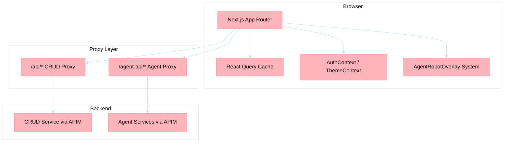
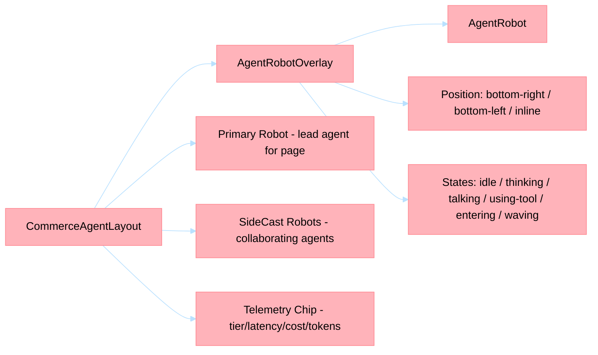

# Holiday Peak Hub — UI

> **Last Updated**: 2026-04-30

Next.js 16 App Router frontend for the Holiday Peak Hub intelligent retail platform. Deployed on Azure Static Web Apps with TypeScript strict mode, Tailwind CSS, and React Query.

---

## Architecture Overview



## Tech Stack

| Layer | Technology | Version |
|-------|-----------|---------|
| Framework | Next.js (App Router) | 16.x |
| Language | TypeScript (strict) | 5.x |
| UI Library | React | 19.x |
| Styling | Tailwind CSS + custom design tokens | 4.x |
| Server State | @tanstack/react-query | 5.x |
| Client State | React Context + useReducer | — |
| Auth | @azure/msal-browser + @azure/msal-react | 5.x |
| Payments | @stripe/react-stripe-js | 4.x |
| Charts | Recharts | 2.x |
| Forms | react-hook-form | 7.x |
| Testing | Jest + React Testing Library + Playwright | — |
| Package Manager | Yarn | — |
| Deployment | Azure Static Web Apps (standalone output) | — |

## Project Structure

```
apps/ui/
├── app/                    # Next.js App Router pages and route handlers
│   ├── layout.tsx          # Root layout (Providers wrapper)
│   ├── providers.tsx       # AuthProvider → QueryProvider → ThemeProvider → PageSessionProvider
│   ├── page.tsx            # Homepage — executive demo narrative
│   ├── admin/              # Admin control plane routes
│   ├── agent-api/          # Agent proxy route handlers
│   ├── api/                # CRUD proxy route handlers
│   ├── cart/               # Shopping cart
│   ├── categories/         # Category catalog
│   ├── category/           # Single category browse
│   ├── checkout/           # Checkout flow
│   ├── dashboard/          # Customer dashboard
│   ├── demo/               # Demo utilities (color system)
│   ├── order/              # Single order detail
│   ├── orders/             # Order history
│   ├── product/            # Product detail
│   ├── profile/            # User profile
│   ├── scenarios/          # Agent scenario playground
│   ├── search/             # Semantic search
│   ├── shop/               # Catalog landing
│   ├── staff/              # Staff operations (sales, review, requests, logistics)
│   └── _shared/            # Shared route utilities
├── components/             # Atomic Design component library
│   ├── atoms/              # Button, Badge, Input, Skeleton, Spinner, ThemeToggle...
│   ├── molecules/          # Card, ProductCard, SearchInput, Modal, Tabs, Timeline...
│   ├── organisms/          # AgentRobotOverlay, Navigation, HeroSlider, ProductGrid, ChatWidget...
│   ├── templates/          # MainLayout, CommerceAgentLayout, CheckoutLayout, ShopLayout...
│   ├── demo/               # ExecutiveDemoPage, AgentProfileDrawer, AgentFrieze
│   ├── enrichment/         # AttributeDiffView, SearchResultCard, CsvUploadPanel...
│   ├── truth/              # ReviewQueueTable, ProposalCard, ConfidenceBadge...
│   └── admin/              # EvaluationTrendChart, TraceWaterfall, PipelineFlowDiagram...
├── contexts/               # AuthContext, ThemeContext
├── lib/                    # Shared logic
│   ├── api/                # apiClient (CRUD), agentClient (Agent), endpoints
│   ├── agents/             # Agent profile registry (profiles.ts)
│   ├── hooks/              # React Query hooks (useProducts, useCart, useSemanticSearch...)
│   ├── services/           # agentStreamingService (SSE)
│   ├── providers/          # QueryProvider, PageSessionProvider
│   ├── types/              # TypeScript API type definitions
│   └── utils/              # Utility functions (formatters, mappers)
├── layouts/                # Legacy layout CSS
├── css/                    # Additional CSS modules
├── public/                 # Static assets
├── slices/                 # Redux slices (legacy, migrating to React Query)
├── tests/
│   ├── unit/               # Jest + RTL unit tests
│   └── e2e/                # Playwright E2E specs
├── next.config.js          # Next.js configuration
├── tailwind.config.ts      # Tailwind design tokens
├── tsconfig.json           # TypeScript strict config
├── jest.config.js          # Jest with coverage thresholds
├── playwright.config.ts    # Playwright E2E config
└── staticwebapp.config.json # Azure SWA routing
```

## Route Map

| Route | Responsibility | Agent Integration |
|-------|---------------|-------------------|
| `/` | Homepage — executive demo scroll narrative with agent orchestra | Full (RobotScatterIntro, AgentFrieze) |
| `/categories` | Category atlas with live catalog data | — |
| `/category?slug=...` | Category browse with filter rail | CommerceAgentLayout |
| `/product?id=...` | Product detail with enrichment tabs | CommerceAgentLayout (product-detail-enrichment) |
| `/search` | Semantic search via `useSemanticSearch` + `useStreamingSearch` | CommerceAgentLayout (catalog-search) |
| `/cart` | Shopping cart (CRUD-backed) | CommerceAgentLayout (cart-intelligence) |
| `/checkout` | Stripe-integrated checkout flow | CheckoutLayout |
| `/orders` | Order history list | CommerceAgentLayout |
| `/order/[id]` | Order lifecycle detail with logistics robots | CommerceAgentLayout (route-issue-detection + returns) |
| `/shop` | Catalog landing | ShopLayout |
| `/deals` | Deals search shortcut | — |
| `/dashboard` | Customer dashboard (orders, recommendations) | — |
| `/profile` | Account settings | — |
| `/scenarios/[id]` | Agent scenario playground | Full invocation UI |
| `/staff/sales` | Sales performance cockpit | — |
| `/staff/review` | Product enrichment review queue | Truth components |
| `/staff/requests` | Support tickets and returns | — |
| `/staff/logistics` | Shipment monitoring | — |
| `/admin` | Admin control-plane home | — |
| `/admin/agent-activity` | Agent observability cockpit | TraceWaterfall, EvaluationTrendChart |
| `/admin/enrichment-monitor` | Enrichment pipeline board | PipelineFlowDiagram |
| `/admin/truth-analytics` | Truth layer analytics | — |
| `/admin/config` | Platform configuration | — |
| `/admin/schemas` | Schema builder | — |
| `/agents/product-enrichment-chat` | Direct agent chat UI | Full |

## Agent Robot Overlay System

The `AgentRobotOverlay` component renders animated agent robot personas that appear contextually during user interactions:



- **`AgentRobotOverlay`** — Positioned wrapper with entrance/exit animations. Configured by `agentSlug`, `state`, `position`, `size`, and `facing`.
- **`CommerceAgentLayout`** — Template that standardizes primary + side-cast robots and compact telemetry chips across commerce routes (cart, search, category, product, checkout, orders).
- **`AgentProfileDrawer`** — Slide-out panel showing agent input/output schemas, sample invocations with SSE streaming, and an in-place trace explorer backed by admin monitor APIs.
- **`ExecutiveDemoPage`** — Scroll-driven executive demo that orchestrates 26 agents across Customer 360, commerce, inventory, logistics, and observability sections.

## API Client Architecture (ADR-016)

Two Axios clients route requests through same-origin Next.js proxy routes to avoid CORS:

| Client | File | Base Route | Upstream |
|--------|------|-----------|----------|
| `apiClient` | `lib/api/client.ts` | `/api/*` | CRUD Service (via APIM) |
| `agentApiClient` | `lib/api/agentClient.ts` | `/agent-api/*` | Agent Services (via APIM) |

**Base URL resolution** (server-side fallback chain):
- CRUD: `NEXT_PUBLIC_CRUD_API_URL` → `NEXT_PUBLIC_API_URL` → `CRUD_API_URL`
- Agent: `NEXT_PUBLIC_AGENT_API_URL` → `AGENT_API_URL`

**SSE streaming** for agent invocations uses `/invoke/stream` endpoints via `agentStreamingService`.

**Page session**: `usePageSession` hook injects `x-holiday-peak-session-id` into agent requests for Foundry conversation thread reuse.

## Tailwind Design Tokens

Custom color palette defined in `tailwind.config.ts`:

| Token | Scale | Usage |
|-------|-------|-------|
| `ocean-*` | 50–900 | Primary brand (blues) |
| `lime-*` | 50–900 | Success/secondary (greens) |
| `cyan-*` | 50–900 | Accent (teals) |
| `hp-*` | CSS variables | Semantic tokens (bg, surface, text, border, primary, accent, focus) |

Dark mode: class-based (`darkMode: 'class'`), toggled via `ThemeContext` + `ThemeToggle` atom.

Font: Inter (sans-serif).

## State Management

| Concern | Mechanism |
|---------|-----------|
| Server state (products, orders, cart) | `@tanstack/react-query` via hooks in `lib/hooks/` |
| Auth state | `AuthContext` (MSAL + dev mock mode) |
| Theme | `ThemeContext` (light/dark) |
| Page session | `PageSessionProvider` (Foundry thread ID per page) |
| Legacy slices | Redux Toolkit (`slices/`) — migrating to React Query |

## Run / Test Commands

```bash
yarn --cwd apps/ui install
yarn --cwd apps/ui dev          # Local dev server (port 3000)
yarn --cwd apps/ui build        # Production build (standalone output)
yarn --cwd apps/ui start        # Start production server
yarn --cwd apps/ui test         # Jest unit tests
yarn --cwd apps/ui test:coverage # Jest with coverage report
yarn --cwd apps/ui test:e2e     # Playwright E2E tests
yarn --cwd apps/ui lint         # ESLint (zero warnings enforced)
yarn --cwd apps/ui type-check   # tsc --noEmit strict check
```

## Coverage and Quality Gates

- Jest enforces global coverage thresholds (`branches/functions/lines/statements >= 60%`) in `jest.config.js`.
- Playwright E2E specs:
  - `tests/e2e/critical-flows.spec.ts` — Baseline critical-flow coverage.
  - `tests/e2e/demo-narrative.spec.ts` — Executive demo scroll narrative.
  - `tests/e2e/dark-mode-regression.spec.ts` — Dark mode visual regression.
  - `tests/e2e/cockpit-readiness.spec.ts` — Admin cockpit readiness.
- Focused unit coverage validates telemetry persistence for enrichment-backed product loads and graph-summary enrichment calls.

## Accessibility (WCAG 2.2 AA)

- Skip link to `#main-content` on every page.
- Semantic landmarks (`<main>`, `<nav>`, `<aside>`) with ARIA labelling.
- `prefers-reduced-motion` respected for all animations.
- Touch targets ≥ 44×44 CSS px on primary actions.
- Keyboard navigation for all interactive elements (Escape closes drawers/modals).
- `color-scheme: light dark` meta tag for OS-level theme coordination.
- ESLint a11y rules enforced via `@next/eslint-plugin-next`.

## Azure Static Web Apps Deployment

- Build output: `standalone` (configured in `next.config.js`).
- Routing: `staticwebapp.config.json` at project root.
- Environment variables injected at deployment time via SWA app settings.
- Entra app registration provisioned by `azd postprovision` hook (`ensure-entra-ui-app.ps1`).
- Redirect URIs maintained idempotently for `localhost:3000` and SWA callback URLs.

## Configuration Notes

- `NEXT_PUBLIC_CRUD_API_URL` — **Required**. Backend CRUD gateway URL.
- `NEXT_PUBLIC_AGENT_API_URL` — Agent API gateway URL.
- `NEXT_PUBLIC_ENTRA_CLIENT_ID` / `NEXT_PUBLIC_ENTRA_TENANT_ID` — Entra auth.
- `NEXT_PUBLIC_DEV_AUTH_MOCK=true` — Enables dev mock auth (non-production only).
- Commerce drill-down routes share `CommerceAgentLayout`, which standardizes the primary-stage robot, side-cast robot, and compact telemetry chip.
- The compact telemetry chip hydrates from persisted `_telemetry` emitted by sample streaming, search, product enrichment, and graph-summary invoke paths.
- Order detail keeps `logistics-route-issue-detection` visible as the default side cast until a return flow is opened, then swaps to returns + support assistance.
