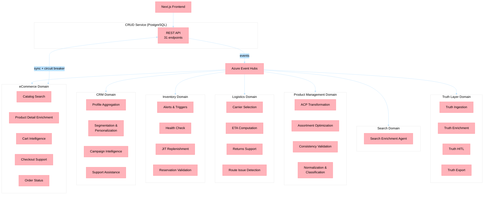

# Holiday Peak Hub — A Reference Architecture for Agentic Microservices

**Version**: 1.0
**Last Updated**: 2026-04-30

---

## What Are Agentic Microservices?

Agentic Microservices extend the traditional microservices pattern by embedding AI agent capabilities directly inside each service boundary. Instead of bolting a monolithic AI layer on top of existing services, each microservice carries its own agent runtime that can:

- **Plan dynamically** at runtime based on context (not just execute static call sequences)
- **Use tools** via the Model Context Protocol (MCP) to call other services
- **Maintain memory** across interactions using a tiered persistence strategy
- **Route between models** (SLM for simple queries, LLM for complex ones) based on real-time complexity assessment
- **Self-heal** by detecting, classifying, and remediating infrastructure incidents autonomously

This pattern is distinct from both traditional microservices (deterministic, code-defined flows) and monolithic AI gateways (single-point bottleneck for all AI interactions).

---

## Why This Repository Is a Reference Implementation

Holiday Peak Hub demonstrates how to build an Agentic Microservices platform at scale using Microsoft's AI and cloud stack. It is a working, tested, deployed system — not a conceptual framework.

| Characteristic | Implementation |
|----------------|---------------|
| **26 domain-specific agents** | Each agent handles a bounded context (CRM, eCommerce, Inventory, Logistics, Product Mgmt, Search, Truth Layer) |
| **Shared micro-framework** | `holiday-peak-lib` provides BaseRetailAgent, memory, guardrails, resilience, telemetry |
| **Microsoft Agent Framework (MAF)** | `agent-framework>=1.0.1` GA wraps Azure AI Foundry agents via `FoundryAgentInvoker` |
| **SLM-first routing** | Every request starts with GPT-5-nano (fast, cheap); complex queries escalate to GPT-4o (rich) |
| **Three-tier memory** | Hot (Redis, <50ms) → Warm (Cosmos DB, 100-500ms) → Cold (Blob, archival) |
| **Agent-to-agent communication** | MCP protocol for structured tool calls between agents |
| **Event-driven async** | Azure Event Hubs for decoupled CRUD → Agent processing |
| **GitOps deployment** | Flux CD reconciles rendered Helm manifests to AKS with namespace isolation |
| **Self-healing runtime** | Incident lifecycle: detect → classify → remediate → verify → escalate |
| **1796 automated tests** | 1136 lib + 660 app tests, 89% coverage, CI/CD enforced |

---

## Microsoft Technology Stack

This reference architecture is built entirely on Microsoft's AI and cloud platform:

| Layer | Technology | Purpose | Documentation |
|-------|-----------|---------|---------------|
| **AI Runtime** | [Microsoft Agent Framework](https://learn.microsoft.com/en-us/python/api/overview/azure/agent-framework) | Agent execution, tool forwarding, message protocol | [MAF Python API](https://learn.microsoft.com/en-us/python/api/overview/azure/agent-framework) |
| **AI Models** | [Azure AI Foundry](https://learn.microsoft.com/en-us/azure/ai-studio/) | Model hosting, Agents V2 API, prompt governance | [Foundry Agents quickstart](https://learn.microsoft.com/en-us/azure/ai-studio/how-to/develop/agents) |
| **Search** | [Azure AI Search](https://learn.microsoft.com/en-us/azure/search/) | Vector + hybrid search, semantic ranking | [AI Search overview](https://learn.microsoft.com/en-us/azure/search/search-what-is-azure-search) |
| **Warm Memory** | [Azure Cosmos DB](https://learn.microsoft.com/en-us/azure/cosmos-db/) | User profiles, search history, agent state | [Cosmos DB for NoSQL](https://learn.microsoft.com/en-us/azure/cosmos-db/nosql/) |
| **Hot Memory** | [Azure Cache for Redis](https://learn.microsoft.com/en-us/azure/azure-cache-for-redis/) | Session state, real-time context | [Redis quickstart](https://learn.microsoft.com/en-us/azure/azure-cache-for-redis/cache-python-get-started) |
| **Cold Memory** | [Azure Blob Storage](https://learn.microsoft.com/en-us/azure/storage/blobs/) | Archival, catalog snapshots, images | [Blob Storage overview](https://learn.microsoft.com/en-us/azure/storage/blobs/storage-blobs-introduction) |
| **Messaging** | [Azure Event Hubs](https://learn.microsoft.com/en-us/azure/event-hubs/) | Async CRUD → Agent event processing | [Event Hubs Python SDK](https://learn.microsoft.com/en-us/azure/event-hubs/event-hubs-python-get-started-send) |
| **Compute** | [Azure Kubernetes Service](https://learn.microsoft.com/en-us/azure/aks/) | Namespace-isolated agent pods with KEDA autoscaling | [AKS overview](https://learn.microsoft.com/en-us/azure/aks/intro-kubernetes) |
| **API Gateway** | [Azure API Management](https://learn.microsoft.com/en-us/azure/api-management/) | Traffic management, auth, AI policies | [APIM overview](https://learn.microsoft.com/en-us/azure/api-management/api-management-key-concepts) |
| **CRUD Data** | [Azure Database for PostgreSQL](https://learn.microsoft.com/en-us/azure/postgresql/) | Transactional data (orders, products, users) | [PostgreSQL Flexible Server](https://learn.microsoft.com/en-us/azure/postgresql/flexible-server/) |
| **Secrets** | [Azure Key Vault](https://learn.microsoft.com/en-us/azure/key-vault/) | Connection strings, API keys, certificates | [Key Vault overview](https://learn.microsoft.com/en-us/azure/key-vault/general/overview) |
| **Observability** | [Azure Monitor + Application Insights](https://learn.microsoft.com/en-us/azure/azure-monitor/) | Distributed tracing, KQL queries | [OpenTelemetry for Azure](https://learn.microsoft.com/en-us/azure/azure-monitor/app/opentelemetry-enable) |
| **GitOps** | [Flux CD](https://fluxcd.io/) on AKS | Continuous reconciliation, drift detection | [Flux on AKS](https://learn.microsoft.com/en-us/azure/azure-arc/kubernetes/tutorial-use-gitops-flux2) |
| **Frontend** | [Azure Static Web Apps](https://learn.microsoft.com/en-us/azure/static-web-apps/) | Next.js 15 hosting with managed SSL | [SWA overview](https://learn.microsoft.com/en-us/azure/static-web-apps/overview) |
| **Identity** | [Microsoft Entra ID](https://learn.microsoft.com/en-us/entra/identity/) | JWT validation, RBAC, managed identity | [Entra ID overview](https://learn.microsoft.com/en-us/entra/fundamentals/whatis) |
| **CI/CD** | [GitHub Actions](https://docs.github.com/en/actions) | Build, test, deploy workflows | [Actions documentation](https://docs.github.com/en/actions) |

---

## Architectural Patterns Demonstrated

### 1. Agentic Microservices (Core Pattern)

Each agent service is a self-contained FastAPI application that:
- Owns its domain logic
- Hosts its own agent runtime (via `BaseRetailAgent`)
- Exposes REST endpoints for Frontend/CRUD and MCP tools for agents
- Subscribes to Event Hub topics for async processing
- Maintains independent memory namespaces

### 2. SLM-First Model Routing

Every request starts with the fast (SLM) model. The agent evaluates complexity and only escalates to the rich (LLM) model when needed. This reduces cost by 60-80% while maintaining quality for complex queries.

### 3. Three-Tier Memory Architecture

Agents operate on context assembled from three tiers with different latency and cost profiles, read in parallel via `asyncio.gather`:
- **Hot** (Redis): Session state, <50ms reads, TTL-based expiry
- **Warm** (Cosmos DB): User profiles, search history, enrichment state, 100–500ms
- **Cold** (Blob Storage): Interaction logs, catalog snapshots, archival

### 4. Event-Driven Agent Processing

CRUD operations publish domain events to Azure Event Hubs. Agents subscribe to relevant topics and process asynchronously:

```
Frontend → CRUD Service → Event Hubs → Agent(s)
                           ↑ publish       ↓ consume
                      (order.created)  (enrich, classify, alert)
```

### 5. MCP Tool Protocol for Agent-to-Agent Communication

Agents expose tools via `FastAPIMCPServer` that other agents can invoke:

```python
@mcp.tool()
async def get_inventory_status(sku: str) -> dict:
    """Check real-time stock level for an SKU."""
    return await adapter.check_stock(sku)
```

This enables compositional intelligence: the checkout agent can call the inventory agent's tools without tight coupling.

### 6. Enrichment Guardrails

The `EnrichmentGuardrail` validates agent outputs before they reach downstream consumers:
- Schema conformance (Pydantic model validation)
- Content policy enforcement (no hallucinated data)
- Confidence thresholds (reject low-confidence enrichments)
- Audit trail (every decision logged with evidence)

### 7. GitOps Deployment with Flux CD

All services are deployed via rendered Kubernetes manifests reconciled by Flux CD:
1. CI builds container images → pushes to ACR
2. Helm templates rendered → committed to manifests branch
3. Flux detects changes → applies to AKS namespaces
4. Health checks validate rollout → auto-rollback on failure
5. Drift detection ensures desired state is maintained

### 8. Self-Healing Runtime

The platform includes autonomous incident management:
- **Detection**: Health probes, Azure Monitor alerts, APIM diagnostics
- **Classification**: Incident type mapping (pod crash, memory pressure, model degradation)
- **Remediation**: Strategy-specific handlers (AKS restart, APIM circuit break, Redis flush)
- **Verification**: Post-remediation health check with configurable thresholds
- **Escalation**: Human notification when automated remediation fails

---

## Domain Architecture

The 26 agent services are organized into 7 bounded contexts:



---

## How to Use This Reference

### For Platform Architects

Start with [Architecture Overview](architecture/architecture.md) and the [ADR Index](architecture/ADRs.md) to understand the decision landscape. Review the [MAF Integration Rationale](architecture/maf-integration-rationale.md) for the agent runtime design.

### For Service Developers

Read the [lib README](../lib/README.md) to understand the micro-framework, then look at any app's `main.py` + `adapters.py` + `agents.py` for the service pattern. The [Standalone Deployment Guide](architecture/standalone-deployment-guide.md) covers single-service deployment.

### For DevOps Engineers

Start with the [Infrastructure README](../.infra/README.md) and [Deployment Guide](../.infra/DEPLOYMENT.md). Review [ADR-017](architecture/adrs/adr-017-deployment-strategy.md) (Flux CD) and [ADR-026](architecture/adrs/adr-026-namespace-isolation-strategy.md) (Namespace Isolation) for the GitOps model.

### For AI/ML Engineers

Review the [Foundry Agent Invocation Flow](architecture/diagrams/sequence-foundry-agent-invocation.md) and [MAF Integration Rationale](architecture/maf-integration-rationale.md). The SLM-first routing logic is in `lib/src/holiday_peak_lib/agents/base_agent.py`.

---

## Comparison with Alternative Architectures

| Approach | Pros | Cons | When to Use |
|----------|------|------|-------------|
| **Agentic Microservices** (this repo) | Domain isolation, independent scaling, per-agent memory | More services to operate, cross-agent latency | Multi-domain platforms with distinct AI capabilities per domain |
| **Monolithic AI Gateway** | Single deployment, centralized model management | Single point of failure, no domain isolation, all-or-nothing scaling | Simple chatbot or single-purpose AI applications |
| **AI Sidecar Pattern** | Minimal code changes to existing services | Limited agent autonomy, no inter-agent communication | Adding AI to legacy services without rewrite |
| **Orchestrator Agent** | Centralized planning, simpler routing | Bottleneck at orchestrator, hard to scale horizontally | Workflows with a single decision-maker |

---

## Microsoft Documentation Cross-References

| Topic | Official Documentation |
|-------|----------------------|
| Building AI agents with Microsoft Agent Framework | [MAF Python SDK](https://learn.microsoft.com/en-us/python/api/overview/azure/agent-framework) |
| Azure AI Foundry agent creation and management | [Foundry Agents overview](https://learn.microsoft.com/en-us/azure/ai-studio/how-to/develop/agents) |
| Model Context Protocol (MCP) for tool integration | [MCP specification](https://modelcontextprotocol.io/) |
| Microservices architecture on Azure | [Azure Architecture Center — Microservices](https://learn.microsoft.com/en-us/azure/architecture/microservices/) |
| Event-driven architecture patterns | [Azure Architecture Center — Event-driven](https://learn.microsoft.com/en-us/azure/architecture/guide/architecture-styles/event-driven) |
| AKS best practices | [AKS baseline architecture](https://learn.microsoft.com/en-us/azure/architecture/reference-architectures/containers/aks/baseline-aks) |
| Cosmos DB data modeling | [Cosmos DB data modeling](https://learn.microsoft.com/en-us/azure/cosmos-db/nosql/modeling-data) |
| Azure Well-Architected Framework | [WAF overview](https://learn.microsoft.com/en-us/azure/well-architected/) |

---

## Related Documents

- [Architecture Overview](architecture/architecture.md) — System context and container views
- [ADR Index](architecture/ADRs.md) — 35 architecture decision records
- [MAF Integration Rationale](architecture/maf-integration-rationale.md) — Why MAF is wrapped in the lib
- [Standalone Deployment Guide](architecture/standalone-deployment-guide.md) — Single-service AKS deployment
- [Lib README](../lib/README.md) — Micro-framework API reference
- [Infrastructure README](../.infra/README.md) — Bicep provisioning and AKS operations
- [Project Status](project-status.md) — Current state and recent changes
- **Warm** (Cosmos DB): Profiles and history, 100-500ms
- **Cold** (Blob): Archival data, seconds

### 4. Enrichment Guardrails

The `EnrichmentGuardrail` enforces that AI-generated content is always grounded in company-owned data (PIM, DAM, CRM). Agents never generate without a verifiable internal data source.

### 5. GitOps with Namespace Isolation

Flux CD reconciles rendered Helm manifests from a manifests branch. Each domain gets its own Kubernetes namespace with RBAC boundaries and network policies (ADR-017, ADR-026).

### 6. Self-Healing Runtime

An autonomous incident lifecycle (detect → classify → remediate → verify → escalate) handles infrastructure misconfigurations without human intervention, with audit trails and allowlisted remediation actions.

---

## Getting Started

1. **Understand the architecture**: Start with [Solution Architecture Overview](architecture/solution-architecture-overview.md)
2. **Explore the lib**: Read [lib/README.md](../lib/README.md) for the shared framework
3. **Deploy a single service**: Follow the [Standalone Deployment Guide](architecture/standalone-deployment-guide.md)
4. **Deploy everything**: Use `azd up` with the [Deployment Guide](../.infra/DEPLOYMENT.md)
5. **Run tests**: `python -m pytest` at the repository root (1796 tests)

---

## Related Microsoft Guidance

- [Azure Architecture Center: Microservices](https://learn.microsoft.com/en-us/azure/architecture/microservices/)
- [Azure Architecture Center: AI Agent Patterns](https://learn.microsoft.com/en-us/azure/architecture/ai-ml/architecture/baseline-openai-e2e-chat)
- [Azure Well-Architected Framework](https://learn.microsoft.com/en-us/azure/well-architected/)
- [Microsoft Cloud Adoption Framework](https://learn.microsoft.com/en-us/azure/cloud-adoption-framework/)
- [Azure AI Foundry: Build AI Agents](https://learn.microsoft.com/en-us/azure/ai-studio/how-to/develop/agents)
