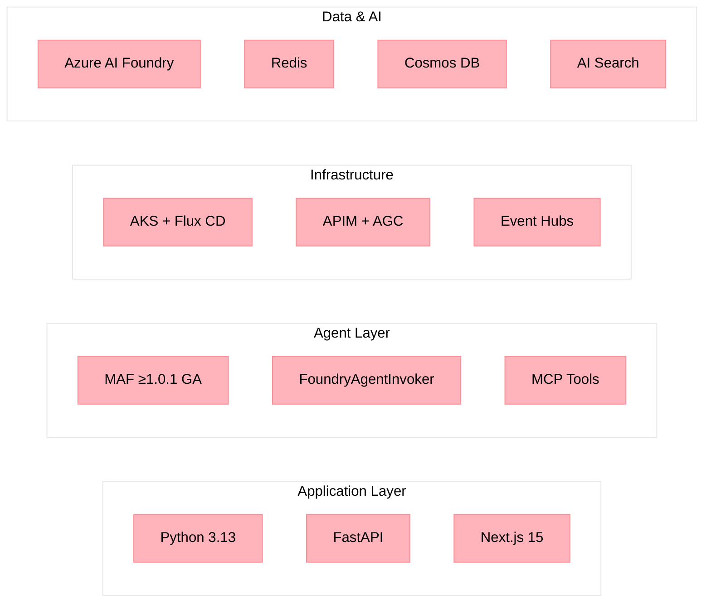

# Architecture Documentation

<!-- Last Updated: 2026-04-30 -->

This folder contains the canonical architecture, ADRs, component references, operational playbooks, and diagrams for Holiday Peak Hub — a reference implementation for **Agentic Microservices** on Microsoft's AI and cloud platform.

## Platform Summary

| Dimension | Value |
|-----------|-------|
| **Agent Services** | 26 domain agents (5 domains + Search + Truth Layer) |
| **CRUD Service** | 1 FastAPI transactional service (PostgreSQL) |
| **Frontend** | Next.js 15 on Azure Static Web Apps |
| **Runtime** | AKS with Flux CD GitOps (HelmRelease CRDs) |
| **Edge** | APIM → Application Gateway for Containers → AKS ClusterIP |
| **AI Runtime** | Azure AI Foundry via MAF ≥1.0.1 GA (FoundryAgentInvoker) |
| **Model Routing** | SLM-first (GPT-5-nano) → LLM escalation (GPT-5) |
| **Memory** | Three-tier: Hot (Redis) · Warm (Cosmos DB) · Cold (Blob) |
| **Events** | Azure Event Hubs (8 topics, Saga choreography) |
| **Tests** | 1796 passed, 89% coverage |

## Canonical Documents

- [Architecture Overview](architecture.md) — Primary technical architecture narrative (context, interactions, deployment)
- [Solution Architecture Overview](solution-architecture-overview.md) — C4 diagrams, domain agent map, data flow patterns, deployment topology
- [Solution Architecture Diagrams](solution-architecture-diagrams.md) — System context, container, per-domain, and data flow Mermaid diagrams
- [Architecture Decision Records](ADRs.md) — Full ADR index and status (27 ADRs)
- [Components](components.md) — Library, app, and frontend component references
- [MAF Integration Rationale](maf-integration-rationale.md) — Why Microsoft Agent Framework is wrapped in `holiday-peak-lib`
- [Foundry Agents vs Direct API Report](foundry-agents-vs-direct-api-report.md) — Trade-off analysis for Foundry vs Responses API
- [Design: Enrichment & Search Flows](design-enrichment-search-flows.md) — End-to-end enrichment and intelligent search architecture
- [Standalone Deployment Guide](standalone-deployment-guide.md) — How to deploy a single agent service to AKS
- [Test Coverage Gap Analysis](test-coverage-gap-analysis.md) — Coverage gaps, patterns, and wave-based remediation plan
- [Architecture Compliance Review](architecture-compliance-review.md) — Branch-level ADR and policy conformance assessment
- [Event Hub Topology Matrix](eventhub-topology-matrix.md) — Topic-level publisher/subscriber coverage contract and gap tracking
- [CRUD Service Implementation](crud-service-implementation.md) — CRUD service architecture and integration details
- [Operational Playbooks](playbooks/README.md) — Incident runbooks aligned to governance policies
- [Diagrams](diagrams/README.md) — Draw.io C4 diagrams and sequence flow documents
- [Business Summary](business-summary.md) — Executive architecture summary

## Agentic Microservices Reference

This repository positions Holiday Peak Hub as a reference for building agentic microservices on Azure. See [Agentic Microservices Reference](../agentic-microservices-reference.md) for the full positioning document.

## Technology Stack

## Microsoft Technology Cross-References

| Topic | Official Documentation |
|-------|----------------------|
| Microsoft Agent Framework (MAF) | [MAF Python SDK](https://learn.microsoft.com/en-us/python/api/overview/azure/agent-framework) |
| Azure AI Foundry Agents | [Foundry Agents overview](https://learn.microsoft.com/en-us/azure/ai-studio/how-to/develop/agents) |
| Azure AI Search | [AI Search overview](https://learn.microsoft.com/en-us/azure/search/search-what-is-azure-search) |
| Azure Cosmos DB for NoSQL | [Cosmos DB data modeling](https://learn.microsoft.com/en-us/azure/cosmos-db/nosql/modeling-data) |
| Azure Kubernetes Service | [AKS baseline](https://learn.microsoft.com/en-us/azure/architecture/reference-architectures/containers/aks/baseline-aks) |
| Microservices on Azure | [Azure Architecture Center](https://learn.microsoft.com/en-us/azure/architecture/microservices/) |
| Event-driven architecture | [Event-driven patterns](https://learn.microsoft.com/en-us/azure/architecture/guide/architecture-styles/event-driven) |
| Well-Architected Framework | [WAF overview](https://learn.microsoft.com/en-us/azure/well-architected/) |

## Governance Alignment

- [Governance Overview](../governance/README.md)
- [Frontend Governance](../governance/frontend-governance.md)
- [Backend Governance](../governance/backend-governance.md)
- [Infrastructure Governance](../governance/infrastructure-governance.md)

## Source of Truth Rules

- Use this folder as architecture source of truth for repo-level design.
- Use `components/apps/*.md` for service-level implementation details.
- Use ADRs for all non-trivial architecture decisions and updates.
- Keep deployment policy references aligned with `deploy-azd-dev.yml`, `deploy-azd-prod.yml`, and reusable `deploy-azd.yml`.
- Prefer diagrams in `diagrams/*.drawio` for C4 views and `diagrams/sequence-*.md` for runtime flows.
