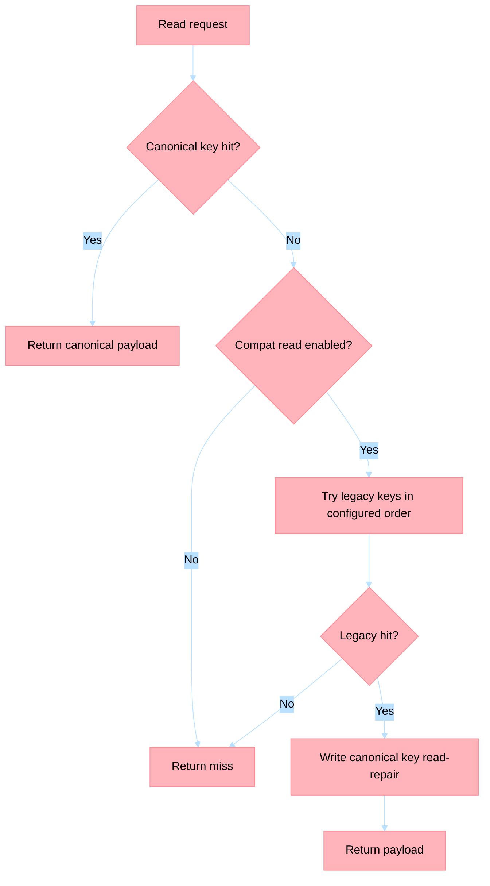

# ADR-007: Memory Architecture and Isolation Strategy

**Status**: Accepted (Revised 2026-04-28 — consolidated memory architecture, builder, partitioning, and namespace isolation)  
**Date**: 2024-12  
**Supersedes**: prior separate decisions on Builder Pattern for Memory, Memory Partitioning, and Memory Namespace Isolation Contract (now absorbed into this ADR)

## Context

Agents require memory with different latency/cost trade-offs:
- **Session state**: Sub-50ms access (current cart, user context)
- **Conversation history**: 100-500ms acceptable (past 30 days)
- **Archival**: Seconds acceptable (orders, uploads beyond 30 days)

Different apps need different tier configurations, and data must be placed in the right tier with clear partitioning, TTL, compliance, and namespace isolation rules.

## Part 1: Three-Tier Structure

**Implement three-tier memory**: Redis (hot), Cosmos DB (warm), Blob Storage (cold).

| Tier | Service | Latency | Cost/GB | Use Case |
|------|---------|---------|---------|----------|
| Hot | Redis | <50ms | $$$$ | Session state, recent queries |
| Warm | Cosmos | 100-500ms | $$ | Conversation history, preferences |
| Cold | Blob | Seconds | $ | Uploaded files, archival logs |

### Cascading Rules

Frequently accessed data can be promoted hot ← warm ← cold via `MemoryClient` rules.

### Pooling and Transport

Each tier supports connection pooling/transport tuning:
- **Hot**: Redis connection pool and socket timeouts
- **Warm**: Cosmos client connection limits and client kwargs
- **Cold**: Blob transport pooling and timeouts

### Tiered Eviction (Extension)

Demotion hot → warm → cold is an extension point. Business rules should consider:
- Access frequency and recency
- Payload size
- Compliance/retention requirements
- SLA or latency constraints

---

## Part 2: Builder Pattern Configuration

**Implement Builder Pattern for memory tier assembly.**

```python
class MemoryBuilder:
    def with_hot(self, hot: HotMemory) -> "MemoryBuilder":
        self._hot = hot
        return self

    def with_warm(self, warm: WarmMemory) -> "MemoryBuilder":
        self._warm = warm
        return self

    def with_cold(self, cold: ColdMemory) -> "MemoryBuilder":
        self._cold = cold
        return self

    def with_rules(self, **kwargs) -> "MemoryBuilder":
        self._rules = MemoryRules(**kwargs)
        return self

    def build(self) -> MemoryClient:
        return MemoryClient(hot=self._hot, warm=self._warm, cold=self._cold, rules=self._rules)
```

Usage:
```python
memory = (
    MemoryBuilder()
    .with_hot(HotMemory(redis_url))
    .with_warm(WarmMemory(cosmos_uri, database, container))
    .with_cold(ColdMemory(blob_account_url, container))
    .with_rules(read_fallback=True, promote_on_read=True, write_through=True)
    .build()
)
```

### Tier Interfaces

```python
class HotMemory(Protocol):
    async def get(self, key: str) -> Optional[str]: ...
    async def set(self, key: str, value: str, ttl: Optional[int] = None) -> None: ...
    async def delete(self, key: str) -> None: ...

class WarmMemory(Protocol):
    async def read(self, key: str) -> Optional[str]: ...
    async def upsert(self, key: str, value: str) -> None: ...
    async def delete(self, key: str) -> None: ...

class ColdMemory(Protocol):
    async def download_text(self, key: str) -> Optional[str]: ...
    async def upload_text(self, key: str, value: str) -> None: ...
    async def delete(self, key: str) -> None: ...
```

### Cascading Rules (Promotion)

`MemoryClient` checks tiers in order (hot → warm → cold) and optionally promotes on read:
```python
async def get(self, key: str) -> Optional[str]:
    value = await self._hot.get(key)
    if value is not None:
        return value
    value = await self._warm.read(key)
    if value is not None and self._rules.promote_on_read:
        await self._hot.set(key, value, ttl=self._rules.hot_ttl)
        return value
    value = await self._cold.download_text(key)
    if value is not None and self._rules.promote_on_read:
        await self._warm.upsert(key, value)
        await self._hot.set(key, value, ttl=self._rules.hot_ttl)
    return value
```

---

## Part 3: Tier Selection Matrix and Data Placement

### Tier Selection Matrix

| Data Type | Access Frequency | Latency SLA | Retention | Tier | TTL/Eviction |
|-----------|------------------|-------------|-----------|------|--------------|
| Session state | Per-request | < 50ms | 15min | **Hot** | 15min TTL |
| Cart contents | Multiple per session | < 100ms | 24h | **Hot** | 24h TTL |
| Recent search queries | Multiple per session | < 100ms | 5min | **Hot** | 5min TTL |
| User preferences | Once per session | < 500ms | 90 days | **Warm** | No TTL |
| Conversation history | 1-2x per session | < 500ms | 30 days | **Warm** | 30d TTL |
| Order history | Rare | < 2s | 7 years | **Cold** | Lifecycle policy |
| Product images | Rare | < 5s | Indefinite | **Cold** | No expiration |
| System logs | Rare | < 10s | 90 days | **Cold** | 90d lifecycle |

### Hot Memory (Redis) Configuration
- **Eviction Policy**: Volatile LRU
- **Max key size**: 1MB
- **Max memory**: 4GB per instance
- Default TTL: 900s (15min)

### Warm Memory (Cosmos DB) Partition Key Strategy
- **User-scoped data**: `user_id` (profiles, conversations)
- **Agent-scoped data**: `agent_id` (agent state)
- **Order-scoped data**: `order_id` (order details)
- **Hierarchical Partition Keys**: For data > 20GB per logical partition

### Cold Memory (Blob Storage) Lifecycle Policy
- `uploads/` → Cool tier after 30 days
- `orders-archive/` → Archive tier after 1 year
- `logs/` → Delete after 90 days

### PII and Compliance
- **PII fields** encrypted at rest (email, phone, address, payment_method)
- PII stored only in Warm tier (not Hot, due to compliance)
- Right to Deletion (GDPR, CCPA): delete across all three tiers by user_id

---

## Part 4: Namespace Isolation Contract

### Canonical Namespace Key

`<service>:<tenantId>:<sessionId>`

1. `service` — logical service name (e.g. `crm-profile-aggregation`)
2. `tenantId` — tenant boundary for customer/account isolation
3. `sessionId` — runtime conversational or workflow session boundary
4. Delimiter is `:` only. Empty or wildcard segments are invalid for writes.

### Redis Key Format
`<namespaceKey>:<memoryKind>:<entityId>`

Examples:
- `crm-support-assistance:tenant-acme:s-8f21a:conversation:turn-001`
- `ecommerce-cart-intelligence:tenant-contoso:s-21ab9:cart:active`

### Cosmos DB Item Contract
- `namespaceKey` property required on every item
- Partition key for memory containers must be `namespaceKey`

### Compatibility-Read Strategy



**Read order**: canonical key first → legacy patterns on miss → read-repair to canonical.

**Feature flags**:
- `MEMORY_NAMESPACE_WRITE_CANONICAL` (default `false`)
- `MEMORY_NAMESPACE_COMPAT_READ` (default `false`)

### Migration Phases
1. **Phase 1 (Dual Read)**: Enable compat read, keep canonical writes disabled
2. **Phase 2 (Canonical Write + Compat Read)**: Enable canonical writes, run backfill
3. **Phase 3 (Canonical Only)**: Disable compat reads after two stable release cycles

### Rollback Rules
If canonical read hit rate drops below baseline, revert to compat-read mode. Do not delete canonical data during rollback.

---

## Consequences

**Positive**: 70% cost reduction vs all-Redis, optimized latency, clear PII handling, deterministic tenant/session isolation, safe phased migration  
**Negative**: Complexity in tier management, cold start delays, promotion/demotion overhead, temporary operational overhead during namespace migration

## Related ADRs
- [ADR-002: Azure Services](adr-002-azure-services.md)
- [ADR-005: Agent Framework](adr-005-agent-framework.md) — Agent memory consumption

## Migration Notes

This ADR consolidates four formerly separate decisions:
- Three-Tier Memory Architecture (original)
- Builder Pattern for Agent Memory Configuration
- Memory Partitioning and Data Placement Strategy
- Memory Namespace Isolation Contract

The builder, partitioning, and namespace decisions are now superseded and absorbed into this ADR.
