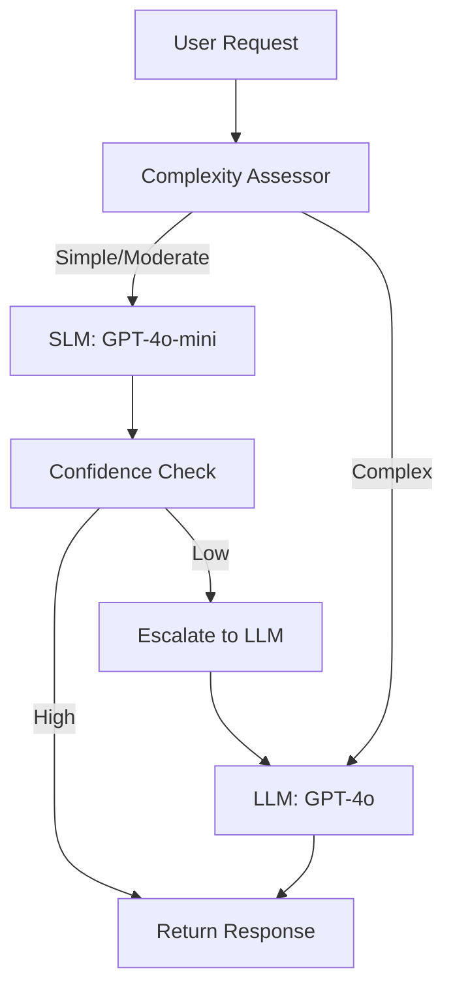

# ADR-013: SLM-First Model Routing Strategy

**Status**: Accepted  
**Date**: 2026-01  
**Deciders**: Architecture Team

## Context

Retail agents handle requests with varying complexity:
- **Simple**: Product lookup by SKU, inventory check (deterministic)
- **Moderate**: Natural language search, basic recommendations (rule-based + embeddings)
- **Complex**: Multi-step reasoning, multi-agent coordination, explainability (LLM required)

Running all requests through large language models (LLMs) is expensive and slow. Small language models (SLMs) can handle 60-80% of requests at 10x lower cost and 5x lower latency.

**Challenge**: Automatically route requests to the appropriate model without manual rules.

## Decision

**Implement SLM-first routing with dynamic complexity assessment and automatic escalation to LLM.**

### Routing Flow



### Complexity Signals

The **ComplexityAssessor** evaluates requests based on:

#### 1. Lexical Signals (Fast Heuristics)
```python
COMPLEXITY_INDICATORS = {
    "simple": ["show", "get", "fetch", "list", "find"],
    "moderate": ["search", "recommend", "similar", "filter"],
    "complex": ["why", "explain", "compare", "analyze", "optimize", "plan"]
}

def assess_complexity(query: str) -> ComplexityLevel:
    tokens = query.lower().split()
    
    # Multiple questions = complex
    if query.count("?") > 1:
        return ComplexityLevel.COMPLEX
    
    # Conditional logic = complex
    if any(word in tokens for word in ["if", "unless", "but", "however"]):
        return ComplexityLevel.COMPLEX
    
    # Simple lookup patterns
    if any(word in tokens for word in COMPLEXITY_INDICATORS["simple"]):
        return ComplexityLevel.SIMPLE
    
    return ComplexityLevel.MODERATE
```

#### 2. Semantic Signals (Embedding-Based)
```python
async def assess_semantic_complexity(query: str) -> float:
    """Return complexity score 0.0-1.0 based on embedding similarity to known patterns."""
    query_embedding = await embedding_model.embed(query)
    
    # Compare to reference patterns
    simple_similarity = cosine_similarity(query_embedding, SIMPLE_PATTERN_EMBEDDINGS)
    complex_similarity = cosine_similarity(query_embedding, COMPLEX_PATTERN_EMBEDDINGS)
    
    return complex_similarity / (simple_similarity + complex_similarity)
```

#### 3. Context Signals
- **Multi-turn conversation**: Previous turns suggest complexity
- **User history**: Power users get SLM, new users get LLM (better experience)
- **Time of day**: Peak hours → SLM preferred (cost optimization)

### Automatic Escalation

SLM responses include confidence scores. Low confidence triggers escalation:

```python
class ModelRouter:
    async def route(self, request: Request) -> Response:
        complexity = await self.assess_complexity(request)
        
        # Try SLM first for simple/moderate
        if complexity in [ComplexityLevel.SIMPLE, ComplexityLevel.MODERATE]:
            slm_response = await self.slm_model.invoke(request)
            
            # Check confidence
            if slm_response.confidence > 0.8:
                return slm_response
            
            # Low confidence → escalate
            logger.info(f"Escalating to LLM: confidence={slm_response.confidence}")
            return await self.llm_model.invoke(request)
        
        # Complex requests go straight to LLM
        return await self.llm_model.invoke(request)
```

### Model Target Configuration

Agents configure both SLM and LLM targets:

```python
from holiday_peak_lib.agents import AgentBuilder, ModelTarget

agent = (AgentBuilder()
    .with_agent_class(CatalogAgent)
    .with_model_targets(
        slm=ModelTarget(
            deployment_name="gpt-4o-mini",
            endpoint=os.getenv("FOUNDRY_ENDPOINT"),
            agent_id=os.getenv("FOUNDRY_AGENT_ID_FAST"),
            max_tokens=500,
            temperature=0.3
        ),
        llm=ModelTarget(
            deployment_name="gpt-4o",
            endpoint=os.getenv("FOUNDRY_ENDPOINT"),
            agent_id=os.getenv("FOUNDRY_AGENT_ID_RICH"),
            max_tokens=2000,
            temperature=0.7
        )
    )
    .build())
```

### Fallback Strategy

If LLM is unavailable (throttled, down), fall back to SLM with best effort:

```python
try:
    return await self.llm_model.invoke(request)
except ModelUnavailableError:
    logger.warning("LLM unavailable, falling back to SLM")
    return await self.slm_model.invoke(request, force=True)
```

## Consequences

### Positive
- **60-70% cost reduction**: Majority of requests handled by SLM
- **3-5x faster responses**: SLM latency < 500ms vs LLM 2-3s
- **Automatic optimization**: No manual routing rules
- **Graceful degradation**: Escalation ensures quality
- **Observable**: Metrics on escalation rate guide tuning

### Negative
- **Two model dependencies**: More failure modes
- **Complexity assessment overhead**: Adds 10-50ms per request
- **Escalation latency**: Failed SLM → LLM adds total latency
- **Confidence calibration**: Requires tuning per domain

### Risk Mitigation
- **A/B testing**: Compare SLM-first vs always-LLM for quality
- **Monitoring**: Track escalation rate, response quality, latency
- **Circuit breaker**: Disable SLM if escalation rate > 50%
- **Override flags**: Allow users to request LLM explicitly

## Implementation Guidelines

### Environment Variables
```bash
# SLM Configuration
FOUNDRY_AGENT_ID_FAST=agent-slm-prod
MODEL_DEPLOYMENT_NAME_FAST=gpt-4o-mini

# LLM Configuration
FOUNDRY_AGENT_ID_RICH=agent-llm-prod
MODEL_DEPLOYMENT_NAME_RICH=gpt-4o

# Routing Tuning
SLM_CONFIDENCE_THRESHOLD=0.8
MAX_ESCALATION_RATE=0.5
ENABLE_SEMANTIC_COMPLEXITY=true
```

### Agent Integration
```python
# apps/ecommerce-catalog-search/src/agents.py
from holiday_peak_lib.agents import BaseRetailAgent, RoutingStrategy

class CatalogAgent(BaseRetailAgent):
    def __init__(self, **kwargs):
        super().__init__(**kwargs)
        self.router = RoutingStrategy()
        
        # Register handlers
        self.router.register("search", self._handle_search)
        self.router.register("product_detail", self._handle_product_detail)
    
    async def _handle_search(self, payload: dict) -> dict:
        """Route search requests through SLM-first routing."""
        complexity = await self.assess_complexity(payload["query"])
        
        if complexity == "simple":
            return await self._simple_search(payload)
        
        # Delegate to model router
        return await self.invoke_with_routing(payload)
```

### Observability
```python
from opencensus.ext.azure.metrics_exporter import MetricsExporter

metrics = MetricsExporter(connection_string=os.getenv("APPLICATIONINSIGHTS_CONNECTION_STRING"))

# Track routing decisions
metrics.record("model_routing", {
    "model": "slm" | "llm",
    "complexity": "simple" | "moderate" | "complex",
    "escalated": True | False,
    "confidence": 0.0-1.0,
    "latency_ms": int
})
```

## Alternatives Considered

### Always Use LLM
**Pros**: Maximum quality, no routing logic  
**Cons**: 10x higher cost, 5x higher latency  
**Decision**: Cost prohibitive for high-volume retail workloads.

### Static Rules (Regex-Based Routing)
**Pros**: Fast, deterministic, no model calls  
**Cons**: Brittle, hard to maintain, can't handle edge cases  
**Decision**: Too inflexible for evolving use cases.

### Separate SLM and LLM Endpoints
**Pros**: Client chooses model explicitly  
**Cons**: Client must know complexity, duplicates logic, poor UX  
**Decision**: Transparent routing is better developer experience.

### Model Ensemble (SLM + LLM in Parallel)
**Pros**: Compare outputs, choose best  
**Cons**: 2x cost, complex merging logic, higher latency  
**Decision**: Sequential routing with escalation is more efficient.

## Performance Targets

| Metric | Target | Current |
|--------|--------|---------|
| SLM usage rate | 60-80% | TBD |
| Escalation rate | < 20% | TBD |
| SLM latency (P95) | < 500ms | TBD |
| LLM latency (P95) | < 3s | TBD |
| Cost per 1K requests | < $0.50 | TBD |

## Related ADRs
- [ADR-006: Microsoft Agent Framework + Foundry](adr-006-agent-framework.md)
- [ADR-012: Adapter Boundaries and Composition](adr-012-adapter-boundaries.md)

## References
- [Azure AI Foundry Model Catalog](https://learn.microsoft.com/azure/ai-services/openai/concepts/models)
- [Prompt Engineering for Cost Optimization](https://learn.microsoft.com/azure/ai-services/openai/concepts/prompt-engineering)
- [Azure Monitor Application Insights](https://learn.microsoft.com/azure/azure-monitor/app/app-insights-overview)
