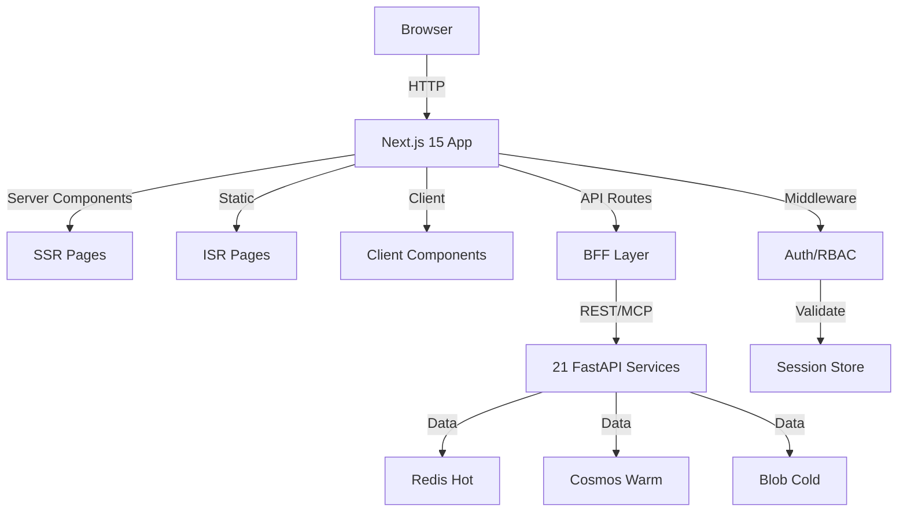

# ADR-015: Next.js 15 with App Router for Frontend Framework

**Status**: Accepted  
**Date**: 2026-01-30  
**Deciders**: Architecture Team  
**Tags**: frontend, framework, nextjs

## Context

The Holiday Peak Hub requires a modern, performant frontend framework that can:
- Handle complex e-commerce workflows (14 pages, 21 backend services)
- Support server-side rendering (SSR) for SEO and performance
- Enable incremental static regeneration (ISR) for product pages
- Provide excellent developer experience with TypeScript
- Integrate seamlessly with AG-UI Protocol and Agentic Commerce Protocol
- Support role-based access control (RBAC) with middleware
- Scale to handle holiday peak traffic

### Requirements

**Functional**:
- 7 public pages (homepage, store, product, cart, checkout, order tracking)
- 7 admin pages (dashboard, inventory, products, logistics, CRM, support, analytics)
- Real-time backend integration with 21 Python FastAPI services
- AG-UI protocol annotations for agent interoperability
- ACP-compliant product data handling

**Non-Functional**:
- First Contentful Paint < 1.5s
- Time to Interactive < 3s
- Support 10,000+ concurrent users during peaks
- SEO-optimized for product discovery
- Excellent mobile experience

## Decision

We will use **Next.js 15 with App Router** as the primary frontend framework.

### Key Capabilities Leveraged

**1. App Router (Next.js 13+)**
- File-based routing with nested layouts
- Server Components for performance
- Streaming and Suspense for better UX
- Built-in loading and error states

**2. Server-Side Rendering (SSR)**
- Dynamic product pages with real-time inventory
- Personalized content based on user context
- SEO-optimized for search engines

**3. Incremental Static Regeneration (ISR)**
- Static generation for product catalog
- Background revalidation for data freshness
- Optimal performance with dynamic content

**4. API Routes**
- Backend-for-frontend (BFF) pattern
- Proxy to Python FastAPI services
- Session management and authentication

**5. Middleware**
- Route protection for admin pages
- Role-based access control
- Session validation

**6. Image Optimization**
- Automatic image optimization
- Responsive images
- WebP/AVIF support

### Architecture



### Tech Stack

```json
{
  "framework": "Next.js 15.1.6",
  "runtime": "React 19.0.0",
  "language": "TypeScript 5.7.2",
  "styling": "Tailwind CSS 4.0.0",
  "state": "Redux Toolkit 2.5.0",
  "routing": "App Router (built-in)",
  "bundler": "Turbopack",
  "package-manager": "yarn"
}
```

## Consequences

### Positive

**Performance**:
- Server Components reduce client-side JavaScript
- Automatic code splitting and lazy loading
- Built-in image and font optimization
- Streaming for faster perceived performance

**Developer Experience**:
- File-based routing (no manual route configuration)
- TypeScript-first with excellent type inference
- Hot module replacement for fast development
- Built-in testing utilities

**SEO**:
- Server-side rendering for crawlers
- Automatic sitemap generation
- Meta tag management
- Open Graph support

**Scalability**:
- Edge-ready deployment
- Automatic static optimization
- CDN-friendly architecture
- Serverless function support

**Security**:
- Built-in CSRF protection
- Environment variable validation
- Secure headers by default
- Middleware for authentication

### Negative

**Learning Curve**:
- New App Router patterns (vs Pages Router)
- Server vs Client Components distinction
- Caching strategies can be complex
- **Mitigation**: Team training, documentation, code reviews

**Vendor Lock-in**:
- Tight coupling with Vercel ecosystem
- Some features work best on Vercel platform
- **Mitigation**: Use standard patterns, avoid platform-specific features

**Build Complexity**:
- Larger build times for complex apps
- Cache invalidation strategies needed
- **Mitigation**: Incremental builds, proper caching, build optimization

**Debugging**:
- Server Component errors can be harder to debug
- Hydration mismatches require careful handling
- **Mitigation**: Good error boundaries, logging, dev tools

## Alternatives Considered

### Alternative 1: Remix

**Pros**:
- Progressive enhancement focus
- Excellent data loading patterns
- Nested routing

**Cons**:
- Smaller ecosystem vs Next.js
- Less mature for production
- Fewer deployment options

**Why Not Chosen**: Next.js has better enterprise support, larger ecosystem, and more deployment flexibility.

### Alternative 2: SvelteKit

**Pros**:
- Smaller bundle sizes
- Simpler component model
- Fast compilation

**Cons**:
- Smaller ecosystem
- Less enterprise adoption
- Fewer integrations

**Why Not Chosen**: React ecosystem better suits our team expertise and component library needs.

### Alternative 3: Astro

**Pros**:
- Partial hydration
- Framework-agnostic
- Excellent for content sites

**Cons**:
- Less suitable for complex apps
- Limited state management
- Smaller community

**Why Not Chosen**: Not designed for complex e-commerce applications with heavy interactivity.

### Alternative 4: Create React App (CRA)

**Pros**:
- Simple setup
- Pure client-side
- Full React flexibility

**Cons**:
- No SSR
- Poor SEO
- Manual optimization needed

**Why Not Chosen**: Lacks SSR, routing, and optimization features critical for e-commerce.

## Implementation

### Phase 1: Project Setup
```bash
# Create Next.js 15 app with TypeScript
npx create-next-app@latest holiday-peak-hub \
  --typescript \
  --tailwind \
  --app \
  --src-dir \
  --import-alias "@/*"

# Install additional dependencies
yarn add redux @reduxjs/toolkit
yarn add @headlessui/react react-icons
yarn add date-fns zod
```

### Phase 2: Project Structure
```
src/
├── app/                    # App Router pages
│   ├── (public)/          # Public layout group
│   │   ├── page.tsx       # Homepage
│   │   ├── store/         # Store pages
│   │   ├── product/       # Product pages
│   │   ├── cart/          # Cart page
│   │   └── checkout/      # Checkout flow
│   ├── (auth)/            # Auth layout group
│   │   ├── login/         # Login page
│   │   └── logout/        # Logout page
│   ├── admin/             # Admin layout group
│   │   ├── dashboard/     # Dashboard
│   │   ├── inventory/     # Inventory management
│   │   └── ...            # Other admin pages
│   ├── api/               # API routes (BFF)
│   │   ├── auth/          # Auth endpoints
│   │   └── services/      # Service proxies
│   ├── layout.tsx         # Root layout
│   └── middleware.ts      # Auth middleware
├── components/            # Atomic design components
├── lib/                   # Utilities and libraries
│   ├── api/              # API client
│   ├── auth/             # Auth utilities
│   ├── ag-ui/            # AG-UI protocol
│   └── acp/              # ACP schemas
└── types/                 # TypeScript types
```

### Phase 3: Middleware Configuration
```typescript
// middleware.ts
import { NextResponse } from 'next/server';
import type { NextRequest } from 'next/server';

export function middleware(request: NextRequest) {
  // Protected routes
  if (request.nextUrl.pathname.startsWith('/admin')) {
    const session = request.cookies.get('session');
    if (!session) {
      return NextResponse.redirect(new URL('/login', request.url));
    }
  }
  
  return NextResponse.next();
}
```

## Monitoring and Validation

### Performance Metrics
- Lighthouse scores (weekly)
- Core Web Vitals (continuous)
- Build time tracking
- Bundle size monitoring

### Success Criteria
- LCP < 2.5s (75th percentile)
- FID < 100ms (75th percentile)
- CLS < 0.1 (75th percentile)
- Build time < 5 minutes
- Bundle size < 500KB (initial)

## References

- [Next.js 15 Documentation](https://nextjs.org/docs)
- [App Router Migration Guide](https://nextjs.org/docs/app/building-your-application/upgrading/app-router-migration)
- [React 19 Release Notes](https://react.dev/blog/2024/12/05/react-19)
- [ADR-016: Atomic Design System](adr-016-atomic-design-system.md)
- [ADR-017: AG-UI Protocol Integration](adr-017-ag-ui-protocol.md)

## Revision History

| Version | Date | Changes | Author |
|---------|------|---------|--------|
| 1.0 | 2026-01-30 | Initial decision | Architecture Team |
