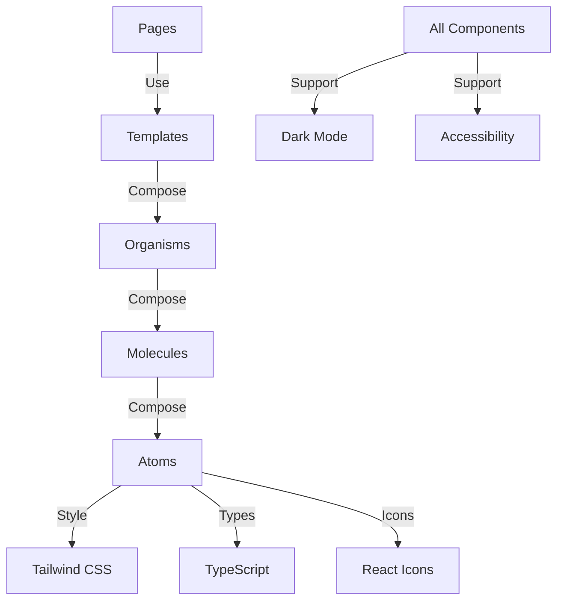

# ADR-016: Atomic Design System for Component Library

**Status**: Accepted  
**Date**: 2026-01-30  
**Deciders**: Frontend Team  
**Tags**: frontend, components, design-system

## Context

The Holiday Peak Hub frontend requires a scalable, maintainable component library that can support 14 pages with consistent UX while enabling rapid development and ensuring code reusability.

### Requirements

**Functional**:
- 52+ reusable UI components
- Consistent design language
- Dark mode support
- Accessibility (WCAG 2.1 AA)
- TypeScript type safety
- React Hook Form integration

**Non-Functional**:
- Component reusability > 80%
- Bundle size optimization
- Fast development iteration
- Easy onboarding for new developers
- Clear component hierarchy

## Decision

We will use **Atomic Design methodology** to organize our component library into five distinct levels:

1. **Atoms** (19 components) - Basic building blocks
2. **Molecules** (20 components) - Simple composed components
3. **Organisms** (9 components) - Complex composed components
4. **Templates** (4 layouts) - Page-level layouts
5. **Pages** (14 pages) - Complete application screens

### Component Inventory

**Atoms**:
Button, Icon, Input, Label, Checkbox, Radio, Select, Textarea, Badge, Text, Divider, Avatar, Skeleton, Spinner, Rating, Switch, Tooltip, ProgressBar, Chart

**Molecules**:
Card, FormField, Alert, Dropdown, Modal, SearchInput, Breadcrumb, PriceDisplay, ProductCard, CartItem, Tabs, Popover, Steps, SectionTitle, StatCard, AvatarGroup, MenuList, ListItem, Timeline, ProfileCard

**Organisms**:
FilterPanel, ProductGrid, Navigation, ShoppingCart, CheckoutForm, OrderTracker, NotificationCenter, DataTable, TaskList

**Templates**:
MainLayout, ShopLayout, CheckoutLayout, OrderTrackingLayout

### Architecture



## Consequences

### Positive

**Maintainability**:
- Clear component hierarchy reduces confusion
- Single responsibility principle enforced
- Easy to locate and update components

**Reusability**:
- Components designed for multiple contexts
- Props-based customization
- Composition over inheritance

**Consistency**:
- Unified design language
- Shared prop patterns
- Consistent dark mode and accessibility

**Developer Experience**:
- Intuitive component discovery
- Clear import paths
- Excellent TypeScript support

**Performance**:
- Tree-shaking friendly
- Lazy loading support
- Minimal bundle size

### Negative

**Initial Setup Time**:
- Required upfront planning
- Component categorization decisions
- **Mitigation**: Completed during migration phase

**Learning Curve**:
- Team must understand atomic design principles
- Component hierarchy can be initially confusing
- **Mitigation**: Documentation and training

**Over-Abstraction Risk**:
- Temptation to over-engineer simple components
- **Mitigation**: Follow "three uses rule" before abstracting

## Alternatives Considered

### Alternative 1: Flat Component Structure

**Pros**:
- Simple organization
- No categorization needed

**Cons**:
- Hard to navigate at scale
- No clear reusability patterns

**Why Not Chosen**: Doesn't scale well for 52+ components

### Alternative 2: Feature-Based Organization

**Pros**:
- Components grouped by feature
- Co-located with pages

**Cons**:
- Duplicate components across features
- Harder to share components

**Why Not Chosen**: Reduces reusability and increases duplication

### Alternative 3: Third-Party Component Library (e.g., Material-UI, Ant Design)

**Pros**:
- Ready-made components
- Established patterns

**Cons**:
- Heavy bundle size
- Difficult customization
- Not optimized for our use case

**Why Not Chosen**: Need custom design and lightweight bundle

## Implementation

### Directory Structure
```
components/
├── atoms/
│   ├── Button.tsx
│   ├── Input.tsx
│   ├── index.ts          # Barrel export
│   └── ...
├── molecules/
│   ├── Card.tsx
│   ├── FormField.tsx
│   ├── index.ts
│   └── ...
├── organisms/
│   ├── Navigation.tsx
│   ├── ProductGrid.tsx
│   ├── index.ts
│   └── ...
├── templates/
│   ├── MainLayout.tsx
│   ├── ShopLayout.tsx
│   ├── index.ts
│   └── ...
├── types/
│   └── index.ts          # Shared types
├── utils/
│   └── utils.ts          # Utility functions
├── atomic-index.ts       # Main barrel export
└── index.ts              # Public API
```

### Import Patterns
```typescript
// Import everything
import { Button, Card, ProductGrid, ShopLayout } from '@/components';

// Import by category
import { Button, Input } from '@/components/atoms';
import { Card, FormField } from '@/components/molecules';
import { Navigation } from '@/components/organisms';
import { MainLayout } from '@/components/templates';
```

### Component Template
```typescript
// atoms/Button.tsx
import React from 'react';

export interface ButtonProps {
  variant?: 'primary' | 'secondary' | 'outline' | 'ghost' | 'link' | 'danger' | 'success';
  size?: 'xs' | 'sm' | 'md' | 'lg' | 'xl';
  loading?: boolean;
  disabled?: boolean;
  children: React.ReactNode;
  onClick?: () => void;
  className?: string;
}

export const Button: React.FC<ButtonProps> = ({
  variant = 'primary',
  size = 'md',
  loading = false,
  disabled = false,
  children,
  onClick,
  className = '',
}) => {
  // Implementation with Tailwind CSS
  return (
    <button
      className={/* variant and size classes */}
      disabled={disabled || loading}
      onClick={onClick}
    >
      {loading ? <Spinner /> : children}
    </button>
  );
};

Button.displayName = 'Button';
```

## Documentation

Each component includes:
- **TypeScript interfaces** - Full prop documentation
- **Usage examples** - Common use cases
- **Accessibility notes** - ARIA attributes and keyboard support
- **Dark mode** - Theme-aware styling

## Monitoring

### Metrics
- Component reusability rate
- Bundle size per category
- Import analysis
- Usage statistics

### Success Criteria
- All 52 components documented
- Zero prop-type warnings
- 100% TypeScript coverage
- Lighthouse accessibility score > 95

## References

- [Atomic Design Methodology](https://atomicdesign.bradfrost.com/)
- [Component Documentation](../../ui/components/COMPONENT_README.md)
- [Migration Reports](../../ui/components/)
- [ADR-015: Next.js App Router](adr-015-nextjs-app-router.md)

## Revision History

| Version | Date | Changes | Author |
|---------|------|---------|--------|
| 1.0 | 2026-01-30 | Initial decision | Frontend Team |
