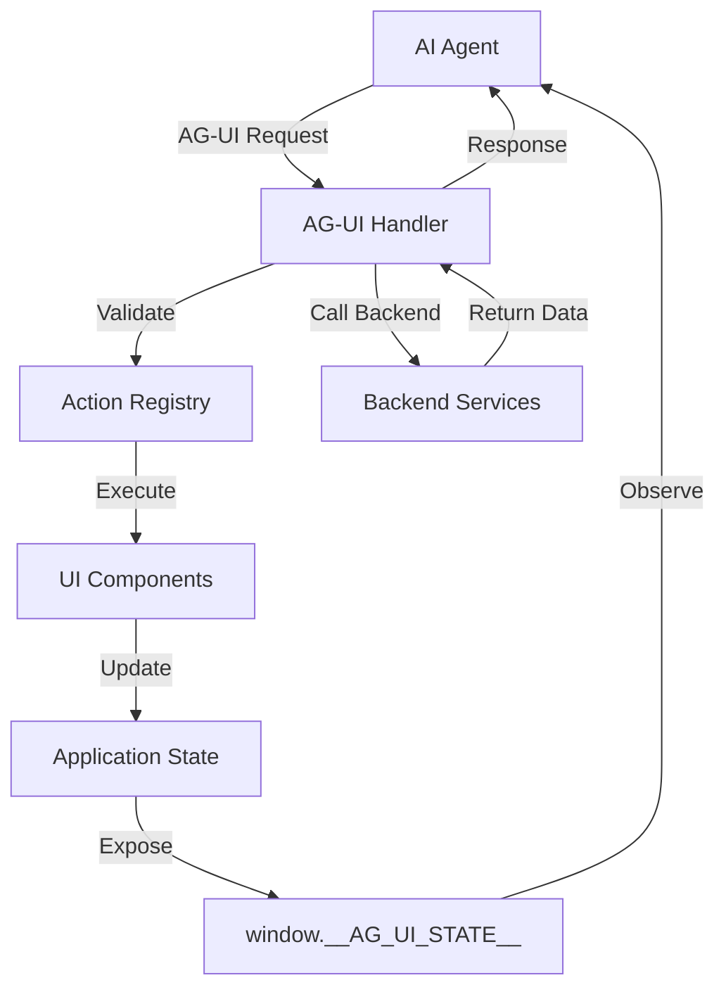

# ADR-017: AG-UI Protocol Integration

**Status**: Accepted  
**Date**: 2026-01-30  
**Deciders**: Architecture Team  
**Tags**: frontend, agents, protocol, ag-ui

## Context

The Holiday Peak Hub must support AI agent interactions with the UI, enabling agents to observe state, trigger actions, and navigate the interface programmatically. This requires a standardized protocol for agent-UI communication.

### Requirements

**Functional**:
- Agents must observe application state
- Agents must trigger UI actions (clicks, form submissions)
- Agents must navigate between pages
- Agents must read form schemas and validation rules
- Agents must access semantic information about UI elements

**Non-Functional**:
- Minimal performance impact on human users
- No breaking changes to existing UI
- Type-safe action definitions
- Secure agent authorization

## Decision

We will implement the **AG-UI (Agentic GUI) Protocol** throughout the frontend application.

**Specification**: https://docs.ag-ui.com/concepts/generative-ui-specs

### Core Concepts

**1. UI Metadata Annotations**
- Add `data-ag-*` attributes to all interactive elements
- Provide semantic information for agent understanding
- Include context data for action execution

**2. Action Registry**
- Centralized registry of all agent-callable actions
- Type-safe action definitions with Zod schemas
- Backend service mappings

**3. State Exposure**
- Expose application state to `window.__AG_UI_STATE__`
- Include cart, user, navigation, and page context
- Real-time updates on state changes

**4. Agent Communication Layer**
- Handle agent requests and validate schemas
- Execute actions and return results
- Maintain agent session context

### Architecture



## Consequences

### Positive

**Agent Interoperability**:
- Standardized protocol enables any AG-UI compliant agent
- No custom integration needed per agent
- Future-proof for new agent capabilities

**Developer Experience**:
- Clear action definitions with TypeScript
- Centralized action registry
- Easy to add new agent-callable actions

**User Experience**:
- Agents can assist users with complex workflows
- Conversational UI interactions
- Automated task completion

**Testability**:
- Actions can be tested independently
- Agent scenarios can be automated
- Clear contract between UI and agents

### Negative

**Additional Markup**:
- `data-ag-*` attributes add to HTML size
- ~5% increase in markup
- **Mitigation**: Minification and compression

**State Synchronization Overhead**:
- Updating `window.__AG_UI_STATE__` on every change
- Minimal performance impact (< 1ms per update)
- **Mitigation**: Debounced updates, selective exposure

**Security Considerations**:
- Exposed state must not include sensitive data
- Agent actions must be authorized
- **Mitigation**: Sanitized state exposure, RBAC for actions

**Maintenance Complexity**:
- Must maintain action registry
- Breaking changes affect agents
- **Mitigation**: Versioned API, deprecation warnings

## Implementation

### 1. Component Annotations

```typescript
// components/atoms/Button.tsx
export const Button: React.FC<ButtonProps> = ({
  variant,
  children,
  onClick,
  agAction, // AG-UI action name
  agTarget, // Target entity type
  agId, // Target entity ID
  agContext, // Additional context
  ...props
}) => {
  return (
    <button
      data-ag-component="button"
      data-ag-action={agAction}
      data-ag-target={agTarget}
      data-ag-id={agId}
      data-ag-context={agContext ? JSON.stringify(agContext) : undefined}
      onClick={onClick}
      {...props}
    >
      {children}
    </button>
  );
};

// Usage
<Button
  agAction="add-to-cart"
  agTarget="product"
  agId={productId}
  agContext={{ sku, price, quantity }}
  onClick={handleAddToCart}
>
  Add to Cart
</Button>
```

### 2. Action Registry

```typescript
// lib/ag-ui/action-registry.ts
import { z } from 'zod';

export const AG_UI_ACTIONS = {
  'add-to-cart': {
    service: 'ecommerce-cart-intelligence',
    endpoint: '/cart/add',
    schema: z.object({
      productId: z.string(),
      sku: z.string(),
      quantity: z.number().min(1),
      price: z.number(),
    }),
    description: 'Add product to shopping cart',
  },
  'remove-from-cart': {
    service: 'ecommerce-cart-intelligence',
    endpoint: '/cart/remove',
    schema: z.object({
      itemId: z.string(),
    }),
    description: 'Remove item from shopping cart',
  },
  'update-quantity': {
    service: 'ecommerce-cart-intelligence',
    endpoint: '/cart/update',
    schema: z.object({
      itemId: z.string(),
      quantity: z.number().min(0),
    }),
    description: 'Update cart item quantity',
  },
  'checkout': {
    service: 'ecommerce-checkout-support',
    endpoint: '/checkout/validate',
    schema: z.object({
      cartId: z.string(),
      shippingAddress: z.object({
        street: z.string(),
        city: z.string(),
        state: z.string(),
        zip: z.string(),
        country: z.string(),
      }),
      paymentMethod: z.string(),
    }),
    description: 'Validate and process checkout',
  },
  // ... all other actions
} as const;

export type AGUIActionName = keyof typeof AG_UI_ACTIONS;
```

### 3. State Exposure

```typescript
// lib/ag-ui/state-provider.tsx
'use client';

import { useEffect } from 'react';
import { useSelector } from 'react-redux';
import type { RootState } from '@/store';

export function AGUIStateProvider({ children }: { children: React.ReactNode }) {
  const state = useSelector((s: RootState) => s);
  
  useEffect(() => {
    // Sanitize and expose state
    window.__AG_UI_STATE__ = {
      cart: {
        items: state.cart.items.map(item => ({
          id: item.id,
          sku: item.sku,
          name: item.name,
          quantity: item.quantity,
          price: item.price,
        })),
        total: state.cart.total,
        itemCount: state.cart.itemCount,
      },
      user: state.user.isAuthenticated ? {
        id: state.user.id,
        name: state.user.name,
        email: state.user.email,
        // Exclude sensitive data
      } : null,
      navigation: {
        currentPage: window.location.pathname,
        previousPage: state.navigation.previousPage,
      },
      lastUpdate: Date.now(),
    };
  }, [state]);
  
  return <>{children}</>;
}
```

### 4. Agent Handler

```typescript
// lib/ag-ui/agent-handler.ts
import { AG_UI_ACTIONS, type AGUIActionName } from './action-registry';

export interface AGUIRequest {
  action: AGUIActionName;
  payload: Record<string, any>;
  agentId?: string;
  sessionId?: string;
}

export interface AGUIResponse {
  success: boolean;
  data?: any;
  error?: string;
  state: any;
}

export class AGUIHandler {
  async handleRequest(request: AGUIRequest): Promise<AGUIResponse> {
    try {
      const action = AG_UI_ACTIONS[request.action];
      
      if (!action) {
        throw new Error(`Unknown action: ${request.action}`);
      }
      
      // Validate payload against schema
      const validated = action.schema.parse(request.payload);
      
      // Call backend service
      const response = await fetch(`/api/services/${action.service}${action.endpoint}`, {
        method: 'POST',
        headers: {
          'Content-Type': 'application/json',
          'X-Agent-ID': request.agentId || 'unknown',
          'X-Session-ID': request.sessionId || '',
        },
        body: JSON.stringify(validated),
      });
      
      if (!response.ok) {
        throw new Error(`Service error: ${response.statusText}`);
      }
      
      const data = await response.json();
      
      return {
        success: true,
        data,
        state: window.__AG_UI_STATE__,
      };
    } catch (error) {
      return {
        success: false,
        error: error instanceof Error ? error.message : 'Unknown error',
        state: window.__AG_UI_STATE__,
      };
    }
  }
}

// Expose handler globally
if (typeof window !== 'undefined') {
  window.__AG_UI_HANDLER__ = new AGUIHandler();
}
```

### 5. Agent API Endpoint

```typescript
// app/api/agent/route.ts
import { NextRequest, NextResponse } from 'next/server';
import { AGUIHandler } from '@/lib/ag-ui/agent-handler';

const handler = new AGUIHandler();

export async function POST(request: NextRequest) {
  try {
    const body = await request.json();
    const response = await handler.handleRequest(body);
    return NextResponse.json(response);
  } catch (error) {
    return NextResponse.json(
      { success: false, error: 'Invalid request' },
      { status: 400 }
    );
  }
}
```

## Security

### Authorization
- All agent actions must include agent ID
- RBAC applied to agent actions
- Rate limiting per agent

### State Sanitization
- No sensitive data in exposed state
- No passwords, tokens, or PII
- Only minimal user information

### Action Validation
- All payloads validated with Zod schemas
- Type safety enforced
- Input sanitization

## Monitoring

### Metrics
- Agent action success rate
- Action execution time
- State exposure overhead
- Error rates per action

### Logging
```typescript
// Log all agent actions
logger.info('agent.action', {
  action: request.action,
  agentId: request.agentId,
  success: response.success,
  duration: Date.now() - startTime,
});
```

## References

- [AG-UI Protocol Documentation](https://docs.ag-ui.com/)
- [AG-UI Generative UI Specs](https://docs.ag-ui.com/concepts/generative-ui-specs)
- [ADR-018: ACP Frontend Integration](adr-018-acp-frontend.md)
- [Frontend Architecture Plan](../FRONTEND_ARCHITECTURE_PLAN.md)

## Revision History

| Version | Date | Changes | Author |
|---------|------|---------|--------|
| 1.0 | 2026-01-30 | Initial decision | Architecture Team |
