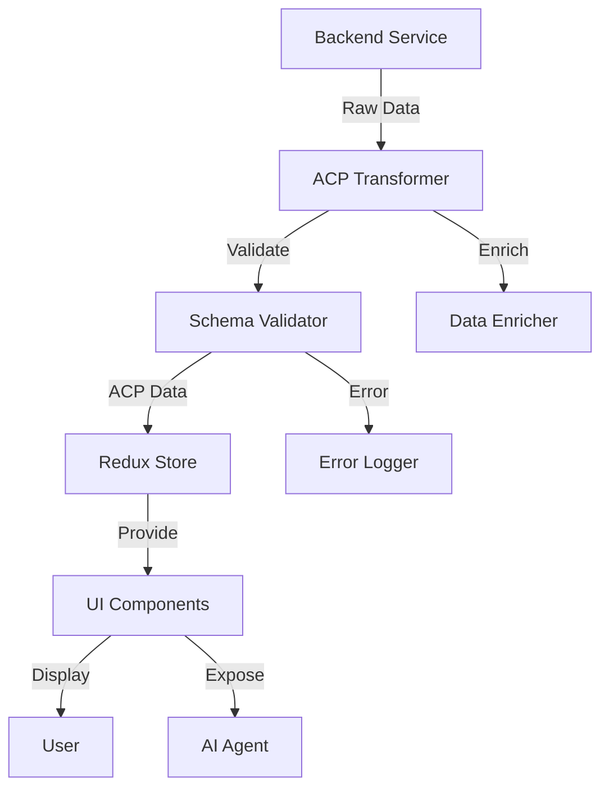

# ADR-018: Agentic Commerce Protocol (ACP) Frontend Integration

**Status**: Accepted  
**Date**: 2026-01-30  
**Deciders**: Architecture Team  
**Tags**: frontend, protocol, acp, product-data

## Context

The Holiday Peak Hub must maintain **Agentic Commerce Protocol (ACP)** compliance for all product data displayed and manipulated in the frontend. ACP standardizes product information across retailers, enabling AI agents to understand and interact with products consistently.

### Requirements

**Functional**:
- Display ACP-compliant product data
- Validate product data against ACP schemas
- Transform backend responses to ACP format
- Support ACP extensions for custom attributes
- Enable agent-friendly product interactions

**Non-Functional**:
- Zero data loss during transformation
- Schema validation performance < 5ms
- Backward compatibility with legacy product data
- Type safety for all product fields

## Decision

We will implement **full ACP compliance** in the frontend, including schema validation, data transformation, and agent-friendly product representations.

**Specification**: https://github.com/agentic-commerce-protocol/agentic-commerce-protocol

### Core Components

**1. ACP Type Definitions**
- TypeScript interfaces for all ACP entities
- Zod schemas for runtime validation
- Utility types for transformations

**2. Data Transformation Layer**
- Convert backend responses to ACP format
- Apply normalization and enrichment
- Handle ACP extensions

**3. Schema Validation**
- Validate all product data against ACP schemas
- Log validation errors
- Provide fallbacks for non-compliant data

**4. Agent-Friendly Representations**
- Structured product data for AI agents
- Semantic annotations
- Action mappings

### Architecture



## Consequences

### Positive

**Interoperability**:
- Products understood by any ACP-compliant agent
- Consistent data model across services
- Future-proof against schema changes

**Data Quality**:
- Schema validation catches errors early
- Normalized product representation
- Complete and accurate product information

**Developer Experience**:
- Type-safe product data access
- Clear data contracts
- Reduced bugs from malformed data

**Agent Experience**:
- Standardized product structure
- Predictable data access patterns
- Rich semantic information

### Negative

**Transformation Overhead**:
- Additional processing for data transformation
- ~3-5ms per product
- **Mitigation**: Caching transformed products, batch processing

**Schema Validation Cost**:
- Runtime validation adds latency
- ~2-3ms per product
- **Mitigation**: Validate once on fetch, cache results

**Learning Curve**:
- Developers must learn ACP schema
- **Mitigation**: Documentation, TypeScript autocomplete, examples

**Schema Evolution**:
- Must track ACP version updates
- Breaking changes require migration
- **Mitigation**: Version pinning, automated tests

## Implementation

### 1. ACP Type Definitions

```typescript
// lib/acp/types.ts
import { z } from 'zod';

// Core ACP Product Schema (v1.0)
export const ACPProductSchema = z.object({
  id: z.string(),
  sku: z.string(),
  name: z.string(),
  description: z.string().optional(),
  shortDescription: z.string().optional(),
  brand: z.object({
    id: z.string(),
    name: z.string(),
    logo: z.string().url().optional(),
  }).optional(),
  category: z.object({
    id: z.string(),
    name: z.string(),
    path: z.array(z.string()),
  }),
  price: z.object({
    amount: z.number(),
    currency: z.string().length(3),
    compareAt: z.number().optional(),
    discountPercent: z.number().min(0).max(100).optional(),
  }),
  inventory: z.object({
    available: z.boolean(),
    quantity: z.number().int().min(0),
    status: z.enum(['in-stock', 'low-stock', 'out-of-stock', 'preorder']),
    eta: z.string().datetime().optional(),
  }),
  images: z.array(z.object({
    url: z.string().url(),
    alt: z.string().optional(),
    width: z.number().int().positive().optional(),
    height: z.number().int().positive().optional(),
    isPrimary: z.boolean().optional(),
  })),
  attributes: z.record(z.any()).optional(),
  variants: z.array(z.object({
    id: z.string(),
    sku: z.string(),
    name: z.string(),
    attributes: z.record(z.string()),
    price: z.object({
      amount: z.number(),
      currency: z.string().length(3),
    }),
    inventory: z.object({
      available: z.boolean(),
      quantity: z.number().int().min(0),
    }),
  })).optional(),
  metadata: z.object({
    createdAt: z.string().datetime(),
    updatedAt: z.string().datetime(),
    acpVersion: z.string(),
  }),
});

export type ACPProduct = z.infer<typeof ACPProductSchema>;

// ACP Cart Schema
export const ACPCartItemSchema = z.object({
  id: z.string(),
  product: ACPProductSchema,
  quantity: z.number().int().min(1),
  variantId: z.string().optional(),
  addedAt: z.string().datetime(),
});

export type ACPCartItem = z.infer<typeof ACPCartItemSchema>;

export const ACPCartSchema = z.object({
  id: z.string(),
  items: z.array(ACPCartItemSchema),
  totals: z.object({
    subtotal: z.number(),
    tax: z.number().optional(),
    shipping: z.number().optional(),
    discount: z.number().optional(),
    total: z.number(),
    currency: z.string().length(3),
  }),
  metadata: z.object({
    createdAt: z.string().datetime(),
    updatedAt: z.string().datetime(),
    acpVersion: z.string(),
  }),
});

export type ACPCart = z.infer<typeof ACPCartSchema>;
```

### 2. Data Transformer

```typescript
// lib/acp/transformer.ts
import type { ACPProduct } from './types';
import { ACPProductSchema } from './types';

export interface BackendProduct {
  product_id: string;
  product_sku: string;
  product_name: string;
  product_description?: string;
  brand_name?: string;
  category_id: string;
  category_name: string;
  price: number;
  currency: string;
  stock_quantity: number;
  image_url?: string;
  [key: string]: any;
}

export class ACPTransformer {
  /**
   * Transform backend product to ACP format
   */
  static toACPProduct(backendProduct: BackendProduct): ACPProduct {
    const product: ACPProduct = {
      id: backendProduct.product_id,
      sku: backendProduct.product_sku,
      name: backendProduct.product_name,
      description: backendProduct.product_description,
      shortDescription: backendProduct.short_description,
      brand: backendProduct.brand_name ? {
        id: backendProduct.brand_id || `brand-${backendProduct.brand_name}`,
        name: backendProduct.brand_name,
        logo: backendProduct.brand_logo,
      } : undefined,
      category: {
        id: backendProduct.category_id,
        name: backendProduct.category_name,
        path: backendProduct.category_path || [backendProduct.category_name],
      },
      price: {
        amount: backendProduct.price,
        currency: backendProduct.currency || 'USD',
        compareAt: backendProduct.compare_at_price,
        discountPercent: backendProduct.discount_percent,
      },
      inventory: {
        available: backendProduct.stock_quantity > 0,
        quantity: backendProduct.stock_quantity,
        status: this.getInventoryStatus(backendProduct.stock_quantity),
        eta: backendProduct.restock_eta,
      },
      images: this.transformImages(backendProduct),
      attributes: backendProduct.attributes || {},
      variants: backendProduct.variants?.map(v => this.transformVariant(v)),
      metadata: {
        createdAt: backendProduct.created_at || new Date().toISOString(),
        updatedAt: backendProduct.updated_at || new Date().toISOString(),
        acpVersion: '1.0',
      },
    };
    
    return product;
  }
  
  private static getInventoryStatus(quantity: number) {
    if (quantity === 0) return 'out-of-stock';
    if (quantity < 5) return 'low-stock';
    return 'in-stock';
  }
  
  private static transformImages(product: BackendProduct) {
    const images = [];
    
    if (product.image_url) {
      images.push({
        url: product.image_url,
        alt: product.product_name,
        isPrimary: true,
      });
    }
    
    if (product.additional_images) {
      images.push(...product.additional_images.map((url: string) => ({
        url,
        alt: product.product_name,
        isPrimary: false,
      })));
    }
    
    return images;
  }
  
  private static transformVariant(backendVariant: any) {
    return {
      id: backendVariant.variant_id,
      sku: backendVariant.variant_sku,
      name: backendVariant.variant_name,
      attributes: backendVariant.attributes || {},
      price: {
        amount: backendVariant.price,
        currency: backendVariant.currency || 'USD',
      },
      inventory: {
        available: backendVariant.stock_quantity > 0,
        quantity: backendVariant.stock_quantity,
      },
    };
  }
}
```

### 3. Schema Validator

```typescript
// lib/acp/validator.ts
import { ACPProductSchema, type ACPProduct } from './types';
import { ZodError } from 'zod';

export interface ValidationResult {
  valid: boolean;
  errors?: string[];
  data?: ACPProduct;
}

export class ACPValidator {
  /**
   * Validate product against ACP schema
   */
  static validateProduct(product: unknown): ValidationResult {
    try {
      const validated = ACPProductSchema.parse(product);
      return {
        valid: true,
        data: validated,
      };
    } catch (error) {
      if (error instanceof ZodError) {
        return {
          valid: false,
          errors: error.errors.map(e => `${e.path.join('.')}: ${e.message}`),
        };
      }
      return {
        valid: false,
        errors: ['Unknown validation error'],
      };
    }
  }
  
  /**
   * Validate and log errors
   */
  static validateAndLog(product: unknown, context: string): ACPProduct | null {
    const result = this.validateProduct(product);
    
    if (!result.valid) {
      console.error(`ACP validation failed for ${context}:`, result.errors);
      // Log to monitoring service
      logger.error('acp.validation.failed', {
        context,
        errors: result.errors,
        product: JSON.stringify(product),
      });
      return null;
    }
    
    return result.data!;
  }
}
```

### 4. React Hook for ACP Products

```typescript
// hooks/useACPProduct.ts
import { useQuery } from '@tanstack/react-query';
import { ACPTransformer } from '@/lib/acp/transformer';
import { ACPValidator } from '@/lib/acp/validator';
import type { ACPProduct } from '@/lib/acp/types';

export function useACPProduct(productId: string) {
  return useQuery({
    queryKey: ['product', productId, 'acp'],
    queryFn: async () => {
      // Fetch from backend
      const response = await fetch(`/api/services/ecommerce-product-detail-enrichment/product/${productId}`);
      const backendProduct = await response.json();
      
      // Transform to ACP
      const acpProduct = ACPTransformer.toACPProduct(backendProduct);
      
      // Validate
      const validated = ACPValidator.validateAndLog(acpProduct, `product-${productId}`);
      
      if (!validated) {
        throw new Error('Product failed ACP validation');
      }
      
      return validated;
    },
    staleTime: 5 * 60 * 1000, // 5 minutes
  });
}
```

### 5. Redux Store Integration

```typescript
// store/slices/productsSlice.ts
import { createSlice, createAsyncThunk } from '@reduxjs/toolkit';
import type { ACPProduct } from '@/lib/acp/types';
import { ACPTransformer } from '@/lib/acp/transformer';
import { ACPValidator } from '@/lib/acp/validator';

interface ProductsState {
  items: Record<string, ACPProduct>;
  loading: boolean;
  error: string | null;
}

export const fetchProduct = createAsyncThunk(
  'products/fetch',
  async (productId: string) => {
    const response = await fetch(`/api/services/ecommerce-product-detail-enrichment/product/${productId}`);
    const backendProduct = await response.json();
    
    const acpProduct = ACPTransformer.toACPProduct(backendProduct);
    const validated = ACPValidator.validateAndLog(acpProduct, `product-${productId}`);
    
    if (!validated) {
      throw new Error('Product validation failed');
    }
    
    return validated;
  }
);

const productsSlice = createSlice({
  name: 'products',
  initialState: {
    items: {},
    loading: false,
    error: null,
  } as ProductsState,
  reducers: {},
  extraReducers: (builder) => {
    builder
      .addCase(fetchProduct.fulfilled, (state, action) => {
        state.items[action.payload.id] = action.payload;
        state.loading = false;
      })
      .addCase(fetchProduct.rejected, (state, action) => {
        state.error = action.error.message || 'Failed to fetch product';
        state.loading = false;
      });
  },
});

export default productsSlice.reducer;
```

## Monitoring

### Metrics
- ACP validation success rate
- Transformation time per product
- Schema version distribution
- Validation error types

### Logging
```typescript
logger.info('acp.transform', {
  productId: product.id,
  fromSchema: 'backend',
  toSchema: 'acp-1.0',
  duration: transformTime,
});

logger.error('acp.validation.error', {
  productId: product.id,
  errors: validationErrors,
  data: product,
});
```

## Testing

```typescript
// __tests__/acp-transformer.test.ts
describe('ACPTransformer', () => {
  it('transforms backend product to ACP format', () => {
    const backendProduct = { /* ... */ };
    const acpProduct = ACPTransformer.toACPProduct(backendProduct);
    
    expect(acpProduct).toMatchObject({
      id: expect.any(String),
      sku: expect.any(String),
      name: expect.any(String),
      price: expect.objectContaining({
        amount: expect.any(Number),
        currency: expect.any(String),
      }),
      inventory: expect.objectContaining({
        available: expect.any(Boolean),
        quantity: expect.any(Number),
      }),
    });
  });
  
  it('validates ACP product successfully', () => {
    const acpProduct = { /* valid ACP product */ };
    const result = ACPValidator.validateProduct(acpProduct);
    
    expect(result.valid).toBe(true);
    expect(result.data).toBeDefined();
  });
});
```

## References

- [Agentic Commerce Protocol Specification](https://github.com/agentic-commerce-protocol/agentic-commerce-protocol)
- [ACP Schema Documentation](https://github.com/agentic-commerce-protocol/agentic-commerce-protocol/tree/main/schemas)
- [ADR-014: ACP Backend Alignment](adr-014-acp-alignment.md)
- [ADR-017: AG-UI Protocol](adr-017-ag-ui-protocol.md)

## Revision History

| Version | Date | Changes | Author |
|---------|------|---------|--------|
| 1.0 | 2026-01-30 | Initial decision | Architecture Team |
