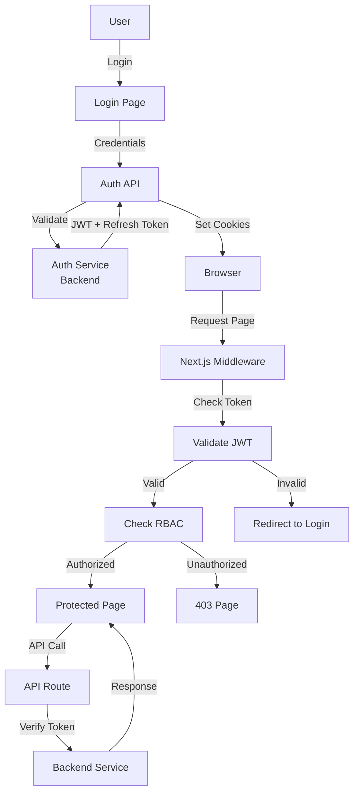

# ADR-019: Authentication and Role-Based Access Control

**Status**: Accepted  
**Date**: 2026-01-30  
**Deciders**: Security Team, Architecture Team  
**Tags**: security, authentication, authorization, rbac

## Context

The Holiday Peak Hub frontend has distinct user personas with different access requirements:

### User Personas

**External Users (Public)**:
- Browse products and catalog
- Add items to cart
- Place orders
- Track order status
- No authentication required for browsing
- Authentication required for checkout

**Internal Users (Authenticated)**:
- Access admin pages (inventory, logistics, CRM)
- Manage products and inventory
- View analytics and reports
- Configure system settings
- Must be authenticated with appropriate role

### Requirements

**Functional**:
- Session-based authentication
- JWT token management
- Role-based access control (RBAC)
- Secure session storage
- Token refresh mechanism
- Logout and session invalidation

**Non-Functional**:
- Secure token storage (httpOnly cookies)
- CSRF protection
- XSS prevention
- Session timeout (30 minutes inactivity)
- Audit logging for sensitive actions

## Decision

We will implement a **JWT-based authentication system with Next.js middleware for route protection** and **RBAC for granular access control**.

### Architecture



## Consequences

### Positive

**Security**:
- JWT stored in httpOnly cookies (XSS protection)
- CSRF tokens for mutation requests
- Short-lived access tokens (15 min)
- Refresh token rotation
- Secure session management

**User Experience**:
- Seamless authentication
- Persistent sessions across tabs
- Auto token refresh
- Clear error messages

**Developer Experience**:
- Middleware-based protection
- Type-safe role checking
- Easy to add new roles
- Centralized auth logic

**Scalability**:
- Stateless authentication
- No server-side session storage
- Horizontal scaling friendly

### Negative

**Complexity**:
- Token refresh logic
- Middleware configuration
- Role management
- **Mitigation**: Well-documented patterns, helper functions

**Token Storage**:
- httpOnly cookies can't be accessed by JS
- Requires server-side token validation
- **Mitigation**: Standard pattern, next-auth compatible

**Session Management**:
- Must handle token expiry gracefully
- Refresh token rotation complexity
- **Mitigation**: Automatic refresh, clear error handling

## Implementation

### 1. Environment Variables

```bash
# .env.local
AUTH_SECRET="your-secret-key-min-32-chars"
AUTH_API_URL="http://localhost:8000/auth"
JWT_SECRET="your-jwt-secret-key"
JWT_ACCESS_EXPIRY="15m"
JWT_REFRESH_EXPIRY="7d"
```

### 2. Auth Types

```typescript
// lib/auth/types.ts
export interface User {
  id: string;
  email: string;
  name: string;
  role: Role;
  permissions: Permission[];
}

export enum Role {
  GUEST = 'guest',
  CUSTOMER = 'customer',
  STAFF = 'staff',
  MANAGER = 'manager',
  ADMIN = 'admin',
}

export enum Permission {
  // Product Management
  VIEW_PRODUCTS = 'view:products',
  EDIT_PRODUCTS = 'edit:products',
  DELETE_PRODUCTS = 'delete:products',
  
  // Inventory
  VIEW_INVENTORY = 'view:inventory',
  EDIT_INVENTORY = 'edit:inventory',
  
  // Orders
  VIEW_ORDERS = 'view:orders',
  MANAGE_ORDERS = 'manage:orders',
  
  // CRM
  VIEW_CUSTOMERS = 'view:customers',
  EDIT_CUSTOMERS = 'edit:customers',
  
  // Logistics
  VIEW_LOGISTICS = 'view:logistics',
  MANAGE_LOGISTICS = 'manage:logistics',
  
  // Analytics
  VIEW_ANALYTICS = 'view:analytics',
  
  // System
  VIEW_SETTINGS = 'view:settings',
  EDIT_SETTINGS = 'edit:settings',
}

export interface JWTPayload {
  sub: string; // user ID
  email: string;
  name: string;
  role: Role;
  permissions: Permission[];
  iat: number;
  exp: number;
}

export interface AuthTokens {
  accessToken: string;
  refreshToken: string;
  expiresIn: number;
}
```

### 3. Auth Service

```typescript
// lib/auth/auth-service.ts
import { jwtVerify, SignJWT } from 'jose';
import type { User, JWTPayload, AuthTokens } from './types';

const JWT_SECRET = new TextEncoder().encode(process.env.JWT_SECRET);

export class AuthService {
  /**
   * Login user with credentials
   */
  static async login(email: string, password: string): Promise<AuthTokens> {
    const response = await fetch(`${process.env.AUTH_API_URL}/login`, {
      method: 'POST',
      headers: { 'Content-Type': 'application/json' },
      body: JSON.stringify({ email, password }),
    });
    
    if (!response.ok) {
      throw new Error('Invalid credentials');
    }
    
    return response.json();
  }
  
  /**
   * Verify JWT token
   */
  static async verifyToken(token: string): Promise<JWTPayload> {
    try {
      const { payload } = await jwtVerify(token, JWT_SECRET);
      return payload as JWTPayload;
    } catch (error) {
      throw new Error('Invalid token');
    }
  }
  
  /**
   * Refresh access token
   */
  static async refreshToken(refreshToken: string): Promise<AuthTokens> {
    const response = await fetch(`${process.env.AUTH_API_URL}/refresh`, {
      method: 'POST',
      headers: { 'Content-Type': 'application/json' },
      body: JSON.stringify({ refreshToken }),
    });
    
    if (!response.ok) {
      throw new Error('Token refresh failed');
    }
    
    return response.json();
  }
  
  /**
   * Get current user from token
   */
  static async getCurrentUser(token: string): Promise<User> {
    const payload = await this.verifyToken(token);
    
    return {
      id: payload.sub,
      email: payload.email,
      name: payload.name,
      role: payload.role,
      permissions: payload.permissions,
    };
  }
  
  /**
   * Check if user has permission
   */
  static hasPermission(user: User, permission: Permission): boolean {
    return user.permissions.includes(permission);
  }
  
  /**
   * Check if user has role
   */
  static hasRole(user: User, role: Role): boolean {
    return user.role === role;
  }
  
  /**
   * Check if user has any of the roles
   */
  static hasAnyRole(user: User, roles: Role[]): boolean {
    return roles.includes(user.role);
  }
}
```

### 4. Auth API Routes

```typescript
// app/api/auth/login/route.ts
import { NextRequest, NextResponse } from 'next/server';
import { AuthService } from '@/lib/auth/auth-service';

export async function POST(request: NextRequest) {
  try {
    const { email, password } = await request.json();
    
    const tokens = await AuthService.login(email, password);
    
    // Set httpOnly cookies
    const response = NextResponse.json({ success: true });
    
    response.cookies.set('accessToken', tokens.accessToken, {
      httpOnly: true,
      secure: process.env.NODE_ENV === 'production',
      sameSite: 'strict',
      maxAge: tokens.expiresIn,
      path: '/',
    });
    
    response.cookies.set('refreshToken', tokens.refreshToken, {
      httpOnly: true,
      secure: process.env.NODE_ENV === 'production',
      sameSite: 'strict',
      maxAge: 7 * 24 * 60 * 60, // 7 days
      path: '/',
    });
    
    return response;
  } catch (error) {
    return NextResponse.json(
      { error: 'Authentication failed' },
      { status: 401 }
    );
  }
}

// app/api/auth/logout/route.ts
export async function POST(request: NextRequest) {
  const response = NextResponse.json({ success: true });
  
  // Clear cookies
  response.cookies.delete('accessToken');
  response.cookies.delete('refreshToken');
  
  return response;
}

// app/api/auth/me/route.ts
export async function GET(request: NextRequest) {
  try {
    const token = request.cookies.get('accessToken')?.value;
    
    if (!token) {
      return NextResponse.json({ error: 'Not authenticated' }, { status: 401 });
    }
    
    const user = await AuthService.getCurrentUser(token);
    
    return NextResponse.json({ user });
  } catch (error) {
    return NextResponse.json({ error: 'Invalid token' }, { status: 401 });
  }
}
```

### 5. Next.js Middleware

```typescript
// middleware.ts
import { NextResponse } from 'next/server';
import type { NextRequest } from 'next/server';
import { AuthService } from '@/lib/auth/auth-service';
import { Role } from '@/lib/auth/types';

// Define protected routes and required roles
const PROTECTED_ROUTES: Record<string, Role[]> = {
  '/admin': [Role.ADMIN, Role.MANAGER],
  '/admin/inventory': [Role.ADMIN, Role.MANAGER, Role.STAFF],
  '/admin/logistics': [Role.ADMIN, Role.MANAGER, Role.STAFF],
  '/admin/crm': [Role.ADMIN, Role.MANAGER],
  '/admin/analytics': [Role.ADMIN, Role.MANAGER],
  '/admin/products': [Role.ADMIN, Role.MANAGER, Role.STAFF],
};

export async function middleware(request: NextRequest) {
  const { pathname } = request.nextUrl;
  
  // Check if route is protected
  const requiredRoles = Object.entries(PROTECTED_ROUTES).find(([route]) =>
    pathname.startsWith(route)
  )?.[1];
  
  if (!requiredRoles) {
    return NextResponse.next();
  }
  
  // Get access token from cookie
  const accessToken = request.cookies.get('accessToken')?.value;
  
  if (!accessToken) {
    // Redirect to login
    const loginUrl = new URL('/login', request.url);
    loginUrl.searchParams.set('redirect', pathname);
    return NextResponse.redirect(loginUrl);
  }
  
  try {
    // Verify token and get user
    const user = await AuthService.getCurrentUser(accessToken);
    
    // Check if user has required role
    if (!AuthService.hasAnyRole(user, requiredRoles)) {
      return NextResponse.redirect(new URL('/403', request.url));
    }
    
    // Add user to request headers
    const requestHeaders = new Headers(request.headers);
    requestHeaders.set('x-user-id', user.id);
    requestHeaders.set('x-user-role', user.role);
    
    return NextResponse.next({
      request: {
        headers: requestHeaders,
      },
    });
  } catch (error) {
    // Token invalid, try to refresh
    const refreshToken = request.cookies.get('refreshToken')?.value;
    
    if (refreshToken) {
      try {
        const tokens = await AuthService.refreshToken(refreshToken);
        
        const response = NextResponse.next();
        response.cookies.set('accessToken', tokens.accessToken, {
          httpOnly: true,
          secure: process.env.NODE_ENV === 'production',
          sameSite: 'strict',
          maxAge: tokens.expiresIn,
          path: '/',
        });
        
        return response;
      } catch (refreshError) {
        // Refresh failed, redirect to login
        const loginUrl = new URL('/login', request.url);
        loginUrl.searchParams.set('redirect', pathname);
        return NextResponse.redirect(loginUrl);
      }
    }
    
    // No refresh token, redirect to login
    const loginUrl = new URL('/login', request.url);
    loginUrl.searchParams.set('redirect', pathname);
    return NextResponse.redirect(loginUrl);
  }
}

export const config = {
  matcher: [
    '/admin/:path*',
    '/api/:path*',
  ],
};
```

### 6. Auth Context Provider

```typescript
// contexts/AuthContext.tsx
'use client';

import { createContext, useContext, useEffect, useState } from 'react';
import type { User } from '@/lib/auth/types';

interface AuthContextType {
  user: User | null;
  loading: boolean;
  login: (email: string, password: string) => Promise<void>;
  logout: () => Promise<void>;
  isAuthenticated: boolean;
}

const AuthContext = createContext<AuthContextType | undefined>(undefined);

export function AuthProvider({ children }: { children: React.ReactNode }) {
  const [user, setUser] = useState<User | null>(null);
  const [loading, setLoading] = useState(true);
  
  useEffect(() => {
    // Fetch current user on mount
    fetch('/api/auth/me')
      .then(res => res.json())
      .then(data => {
        if (data.user) {
          setUser(data.user);
        }
      })
      .catch(() => {
        setUser(null);
      })
      .finally(() => {
        setLoading(false);
      });
  }, []);
  
  const login = async (email: string, password: string) => {
    const response = await fetch('/api/auth/login', {
      method: 'POST',
      headers: { 'Content-Type': 'application/json' },
      body: JSON.stringify({ email, password }),
    });
    
    if (!response.ok) {
      throw new Error('Login failed');
    }
    
    // Fetch updated user
    const meResponse = await fetch('/api/auth/me');
    const { user } = await meResponse.json();
    setUser(user);
  };
  
  const logout = async () => {
    await fetch('/api/auth/logout', { method: 'POST' });
    setUser(null);
  };
  
  return (
    <AuthContext.Provider
      value={{
        user,
        loading,
        login,
        logout,
        isAuthenticated: !!user,
      }}
    >
      {children}
    </AuthContext.Provider>
  );
}

export function useAuth() {
  const context = useContext(AuthContext);
  if (!context) {
    throw new Error('useAuth must be used within AuthProvider');
  }
  return context;
}
```

### 7. Protected Route Component

```typescript
// components/ProtectedRoute.tsx
'use client';

import { useAuth } from '@/contexts/AuthContext';
import { Role, Permission } from '@/lib/auth/types';
import { AuthService } from '@/lib/auth/auth-service';
import { useRouter } from 'next/navigation';
import { useEffect } from 'react';

interface ProtectedRouteProps {
  children: React.ReactNode;
  requiredRoles?: Role[];
  requiredPermissions?: Permission[];
  fallback?: React.ReactNode;
}

export function ProtectedRoute({
  children,
  requiredRoles,
  requiredPermissions,
  fallback,
}: ProtectedRouteProps) {
  const { user, loading, isAuthenticated } = useAuth();
  const router = useRouter();
  
  useEffect(() => {
    if (!loading && !isAuthenticated) {
      router.push('/login');
    }
  }, [loading, isAuthenticated, router]);
  
  if (loading) {
    return <div>Loading...</div>;
  }
  
  if (!isAuthenticated || !user) {
    return null;
  }
  
  // Check roles
  if (requiredRoles && !AuthService.hasAnyRole(user, requiredRoles)) {
    return fallback || <div>Access Denied</div>;
  }
  
  // Check permissions
  if (requiredPermissions) {
    const hasAllPermissions = requiredPermissions.every(permission =>
      AuthService.hasPermission(user, permission)
    );
    
    if (!hasAllPermissions) {
      return fallback || <div>Access Denied</div>;
    }
  }
  
  return <>{children}</>;
}
```

## Security Considerations

### Token Storage
- Access tokens in httpOnly cookies (XSS protection)
- Refresh tokens in httpOnly cookies
- Never store tokens in localStorage
- CSRF protection with SameSite=strict

### Token Expiry
- Access tokens: 15 minutes
- Refresh tokens: 7 days
- Automatic refresh before expiry
- Graceful handling of expired tokens

### Session Management
- Idle timeout: 30 minutes
- Session logging for audit
- Concurrent session control
- Logout on suspicious activity

## Monitoring

### Metrics
- Login success/failure rate
- Token refresh rate
- Session duration
- Access denied events

### Audit Logging
```typescript
logger.info('auth.login', { userId, email, timestamp });
logger.warn('auth.access_denied', { userId, resource, reason });
logger.info('auth.logout', { userId, sessionDuration });
```

## References

- [Next.js Authentication](https://nextjs.org/docs/authentication)
- [JWT Best Practices](https://tools.ietf.org/html/rfc8725)
- [OWASP Authentication Cheat Sheet](https://cheatsheetseries.owasp.org/cheatsheets/Authentication_Cheat_Sheet.html)
- [Frontend Architecture Plan](../FRONTEND_ARCHITECTURE_PLAN.md)

## Revision History

| Version | Date | Changes | Author |
|---------|------|---------|--------|
| 1.0 | 2026-01-30 | Initial decision | Security Team |
