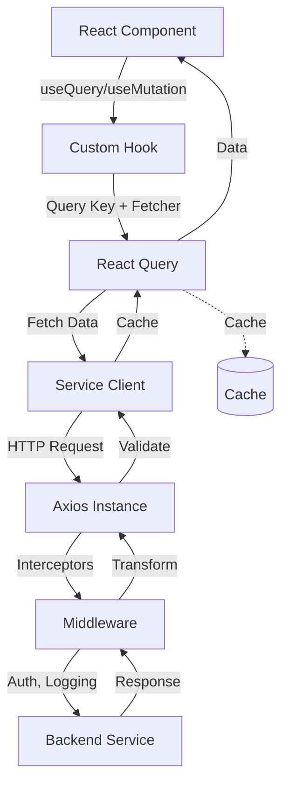

# ADR-020: API Client Architecture

**Status**: Accepted  
**Date**: 2026-01-30  
**Deciders**: Architecture Team, Frontend Team  
**Tags**: frontend, api, client, architecture

## Context

The Holiday Peak Hub frontend must communicate with **21 backend Python FastAPI services** across five domains (E-Commerce, Product Management, CRM, Inventory, Logistics). Each service exposes:
- **POST /invoke** - Main agent invocation endpoint
- **GET /health** - Health check endpoint
- **MCP Tools** - Domain-specific tool endpoints (e.g., `/crm/profile/context`)

### Requirements

**Functional**:
- Type-safe API calls
- Request/response validation
- Error handling and retries
- Loading states
- Caching and invalidation
- Optimistic updates
- Request cancellation

**Non-Functional**:
- Response time < 200ms (frontend overhead)
- Automatic retries with exponential backoff
- Request deduplication
- Request batching where applicable
- Comprehensive error logging

### Service Inventory

**E-Commerce (5 services)**:
- ecommerce-catalog-search
- ecommerce-product-detail-enrichment
- ecommerce-cart-intelligence
- ecommerce-checkout-support
- ecommerce-order-status

**Product Management (4 services)**:
- product-management-normalization-classification
- product-management-acp-transformation
- product-management-consistency-validation
- product-management-assortment-optimization

**CRM (4 services)**:
- crm-profile-aggregation
- crm-segmentation-personalization
- crm-campaign-intelligence
- crm-support-assistance

**Inventory (4 services)**:
- inventory-health-check
- inventory-jit-replenishment
- inventory-reservation-validation
- inventory-alerts-triggers

**Logistics (4 services)**:
- logistics-eta-computation
- logistics-carrier-selection
- logistics-returns-support
- logistics-route-issue-detection

## Decision

We will implement a **layered API client architecture** using:
- **TanStack Query (React Query)** for data fetching and caching
- **Axios** for HTTP client with interceptors
- **Zod** for request/response validation
- **Type-safe service clients** generated from backend schemas

### Architecture Layers



## Consequences

### Positive

**Type Safety**:
- Full TypeScript coverage
- Schema validation with Zod
- Auto-complete for all API calls

**Developer Experience**:
- Simple hook-based API
- Automatic loading/error states
- Easy cache invalidation
- Optimistic updates

**Performance**:
- Intelligent caching
- Request deduplication
- Background refetching
- Prefetching support

**Reliability**:
- Automatic retries
- Error boundary integration
- Request cancellation
- Stale-while-revalidate

### Negative

**Bundle Size**:
- React Query (~40KB)
- Axios (~15KB)
- Service clients (~50KB)
- **Mitigation**: Tree-shaking, code splitting

**Learning Curve**:
- React Query concepts (queries, mutations, cache)
- **Mitigation**: Documentation, examples, training

**Cache Management**:
- Must define invalidation strategies
- Risk of stale data
- **Mitigation**: Proper cache keys, automatic invalidation

## Implementation

### 1. Axios Instance

```typescript
// lib/api/axios-instance.ts
import axios from 'axios';
import type { AxiosError, AxiosRequestConfig } from 'axios';

// Create base axios instance
export const apiClient = axios.create({
  baseURL: process.env.NEXT_PUBLIC_API_URL || '/api/services',
  timeout: 30000,
  headers: {
    'Content-Type': 'application/json',
  },
});

// Request interceptor - Add auth token
apiClient.interceptors.request.use(
  (config) => {
    // Token is sent via cookie, but we can add it to header for non-browser clients
    const token = typeof window !== 'undefined' 
      ? document.cookie.match(/accessToken=([^;]+)/)?.[1]
      : null;
    
    if (token) {
      config.headers.Authorization = `Bearer ${token}`;
    }
    
    // Add request ID for tracing
    config.headers['X-Request-ID'] = crypto.randomUUID();
    
    // Log request
    logger.debug('api.request', {
      method: config.method,
      url: config.url,
      requestId: config.headers['X-Request-ID'],
    });
    
    return config;
  },
  (error) => {
    logger.error('api.request.error', { error });
    return Promise.reject(error);
  }
);

// Response interceptor - Handle errors
apiClient.interceptors.response.use(
  (response) => {
    // Log successful response
    logger.debug('api.response', {
      status: response.status,
      url: response.config.url,
      requestId: response.config.headers['X-Request-ID'],
    });
    
    return response;
  },
  async (error: AxiosError) => {
    const requestId = error.config?.headers?.['X-Request-ID'];
    
    // Log error
    logger.error('api.response.error', {
      status: error.response?.status,
      url: error.config?.url,
      requestId,
      message: error.message,
    });
    
    // Handle 401 - Unauthorized (token expired)
    if (error.response?.status === 401) {
      // Redirect to login
      if (typeof window !== 'undefined') {
        window.location.href = '/login?redirect=' + window.location.pathname;
      }
    }
    
    // Handle 403 - Forbidden
    if (error.response?.status === 403) {
      logger.warn('api.access_denied', {
        url: error.config?.url,
        requestId,
      });
    }
    
    return Promise.reject(error);
  }
);
```

### 2. Service Client Base Class

```typescript
// lib/api/service-client.ts
import { apiClient } from './axios-instance';
import type { AxiosRequestConfig } from 'axios';
import { z } from 'zod';

export interface InvokeRequest {
  query: string;
  context?: Record<string, any>;
  stream?: boolean;
}

export interface InvokeResponse {
  response: string;
  metadata?: Record<string, any>;
  timestamp: string;
}

export abstract class ServiceClient {
  constructor(protected serviceName: string) {}
  
  /**
   * Get base URL for service
   */
  protected getBaseUrl(): string {
    return `/${this.serviceName}`;
  }
  
  /**
   * Invoke agent endpoint
   */
  async invoke(request: InvokeRequest): Promise<InvokeResponse> {
    const response = await apiClient.post<InvokeResponse>(
      `${this.getBaseUrl()}/invoke`,
      request
    );
    return response.data;
  }
  
  /**
   * Health check
   */
  async health(): Promise<{ status: string }> {
    const response = await apiClient.get(`${this.getBaseUrl()}/health`);
    return response.data;
  }
  
  /**
   * Call MCP tool endpoint
   */
  protected async callTool<T>(
    toolPath: string,
    method: 'GET' | 'POST' = 'POST',
    data?: any,
    schema?: z.ZodSchema<T>
  ): Promise<T> {
    const response = await apiClient.request({
      method,
      url: `${this.getBaseUrl()}${toolPath}`,
      data,
    });
    
    if (schema) {
      return schema.parse(response.data);
    }
    
    return response.data;
  }
}
```

### 3. Domain-Specific Service Clients

```typescript
// lib/api/clients/ecommerce-cart.ts
import { ServiceClient } from '../service-client';
import { z } from 'zod';

const AddToCartSchema = z.object({
  success: z.boolean(),
  cartId: z.string(),
  itemId: z.string(),
  quantity: z.number(),
});

const CartStateSchema = z.object({
  cartId: z.string(),
  items: z.array(z.object({
    id: z.string(),
    productId: z.string(),
    sku: z.string(),
    name: z.string(),
    quantity: z.number(),
    price: z.number(),
  })),
  subtotal: z.number(),
  total: z.number(),
});

export class EcommerceCartClient extends ServiceClient {
  constructor() {
    super('ecommerce-cart-intelligence');
  }
  
  async addToCart(productId: string, sku: string, quantity: number) {
    return this.callTool(
      '/cart/add',
      'POST',
      { productId, sku, quantity },
      AddToCartSchema
    );
  }
  
  async removeFromCart(itemId: string) {
    return this.callTool(
      '/cart/remove',
      'POST',
      { itemId },
      z.object({ success: z.boolean() })
    );
  }
  
  async updateQuantity(itemId: string, quantity: number) {
    return this.callTool(
      '/cart/update',
      'POST',
      { itemId, quantity },
      z.object({ success: z.boolean(), quantity: z.number() })
    );
  }
  
  async getCartState(cartId: string) {
    return this.callTool(
      `/cart/state/${cartId}`,
      'GET',
      undefined,
      CartStateSchema
    );
  }
}

// Export singleton instance
export const ecommerceCartClient = new EcommerceCartClient();
```

```typescript
// lib/api/clients/crm-profile.ts
import { ServiceClient } from '../service-client';
import { z } from 'zod';

const UserProfileSchema = z.object({
  userId: z.string(),
  email: z.string().email(),
  name: z.string(),
  segment: z.string().optional(),
  preferences: z.record(z.any()).optional(),
  purchaseHistory: z.array(z.object({
    orderId: z.string(),
    date: z.string(),
    total: z.number(),
  })).optional(),
});

export class CRMProfileClient extends ServiceClient {
  constructor() {
    super('crm-profile-aggregation');
  }
  
  async getProfile(userId: string) {
    return this.callTool(
      `/crm/profile/context`,
      'POST',
      { userId },
      UserProfileSchema
    );
  }
  
  async updateProfile(userId: string, updates: Partial<z.infer<typeof UserProfileSchema>>) {
    return this.callTool(
      `/crm/profile/update`,
      'POST',
      { userId, updates },
      UserProfileSchema
    );
  }
}

export const crmProfileClient = new CRMProfileClient();
```

### 4. React Query Hooks

```typescript
// hooks/api/useCart.ts
import { useMutation, useQuery, useQueryClient } from '@tanstack/react-query';
import { ecommerceCartClient } from '@/lib/api/clients/ecommerce-cart';
import { useAuth } from '@/contexts/AuthContext';

export function useCart(cartId?: string) {
  const queryClient = useQueryClient();
  const { user } = useAuth();
  
  // Get cart state
  const { data: cart, isLoading, error } = useQuery({
    queryKey: ['cart', cartId || user?.id],
    queryFn: () => ecommerceCartClient.getCartState(cartId || user?.id || ''),
    enabled: !!(cartId || user?.id),
    staleTime: 30 * 1000, // 30 seconds
  });
  
  // Add to cart mutation
  const addToCart = useMutation({
    mutationFn: ({ productId, sku, quantity }: {
      productId: string;
      sku: string;
      quantity: number;
    }) => ecommerceCartClient.addToCart(productId, sku, quantity),
    onSuccess: () => {
      // Invalidate cart query
      queryClient.invalidateQueries({ queryKey: ['cart'] });
    },
  });
  
  // Remove from cart mutation
  const removeFromCart = useMutation({
    mutationFn: (itemId: string) => ecommerceCartClient.removeFromCart(itemId),
    onMutate: async (itemId) => {
      // Cancel outgoing queries
      await queryClient.cancelQueries({ queryKey: ['cart'] });
      
      // Snapshot previous value
      const previousCart = queryClient.getQueryData(['cart', cartId || user?.id]);
      
      // Optimistically update
      queryClient.setQueryData(['cart', cartId || user?.id], (old: any) => ({
        ...old,
        items: old.items.filter((item: any) => item.id !== itemId),
      }));
      
      return { previousCart };
    },
    onError: (err, itemId, context) => {
      // Rollback on error
      queryClient.setQueryData(['cart', cartId || user?.id], context?.previousCart);
    },
    onSettled: () => {
      // Refetch after mutation
      queryClient.invalidateQueries({ queryKey: ['cart'] });
    },
  });
  
  // Update quantity mutation
  const updateQuantity = useMutation({
    mutationFn: ({ itemId, quantity }: { itemId: string; quantity: number }) =>
      ecommerceCartClient.updateQuantity(itemId, quantity),
    onMutate: async ({ itemId, quantity }) => {
      await queryClient.cancelQueries({ queryKey: ['cart'] });
      
      const previousCart = queryClient.getQueryData(['cart', cartId || user?.id]);
      
      queryClient.setQueryData(['cart', cartId || user?.id], (old: any) => ({
        ...old,
        items: old.items.map((item: any) =>
          item.id === itemId ? { ...item, quantity } : item
        ),
      }));
      
      return { previousCart };
    },
    onError: (err, variables, context) => {
      queryClient.setQueryData(['cart', cartId || user?.id], context?.previousCart);
    },
    onSettled: () => {
      queryClient.invalidateQueries({ queryKey: ['cart'] });
    },
  });
  
  return {
    cart,
    isLoading,
    error,
    addToCart,
    removeFromCart,
    updateQuantity,
  };
}
```

```typescript
// hooks/api/useProducts.ts
import { useQuery } from '@tanstack/react-query';
import { ecommerceProductClient } from '@/lib/api/clients/ecommerce-product';

export function useProduct(productId: string) {
  return useQuery({
    queryKey: ['product', productId],
    queryFn: () => ecommerceProductClient.getProduct(productId),
    staleTime: 5 * 60 * 1000, // 5 minutes
    enabled: !!productId,
  });
}

export function useProducts(filters?: Record<string, any>) {
  return useQuery({
    queryKey: ['products', filters],
    queryFn: () => ecommerceProductClient.searchProducts(filters),
    staleTime: 1 * 60 * 1000, // 1 minute
  });
}
```

### 5. React Query Provider Setup

```typescript
// app/providers.tsx
'use client';

import { QueryClient, QueryClientProvider } from '@tanstack/react-query';
import { ReactQueryDevtools } from '@tanstack/react-query-devtools';
import { useState } from 'react';

export function Providers({ children }: { children: React.ReactNode }) {
  const [queryClient] = useState(() => new QueryClient({
    defaultOptions: {
      queries: {
        staleTime: 60 * 1000, // 1 minute
        retry: 3,
        retryDelay: (attemptIndex) => Math.min(1000 * 2 ** attemptIndex, 30000),
        refetchOnWindowFocus: false,
      },
      mutations: {
        retry: 1,
      },
    },
  }));
  
  return (
    <QueryClientProvider client={queryClient}>
      {children}
      {process.env.NODE_ENV === 'development' && <ReactQueryDevtools />}
    </QueryClientProvider>
  );
}
```

### 6. Usage in Components

```typescript
// app/products/[id]/page.tsx
'use client';

import { useProduct } from '@/hooks/api/useProducts';
import { useCart } from '@/hooks/api/useCart';
import { Button } from '@/components/atoms/Button';

export default function ProductPage({ params }: { params: { id: string } }) {
  const { data: product, isLoading, error } = useProduct(params.id);
  const { addToCart } = useCart();
  
  if (isLoading) return <div>Loading...</div>;
  if (error) return <div>Error loading product</div>;
  if (!product) return <div>Product not found</div>;
  
  const handleAddToCart = () => {
    addToCart.mutate({
      productId: product.id,
      sku: product.sku,
      quantity: 1,
    });
  };
  
  return (
    <div>
      <h1>{product.name}</h1>
      <p>{product.description}</p>
      <p>${product.price.amount}</p>
      <Button
        onClick={handleAddToCart}
        loading={addToCart.isPending}
      >
        Add to Cart
      </Button>
    </div>
  );
}
```

## Error Handling

### Error Types
```typescript
// lib/api/errors.ts
export class APIError extends Error {
  constructor(
    public statusCode: number,
    message: string,
    public requestId?: string
  ) {
    super(message);
    this.name = 'APIError';
  }
}

export class ValidationError extends APIError {
  constructor(message: string, requestId?: string) {
    super(400, message, requestId);
    this.name = 'ValidationError';
  }
}

export class AuthenticationError extends APIError {
  constructor(message: string, requestId?: string) {
    super(401, message, requestId);
    this.name = 'AuthenticationError';
  }
}

export class AuthorizationError extends APIError {
  constructor(message: string, requestId?: string) {
    super(403, message, requestId);
    this.name = 'AuthorizationError';
  }
}
```

## Monitoring

### Metrics
- API call success rate per service
- Response time percentiles (p50, p95, p99)
- Cache hit rate
- Retry rate
- Error rate by type

### Logging
```typescript
logger.info('api.call', {
  service: 'ecommerce-cart-intelligence',
  endpoint: '/cart/add',
  duration: 125,
  success: true,
});

logger.error('api.error', {
  service: 'crm-profile-aggregation',
  endpoint: '/crm/profile/context',
  error: error.message,
  statusCode: 500,
});
```

## Testing

```typescript
// __tests__/api/cart-client.test.ts
import { ecommerceCartClient } from '@/lib/api/clients/ecommerce-cart';
import { apiClient } from '@/lib/api/axios-instance';

jest.mock('@/lib/api/axios-instance');

describe('EcommerceCartClient', () => {
  it('adds item to cart', async () => {
    const mockResponse = {
      data: {
        success: true,
        cartId: 'cart-123',
        itemId: 'item-456',
        quantity: 1,
      },
    };
    
    (apiClient.request as jest.Mock).mockResolvedValue(mockResponse);
    
    const result = await ecommerceCartClient.addToCart('prod-1', 'sku-1', 1);
    
    expect(result).toEqual(mockResponse.data);
    expect(apiClient.request).toHaveBeenCalledWith({
      method: 'POST',
      url: '/ecommerce-cart-intelligence/cart/add',
      data: { productId: 'prod-1', sku: 'sku-1', quantity: 1 },
    });
  });
});
```

## References

- [TanStack Query Documentation](https://tanstack.com/query/latest)
- [Axios Documentation](https://axios-http.com/)
- [Zod Documentation](https://zod.dev/)
- [Frontend Architecture Plan](../FRONTEND_ARCHITECTURE_PLAN.md)

## Revision History

| Version | Date | Changes | Author |
|---------|------|---------|--------|
| 1.0 | 2026-01-30 | Initial decision | Architecture Team |
