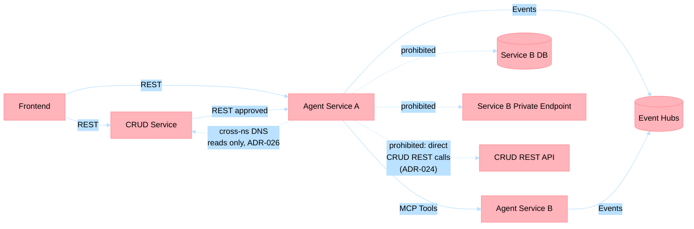
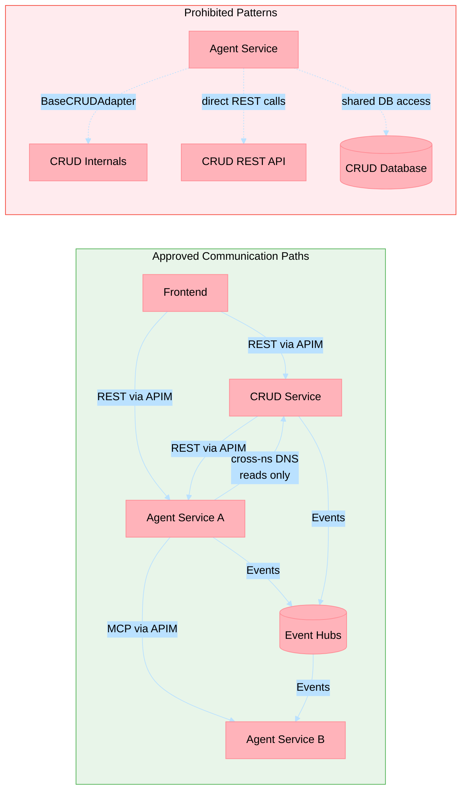
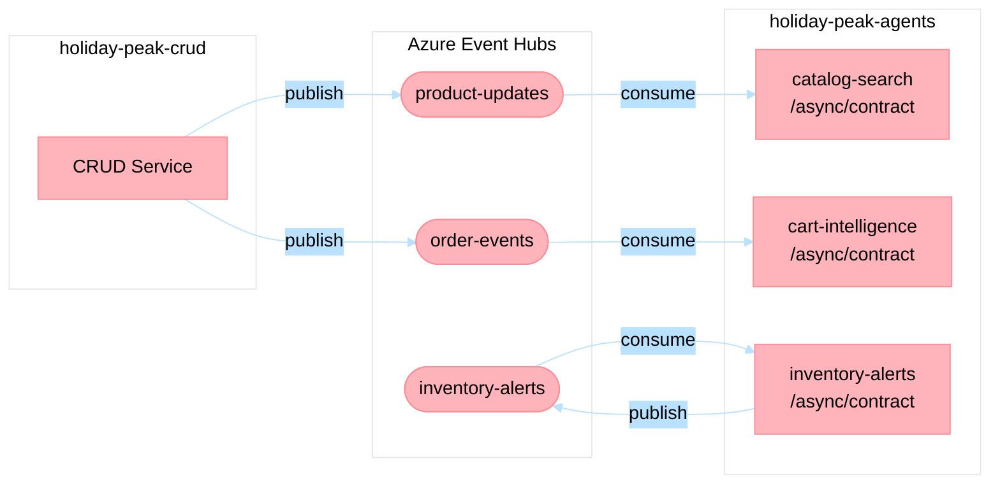

# ADR-024: Agent Communication Policy, Isolation, and Async Contracts

## Status

Accepted (Revised 2026-04-28 — consolidated agent isolation policy and async communication contracts)  
**Supersedes**: prior separate decisions on Agent Isolation Policy and Async Communication Contract (now absorbed into this ADR)

## Date

2026-03-18

## Context

The platform uses dual exposition (REST + MCP) as defined in [ADR-004](adr-004-fastapi-mcp.md). As agent services scaled, internal service-to-service communication paths diverged, creating architecture drift risk and inconsistent rollout controls.

Issue #329 requests an explicit internal communication policy that service teams can execute consistently and that provides rollout guardrails for #330.

This addendum defines mandatory MCP communication boundaries, prohibited coupling patterns, observability and compliance requirements, and release governance checks.

Architecture principles applied:

- **Domain-Driven Design (Bounded Contexts)**: internal calls must respect domain ownership and explicit interfaces.
- **TOGAF (Architecture Governance and Building Blocks)**: communication contracts are governed architecture building blocks with compliance checkpoints.
- **microservices.io (Loose Coupling, Smart Endpoints)**: avoid point-to-point coupling that bypasses policy and observability controls.

## Decision

Adopt a mandatory **MCP-first internal communication policy** for agent-to-agent interaction boundaries, with explicit exceptions.

### Allowed Internal Communication Paths

1. **Agent service -> Agent service via MCP tools**
   - Required for internal capability composition and tool discovery.
2. **Frontend -> CRUD service via REST**
   - Allowed for transactional UX operations.
3. **Frontend -> Agent service via REST**
   - Allowed for user-facing intelligence endpoints exposed as HTTP APIs.
4. **CRUD service -> Agent service via REST**
   - Allowed for fast enrichment/decision assist flows where CRUD remains the transactional system of record.
5. **Async domain events via Event Hubs**
   - Allowed for decoupled choreography and background processing.

### Boundary Rules (Mandatory)

1. **Domain ownership**
   - MCP tools expose domain capabilities only from owning services.
   - Cross-domain direct data reads must go through owning service contracts (MCP tool or approved REST API).
2. **No transport leakage**
   - Callers must not depend on internal storage or adapter details of another service.
3. **Stable contracts**
   - MCP input/output schemas must be versioned and backward compatible for additive changes.
4. **Identity and tenant propagation**
   - Internal calls must propagate tenant, correlation, and caller identity context.
5. **Default deny for new paths**
   - Any new internal communication edge requires architecture review and ADR reference before production enablement.

### Prohibited Direct Coupling Patterns

1. Agent service directly calling another service's database, cache, or blob container.
2. Agent service invoking another service's private, non-governed HTTP endpoint (bypassing MCP/approved API surface).
3. Shared mutable schema ownership across bounded contexts without an owning contract.
4. Hard-coded service internals (pod IPs, internal hostnames, storage keys) in application call paths.
5. Runtime dependency on undocumented tool names or unversioned MCP payload fields.
6. Agent service invoking CRUD REST endpoints directly — all agent-to-CRUD reads must use approved cross-namespace DNS paths (ADR-026); enrichment and decision flows are initiated by CRUD calling agents, not the reverse (§Part 2 Isolation).



### Observability and Compliance Expectations

Every internal MCP interaction must emit the following minimum telemetry fields:

- `correlation_id`
- `tenant_id`
- `caller_service`
- `target_service`
- `tool_name`
- `tool_version`
- `latency_ms`
- `status` (`success|error|timeout|rejected`)

Compliance requirements:

1. Retain structured audit logs for internal MCP calls per environment retention policy.
2. Alert on policy violations (prohibited direct-coupling path detected, missing tenant context, missing correlation).
3. Include MCP dependency edges in architecture inventory for review cadence.

## Governance Checks for #330 Rollout

The following gates are required for service-team rollout approval.

### Gate 1: Contract and Boundary Readiness

- MCP tools are documented with owner, purpose, request/response schema, and version.
- Internal communication edges are classified as allowed paths in this ADR.
- No prohibited direct coupling patterns are present.

### Gate 2: Runtime Safety and Telemetry

- Correlation and tenant context propagation verified in integration tests.
- Telemetry fields required by this ADR are present in logs and traces.
- Error handling and timeout behavior are defined for upstream callers.

### Gate 3: Compliance and Operations

- Policy violation alert rules are enabled.
- Runbook entries exist for MCP tool failures and dependency degradation.
- Rollback plan includes feature flags or route controls to disable new internal edges safely.

## Practical Implementation Checklist (Service Teams)

- [ ] Internal service dependencies are represented as MCP tools or approved REST contracts only.
- [ ] No direct reads/writes to another service's persistence layer.
- [ ] MCP contracts are versioned and additive-change compatible.
- [ ] Tenant and correlation context are propagated end-to-end.
- [ ] Required MCP telemetry fields are emitted and queryable.
- [ ] Policy violation alerts are configured and tested.
- [ ] Integration tests validate allowed-path behavior and denied-path safeguards.
- [ ] Rollout plan maps to Gate 1–3 and identifies rollback controls.

## Alternatives Considered

1. **REST-only internal communication**
   - Rejected: loses MCP tool discoverability and weakens agent-native composition patterns.
2. **Unrestricted protocol choice by team**
   - Rejected: increases drift risk and weakens governance consistency.
3. **Event-only internal communication**
   - Rejected: unsuitable for synchronous capability invocation and request-response workflows.

## Consequences

### Positive

1. Reduces architecture drift with explicit communication boundaries.
2. Improves auditability and incident triage for internal agent interactions.
3. Provides consistent rollout gates for #330 across service teams.

### Negative

1. Adds governance overhead for introducing new internal communication edges.
2. Requires teams to maintain MCP contract metadata and telemetry discipline.

## References

- [ADR-004](adr-004-fastapi-mcp.md)
- [ADR-019](adr-019-enterprise-resilience-patterns.md)
- [ADR-026](adr-026-namespace-isolation-strategy.md)
- [Architecture Overview](../architecture.md)

---

## Part 2: Agent Isolation Policy

### Context

The platform deploys 26 agent services alongside 1 CRUD service. Agents are forbidden from importing or calling CRUD service adapters and REST endpoints directly — this prevents blast radius expansion, coupling, and security surface issues.

### Approved Communication Paths

| Path | Direction | Mechanism | Governed By |
|------|-----------|-----------|-------------|
| Cross-namespace K8s DNS | Agent → CRUD | Transactional reads only | ADR-026 Option A |
| APIM MCP tools | Agent → Agent | MCP tool invocation through APIM | §Allowed Paths above |
| Event Hubs | Agent ↔ CRUD | Asynchronous domain events (SAGA) | ADR-006 |
| APIM REST | CRUD → Agent | Enrichment/decision-assist calls | §Allowed Paths above |
| APIM REST | Frontend → CRUD | Transactional UI operations | ADR-021 |
| APIM REST | Frontend → Agent | Intelligence endpoints for UI | ADR-021 |

### Prohibited Patterns (Isolation)

1. **Agent importing `BaseCRUDAdapter`** or any CRUD-specific adapter from `holiday_peak_lib`.
2. **Agent calling `register_crud_tools()`** or registering CRUD endpoints as MCP tools within agent processes.
3. **Agent making direct HTTP calls** to CRUD REST endpoints outside the approved cross-namespace DNS path for transactional reads.
4. **Agent holding CRUD database connection strings** or accessing CRUD's PostgreSQL, Redis, or Cosmos DB instances directly.
5. **Shared mutable state** between agent and CRUD services via any mechanism other than Event Hubs.

### Communication Path Topology



### Isolation Enforcement

- **CI/CD checks**: Import scanning for `BaseCRUDAdapter` and `register_crud_tools` in agent code
- **Architecture review**: New agent→CRUD paths require ADR reference and team approval
- **Runtime monitoring**: APIM and Istio telemetry detect unauthorized direct REST calls

### Implementation Evidence

| Change | PR | Scope |
|--------|----|-------|
| Removed `BaseCRUDAdapter` from `holiday_peak_lib` | #881 | Eliminates compile-time CRUD coupling |
| Removed `register_crud_tools()` from `registration_helpers.py` | #881 | Prevents CRUD tool registration in agents |
| Swept 22 agent services to drop CRUD imports/calls | #882 | Removes all direct CRUD invocations |
| Stripped `CRUD_SERVICE_URL` from 25 rendered manifests | #882 | Removes runtime CRUD config from agents |

---

## Part 3: Async Communication Contracts

### Observer Pattern Primitives

#### `TopicSubject`

A named topic wrapper implementing the Observer pattern:

```python
from holiday_peak_lib.messaging import TopicSubject

# Producer side
product_events = TopicSubject(topic="product-updates", schema=ProductUpdateEvent)
await product_events.publish(ProductUpdateEvent(product_id="123", action="enriched"))

# Consumer side
product_events = TopicSubject(topic="product-updates", schema=ProductUpdateEvent)
product_events.register_observer(handle_product_update)
await product_events.start_consuming()
```

#### `AgentAsyncContract`

A Pydantic model self-describing an agent's async capabilities:

```python
from holiday_peak_lib.messaging import AgentAsyncContract, TopicDescriptor

contract = AgentAsyncContract(
    agent_name="ecommerce-catalog-search",
    publishes=[
        TopicDescriptor(topic="search-index-updated", schema_ref="SearchIndexEvent",
                        description="Emitted when catalog search index is refreshed"),
    ],
    consumes=[
        TopicDescriptor(topic="product-updates", schema_ref="ProductUpdateEvent",
                        description="Triggers re-indexing when product data changes"),
    ],
)
```

#### `/async/contract` Endpoint

Auto-registered by `create_standard_app()` to expose async contracts as machine-readable JSON.

### Async Contract Topology



### Risk Mitigation for Async Contracts

| Risk | Mitigation |
|------|------------|
| Contract drift (declared vs. actual) | CI check comparing declared topics against `TopicSubject` instantiations |
| Over-abstraction | `TopicSubject` wraps existing primitives; agents can fall back to raw `EventPublisher` |
| Adoption lag | Incremental rollout by domain (truth-layer first, then ecommerce, CRM, etc.) |

---

## Migration Notes

This ADR consolidates three formerly separate decisions:
- MCP Internal Communication Policy (original)
- Agent Isolation Policy — prohibited coupling, enforcement evidence, approved paths
- Async Communication Contract — Observer pattern, `TopicSubject`, `AgentAsyncContract`

The isolation and async-contract decisions are now superseded and absorbed into this ADR.
