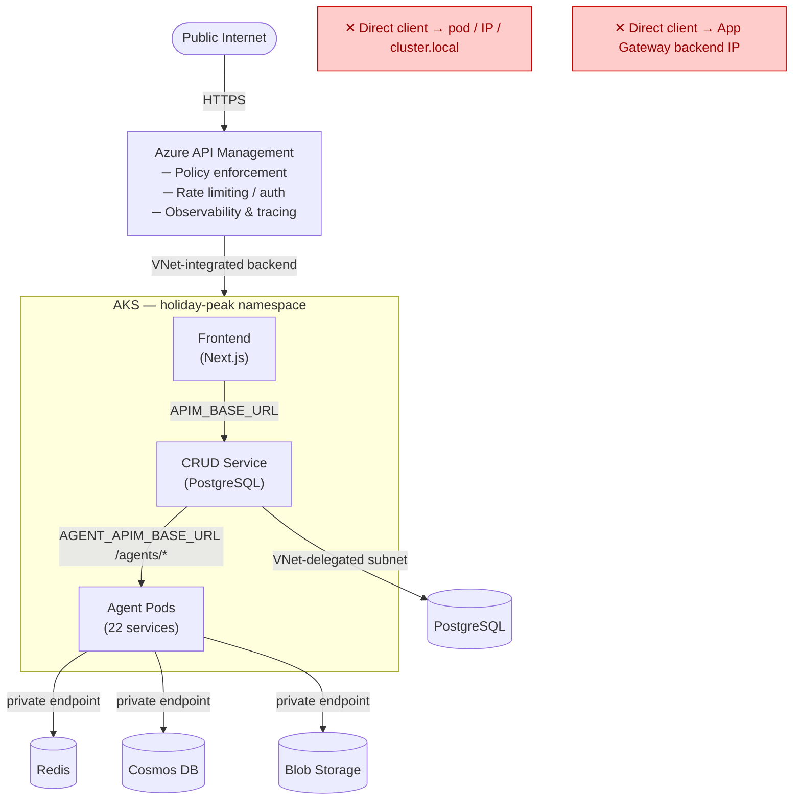

````markdown
# ADR-027: APIM-Only Backend Access and Private Data-Plane Connectivity

**Status**: Accepted  
**Date**: 2026-03  
**Deciders**: Architecture Team, Ricardo Cataldi  
**Tags**: networking, security, apim, aks, private-endpoints, data-plane

## Context

After implementing AGIC for unified AKS ingress (ADR-026), the architecture had a
separate, unresolved gap: **who is the authoritative entry point for backend API
traffic, and how must service dependencies (Redis, Cosmos DB, Blob Storage,
PostgreSQL) be reached?**

Several inconsistencies were found in the running system:

1. **CRUD-to-agent routing** used explicit service URLs without enforcing that those
   URLs were APIM-backed, allowing non-APIM paths to slip through silently.
2. **Frontend environment variables** referenced agent services in some environments
   via raw App Gateway or internal IPs instead of the APIM gateway URL.
3. **Agent pods** were occasionally deployed without the required memory dependency
   environment variables (`REDIS_URL`, `COSMOS_ACCOUNT_URI`, etc.), causing silent
   degradation at runtime instead of an early deployment failure.
4. **PostgreSQL** had its public network access enabled in the `dev` environment
   during a troubleshooting window and was not automatically re-hardened.
5. **No deployment guardrail** existed to fail fast when any of the required
   APIM or private-memory environment values were absent.

### Drivers

- **Security posture**: Data services (Redis, Cosmos DB, Blob, Postgres) must not be
  reachable from the public internet. Exposing them, even temporarily, violates the
  intended private networking design.
- **Auditability and observability**: Routing all client-visible API traffic through
  APIM allows centralized rate limiting, tracing, subscription key management, and
  policy enforcement. Bypassing APIM removes these controls.
- **Operational predictability**: Services with missing dependency env vars are harder
  to debug at runtime. A fail-fast guardrail at deploy time is preferable.
- **Consistency**: The standard must apply uniformly to all environments (dev, staging,
  prod) without exception. There should be no "it works differently in dev" carve-outs.

## Decision

**Adopt Azure API Management (APIM) as the sole externally-reachable entry point for
all backend API traffic. Require all data-plane service dependencies (Redis, Cosmos DB,
Blob Storage, PostgreSQL) to remain on private networks. Enforce both constraints at
the deployment layer with fail-fast hooks.**

### Architecture Overview



### Rules

#### Rule 1 — APIM is the only externally-reachable backend entry point

- Frontend env vars (`NEXT_PUBLIC_API_URL`, `NEXT_PUBLIC_CRUD_API_URL`,
  `NEXT_PUBLIC_AGENT_API_URL`) MUST all point to the APIM gateway URL.
- CRUD synchronous calls to agent services MUST route via
  `AGENT_APIM_BASE_URL/agents/{service-name}`.
- Direct calls to pod IPs, AKS ClusterIP DNS names, App Gateway backend IPs, or
  internal load balancer addresses from any client outside the cluster are prohibited.

#### Rule 2 — CRUD-to-agent URL resolution is APIM-enforced in code

`_resolve_agent_url()` in `apps/crud-service/src/crud_service/integrations/agent_client.py`
enforces APIM-only semantics:

- If `AGENT_APIM_BASE_URL` is absent → log warning, return `None` (call skipped).
- If an explicit non-APIM URL is passed → log warning, ignore it. APIM URL is used.
- If an APIM-origin explicit URL is passed → accepted (enables per-call path overrides
  within the same APIM gateway).

This prevents non-APIM routing paths from silently entering the call graph at runtime.

#### Rule 3 — Data-plane dependencies must use private networking

All four data-plane dependencies must be reachable **only** via private networks:

| Dependency   | Private mechanism                    | Port  |
|--------------|--------------------------------------|-------|
| Redis        | Private Endpoint + Private DNS zone  | 6380  |
| Cosmos DB    | Private Endpoint + Private DNS zone  | 443   |
| Blob Storage | Private Endpoint + Private DNS zone  | 443   |
| PostgreSQL   | VNet-delegated subnet + Private DNS  | 5432  |

`publicNetworkAccess` MUST remain `Disabled` for all four dependencies.
Break-glass maintenance windows that temporarily enable public access must
be tracked as incidents and reversed immediately after.

#### Rule 4 — Required environment variables enforced at deploy time

Helm render hooks (`.infra/azd/hooks/render-helm.ps1` and `render-helm.sh`) fail
the deployment if any required variable is absent.

Agent services MUST have:

```
REDIS_URL             # rediss://<host>:<port>/0
COSMOS_ACCOUNT_URI    # https://<account>.documents.azure.com:443/
COSMOS_DATABASE
COSMOS_CONTAINER
BLOB_ACCOUNT_URL      # https://<account>.blob.core.windows.net
BLOB_CONTAINER
CRUD_SERVICE_URL      # must equal APIM gateway base URL
```

CRUD service MUST have:

```
AGENT_APIM_BASE_URL   # must equal APIM gateway base URL
```

Missing values cause the hook to exit non-zero, blocking `azd deploy` before any
Kubernetes manifests are applied.

### Verification Protocol

After each deployment the following checks must pass:

1. **APIM reachability**: `GET /api/health`, `GET /agents/{agent}/health` →  HTTP 200.
2. **Env compliance audit** (PowerShell/shell script): all required vars present in every
   running deployment → `ENV_COMPLIANCE=PASS`.
3. **In-pod private connectivity probe** (representative agent pod): DNS resolves to
   `10.x.x.x`, TCP connect succeeds on correct port for Redis/Cosmos/Blob.
4. **CRUD pod private connectivity**: `POSTGRES_HOST` DNS + TCP connect succeeds from
   within cluster.
5. **Network posture check**: `az postgres flexible-server show` confirms
   `publicNetworkAccess=Disabled`.

## Consequences

### Positive

- **Consistent security boundary**: all external API traffic passes through a single
  policy-enforcement point (APIM). No accidental bypass paths exist.
- **Centralized observability**: rate limiting, tracing, and subscription management
  apply uniformly to every backend API call.
- **Reduced blast radius**: private-only data-plane dependencies cannot be reached
  from the public internet, even if a pod is compromised or misconfigured.
- **Fail-fast deployments**: missing required env vars cause deployment failure before
  any pod is restarted, making configuration drift visible immediately.
- **Enforced in code**: CRUD agent client rejects non-APIM routing at the code level,
  not only at the infrastructure level.

### Negative

- **APIM is a critical path dependency**: if APIM is unavailable, all external backend
  API access is unavailable. Mitigated by APIM Premium tier with availability zone
  support.
- **Deployment requires complete env setup**: developers cannot use `azd deploy` until
  all required APIM and memory env vars are set. Mitigated by documented baseline env
  setup in `.infra/azd/` and `docs/governance/backend-networking-standard.md`.
- **Local development workaround needed**: local development (outside AKS) requires
  either `azd env set` with real values or a local mock of the APIM URL. Port-forward
  workflows still work for dev testing.

### Neutral

- **AGIC is the intra-cluster router; APIM is the external gateway**: both exist at
  different layers. APIM routes to the App Gateway IP; App Gateway routes to ClusterIP
  services via AGIC ingress rules. These are complementary, not competing.
- **MCP tool traffic is agent-to-agent** and does not pass through APIM. MCP endpoints
  are internal only (`/mcp/*` on ClusterIP services). This is by design (ADR-010).

## Implementation Checklist

- [x] `_resolve_agent_url()` rewritten to APIM-only semantics
- [x] Unit tests updated for new URL resolution behavior (20 tests passing)
- [x] `render-helm.ps1` fail-fast guardrails for required env vars
- [x] `render-helm.sh` fail-fast guardrails for required env vars
- [x] `AGENT_APIM_BASE_URL` and `CRUD_SERVICE_URL` propagated in render hooks
- [x] All agentic deployments updated with required env vars
- [x] `ENV_COMPLIANCE=PASS` validated across all deployments
- [x] In-pod private connectivity validated (Redis/Cosmos/Blob via `10.x` IPs)
- [x] PostgreSQL `publicNetworkAccess=Disabled`
- [x] APIM smoke test: CRUD + representative agents returning HTTP 200
- [x] `docs/governance/backend-networking-standard.md` created

## Alternatives Considered

### 1. Allow direct App Gateway access without APIM

Rejected. Loses centralized policy enforcement (rate limiting, auth, observability).
Also makes the API surface inconsistent between environments where App Gateway IP
can change.

### 2. Allow CRUD-to-agent calls via internal ClusterIP DNS

Rejected. Although lower latency, this bypasses APIM policy for inter-service calls,
creates a hidden dependency on internal DNS naming that differs from external routing,
and makes tracing of agent invocations from CRUD invisible in APIM analytics.

### 3. Soft enforcement (warn-only for missing env vars)

Rejected. Silent degradation is worse than a failed deployment. A warn-only approach
was the status quo that led to services running without memory dependencies set.

### 4. Public endpoints for Redis/Cosmos/Blob with IP firewall rules

Rejected. Firewall rules based on IPs are brittle in AKS (node pools can get new IPs
on scaling events) and still expose the control plane to public internet scanning.
Private endpoints are the correct model for production and dev parity.

## References

- [ADR-009: AKS Deployment Architecture](adr-009-aks-deployment.md)
- [ADR-021: azd-First Deployment](adr-021-azd-first-deployment.md)
- [ADR-026: AGIC Traffic Management](adr-026-agic-traffic-management.md)
- [Backend Networking Standard](../../governance/backend-networking-standard.md)
- [Azure APIM VNet Integration](https://learn.microsoft.com/azure/api-management/virtual-network-concepts)
- [Azure Private Endpoints](https://learn.microsoft.com/azure/private-link/private-endpoint-overview)
````
