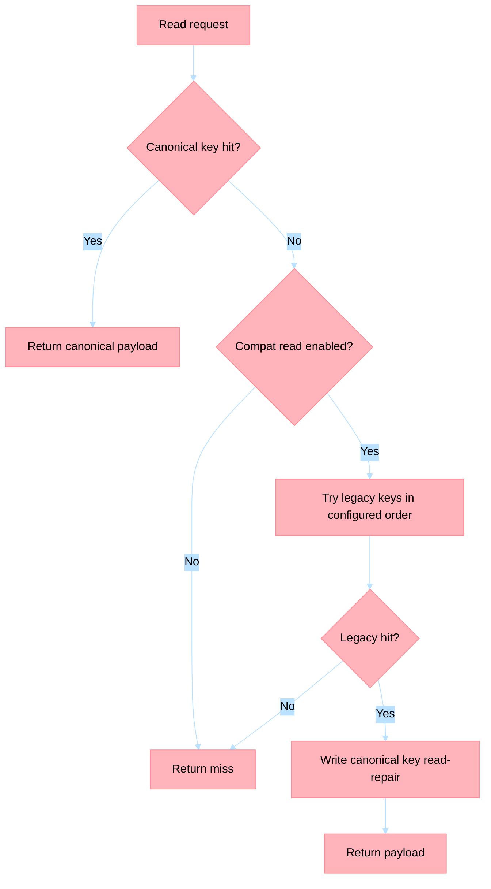

# ADR-028: Memory Namespace Isolation Contract

## Status
Accepted

## Date
2026-03-18

## Context

Pilot rollout readiness requires a canonical memory namespace contract that prevents cross-tenant and cross-session contamination in Hot memory (Redis) and Warm memory (Cosmos DB).

Current implementations use mixed key conventions (service-scoped, tenant-scoped, and session-scoped variations), which creates ambiguity for isolation guarantees, compatibility behavior, and rollback safety.

This ADR defines a single contract and an execution playbook for migration and rollback.

## Decision

Adopt a canonical namespace key contract for all new memory writes and reads:

`<service>:<tenantId>:<sessionId>`

### Canonical Contract (Required)

1. `service` is the logical service name (for example `crm-profile-aggregation`, `crud-service`, `truth-export`).
2. `tenantId` is the tenant boundary used for customer/account isolation.
3. `sessionId` is the runtime conversational or workflow session boundary.
4. Delimiter is `:` only. Empty or wildcard segments are invalid for writes.

### Redis Usage Contract

- Namespace field (required): `namespaceKey = <service>:<tenantId>:<sessionId>`
- Redis key format (required): `<namespaceKey>:<memoryKind>:<entityId>`

Examples:

- `crm-support-assistance:tenant-acme:s-8f21a:conversation:turn-001`
- `ecommerce-cart-intelligence:tenant-contoso:s-21ab9:cart:active`
- `truth-enrichment:tenant-northwind:s-9931f:profile:user-481`

### Cosmos DB Usage Contract

- `namespaceKey` property is required on every item.
- Partition key for memory containers must be `namespaceKey`.
- `id` format must avoid embedding tenant or session outside `namespaceKey`.

Example item:

```json
{
  "id": "conversation:turn-001",
  "namespaceKey": "crm-support-assistance:tenant-acme:s-8f21a",
  "memoryKind": "conversation",
  "payload": {
    "role": "user",
    "content": "Where is my order?"
  },
  "createdAt": "2026-03-18T12:00:00Z",
  "ttl": 2592000
}
```

## Compatibility-Read Strategy

Compatibility reads are mandatory during migration and optional after cutover.

### Read Order

1. Attempt canonical key read first (`<service>:<tenantId>:<sessionId>`).
2. On miss, attempt legacy key patterns in configured priority order.
3. If legacy key returns data, perform read-repair by writing canonical key.
4. Do not delete legacy key during read path.

### Legacy Pattern Registry (Default)

Services may register only known historical patterns. Default order:

1. `<service>:<sessionId>`
2. `<tenantId>:<sessionId>`
3. `<sessionId>`

### Safety Rules

- Compatibility read path is read-only for tenant/session resolution.
- If more than one legacy key resolves with conflicting payloads, select newest by `updatedAt` and emit a structured warning log with both key candidates.
- Compatibility reads must be gated by feature flag `MEMORY_NAMESPACE_COMPAT_READ=true|false`.



## Migration Playbook

### Phase 0 - Preconditions

1. Add `namespaceKey` support to Redis/Cosmos adapters.
2. Add feature flags:
   - `MEMORY_NAMESPACE_WRITE_CANONICAL` (default `false`)
   - `MEMORY_NAMESPACE_COMPAT_READ` (default `false`)
3. Add telemetry counters:
   - `memory.namespace.canonical.read.hit`
   - `memory.namespace.compat.read.hit`
   - `memory.namespace.read.repair.write`

### Phase 1 - Dual Read

1. Enable `MEMORY_NAMESPACE_COMPAT_READ=true`.
2. Keep canonical writes disabled.
3. Validate no cross-tenant/session reads in logs.

### Phase 2 - Canonical Write + Compat Read

1. Enable `MEMORY_NAMESPACE_WRITE_CANONICAL=true`.
2. Keep compatibility read enabled.
3. Run backfill job to convert active legacy keys to canonical keys.

### Phase 3 - Canonical Only

1. Disable compatibility reads (`MEMORY_NAMESPACE_COMPAT_READ=false`) after two release cycles with stable metrics.
2. Run controlled deletion of legacy keys by TTL window.

## Rollback Rules

1. If canonical read hit rate drops below expected baseline or cross-tenant/session incidents are detected, revert to:
   - `MEMORY_NAMESPACE_WRITE_CANONICAL=false`
   - `MEMORY_NAMESPACE_COMPAT_READ=true`
2. Do not delete canonical data during rollback.
3. Keep read-repair disabled during rollback to avoid churn.
4. Re-run targeted validation for tenant/session isolation before retrying phase progression.

## Practical Implementation Checklist

- [ ] Service defines canonical `service` identifier and validates non-empty `tenantId` and `sessionId`.
- [ ] Redis writes use `<namespaceKey>:<memoryKind>:<entityId>` format.
- [ ] Cosmos items include `namespaceKey` and use it as partition key.
- [ ] Feature flags implemented and wired to runtime configuration.
- [ ] Compatibility legacy patterns explicitly enumerated (no wildcard guessing).
- [ ] Read-repair writes canonical key only; no legacy delete in read path.
- [ ] Metrics and logs added for canonical hit, compat hit, and read-repair events.
- [ ] Migration phases executed in order with release checkpoint sign-off.
- [ ] Rollback toggles validated in non-prod before prod promotion.

## Consequences

### Positive

1. Enforces deterministic tenant/session isolation boundaries.
2. Reduces ambiguity across Redis and Cosmos usage.
3. Enables safe phased migration without blocking active sessions.

### Negative

1. Temporary operational overhead from compatibility reads and dual-mode behavior.
2. Additional metrics and feature-flag management required during transition.

## References

- [ADR-008](adr-008-memory-tiers.md)
- [ADR-014](adr-014-memory-partitioning.md)
- [Architecture Overview](../architecture.md)