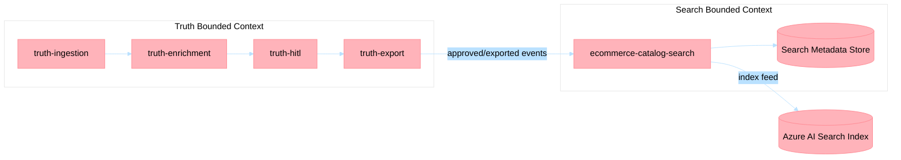

# ADR-030: Search Enrichment as an Isolated Bounded Context

## Status
Accepted

## Date
2026-03-19

## Context

ADR-025 established the Product Truth Layer as the governed system of record for enriched product data, including human-in-the-loop controls and PIM writeback.

Search enrichment workloads have different optimization goals than truth workflows:

- Search enrichment prioritizes retrieval quality and index freshness.
- Truth workflows prioritize governance, approval, and authoritative record lifecycle.

When these concerns are implemented inside a shared service boundary, truth workflow semantics and search indexing semantics can contaminate each other. This increases coupling, weakens ownership boundaries, and creates higher risk for incident blast radius.

The architecture must preserve microservice boundaries and event-driven integration patterns already used across the platform.

## Decision

Adopt a dedicated `ecommerce-catalog-search` bounded context for search enrichment, separate from `truth-*` bounded contexts.

### Boundary Definition (Bounded Context)

- `truth-ingestion`, `truth-enrichment`, `truth-hitl`, and `truth-export` remain responsible for source-of-truth lifecycle, approval workflow, and enterprise writeback.
- `ecommerce-catalog-search` is responsible for search document shaping, ranking-oriented enrichment, and index publication behavior.
- No service in the search bounded context may mutate truth approval state or truth authoring records.

### Data Ownership (Database per Service)

- Truth services own truth persistence stores and schemas.
- Search service owns its own persistence and indexing metadata store.
- Cross-context reads happen via APIs or events, never direct database access.

### Event Topic Ownership (Event-Driven Integration)

- Truth bounded context owns truth lifecycle topics (for example, approvals and export completion events).
- Search bounded context owns search indexing topics (for example, index requested, indexed, and indexing failed events).
- Producers own event contracts for topics they publish; consumers must treat contracts as external and versioned.

### Downstream AI Search Feed

- AI Search index feed is downstream of approved/exported truth events.
- Search enrichment composes search-optimized documents from truth-approved data and publishes to AI Search.
- Failures in AI Search feed processing must not block truth workflow completion.

## Consequences

### Positive

1. Preserves governance integrity of ADR-025 truth workflows by preventing search-specific behavior from modifying truth lifecycle concerns.
2. Improves team autonomy with explicit domain boundaries and ownership.
3. Reduces blast radius by isolating search indexing incidents from truth publishing pipelines.

### Negative

1. Increases operational complexity due to additional service boundary, data store, and event contracts.
2. Requires stronger contract governance and monitoring across context boundaries.
3. Introduces eventual consistency delays between truth approval/export and searchable index availability.

### Risk Controls

- Contract versioning and compatibility testing for cross-context events.
- Dead-letter handling and replay for search indexing topics.
- Correlation IDs, audit logs, and dashboards spanning truth export to search index completion.
- SLOs and alerting for indexing latency and failed feed operations.

## Alternatives Considered

### Option A: Embed Search Enrichment into Truth Services

- **Pros**: Fewer deployable units and simpler initial topology.
- **Cons**: Violates bounded context separation, increases coupling, and raises contamination risk for truth workflows.

### Option B: Shared Data Store Between Truth and Search

- **Pros**: Fewer synchronization steps.
- **Cons**: Violates Database per Service pattern and weakens ownership and change isolation.

## References

- [ADR-025](adr-025-product-truth-layer.md)
- [ADR-007](adr-007-saga-choreography.md)
- [ADR-012](adr-012-adapter-boundaries.md)
- [ADR-024](adr-024-connector-registry-pattern.md)