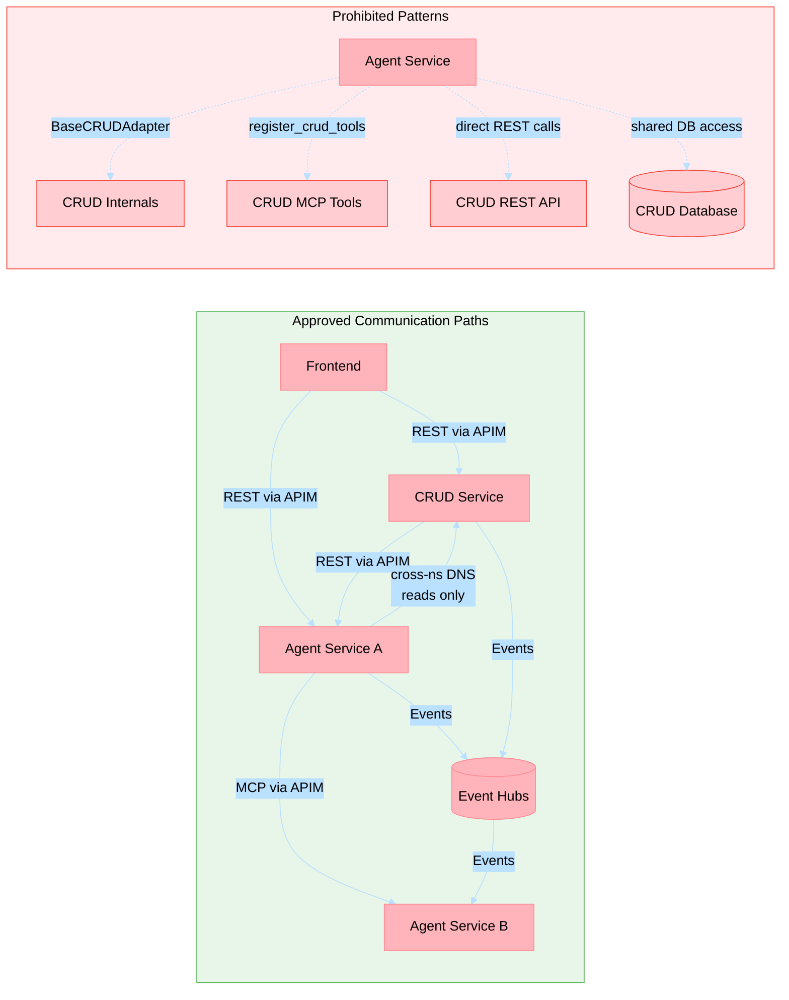

# ADR-036: Agent Isolation Policy

**Status**: Accepted
**Date**: 2026-04
**Deciders**: Architecture Team, Ricardo Cataldi
**Tags**: architecture, agents, isolation, coupling, deployment, security
**References**: [ADR-007](adr-007-saga-choreography.md), [ADR-009](adr-009-aks-deployment.md), [ADR-031](adr-031-mcp-internal-communication-policy.md), [ADR-034](adr-034-namespace-isolation-strategy.md), [ADR-037](adr-037-async-communication-contract.md)

## Context

The holiday-peak-hub platform deploys 26 agent services alongside 1 CRUD service. Prior to this decision, agent services imported and called CRUD service adapters and REST endpoints directly — a coupling pattern that created several architectural liabilities:

1. **Blast radius** — A CRUD deployment failure, schema change, or latency spike cascaded into every agent that held a direct HTTP dependency. Agents could not be tested or deployed in isolation.
2. **Coupling** — `BaseCRUDAdapter` in `holiday_peak_lib` and `register_crud_tools()` in `registration_helpers.py` gave every agent a compile-time dependency on CRUD internals. Updating the CRUD contract required coordinated changes across 22+ services.
3. **Independent deployability** — Agents could not scale, version, or roll back independently because their runtime depended on CRUD being reachable at a specific version.
4. **Security surface** — Every agent held `CRUD_SERVICE_URL` credentials and could invoke any CRUD endpoint, violating the principle of least privilege.
5. **Observability noise** — Direct agent→CRUD REST calls bypassed APIM, making traffic flows invisible to the governance layer (ADR-031) and harder to trace.

Architecture frameworks applied:

- **Domain-Driven Design (Bounded Contexts)**: Agents (intelligence) and CRUD (transactional) are separate bounded contexts that must communicate through explicit, governed interfaces — not shared code.
- **microservices.io (Loose Coupling, Database per Service)**: Direct adapter sharing is the microservices equivalent of a shared database — it defeats independent deployability.
- **Azure Well-Architected Framework (Operational Excellence)**: Independent deployment units reduce change failure rate and mean time to recovery.
- **TOGAF (Architecture Governance)**: Communication paths are governed architecture building blocks with explicit approval gates (ADR-031 §5).

## Decision

**Agents are forbidden from importing or calling CRUD service adapters and REST endpoints directly.**

All agent-to-CRUD communication MUST use one of the following approved paths:

### Approved Communication Paths

| Path | Direction | Mechanism | Governed By |
|------|-----------|-----------|-------------|
| Cross-namespace K8s DNS | Agent → CRUD | Transactional reads only via `CRUD_SERVICE_URL` cross-namespace FQDN | ADR-034 Option A |
| APIM MCP tools | Agent → Agent | MCP tool invocation through APIM gateway | ADR-031 |
| Event Hubs | Agent ↔ CRUD | Asynchronous domain events (SAGA choreography) | ADR-007 |
| APIM REST | CRUD → Agent | Enrichment/decision-assist calls initiated by CRUD | ADR-031, ADR-035 |
| APIM REST | Frontend → CRUD | Transactional UI operations | ADR-027 |
| APIM REST | Frontend → Agent | Intelligence endpoints for UI | ADR-027 |

### Prohibited Patterns

The following patterns are explicitly forbidden:

1. **Agent importing `BaseCRUDAdapter`** or any CRUD-specific adapter from `holiday_peak_lib` or application code.
2. **Agent calling `register_crud_tools()`** or any function that registers CRUD endpoints as MCP tools within agent processes.
3. **Agent making direct HTTP calls** to CRUD REST endpoints (e.g., `POST /api/products`, `PUT /api/orders/{id}`) outside the approved cross-namespace DNS path for transactional reads.
4. **Agent holding CRUD database connection strings** or accessing CRUD's PostgreSQL, Redis, or Cosmos DB instances directly.
5. **Shared mutable state** between agent and CRUD services via any mechanism other than Event Hubs.

### Communication Path Topology

### Implementation Evidence

The following changes were made to enforce this policy:

| Change | PR | Scope |
|--------|----|-------|
| Removed `BaseCRUDAdapter` from `holiday_peak_lib` | #881 | Eliminates compile-time CRUD coupling from shared library |
| Removed `register_crud_tools()` from `registration_helpers.py` | #881 | Prevents agents from registering CRUD endpoints as MCP tools |
| Swept 22 agent services to drop CRUD imports/calls | #882 | Removes all direct CRUD invocations from agent application code |
| Stripped `CRUD_SERVICE_URL` env entries from 25 rendered manifests | #882 | Removes runtime CRUD endpoint configuration from agent deployments |

## Consequences

### Positive

1. **Independent deployability** — Agent services can be deployed, scaled, and rolled back without CRUD dependency. CRUD changes do not cascade to agents.
2. **Reduced blast radius** — CRUD outages do not propagate to agent services; agents degrade gracefully when async events are delayed.
3. **Testability** — Agent unit and integration tests no longer require CRUD service stubs or mocks for adapter internals.
4. **Security** — Agents no longer hold CRUD credentials or have direct access to CRUD's data layer, enforcing least privilege.
5. **Observability** — All agent↔CRUD communication flows through governed paths (Event Hubs, APIM, or Istio-monitored cross-namespace DNS), making traffic visible to the platform's observability stack.
6. **Architectural clarity** — The separation between transactional (CRUD) and intelligence (Agent) bounded contexts is now enforced at the code and infrastructure level.

### Negative

1. **Async latency** — Operations that were previously synchronous CRUD calls now require Event Hub publish/subscribe, introducing eventual consistency and higher latency for write operations.
2. **Migration effort** — 22 agent services required code changes to remove CRUD dependencies (completed in PRs #881, #882).
3. **Cross-namespace DNS dependency** — Agents that need transactional reads still depend on the CRUD service FQDN, which is a single Helm value but still a configuration coupling point.

### Compliance

This ADR extends the prohibited patterns defined in [ADR-031](adr-031-mcp-internal-communication-policy.md) §Prohibited Direct Coupling Patterns. Compliance is enforced through:

- **CI/CD checks**: Import scanning for `BaseCRUDAdapter` and `register_crud_tools` in agent service code.
- **Architecture review**: New agent→CRUD communication paths require ADR reference and architecture team approval (ADR-031 §5).
- **Runtime monitoring**: APIM and Istio telemetry detect unauthorized direct REST calls between namespaces.

## Alternatives Considered

### Alternative 1: Allow Agent→CRUD REST Calls Through APIM

Route all agent→CRUD calls through APIM for governance and observability.

**Rejected**: Adds 15-30 ms latency per call on hot paths. APIM is the public facade (ADR-027), not an internal service bus. This alternative was also rejected in ADR-034 (Option B analysis).

### Alternative 2: Maintain BaseCRUDAdapter with Versioned Contracts

Keep the shared adapter but version its interface and enforce backward compatibility.

**Rejected**: Shared adapters create compile-time coupling regardless of versioning. Any adapter change requires coordinated releases across 22+ services. This violates the independent deployability principle.

### Alternative 3: Event Hubs Only (No Cross-Namespace DNS)

Require all agent→CRUD communication to go through Event Hubs, eliminating even read-path DNS coupling.

**Rejected**: Event Hubs introduce eventual consistency for read operations that require current state (e.g., product lookup during enrichment). The latency and complexity cost is not justified for read-only data plane operations. Cross-namespace DNS reads (ADR-034 Option A) provide sub-2ms latency for hot-path lookups.
