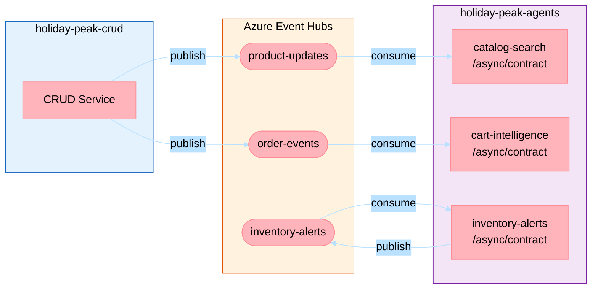

# ADR-037: Async Communication Contract

**Status**: Accepted
**Date**: 2026-04
**Deciders**: Architecture Team, Ricardo Cataldi
**Tags**: architecture, messaging, event-hubs, observer-pattern, async, contracts
**References**: [ADR-007](adr-007-saga-choreography.md), [ADR-036](adr-036-agent-isolation-policy.md)

## Context

With agent isolation enforced (ADR-036), agents are forbidden from calling CRUD REST endpoints directly. The primary asynchronous communication mechanism is Azure Event Hubs, governed by SAGA choreography patterns (ADR-007). The existing implementation in `holiday_peak_lib.utils.event_hub` provides low-level primitives:

- **`EventPublisher`**: Publishes events to a named Event Hub topic.
- **`EventHubSubscriber`**: Subscribes to a named Event Hub topic and invokes a callback.

These primitives are functional but lack:

1. **Observer pattern abstraction** — There is no formal mechanism for agents to register interest in topics, discover available topics, or manage subscriptions declaratively.
2. **Self-describing contracts** — Agents publish and consume events, but there is no machine-readable description of which topics an agent publishes to, which it consumes from, and what schemas those events use.
3. **Runtime discoverability** — There is no endpoint or registry where other agents (or operators) can query an agent's async capabilities without reading its source code.

As the platform scales beyond 26 agent services, the absence of formal async contracts will lead to:

- **Integration drift** — New agents wire up event subscriptions ad hoc, without visibility into the existing topic topology.
- **Schema breakage** — Event producers change payload schemas without consumers being aware, because there is no contract registry.
- **Operational blindness** — Operators cannot determine which agents are affected by an Event Hub topic outage without tracing source code.

Architecture frameworks applied:

- **Enterprise Integration Patterns (Observer, Publish-Subscribe Channel)**: The Observer pattern formalizes the relationship between event producers and consumers, making subscriptions explicit and manageable.
- **Domain-Driven Design (Domain Events)**: Domain events are first-class citizens with explicit schemas that cross bounded context boundaries.
- **microservices.io (Event-Driven Architecture)**: Self-describing event contracts enable loose coupling while maintaining integration visibility.

## Decision

Introduce **Observer pattern primitives** in `holiday_peak_lib.messaging` that wrap the existing `EventPublisher`/`EventHubSubscriber` and add contract self-description capabilities.

### Core Components

#### 1. `TopicSubject`

A named topic wrapper that implements the Observer pattern, providing:

- Topic name registration
- Observer (subscriber) registration and deregistration
- Event publishing through the wrapped `EventPublisher`
- Subscriber notification through the wrapped `EventHubSubscriber`

```python
from holiday_peak_lib.messaging import TopicSubject

# Producer side
product_events = TopicSubject(
    topic="product-updates",
    schema=ProductUpdateEvent,
)
await product_events.publish(ProductUpdateEvent(product_id="123", action="enriched"))

# Consumer side
product_events = TopicSubject(topic="product-updates", schema=ProductUpdateEvent)
product_events.register_observer(handle_product_update)
await product_events.start_consuming()
```

#### 2. `AgentAsyncContract`

A Pydantic model that self-describes an agent's async capabilities:

```python
from holiday_peak_lib.messaging import AgentAsyncContract, TopicDescriptor

contract = AgentAsyncContract(
    agent_name="ecommerce-catalog-search",
    publishes=[
        TopicDescriptor(
            topic="search-index-updated",
            schema_ref="SearchIndexEvent",
            description="Emitted when catalog search index is refreshed",
        ),
    ],
    consumes=[
        TopicDescriptor(
            topic="product-updates",
            schema_ref="ProductUpdateEvent",
            description="Triggers re-indexing when product data changes",
        ),
    ],
)
```

#### 3. `/async/contract` Endpoint

Auto-registered by `create_standard_app()` to expose the agent's async contract as a machine-readable JSON endpoint:

```
GET /async/contract
```

Response:

```json
{
  "agent_name": "ecommerce-catalog-search",
  "publishes": [
    {
      "topic": "search-index-updated",
      "schema_ref": "SearchIndexEvent",
      "description": "Emitted when catalog search index is refreshed"
    }
  ],
  "consumes": [
    {
      "topic": "product-updates",
      "schema_ref": "ProductUpdateEvent",
      "description": "Triggers re-indexing when product data changes"
    }
  ]
}
```

### Async Contract Topology



### Integration with Existing Infrastructure

| Component | Relationship |
|-----------|-------------|
| `holiday_peak_lib.utils.event_hub.EventPublisher` | Wrapped by `TopicSubject` for publishing |
| `holiday_peak_lib.utils.event_hub.EventHubSubscriber` | Wrapped by `TopicSubject` for consuming |
| `create_standard_app()` | Auto-registers `/async/contract` endpoint when an `AgentAsyncContract` is provided |
| APIM (ADR-035) | `/async/contract` endpoints are registered in API Center for discoverability |
| ADR-036 (Agent Isolation) | Async contracts formalize the Event Hub path as the primary agent↔CRUD communication channel for write operations |

## Consequences

### Positive

1. **Runtime discoverability** — Agents expose their async capabilities as machine-readable contracts, enabling operators and other agents to understand the event topology without reading source code.
2. **Schema governance** — `TopicDescriptor` references explicit schema types, making it possible to detect breaking changes before deployment.
3. **Observer pattern clarity** — `TopicSubject` formalizes the publish/subscribe relationship, replacing ad-hoc `EventPublisher`/`EventHubSubscriber` wiring with a consistent pattern.
4. **Operational visibility** — The `/async/contract` endpoint enables automated topology mapping, impact analysis for Event Hub outages, and integration testing validation.
5. **Incremental adoption** — Existing agents can adopt `TopicSubject` and `AgentAsyncContract` incrementally; the low-level Event Hub utilities remain available for edge cases.

### Negative

1. **Abstraction layer** — `TopicSubject` adds an indirection layer over `EventPublisher`/`EventHubSubscriber`. If the abstraction does not carry its weight, it becomes accidental complexity.
2. **Contract maintenance** — Each agent must keep its `AgentAsyncContract` in sync with its actual event subscriptions. Stale contracts are worse than no contracts.
3. **Implementation effort** — 26 agent services will need to adopt the new primitives to achieve full topology coverage.

### Risk Mitigation

| Risk | Mitigation |
|------|------------|
| Contract drift (declared vs. actual) | CI check comparing declared topics against `TopicSubject` instantiations in agent code |
| Over-abstraction | `TopicSubject` wraps existing primitives; agents can fall back to raw `EventPublisher`/`EventHubSubscriber` if needed |
| Adoption lag | Incremental rollout by domain (truth-layer first, then ecommerce, CRM, inventory, logistics, product-management) |

## Alternatives Considered

### Alternative 1: Schema Registry (Confluent/Azure Schema Registry)

Use a centralized schema registry for event contract governance.

**Rejected at current scale**: A full schema registry adds infrastructure cost and operational complexity for 26 services with ~10-15 distinct event topics. The `AgentAsyncContract` model provides 80% of the value at 20% of the cost. If the platform scales to 50+ services or 50+ topics, a schema registry should be reconsidered.

### Alternative 2: AsyncAPI Specification

Use the AsyncAPI standard to describe agent event interfaces.

**Deferred**: AsyncAPI is a good fit for external documentation and tooling but is heavier than needed for internal runtime discoverability. The `/async/contract` endpoint can be extended to return AsyncAPI-compatible output in a future iteration without breaking changes.

### Alternative 3: No Formal Contract — Rely on Documentation

Keep event subscriptions documented in each agent's README.

**Rejected**: Documentation drifts from implementation. Machine-readable contracts enable automated topology mapping, CI validation, and runtime discovery — none of which are possible with markdown documentation alone.
