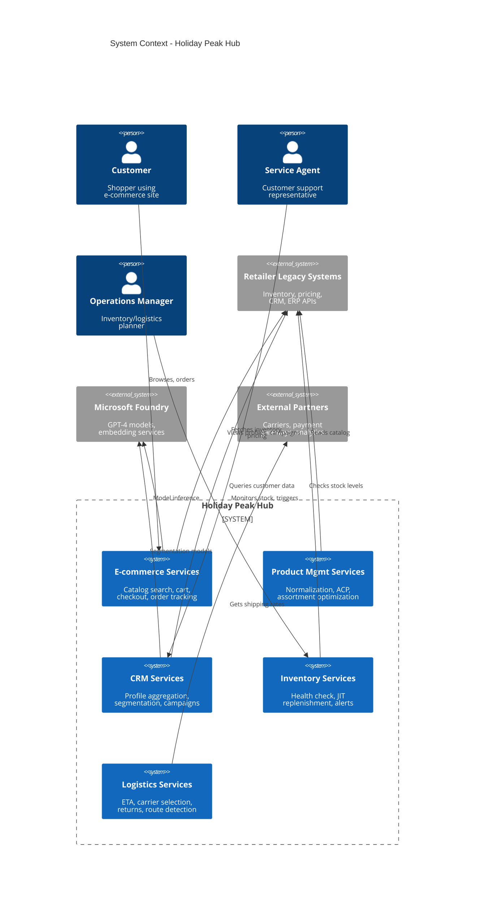
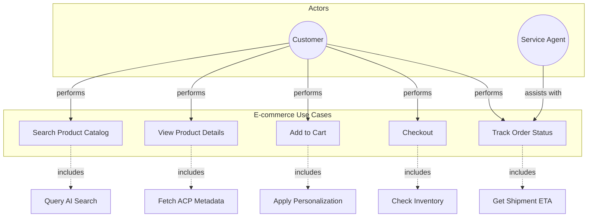
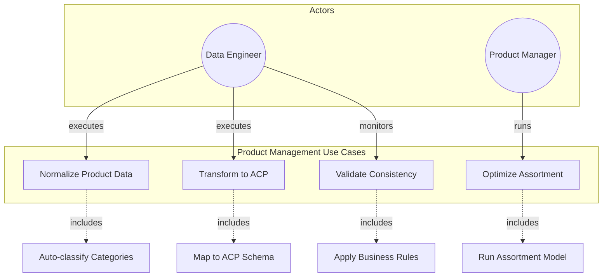
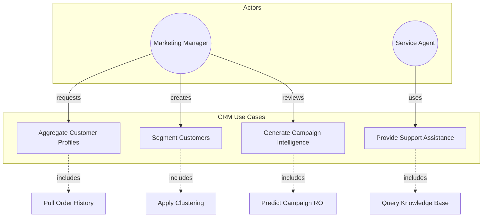
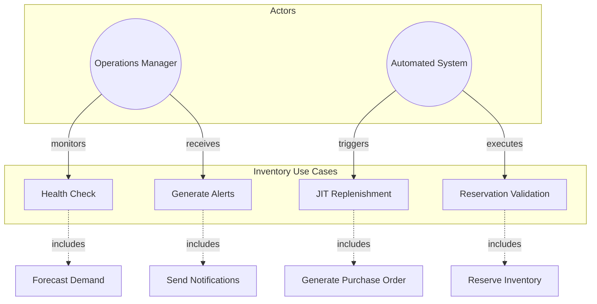
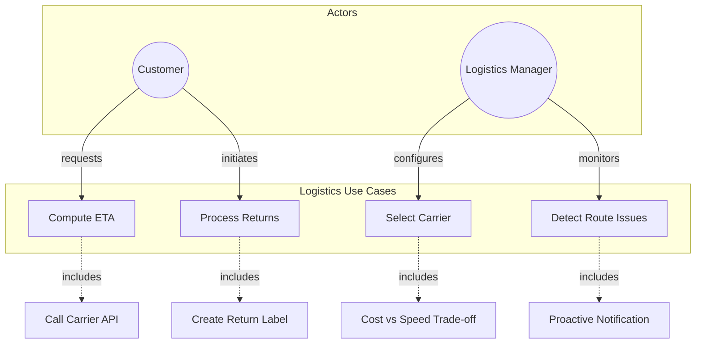
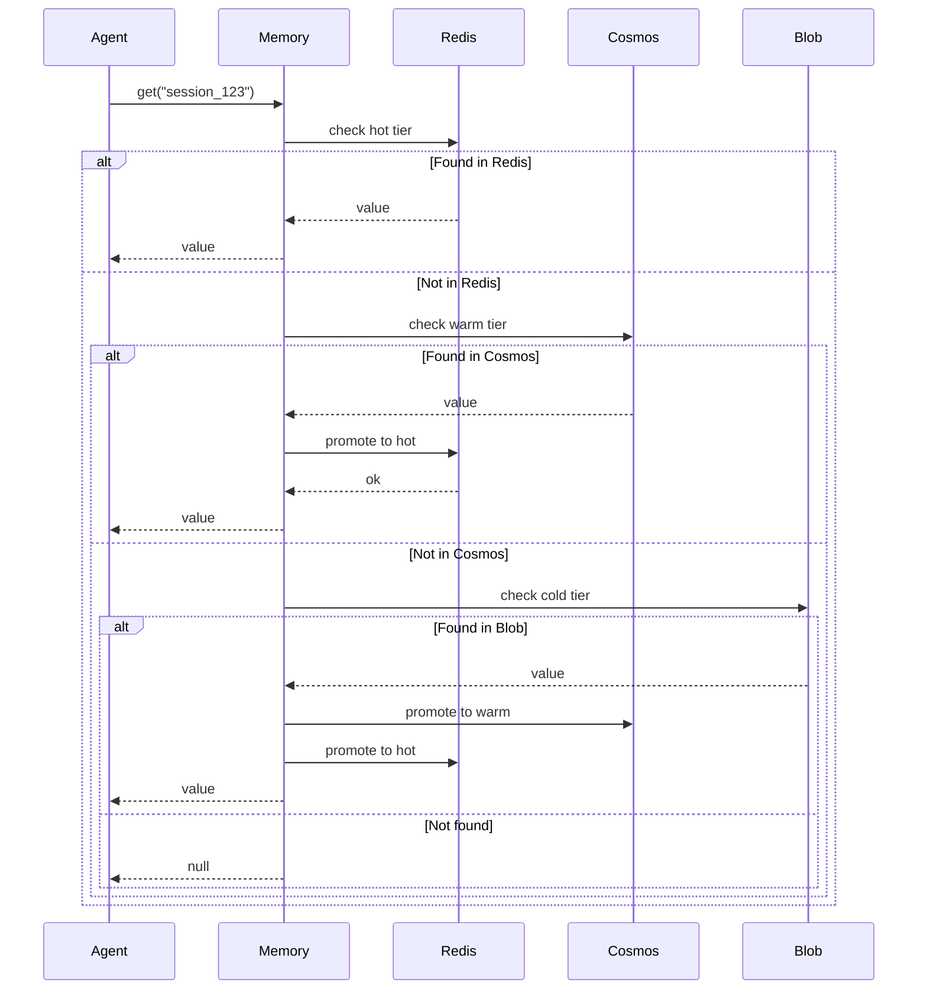
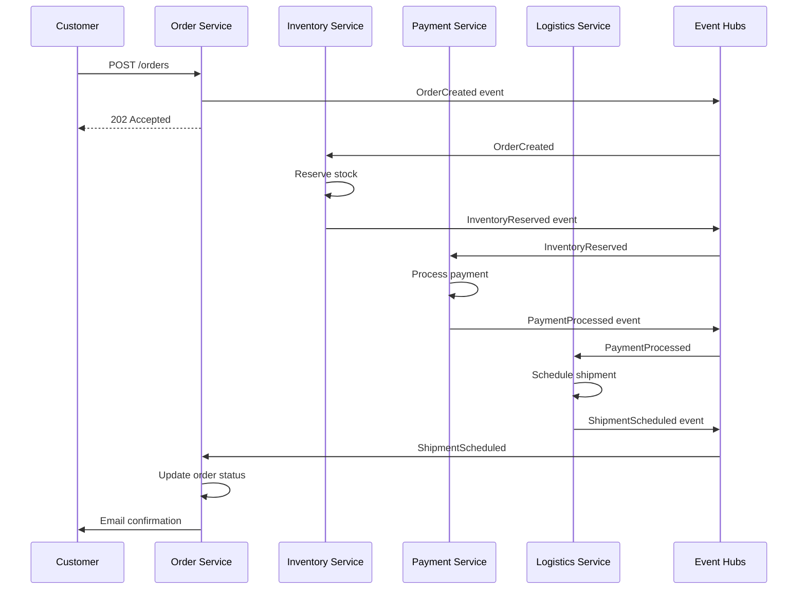
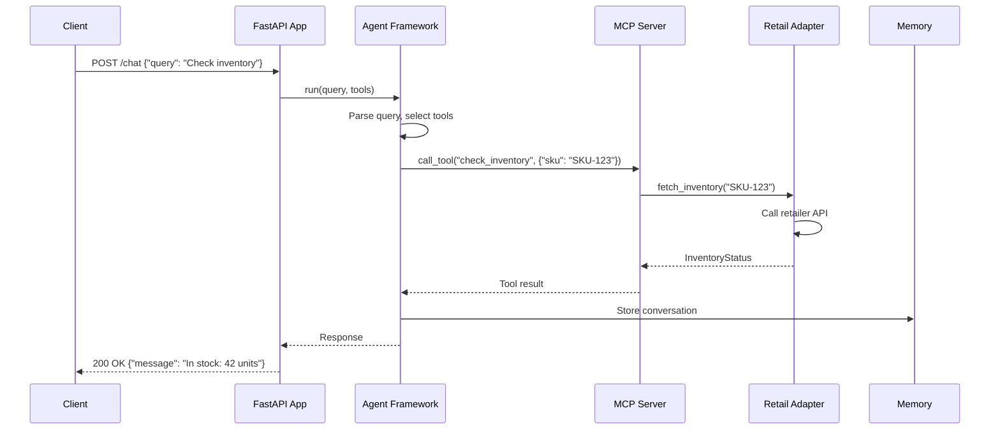

# Architecture Overview

This document provides the overall system architecture for Holiday Peak Hub, including context diagrams, use case models, component interactions, and deployment topology.

## System Context

## Use Case Diagrams

### E-commerce Domain

### Product Management Domain

### CRM Domain

### Inventory Domain

### Logistics Domain

## Component Interaction

### Memory Tier Access Pattern

### SAGA Choreography: Order Placement

### Agent Tool Calling Flow

## Deployment Topology

```mermaid
graph TB
    subgraph "Azure Kubernetes Service"
        subgraph "Namespace: ecommerce"
            EC1[catalog-search pod]
            EC2[product-detail pod]
            EC3[cart-intelligence pod]
            EC4[checkout-support pod]
            EC5[order-status pod]
        end
        
        subgraph "Namespace: product-mgmt"
            PM1[normalization pod]
            PM2[acp-transformation pod]
            PM3[consistency-validation pod]
            PM4[assortment-optimization pod]
        end
        
        subgraph "Namespace: crm"
            CR1[profile-aggregation pod]
            CR2[segmentation pod]
            CR3[campaign-intelligence pod]
            CR4[support-assistance pod]
        end
        
        subgraph "Namespace: inventory"
            IN1[health-check pod]
            IN2[jit-replenishment pod]
            IN3[reservation-validation pod]
            IN4[alerts-triggers pod]
        end
        
        subgraph "Namespace: logistics"
            LO1[eta-computation pod]
            LO2[carrier-selection pod]
            LO3[returns-support pod]
            LO4[route-issue-detection pod]
        end
    end
    
    subgraph "Azure Services"
        Redis[Azure Cache<br/>for Redis]
        Cosmos[Azure Cosmos DB]
        Blob[Azure Blob Storage]
        Search[Azure AI Search]
        EventHub[Azure Event Hubs]
        Monitor[Azure Monitor]
        APIM[API Management]
    end
    
    Client[Clients]
    
    Client -->|HTTPS| APIM
    APIM --> EC1 & EC2 & EC3 & EC4 & EC5
    
    EC1 & PM1 & CR1 --> Redis
    EC1 & PM1 & CR1 --> Cosmos
    EC1 & PM1 & CR1 --> Blob
    EC1 --> Search
    
    EC3 & IN2 --> EventHub
    
    EC1 & PM1 & CR1 & IN1 & LO1 --> Monitor
```

## Technology Stack Summary

| Layer | Technology | Purpose |
|-------|------------|---------|
| **Language** | Python 3.13 | All services and lib |
| **API Framework** | FastAPI + FastAPI-MCP | REST + MCP exposition |
| **Agent Framework** | Microsoft Agent Framework | Orchestration logic |
| **Memory - Hot** | Azure Cache for Redis | <50ms session state |
| **Memory - Warm** | Azure Cosmos DB | Conversation history |
| **Memory - Cold** | Azure Blob Storage | Archival storage |
| **Search** | Azure AI Search | Vector+hybrid search |
| **Messaging** | Azure Event Hubs | SAGA choreography |
| **Compute** | Azure Kubernetes Service | Container orchestration |
| **Scaling** | KEDA | Event-driven auto-scale |
| **Deployment** | Helm + Flagger | Canary deployments |
| **Observability** | Azure Monitor | Logs, metrics, traces |
| **API Gateway** | Azure API Management | Rate limiting, auth |

## Next Steps

- [Review ADRs](ADRs.md) for detailed decision rationale
- [Explore Components](components.md) for implementation details
- [Read Business Summary](business-summary.md) for value proposition
