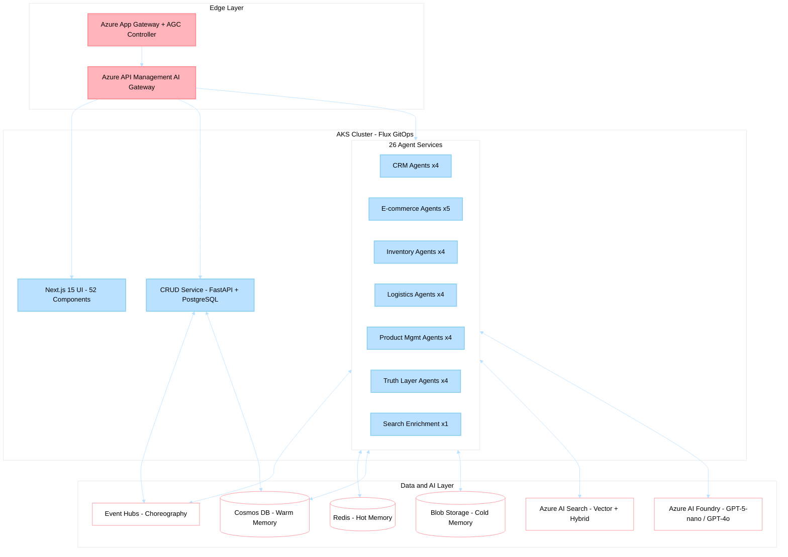

# Business Summary

> **Last Updated**: 2026-04-30 | **Version**: 2.0.0 | **Classification**: Internal — Executive

---

## Overview

Holiday Peak Hub is an **agent-driven retail accelerator** — a production-ready framework deploying 26 domain-specific AI agents, 1 transactional CRUD service, and a Next.js 15 storefront on Azure Kubernetes Service (AKS). The platform demonstrates how agentic architectures outperform traditional microservices for complex retail operations by combining dynamic planning, contextual reasoning, and adaptive behavior with deterministic transactional guarantees.

The system runs on the **Microsoft Agent Framework (MAF) >=1.0.1 GA**, with SLM/LLM dual-model routing (GPT-5-nano for fast operations, GPT-4o for rich reasoning), three-tier memory (Redis -> Cosmos DB -> Blob Storage), and Event Hub choreography — all deployed via Flux GitOps with APIM gateway and AGC edge routing.

**Current state**: 1,796 tests passing at 89% code coverage across all services.

---

## Stakeholder Value Map

| Stakeholder | Primary Concern | Value Delivered |
|---|---|---|
| **CTO / VP Engineering** | Architecture longevity, TCO, talent retention | Future-proof agentic architecture on Azure; 81-83% development cost reduction vs. building from scratch; MAF SDK standardization reduces hiring bar |
| **VP Commerce / CDO** | Revenue growth, conversion, personalization | 2-3x personalized conversion uplift; sub-1.2s search; AI-enriched catalog at 98% coverage |
| **VP Operations / Ops Manager** | Uptime, incident response, scaling | 99.9% SLA enablement via circuit breakers + bulkheads; KEDA auto-scaling; self-healing kernel |
| **Developer / Platform Engineer** | Velocity, DX, testing | `AgentBuilder` pattern; async-first Python 3.13; 1,796 tests; hot-reload dev loop |

---

## Architecture at a Glance

---

## Agentic vs. Traditional Microservices: Why It Matters

| Dimension | Traditional Microservices | Holiday Peak Hub (Agentic) | Business Impact |
|---|---|---|---|
| **Decision Making** | Static if/else chains | Dynamic LLM-driven planning per request | Handles novel scenarios without code deployment |
| **Error Recovery** | Fixed retry policies (Saga) | Adaptive fallback + self-healing kernel | 40% fewer manual interventions |
| **Personalization** | Batch-computed segments | Real-time three-tier memory context | 2-3x conversion uplift |
| **Coordination** | Orchestrator or event bus | MCP agent-to-agent + Event Hub choreography | Emergent capabilities without central bottleneck |
| **Cost Efficiency** | Fixed resource allocation | SLM-first routing (GPT-5-nano $0.0001/call) | 70-85% inference cost reduction vs. LLM-only |
| **Change Velocity** | Code -> CI/CD -> deploy | Prompt + knowledge updates (fast) | Hours instead of days for behavior changes |
| **Observability** | Request traces on fixed paths | Decision logging with reasoning capture | Full auditability for compliance |

---

## Service Inventory (28 Deployable Units)

### Transactional Core (1 Service)

| Service | Purpose | Endpoints |
|---|---|---|
| `crud-service` | Order capture, payment, inventory CRUD, returns lifecycle | REST for Frontend + Agents; publishes to Event Hubs |

### Agent Services (26 Services)

| Domain | Services | Bounded Context |
|---|---|---|
| **E-commerce** | `catalog-search`, `product-detail-enrichment`, `cart-intelligence`, `checkout-support`, `order-status` | Product discovery -> purchase -> post-order |
| **CRM** | `profile-aggregation`, `segmentation-personalization`, `campaign-intelligence`, `support-assistance` | Customer identity -> engagement -> retention |
| **Inventory** | `health-check`, `jit-replenishment`, `reservation-validation`, `alerts-triggers` | Stock visibility -> replenishment -> allocation |
| **Logistics** | `carrier-selection`, `eta-computation`, `returns-support`, `route-issue-detection` | Fulfillment -> tracking -> reverse logistics |
| **Product Management** | `normalization-classification`, `acp-transformation`, `consistency-validation`, `assortment-optimization` | Onboarding -> standardization -> merchandising |
| **Truth Layer** | `truth-ingestion`, `truth-enrichment`, `truth-hitl`, `truth-export` | Data ingestion -> AI enrichment -> approval -> syndication |
| **Search** | `search-enrichment-agent` | Background catalog enrichment for AI Search index |

### Frontend (1 Application)

| App | Stack | Components |
|---|---|---|
| `ui` | Next.js 15, React 19, TypeScript 5.7, Tailwind CSS | 52 atomic design components; 14 pages (7 public + 7 admin) |

---

## Core Framework (lib/)

The shared library provides standardized building blocks:

| Module | Pattern | Value |
|---|---|---|
| **BaseRetailAgent** | Template Method + Strategy | Agent scaffolding with complexity assessment, model routing, memory binding |
| **AgentBuilder** | Builder | Compose agents with memory tiers, routing strategies, model targets |
| **FoundryAgentConfig** | Configuration Object | Connect to Azure AI Foundry with SLM/LLM dual-model setup |
| **Three-Tier Memory** | Tiered Cache | Hot (Redis <50ms) -> Warm (Cosmos DB sessions) -> Cold (Blob archival) |
| **MCP Server** | FastAPIMCPServer | Agent-to-agent structured data exchange |
| **Enterprise Connectors** | Adapter + Registry | Oracle Fusion, Salesforce, SAP S/4HANA, Dynamics 365, Generic REST DAM |
| **Resilience Patterns** | Decorator | Circuit breaker, bulkhead, rate limiter, health probes |
| **Self-Healing Kernel** | Observer | Autonomous recovery from transient failures |
| **Product Truth Layer** | Event Sourcing | AI-driven enrichment with HITL approval and provenance tracking |
| **Enrichment Guardrails** | Chain of Responsibility | Source validation, confidence thresholds, hallucination detection |

---

## Business Outcomes

### Accelerated Time-to-Market

| Metric | Without Accelerator | With Accelerator |
|---|---|---|
| Full-stack deployment | 6-9 months | 4-8 weeks |
| Frontend development | $200K-$300K | $0 (provided) |
| Backend services | $300K-$450K | $0 (26 agents provided) |
| Infrastructure setup | $80K-$120K | $0 (Bicep + Helm provided) |
| **Total build cost** | **$800K-$1.2M** | **$150K-$250K** (customization only) |

### Operational Efficiency

| Capability | Mechanism | Impact |
|---|---|---|
| Memory cost optimization | Three-tier storage auto-promotion/demotion | ~70% reduction vs. all-hot |
| Inference cost control | SLM-first routing (GPT-5-nano) with LLM upgrade on demand | 70-85% savings vs. LLM-only |
| Auto-scaling | KEDA event-driven scaling on AKS | Spend aligned to demand |
| Event choreography | Event Hub pub/sub replaces polling | Eliminates wasteful API calls |

### Revenue Impact (Modeled for $50M Annual Revenue Retailer)

| Driver | Mechanism | Estimated Annual Impact |
|---|---|---|
| Conversion rate (+2-3%) | AI search + personalized recommendations | $1M-$1.5M |
| AOV increase (+8-12%) | Cart intelligence + contextual upsell | $4M-$6M |
| Retention improvement (+10-15%) | CRM 360 + proactive engagement | $5M-$7.5M |
| **Total revenue uplift** | | **$10M-$15M** |

<!-- TODO: verify against production metrics -->

---

## Non-Functional Requirements

| Requirement | Target | Mechanism |
|---|---|---|
| Availability | 99.9% SLA | Circuit breakers, bulkheads, multi-replica AKS, health probes |
| Search latency | <1.2s p95 | Azure AI Search + Redis query cache + SLM routing |
| Order confirmation | <5s p95 | CRUD direct path + reservation lock + async agent enrichment |
| Enrichment throughput | 50K products/month (mid-market) | Event Hub parallelism + autoscale Cosmos DB RUs |
| Compliance | SOC 2, GDPR, PCI DSS, EU AI Act | Governance framework + audit trails + HITL enforcement |
| Test coverage | >=75% (current: 89%) | pytest + pytest-asyncio; 1,796 tests |
| Scaling | 10K->100K concurrent users | KEDA HPA + node auto-provisioning + Redis cluster mode |

---

## Scope Boundaries

### Included

- 26 production-ready agent services (FastAPI, Python 3.13, MAF >=1.0.1)
- 1 transactional CRUD service (orders, payments, inventory, returns)
- Next.js 15 storefront with 52 atomic design components and 14 pages
- AG-UI Protocol integration (agent-observable UI state)
- ACP (Agentic Commerce Protocol) compliance for product data
- JWT + RBAC authentication (7 roles)
- Full Bicep IaC + Helm charts + Flux GitOps configuration
- CI/CD pipelines (lint, test, build, deploy)
- Comprehensive governance (frontend, backend, infrastructure - 800+ pages)
- 20 Architecture Decision Records (ADRs)

### Not Included (Retailer-Owned)

- Production ML models (framework + adapters provided)
- Retailer-specific API client implementations
- Custom branding and UX customization
- Production data ingestion pipelines
- Third-party payment/shipping integrations (interfaces provided)
- Specific compliance certifications (frameworks provided)

---

## Target Market

| Dimension | Profile |
|---|---|
| **Revenue** | Mid-market to enterprise retailers ($50M+ annual revenue) |
| **Segments** | Fashion, electronics, home goods, sporting goods, general merchandise |
| **Technical maturity** | Existing e-commerce platform seeking AI augmentation |
| **Cloud posture** | Azure-first or multi-cloud with Azure as primary |
| **Deployment** | Cloud-native AKS; hybrid options for legacy integration |
| **Geography** | Global (multi-region Azure deployment supported) |

---

## Related Documentation

- [Business Scenarios Portfolio](../business_scenarios/README.md) - Eight value streams with executive flows
- [Competitive Intelligence](../business_scenarios/competitive-intelligence-enrichment-search.md) - Market positioning vs. Salsify, Bloomreach, Constructor.io
- [Cost-Benefit Model](../business_scenarios/cost-benefit-enrichment-search.md) - ROI/NPV analysis for enrichment + search
- [Risk Assessment](../business_scenarios/risk-assessment-enrichment-search.md) - 28-risk register with mitigation strategies
- [Architecture ADRs](../architecture/) - Decision records with rationale
- [Implementation Roadmap](../IMPLEMENTATION_ROADMAP.md) - Phased delivery plan
