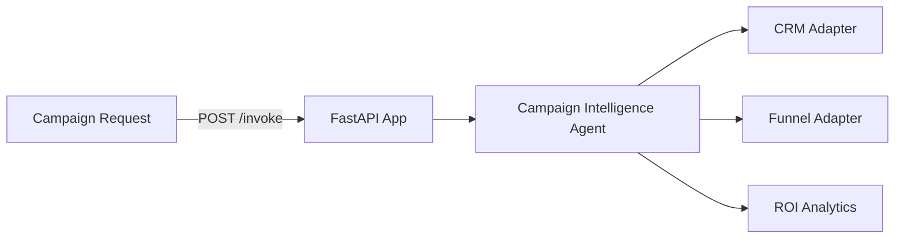

# CRM Campaign Intelligence Service

**Path**: `apps/crm-campaign-intelligence/`  
**Domain**: CRM  
**Purpose**: Campaign insights, funnel diagnostics, and ROI guidance

## Overview

Generates campaign intelligence by combining CRM contact context with funnel metrics and producing actionable insights.

## Architecture



## Components

### 1. FastAPI Application (`main.py`)

**REST Endpoints**:
- `POST /invoke`
- `GET /health`

**MCP Tools**:
- `/campaign/contact-context`
- `/campaign/funnel-context`
- `/campaign/roi`

### 2. Campaign Intelligence Agent (`agents.py`)

Orchestrates:
- CRM contact context
- Funnel metrics
- ROI estimation

**Current Status**: ✅ **IMPLEMENTED (mock adapters)**

### 3. Adapters

**CRM Adapter**: Contact + interactions  
**Funnel Adapter**: Stage metrics  
**Analytics Adapter**: ROI estimation

**Current Status**: ⚠️ **PARTIAL** — Mock adapters return deterministic data

## What's Implemented

✅ MCP tool registration  
✅ Campaign intelligence agent orchestration  
✅ Dockerfile + Bicep module

## What's NOT Implemented

❌ Real CRM/funnel integrations  
❌ Foundry model integration for narratives  
❌ Observability dashboards for funnel drift

## Operational Playbooks

- [Agent latency spikes](../../playbooks/playbook-agent-latency-spikes.md)
- [Tool call failures](../../playbooks/playbook-tool-call-failures.md)
- [Adapter failure](../../playbooks/playbook-adapter-failure.md)
- [Adapter latency spikes](../../playbooks/playbook-adapter-latency-spikes.md)

## Sample Implementation

Replace mock CRM adapter with a real CRM client:

```python
from holiday_peak_lib.adapters.base import BaseAdapter
from holiday_peak_lib.adapters.crm_adapter import CRMConnector

class CrmApiAdapter(BaseAdapter):
    async def _connect_impl(self, **kwargs):
        return None

    async def _fetch_impl(self, query):
        # Call CRM API for contact/account/interactions
        ...

    async def _upsert_impl(self, payload):
        return payload

    async def _delete_impl(self, identifier):
        return True

crm = CRMConnector(adapter=CrmApiAdapter())
```
