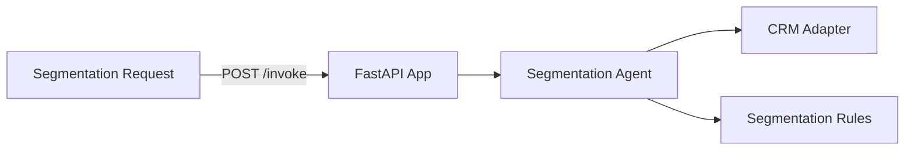

# CRM Segmentation & Personalization Service

**Path**: `apps/crm-segmentation-personalization/`  
**Domain**: CRM  
**Purpose**: Segment customers and recommend personalized outreach

## Overview

Segments contacts based on engagement and opt-in status, producing personalization guidance for campaigns.

## Architecture



## Components

### 1. FastAPI Application (`main.py`)

**REST Endpoints**:
- `POST /invoke`
- `GET /health`

**MCP Tools**:
- `/crm/segment/context`
- `/crm/segment`
- `/crm/personalization`

### 2. Segmentation Agent (`agents.py`)

Orchestrates:
- CRM context assembly
- Segmentation and personalization rules

**Current Status**: ✅ **IMPLEMENTED (mock adapters)**

### 3. Adapters

**CRM Adapter**: Contact/account/interactions  
**Segmentation Adapter**: Heuristic segmenting

**Current Status**: ⚠️ **PARTIAL** — Mock adapters return deterministic data

## What's Implemented

✅ MCP tool registration  
✅ Segmentation agent orchestration  
✅ Dockerfile + Bicep module

## What's NOT Implemented

❌ Real CRM integrations  
❌ Foundry model integration for narratives  
❌ Observability dashboards for segment drift

## Operational Playbooks

- [Agent latency spikes](../../playbooks/playbook-agent-latency-spikes.md)
- [Tool call failures](../../playbooks/playbook-tool-call-failures.md)
- [Adapter failure](../../playbooks/playbook-adapter-failure.md)
- [Adapter latency spikes](../../playbooks/playbook-adapter-latency-spikes.md)

## Sample Implementation

Replace the CRM adapter with a real client:

```python
from holiday_peak_lib.adapters.base import BaseAdapter
from holiday_peak_lib.adapters.crm_adapter import CRMConnector

class CrmApiAdapter(BaseAdapter):
    async def _connect_impl(self, **kwargs):
        return None

    async def _fetch_impl(self, query):
        # Retrieve contact, account, interactions
        ...

    async def _upsert_impl(self, payload):
        return payload

    async def _delete_impl(self, identifier):
        return True

crm = CRMConnector(adapter=CrmApiAdapter())
```
