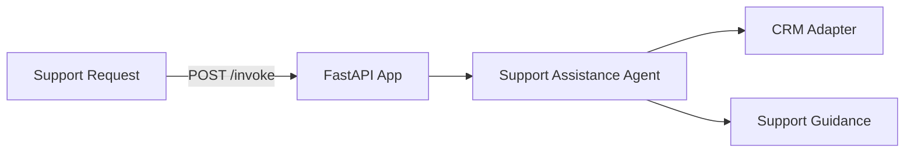

# CRM Support Assistance Service

**Path**: `apps/crm-support-assistance/`  
**Domain**: CRM  
**Purpose**: Provide support briefings and next-best actions

## Overview

Summarizes CRM context, recent interactions, and risk to guide support teams.

## Architecture



## Components

### 1. FastAPI Application (`main.py`)

**REST Endpoints**:
- `POST /invoke`
- `GET /health`

**MCP Tools**:
- `/crm/support/brief`
- `/crm/support/contact-context`
- `/crm/support/interaction-summary`

### 2. Support Assistance Agent (`agents.py`)

Orchestrates:
- CRM context assembly
- Interaction summary
- Support brief generation

**Current Status**: ✅ **IMPLEMENTED (mock adapters)**

### 3. Adapters

**CRM Adapter**: Contact/account/interactions  
**Assistant Adapter**: Support brief heuristics

**Current Status**: ⚠️ **PARTIAL** — Mock adapters return deterministic data

## What's Implemented

✅ MCP tool registration  
✅ Support assistance agent orchestration  
✅ Dockerfile + Bicep module

## What's NOT Implemented

❌ Real CRM integrations  
❌ Foundry model integration for narratives  
❌ Observability dashboards for support SLA

## Operational Playbooks

- [Agent latency spikes](../../playbooks/playbook-agent-latency-spikes.md)
- [Tool call failures](../../playbooks/playbook-tool-call-failures.md)
- [Adapter failure](../../playbooks/playbook-adapter-failure.md)
- [Adapter latency spikes](../../playbooks/playbook-adapter-latency-spikes.md)

## Sample Implementation

Implement CRM adapter with real API calls:

```python
from holiday_peak_lib.adapters.base import BaseAdapter
from holiday_peak_lib.adapters.crm_adapter import CRMConnector

class CrmApiAdapter(BaseAdapter):
    async def _connect_impl(self, **kwargs):
        return None

    async def _fetch_impl(self, query):
        # Fetch contact/account/interactions
        ...

    async def _upsert_impl(self, payload):
        return payload

    async def _delete_impl(self, identifier):
        return True

crm = CRMConnector(adapter=CrmApiAdapter())
```
