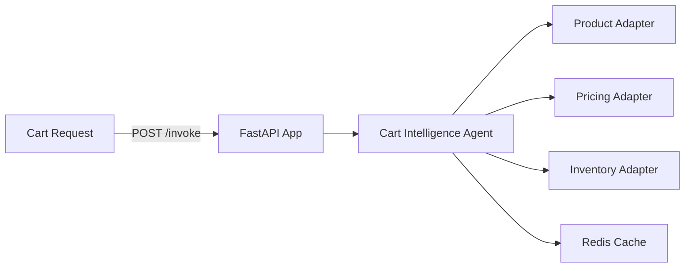

# E-commerce Cart Intelligence Service

**Path**: `apps/ecommerce-cart-intelligence/`  
**Domain**: E-commerce  
**Purpose**: Proactive cart health and abandonment prevention insights

## Overview

Evaluates cart contents using product, pricing, and inventory context to flag risks and recommend actions to improve conversion. Stores cart state in hot memory for short-lived monitoring.

## Architecture



## Components

### 1. FastAPI Application (`main.py`)

**REST Endpoints**:
- `POST /invoke` — Invoke the cart intelligence agent
- `GET /health` — Health check

**MCP Tools**:
- `/cart/context` — Build cart context (products + pricing + inventory)
- `/cart/abandonment-risk` — Estimate abandonment risk
- `/cart/recommendations` — Recommend actions

### 2. Cart Intelligence Agent (`agents.py`)

Orchestrates:
- Product context (base product + related)
- Pricing context (offers + active price)
- Inventory context (availability + warehouse stock)
- Abandonment risk heuristics
- Proactive monitoring guidance

**Current Status**: ✅ **IMPLEMENTED (mock adapters)**

### 3. Adapters

**Product Adapter**: Catalog product + related items  
**Pricing Adapter**: Active price + offers  
**Inventory Adapter**: Availability and warehouse stock  
**Analytics Adapter**: Heuristic risk signals

**Current Status**: ⚠️ **PARTIAL** — Mock adapters return deterministic data

### 4. Memory Integration

**Hot (Redis)**: Stores cart snapshot + risk for short TTL (default 10 minutes)

**Current Status**: ✅ **IMPLEMENTED**

## What's Implemented

✅ MCP tool registration for cart context, risk, and recommendations  
✅ Cart agent orchestration with mock adapters  
✅ Hot memory storage for cart snapshots  
✅ Dockerfile with multi-stage build  
✅ Bicep module for Azure resource provisioning  

## What's NOT Implemented

❌ Real product/pricing/inventory integrations  
❌ Foundry model integration for narrative recommendations  
❌ Observability dashboards for cart risk trends

## Operational Playbooks

- [Agent latency spikes](../../playbooks/playbook-agent-latency-spikes.md)
- [Tool call failures](../../playbooks/playbook-tool-call-failures.md)
- [Adapter latency spikes](../../playbooks/playbook-adapter-latency-spikes.md)
- [Adapter failure](../../playbooks/playbook-adapter-failure.md)
- [Connection pool exhaustion](../../playbooks/playbook-connection-pool-exhaustion.md)
- [Redis OOM](../../playbooks/playbook-redis-oom.md)

## Sample Implementation

Use real adapters and keep the agent unchanged. Replace mock adapters in `adapters.py`:

```python
from holiday_peak_lib.adapters.base import BaseAdapter
from holiday_peak_lib.adapters.product_adapter import ProductConnector

class ProductApiAdapter(BaseAdapter):
    async def _connect_impl(self, **kwargs):
        return None

    async def _fetch_impl(self, query):
        # Call real product API
        ...

    async def _upsert_impl(self, payload):
        return payload

    async def _delete_impl(self, identifier):
        return True

products = ProductConnector(adapter=ProductApiAdapter())
```
