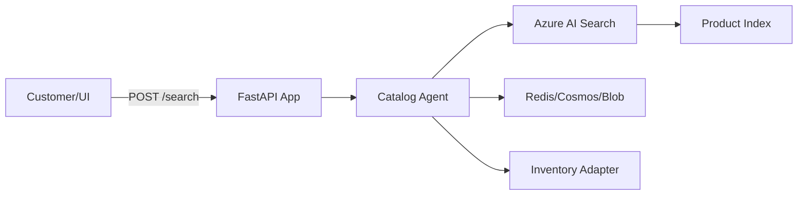

# E-commerce Catalog Search Service

**Path**: `apps/ecommerce-catalog-search/`  
**Domain**: E-commerce  
**Purpose**: Product discovery with sub-3s latency using Azure AI Search vector+hybrid search

## Overview

Enables customers to search product catalog with natural language queries. Uses Azure AI Search for vector similarity (semantic search) and keyword matching (hybrid mode). Agents augment search results with personalization and inventory checks.

## Architecture



## Components

### 1. FastAPI Application (`main.py`)

**REST Endpoints**:
- `POST /search` — Search catalog with query
- `GET /product/{sku}` — Get product details
- `GET /health` — Health check

**MCP Tools**:
- `search_catalog` — Search products (agent-callable)
- `get_product_details` — Fetch SKU metadata

### 2. Catalog Agent (`agents/catalog_agent.py`)

Orchestrates search with:
- Query understanding (extract intent, filters)
- Vector embedding generation
- Search execution (AI Search API)
- Result ranking (personalization if user context available)
- Inventory validation (check stock via adapter)

**Current Status**: ⚠️ **STUBBED** — Agent returns mock results; no real Foundry integration.

### 3. Search Adapter (`adapters/search_adapter.py`)

Wraps Azure AI Search SDK:
- Index management (create, update schema)
- Document ingestion (upload product catalog)
- Query execution (vector+hybrid search)
- Result mapping (AI Search schema → lib schema)

**Current Status**: ⚠️ **STUBBED** — Returns hardcoded product list; no real Azure AI Search calls.

### 4. Memory Integration

**Hot (Redis)**: Recent search queries per user (5-min TTL)  
**Warm (Cosmos)**: User search history (30-day retention)  
**Cold (Blob)**: Product images, catalog snapshots

**Current Status**: ✅ **IMPLEMENTED** — Memory builder wired; no sample data.

## What's Implemented

✅ FastAPI app structure with `/search` and `/health` endpoints  
✅ MCP tool registration for `search_catalog`  
✅ Memory tier wiring (Redis/Cosmos/Blob configs)  
✅ Pydantic models for search requests/responses  
✅ Basic unit tests (`tests/test_api.py`)  
✅ Dockerfile with multi-stage build  
✅ Bicep module for Azure resource provisioning  

## What's NOT Implemented

### Azure AI Search Integration

❌ **No Real Index**: Stub adapter returns mock products  
❌ **No Embedding Model**: No vector generation for semantic search  
❌ **No Hybrid Queries**: Stub doesn't combine vector + keyword  
❌ **No Index Population**: No script to upload catalog to AI Search  

**To Implement**:
```python
from azure.search.documents import SearchClient
from azure.search.documents.models import VectorizedQuery
from azure.core.credentials import AzureKeyCredential

class AzureSearchAdapter:
    def __init__(self, endpoint: str, index: str, key: str):
        self.client = SearchClient(
            endpoint=endpoint,
            index_name=index,
            credential=AzureKeyCredential(key)
        )
    
    async def search(self, query: str, vector: list[float], top: int = 10):
        results = self.client.search(
            search_text=query,
            vector_queries=[VectorizedQuery(
                vector=vector,
                k_nearest_neighbors=top,
                fields="embedding"
            )],
            top=top
        )
        return [self._map_result(r) for r in results]
```

### Agent Orchestration

❌ **No Foundry Call**: Agent stub returns mock response  
❌ **No Multi-Step Reasoning**: No chaining (search → inventory check → ranking)  
❌ **No Personalization**: No user profile integration for ranking  

**To Implement**:
```python
from azure.ai.agents import AgentClient

class CatalogAgent:
    async def search(self, query: str, user_id: str) -> SearchResponse:
        # Step 1: Embed query
        embedding = await embedding_model.embed(query)
        
        # Step 2: Search AI index
        results = await search_adapter.search(query, embedding)
        
        # Step 3: Check inventory for top results
        for product in results[:3]:
            product.stock = await inventory_adapter.fetch_stock(product.sku)
        
        # Step 4: Personalize ranking
        user_profile = await memory.warm.get(f"profile:{user_id}")
        ranked_results = self._rank_for_user(results, user_profile)
        
        return SearchResponse(products=ranked_results)
```

### Observability

❌ **No Distributed Tracing**: No correlation IDs across search → inventory → ranking  
❌ **No Latency Metrics**: No P95/P99 tracking per query  
❌ **No Error Rates**: No dashboard for failed searches  

**Add Azure Monitor**:
```python
from opencensus.ext.azure.log_exporter import AzureLogHandler

logger.addHandler(AzureLogHandler(
    connection_string=os.getenv("APPLICATIONINSIGHTS_CONNECTION_STRING")
))

@app.post("/search")
async def search_products(request: SearchRequest):
    start = time.time()
    try:
        results = await catalog_agent.search(request.query, request.user_id)
        logger.info("search.success", extra={
            "duration_ms": (time.time() - start) * 1000,
            "result_count": len(results.products)
        })
        return results
    except Exception as e:
        logger.error("search.error", exc_info=True)
        raise
```

### Evaluation/QA

❌ **No Catalog Coverage Tests**: No validation that all SKUs are indexed  
❌ **No Relevance Tests**: No benchmark for search quality (NDCG, MRR)  
❌ **No Load Tests**: No k6/Locust scripts for 10k+ req/s  

**Add Evaluation Harness**:
```python
# tests/eval/test_search_quality.py
import pytest

@pytest.mark.eval
@pytest.mark.asyncio
async def test_search_relevance():
    queries = [
        ("Nike shoes", expected_sku="NIKE-AIR-001"),
        ("Red dress size M", expected_sku="DRESS-RED-M")
    ]
    
    for query, expected_sku in queries:
        results = await catalog_agent.search(query, user_id="test-user")
        
        # Top result should be expected SKU
        assert results.products[0].sku == expected_sku
```

### Data Seeding

❌ **No Sample Catalog**: No CSV/JSON with products to upload  
❌ **No Index Creation Script**: No automation to provision AI Search index  

**Add Seed Script**:
```python
# scripts/seed_catalog.py
import asyncio
from azure.search.documents import SearchClient

async def seed_catalog():
    client = SearchClient(...)
    
    # Load sample products
    with open("data/sample_catalog.json") as f:
        products = json.load(f)
    
    # Upload in batches
    await client.upload_documents(products)
    print(f"Uploaded {len(products)} products")

if __name__ == "__main__":
    asyncio.run(seed_catalog())
```

### Security

❌ **No API Key Rotation**: Search API key in `.env`, no Key Vault  
❌ **No Rate Limiting**: No throttling for abusive queries  
❌ **No Query Sanitization**: No protection against injection attacks  

**Add Key Vault**:
```python
from azure.keyvault.secrets import SecretClient
from azure.identity import DefaultAzureCredential

credential = DefaultAzureCredential()
kv_client = SecretClient(vault_url="https://<vault>.vault.azure.net", credential=credential)

search_key = kv_client.get_secret("search-api-key").value
search_adapter = AzureSearchAdapter(endpoint="...", key=search_key)
```

## Deployment

### Local Development

```bash
# Install dependencies
pip install -e apps/ecommerce-catalog-search/src

# Set environment variables
export REDIS_HOST=localhost
export COSMOS_ENDPOINT=https://<account>.documents.azure.com
export SEARCH_ENDPOINT=https://<search>.search.windows.net
export SEARCH_API_KEY=<key>

# Run app
uvicorn main:app --reload --app-dir apps/ecommerce-catalog-search/src
```

### Docker Build

```bash
cd apps/ecommerce-catalog-search
docker build -t catalog-search:latest -f src/Dockerfile .
docker run -p 8000:8000 --env-file .env catalog-search:latest
```

### Azure Deployment

```bash
# Provision resources
python .infra/cli.py deploy --service ecommerce-catalog-search --location eastus

# Push image
docker tag catalog-search:latest ghcr.io/<owner>/ecommerce-catalog-search:latest
docker push ghcr.io/<owner>/ecommerce-catalog-search:latest

# Deploy to AKS
helm upgrade catalog-search .kubernetes/chart \
  --set image.repository=ghcr.io/<owner>/ecommerce-catalog-search \
  --set image.tag=latest
```

## Configuration

### Environment Variables

| Variable | Description | Default | Required |
|----------|-------------|---------|----------|
| `REDIS_HOST` | Redis endpoint | `localhost` | ✅ |
| `REDIS_PASSWORD` | Redis auth | - | ✅ (prod) |
| `COSMOS_ENDPOINT` | Cosmos DB URI | - | ✅ |
| `COSMOS_KEY` | Cosmos DB key | - | ✅ (dev) |
| `BLOB_ACCOUNT` | Storage account | - | ✅ |
| `SEARCH_ENDPOINT` | AI Search URI | - | ✅ |
| `SEARCH_API_KEY` | AI Search key | - | ✅ (dev) |
| `FOUNDRY_ENDPOINT` | Agent endpoint | - | ⚠️ (when wiring agents) |

**Prod Note**: Use Managed Identity; avoid keys in env vars.

## Testing

### Unit Tests

```bash
pytest apps/ecommerce-catalog-search/tests -v
```

**Coverage**: ⚠️ ~40% (only API route tests; no agent/adapter tests)

### Integration Tests (NOT IMPLEMENTED)

Add tests with real Azure services:
```python
@pytest.mark.integration
@pytest.mark.asyncio
async def test_search_with_real_index():
    # Requires AI Search index with test data
    results = await catalog_agent.search("Nike shoes", user_id="test")
    assert len(results.products) > 0
```

### Load Tests (NOT IMPLEMENTED)

Add k6 script:
```javascript
import http from 'k6/http';

export const options = {
  vus: 100,  // 100 virtual users
  duration: '5m',
};

export default function () {
  http.post('http://localhost:8000/search', JSON.stringify({
    query: 'Nike shoes',
    user_id: 'test-user'
  }));
}
```

## Runbooks (NOT PROVIDED)

**Operational playbooks needed**:
- **High Latency**: Diagnose slow AI Search queries, optimize index
- **Low Relevance**: Tune vector weights, adjust ranking parameters
- **Index Corruption**: Rebuild index from Blob snapshot
- **OOM Errors**: Scale AKS pod memory limits

## Monitoring (PARTIALLY CONFIGURED)

### Metrics to Track

- **Search Latency**: P50/P95/P99 per query
- **Result Count**: Avg products returned
- **Cache Hit Rate**: Redis hits vs misses
- **Error Rate**: 4xx/5xx responses
- **Throughput**: Queries per second

### Alerts (NOT CONFIGURED)

Set up Azure Monitor alerts for:
- P95 latency > 3s (SLA violation)
- Error rate > 1%
- Index unavailable (503 from AI Search)

## Related Services

- **[Product Detail Enrichment](ecommerce-product-detail-enrichment.md)** — Augments search results with ACP metadata
- **[Cart Intelligence](ecommerce-cart-intelligence.md)** — Uses search for "similar items" recommendations
- **[Inventory Health Check](../inventory/inventory-health-check.md)** — Provides stock levels for search results

## Related Lib Components

- [Agents](../libs/agents.md)
- [Adapters](../libs/adapters.md)
- [Memory](../libs/memory.md)

## Related ADRs

- [ADR-002: Azure Services](../../adrs/adr-002-azure-services.md) — AI Search rationale
- [ADR-006: Agent Framework](../../adrs/adr-006-agent-framework.md) — Agent orchestration
