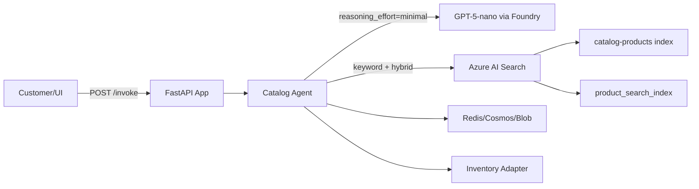

# E-commerce Catalog Search Service

**Path**: `apps/ecommerce-catalog-search/`  
**Domain**: E-commerce  
**Purpose**: Product discovery with strict sub-4s latency using Azure AI Search keyword+hybrid search and GPT-5-nano intent classification

## Overview

Enables customers to search the product catalog with natural language queries. The intelligent pipeline classifies intent via GPT-5-nano (with `reasoning_effort="minimal"` for zero-overhead classification), builds sub-queries from intent entities, fans out parallel keyword + hybrid searches against Azure AI Search, and constructs products directly from search documents — all within a hard 4-second wall-clock budget.

## Architecture


```mermaid
graph LR
    Client[Customer/UI] -->|POST /invoke| API[FastAPI App]
    API --> Agent[Catalog Agent]
    Agent -->|reasoning_effort=minimal| SLM[GPT-5-nano via Foundry]
    Agent -->|keyword + hybrid| Search[Azure AI Search]
    Agent --> Memory[Redis/Cosmos/Blob]
    Agent --> Inventory[Inventory Adapter]
    Search --> KWIndex[catalog-products index]
    Search --> VecIndex[product_search_index]
```

## Intelligent Pipeline (strict mode)

When `mode=intelligent`, the entire pipeline is wrapped in `asyncio.wait_for(timeout=4.0s)`. On timeout or error, returns a hard error — no degraded fallback.

### Step-by-Step Flow

| Step | Operation | Timeout | Fallback |
|------|-----------|---------|----------|
| 1 | **Intent classification** — GPT-5-nano via Foundry Agent with `reasoning_effort="minimal"` | 1.5s | Deterministic regex-based `_deterministic_intent_policy` |
| 2 | **Sub-query expansion** — extract entities from intent (use_case, category, brand, attributes, sub_queries) | ~0ms | Original query only |
| 3a | **Keyword search** — `keyword_search(query, filters, top_k)` against `catalog-products` index (100 docs) | parallel | — |
| 3b | **Hybrid search** — `multi_query_search(sub_queries, filters, top_k)` against `product_search_index` | parallel | — |
| 4 | **Merge & build** — deduplicate SKUs, construct `CatalogProduct` directly from AI Search documents (no CRUD round-trip) | ~0ms | — |
| 5 | **Rank** — `_rank_products_by_query_relevance()` deterministic scoring, trim to limit | ~0ms | — |
| 6 | **Availability** — inventory check with 0.5s timeout | 0.5s | `["unknown"] * len(products)` |
| 7 | **ACP mapping** — `to_acp_product()` + merge enriched fields | ~0ms | — |
| 8 | **History** — `asyncio.create_task()` fire-and-forget (does not consume budget) | background | — |
| 9 | **Return** — deterministic response (model answer generation is **skipped** in strict mode) | — | — |

### Pipeline Constants

| Constant | Value | Description |
|----------|-------|-------------|
| `INTELLIGENT_PIPELINE_TIMEOUT_SECONDS` | `4.0` | Hard wall-clock budget for the entire pipeline |
| `INTELLIGENT_INTENT_TIMEOUT_SECONDS` | `1.5` | SLM intent classification timeout |
| `reasoning_effort` | `"minimal"` | GPT-5 parameter that eliminates most reasoning tokens |
| Availability timeout | `0.5s` | Inventory check timeout in strict mode |
| `GENERIC_KEYWORD_LIMIT` | `8` | Max keyword results for generic queries |
| `QUERY_EXPANSION_QUERY_LIMIT` | `4` | Max sub-queries from intent expansion |

### Performance Results (2026-04-19, v6 deployed)

Tested against live AKS deployment (`strict-4s-v6`) via APIM gateway:

| Query | Wall Clock | Results | Intent |
|-------|-----------|---------|--------|
| travel_russia_clothes | 2.90s | 4 | semantic_search |
| hiking_alps_gear | 2.30s | 5 | semantic_search |
| winter_camping_warm | 2.43s | 5 | semantic_search |
| beach_vacation_thailand | 3.20s | 5 | semantic_search |
| marathon_winter_shoes | 2.54s | 5 | semantic_search |
| business_trip_london | 4.55s | 5 | semantic_search |
| kids_outdoor_summer | 2.65s | 5 | semantic_search |
| skiing_equipment_beginner | 2.32s | 5 | semantic_search |
| rainy_commute_city | 2.31s | 5 | semantic_search |
| festival_weekend_outfit | 2.46s | 5 | semantic_search |

**Summary**: 10/10 within budget, avg ~2.77s, 4-5 products per query.

## Components

### 1. FastAPI Application (`main.py`)

**REST Endpoints**:
- `POST /invoke` — Invoke the catalog agent
- `GET /health` — Health check

**MCP Tools**:
- `/catalog/search` — Search products (ACP-aligned), optional `mode` (`keyword` default, `intelligent` for dual-path intent-aware retrieval)
- `/catalog/intent` — Classify search intent and complexity for diagnostics/routing
- `/catalog/product` — Fetch product details (ACP-aligned)

### 2. Catalog Agent (`agents.py`)

Orchestrates search with:
- Intent classification via GPT-5-nano (Foundry Agent, `reasoning_effort="minimal"`)
- Parallel keyword + hybrid search execution (AI Search API)
- Direct product construction from AI Search documents (no CRUD round-trip)
- Inventory validation (with 0.5s timeout in strict mode)
- Deterministic relevance ranking

**Current Status**: ✅ **IMPLEMENTED** — Full intelligent pipeline deployed with strict 4s budget. Intent classification always fires via SLM. Foundry integration active with `reasoning_effort="minimal"`.

### 3. Catalog Adapters (`adapters.py`)

Wraps product + inventory connectors and maps results to ACP fields.

**Current Status**: ⚠️ **PARTIAL** — Product/inventory adapters remain mock-oriented by default, while AI Search runtime calls are implemented in `ai_search.py`.

### 4. Memory Integration

**Hot (Redis)**: Recent search queries per user (5-min TTL)  
**Warm (Cosmos)**: User search history (30-day retention)  
**Cold (Blob)**: Product images, catalog snapshots

**Current Status**: ✅ **IMPLEMENTED** — Memory builder wired; no sample data.

## What's Implemented

✅ FastAPI app structure with `/invoke` and `/health` endpoints  
✅ MCP tool registration for `/catalog/search` and `/catalog/product`  
✅ ACP-aligned product mapping (required feed fields + eligibility flags)  
✅ Shared infra provisioning of Azure AI Search service with `catalog-products` ensured during `azd` `postprovision`  
✅ Deployment output/env propagation for `AI_SEARCH_ENDPOINT`, `AI_SEARCH_INDEX`, and `AI_SEARCH_AUTH_MODE`  
✅ Runtime AI Search query path with graceful fallback when unconfigured/unavailable/empty  
✅ Product event-driven AI Search document upsert/delete hooks  
✅ Memory tier wiring (Redis/Cosmos/Blob configs)  
✅ Dockerfile with multi-stage build  
✅ Bicep module for Azure resource provisioning  
✅ **Intelligent pipeline** with strict 4s wall-clock budget (`asyncio.wait_for`)  
✅ **Intent classification** via GPT-5-nano Foundry Agent with `reasoning_effort="minimal"`  
✅ **Parallel fan-out** — keyword + hybrid search via `asyncio.gather`  
✅ **Direct product construction** from AI Search documents (zero CRUD round-trips)  
✅ **Fire-and-forget history** — `asyncio.create_task` in strict mode  
✅ **`reasoning_effort` parameter** wired through `FoundryAgentInvoker` pipeline  
✅ **34 unit tests** — all passing (~3.3s)  
✅ **11 live integration tests** — 10 parametrized queries + summary report  
✅ **Deployed** to AKS as `strict-4s-v6` on 2 replicas  

## Remaining Optional Hardening

### Vector Search Index

⚠️ **`product_search_index` is empty** — hybrid/vector search returns 0 results. All results currently come from keyword search on `catalog-products` (100 docs). Populating the vector index would improve result quality for semantic queries.

### AI Search Retrieval Quality

⚠️ **No explicit weighted hybrid tuning policy documented/validated yet**.  
⚠️ **No formal relevance benchmark suite (NDCG/MRR) wired into CI gates yet**.  

**To Implement**:
```python
from azure.search.documents import SearchClient
from azure.search.documents.models import VectorizedQuery
from azure.core.credentials import AzureKeyCredential

class AzureSearchAdapter:
    def __init__(self, endpoint: str, index: str, key: str):
        self.client = SearchClient(
            endpoint=endpoint,
            index_name=index,
            credential=AzureKeyCredential(key)
        )
    
    async def search(self, query: str, vector: list[float], top: int = 10):
        results = self.client.search(
            search_text=query,
            vector_queries=[VectorizedQuery(
                vector=vector,
                k_nearest_neighbors=top,
                fields="embedding"
            )],
            top=top
        )
        return [self._map_result(r) for r in results]
```

### Agent Orchestration

✅ **Foundry Integration**: GPT-5-nano via Azure AI Foundry Agent with `reasoning_effort="minimal"` for intent classification  
✅ **Multi-Step Pipeline**: Intent classify → sub-query expansion → parallel search → merge → rank → availability → ACP mapping  
❌ **No Personalization**: No user profile integration for ranking  

**To Implement**:
```python
from azure.ai.agents import AgentClient

class CatalogAgent:
    async def search(self, query: str, user_id: str) -> SearchResponse:
        # Step 1: Embed query
        embedding = await embedding_model.embed(query)
        
        # Step 2: Search AI index
        results = await search_adapter.search(query, embedding)
        
        # Step 3: Check inventory for top results
        for product in results[:3]:
            product.stock = await inventory_adapter.fetch_stock(product.sku)
        
        # Step 4: Personalize ranking
        user_profile = await memory.warm.get(f"profile:{user_id}")
        ranked_results = self._rank_for_user(results, user_profile)
        
        return SearchResponse(products=ranked_results)
```

### Observability

❌ **No Distributed Tracing**: No correlation IDs across search → inventory → ranking  
❌ **No Latency Metrics**: No P95/P99 tracking per query  
❌ **No Error Rates**: No dashboard for failed searches  

**Add Azure Monitor**:
```python
from opencensus.ext.azure.log_exporter import AzureLogHandler

logger.addHandler(AzureLogHandler(
    connection_string=os.getenv("APPLICATIONINSIGHTS_CONNECTION_STRING")
))

@app.post("/search")
async def search_products(request: SearchRequest):
    start = time.time()
    try:
        results = await catalog_agent.search(request.query, request.user_id)
        logger.info("search.success", extra={
            "duration_ms": (time.time() - start) * 1000,
            "result_count": len(results.products)
        })
        return results
    except Exception as e:
        logger.error("search.error", exc_info=True)
        raise
```

### Evaluation/QA

❌ **No Catalog Coverage Tests**: No validation that all SKUs are indexed  
❌ **No Relevance Tests**: No benchmark for search quality (NDCG, MRR)  
❌ **No Load Tests**: No k6/Locust scripts for 10k+ req/s  

**Add Evaluation Harness**:
```python
# tests/eval/test_search_quality.py
import pytest

@pytest.mark.eval
@pytest.mark.asyncio
async def test_search_relevance():
    queries = [
        ("Nike shoes", expected_sku="NIKE-AIR-001"),
        ("Red dress size M", expected_sku="DRESS-RED-M")
    ]
    
    for query, expected_sku in queries:
        results = await catalog_agent.search(query, user_id="test-user")
        
        # Top result should be expected SKU
        assert results.products[0].sku == expected_sku
```

### Data Seeding

❌ **No Sample Catalog**: No CSV/JSON with products to upload  
✅ **Index Provisioning via Shared Infra**: AI Search index lifecycle is provisioned by shared infrastructure modules (no app-local index creation script required)  

**Add Seed Script**:
```python
# scripts/seed_catalog.py
import asyncio
from azure.search.documents import SearchClient

async def seed_catalog():
    client = SearchClient(...)
    
    # Load sample products
    with open("data/sample_catalog.json") as f:
        products = json.load(f)
    
    # Upload in batches
    await client.upload_documents(products)
    print(f"Uploaded {len(products)} products")

if __name__ == "__main__":
    asyncio.run(seed_catalog())
```

### Security

❌ **No API Key Rotation**: Search API key in `.env`, no Key Vault  
❌ **No Rate Limiting**: No throttling for abusive queries  
❌ **No Query Sanitization**: No protection against injection attacks  

**Add Key Vault**:
```python
from azure.keyvault.secrets import SecretClient
from azure.identity import DefaultAzureCredential

credential = DefaultAzureCredential()
kv_client = SecretClient(vault_url="https://<vault>.vault.azure.net", credential=credential)

search_key = kv_client.get_secret("search-api-key").value
search_adapter = AzureSearchAdapter(endpoint="...", key=search_key)
```

## Deployment

### Local Development

```bash
# Install dependencies
pip install -e apps/ecommerce-catalog-search/src

# Set environment variables
export REDIS_HOST=localhost
export COSMOS_ENDPOINT=https://<account>.documents.azure.com
export AI_SEARCH_ENDPOINT=https://<search>.search.windows.net
export AI_SEARCH_INDEX=catalog-products
export AI_SEARCH_AUTH_MODE=managed_identity

# Run app
uvicorn main:app --reload --app-dir apps/ecommerce-catalog-search/src
```

### Docker Build

```bash
cd apps/ecommerce-catalog-search
docker build -t catalog-search:latest -f src/Dockerfile .
docker run -p 8000:8000 --env-file .env catalog-search:latest
```

### Azure Deployment

## Operational Playbooks

- [Agent latency spikes](../../playbooks/playbook-agent-latency-spikes.md)
- [Tool call failures](../../playbooks/playbook-tool-call-failures.md)
- [Adapter latency spikes](../../playbooks/playbook-adapter-latency-spikes.md)
- [Adapter failure](../../playbooks/playbook-adapter-failure.md)
- [Connection pool exhaustion](../../playbooks/playbook-connection-pool-exhaustion.md)
- [Cosmos high RU consumption](../../playbooks/playbook-cosmos-high-ru.md)
- [Blob throttling](../../playbooks/playbook-blob-throttling.md)

## Sample Implementation

Bind a real Azure AI Search adapter and keep the agent orchestration intact:

```python
from azure.search.documents import SearchClient
from azure.core.credentials import AzureKeyCredential

class AzureSearchAdapter:
    def __init__(self, endpoint: str, index_name: str, key: str):
        self.client = SearchClient(endpoint, index_name, AzureKeyCredential(key))

    def search(self, query: str, top: int = 10):
        return [doc for doc in self.client.search(search_text=query, top=top)]
```

```bash
# Provision resources
python .infra/cli.py deploy --service ecommerce-catalog-search --location eastus

# Push image
docker tag catalog-search:latest ghcr.io/<owner>/ecommerce-catalog-search:latest
docker push ghcr.io/<owner>/ecommerce-catalog-search:latest

# Deploy to AKS
helm upgrade catalog-search .kubernetes/chart \
  --set image.repository=ghcr.io/<owner>/ecommerce-catalog-search \
  --set image.tag=latest
```

## Configuration

### Environment Variables

| Variable | Description | Default | Required |
|----------|-------------|---------|----------|
| `REDIS_HOST` | Redis endpoint | `localhost` | ✅ |
| `REDIS_PASSWORD` | Redis auth | - | ✅ (prod) |
| `COSMOS_ENDPOINT` | Cosmos DB URI | - | ✅ |
| `COSMOS_KEY` | Cosmos DB key | - | ✅ (dev) |
| `BLOB_ACCOUNT` | Storage account | - | ✅ |
| `AI_SEARCH_ENDPOINT` | AI Search URI | - | ✅ (for AI Search runtime path) |
| `AI_SEARCH_INDEX` | AI Search index name | `catalog-products` | ✅ (for AI Search runtime path) |
| `AI_SEARCH_AUTH_MODE` | Auth mode (`managed_identity` or `api_key`) | `managed_identity` | ✅ (for AI Search runtime path) |
| `AI_SEARCH_KEY` | AI Search API key (only with `api_key` auth mode) | - | ⚠️ Optional |
| `FOUNDRY_ENDPOINT` | Agent endpoint | - | ⚠️ (when wiring agents) |

**Prod Note**: Use Managed Identity; avoid keys in env vars.

## Testing

### Unit Tests

```bash
pytest apps/ecommerce-catalog-search/tests -v
```

**Coverage**: ⚠️ ~40% (only API route tests; no agent/adapter tests)

### Integration Tests (NOT IMPLEMENTED)

Add tests with real Azure services:
```python
@pytest.mark.integration
@pytest.mark.asyncio
async def test_search_with_real_index():
    # Requires AI Search index with test data
    results = await catalog_agent.search("Nike shoes", user_id="test")
    assert len(results.products) > 0
```

### Load Tests (NOT IMPLEMENTED)

Add k6 script:
```javascript
import http from 'k6/http';

export const options = {
  vus: 100,  // 100 virtual users
  duration: '5m',
};

export default function () {
  http.post('http://localhost:8000/search', JSON.stringify({
    query: 'Nike shoes',
    user_id: 'test-user'
  }));
}
```

## Runbooks (NOT PROVIDED)

**Operational playbooks needed**:
- **High Latency**: Diagnose slow AI Search queries, optimize index
- **Low Relevance**: Tune vector weights, adjust ranking parameters
- **Index Corruption**: Rebuild index from Blob snapshot
- **OOM Errors**: Scale AKS pod memory limits

## Monitoring (PARTIALLY CONFIGURED)

### Metrics to Track

- **Search Latency**: P50/P95/P99 per query
- **Result Count**: Avg products returned
- **Cache Hit Rate**: Redis hits vs misses
- **Error Rate**: 4xx/5xx responses
- **Throughput**: Queries per second

### Alerts (NOT CONFIGURED)

Set up Azure Monitor alerts for:
- P95 latency > 3s (SLA violation)
- Error rate > 1%
- Index unavailable (503 from AI Search)

## Related Services

- **[Product Detail Enrichment](ecommerce-product-detail-enrichment.md)** — Augments search results with ACP metadata
- **[Cart Intelligence](ecommerce-cart-intelligence.md)** — Uses search for "similar items" recommendations
- **[Inventory Health Check](inventory-health-check.md)** — Provides stock levels for search results

## Related Lib Components

- [Agents](../libs/agents.md)
- [Adapters](../libs/adapters.md)
- [Memory](../libs/memory.md)

## Related ADRs

- [ADR-002: Azure Services](../../adrs/adr-002-azure-services.md) — AI Search rationale
- [ADR-006: Agent Framework](../../adrs/adr-006-agent-framework.md) — Agent orchestration
