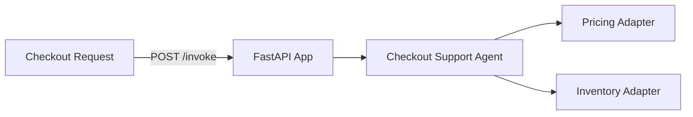

# E-commerce Checkout Support Service

**Path**: `apps/ecommerce-checkout-support/`  
**Domain**: E-commerce  
**Purpose**: Validate pricing and availability before checkout

## Overview

Validates checkout readiness by checking inventory and pricing across cart items. Flags blockers and recommends fixes before an order is created.

## Architecture

## Components

### 1. FastAPI Application (`main.py`)

**REST Endpoints**:
- `POST /invoke` — Invoke the checkout support agent
- `GET /health` — Health check

**MCP Tools**:
- `/checkout/validate` — Validate checkout readiness
- `/checkout/pricing` — Fetch pricing for a SKU
- `/checkout/inventory` — Fetch inventory for a SKU

### 2. Checkout Support Agent (`agents.py`)

Orchestrates:
- Pricing context per item
- Inventory context per item
- Validation of blockers (missing price, out of stock, insufficient stock)
- Proactive monitoring guidance

**Current Status**: ✅ **IMPLEMENTED (mock adapters)**

### 3. Adapters

**Pricing Adapter**: Active price + offers  
**Inventory Adapter**: Availability and warehouse stock  
**Validation Adapter**: Blocker detection

**Current Status**: ⚠️ **PARTIAL** — Mock adapters return deterministic data

## What's Implemented

✅ MCP tool registration for validation, pricing, and inventory  
✅ Checkout agent orchestration with validation heuristics  
✅ Dockerfile with multi-stage build  
✅ Bicep module for Azure resource provisioning  

## What's NOT Implemented

❌ Real pricing/inventory integrations  
❌ Foundry model integration for narrative recommendations  
❌ Observability dashboards for validation failures
