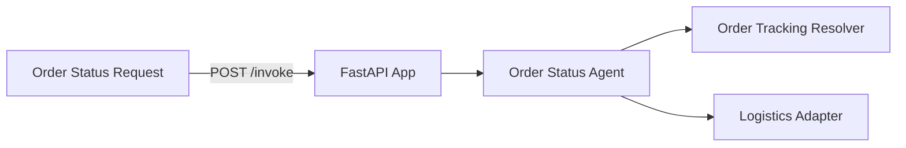

# E-commerce Order Status Service

**Path**: `apps/ecommerce-order-status/`  
**Domain**: E-commerce  
**Purpose**: Proactive order tracking and exception handling

## Overview

Provides shipment status and timeline insights by mapping orders to tracking IDs and querying logistics adapters. Outputs proactive monitoring guidance for delivery risks.

## Architecture



## Components

### 1. FastAPI Application (`main.py`)

**REST Endpoints**:
- `POST /invoke` — Invoke the order status agent
- `GET /health` — Health check

**MCP Tools**:
- `/order/status` — Fetch order status (order_id or tracking_id)
- `/order/events` — Fetch shipment events

### 2. Order Status Agent (`agents.py`)

Orchestrates:
- Tracking ID resolution
- Logistics context (shipment + events)
- Proactive monitoring guidance

**Current Status**: ✅ **IMPLEMENTED (mock adapters)**

### 3. Adapters

**Logistics Adapter**: Shipment status + event timeline  
**Resolver Adapter**: Maps order IDs to tracking IDs

**Current Status**: ⚠️ **PARTIAL** — Mock adapters return deterministic data

## What's Implemented

✅ MCP tool registration for order status + events  
✅ Order status agent orchestration  
✅ Dockerfile with multi-stage build  
✅ Bicep module for Azure resource provisioning  

## What's NOT Implemented

❌ Real OMS or carrier integrations  
❌ Foundry model integration for narrative summaries  
❌ Observability dashboards for SLA drift

## Operational Playbooks

- [Tool call failures](../../playbooks/playbook-tool-call-failures.md)
- [Adapter failure](../../playbooks/playbook-adapter-failure.md)
- [Adapter latency spikes](../../playbooks/playbook-adapter-latency-spikes.md)
- [Adapter schema changes](../../playbooks/playbook-adapter-schema-changes.md)
- [Agent latency spikes](../../playbooks/playbook-agent-latency-spikes.md)

## Sample Implementation

Replace mock logistics + resolver adapters with real OMS and carrier APIs:

```python
from holiday_peak_lib.adapters.base import BaseAdapter
from holiday_peak_lib.adapters.logistics_adapter import LogisticsConnector

class CarrierApiAdapter(BaseAdapter):
    async def _connect_impl(self, **kwargs):
        return None

    async def _fetch_impl(self, query):
        # Query carrier tracking API
        ...

    async def _upsert_impl(self, payload):
        return payload

    async def _delete_impl(self, identifier):
        return True

logistics = LogisticsConnector(adapter=CarrierApiAdapter())
```
