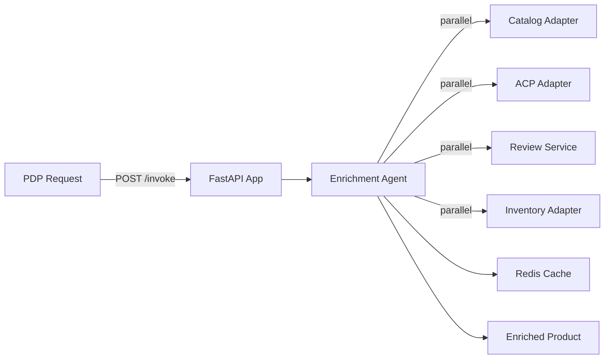

# E-commerce Product Detail Enrichment Service

**Path**: `apps/ecommerce-product-detail-enrichment/`  
**Domain**: E-commerce  
**Purpose**: Augment product pages with ACP (Additional Content Provider) metadata, reviews, and inventory

## Overview

Enriches product detail pages by aggregating data from multiple sources: catalog service for base metadata, ACP adapters for descriptions/features, review service for ratings, and inventory for real-time stock. Optimizes load time through parallel fetching and caching.

## Architecture



## Components

### 1. FastAPI Application (`main.py`)

**REST Endpoints**:
- `POST /invoke` — Invoke the enrichment agent
- `GET /health` — Health check

**MCP Tools**:
- `/product/detail` — Fetch enriched product (agent-callable)
- `/product/similar` — Get recommendations

### 2. Enrichment Agent (`agents.py`)

Orchestrates parallel data fetching:
- Base product metadata (catalog)
- ACP content (descriptions, features, sizing)
- Review aggregates (rating, count, recent reviews)
- Real-time inventory (stock level, ETA)
- Related products (similar items, frequently bought together)

**Current Status**: ✅ **IMPLEMENTED (mock adapters)** — Agent fetches catalog, ACP content, reviews, and inventory in parallel and returns enriched payloads.

### 3. Adapters

**Catalog Adapter**: Fetch base product (SKU, name, price, category)  
**ACP Adapter**: Fetch vendor-provided content (descriptions, images, videos)  
**Review Adapter**: Aggregate ratings and recent reviews  
**Inventory Adapter**: Check stock across warehouses  

**Current Status**: ✅ **IMPLEMENTED (mock adapters)** — Catalog + inventory use mock adapters; ACP and review adapters return stubbed content.

### 4. Caching Strategy

**Hot Cache (Redis)**:
- Enriched product payloads: 5-min TTL (set on read)

**Current Status**: ✅ **IMPLEMENTED** — Hot cache populated via agent; warm/cold cache not yet used.

## What's Implemented

✅ FastAPI app structure with `/invoke` and `/health` endpoints  
✅ MCP tool registration for `/product/detail` and `/product/similar`  
✅ Parallel enrichment via mock adapters (catalog, ACP content, reviews, inventory)  
✅ Redis cache configuration (5-min TTL for enriched payloads)  
✅ Basic unit tests (`tests/test_api.py`)  
✅ Dockerfile with multi-stage build  
✅ Bicep module for Azure resource provisioning  

## What's NOT Implemented

### Parallel Data Fetching

✅ **Concurrent Calls**: Catalog, ACP, reviews, and inventory are fetched in parallel.  
⚠️ **Timeout Handling**: No timeouts yet; slow adapters can delay response.  
⚠️ **Graceful Degradation**: Missing adapter data is tolerated but lacks explicit fallback strategy.  

**To Implement**:
```python
import asyncio

async def enrich_product(sku: str) -> EnrichedProduct:
    """Fetch product data in parallel."""
    # Launch all fetches concurrently
    base_task = asyncio.create_task(catalog_adapter.get_product(sku))
    acp_task = asyncio.create_task(acp_adapter.get_content(sku))
    review_task = asyncio.create_task(review_adapter.get_aggregates(sku))
    inventory_task = asyncio.create_task(inventory_adapter.get_stock(sku))
    
    # Wait with timeout
    try:
        base, acp, reviews, inventory = await asyncio.wait_for(
            asyncio.gather(base_task, acp_task, review_task, inventory_task),
            timeout=2.0  # 2s max
        )
    except asyncio.TimeoutError:
        # Fallback to partial data
        base = await base_task if base_task.done() else None
        acp = await acp_task if acp_task.done() else None
        reviews = await review_task if review_task.done() else None
        inventory = await inventory_task if inventory_task.done() else None
    
    # Merge results (handle missing data)
    return EnrichedProduct(
        sku=base.sku if base else sku,
        name=base.name if base else "Unknown",
        description=acp.description if acp else "No description",
        rating=reviews.avg_rating if reviews else None,
        stock_level=inventory.quantity if inventory else None
    )
```

### Cache Warming

❌ **No Preloading**: Cache empty on cold start, first requests slow  
❌ **No Popular Product Prefetch**: Top 100 products not pre-cached  

**To Implement**:
```python
async def warm_cache():
    """Pre-load popular products into cache."""
    # Fetch top 100 SKUs from analytics
    popular_skus = await analytics_service.get_popular_products(limit=100)
    
    # Fetch in parallel
    tasks = [enrich_product(sku) for sku in popular_skus]
    products = await asyncio.gather(*tasks, return_exceptions=True)
    
    # Store in cache
    for sku, product in zip(popular_skus, products):
        if isinstance(product, EnrichedProduct):
            await memory.hot.set(
                f"product:{sku}",
                product.model_dump_json(),
                ttl=300
            )
    
    print(f"Warmed cache with {len(products)} products")

# Run on startup
@app.on_event("startup")
async def startup():
    await warm_cache()
```

### ACP Content Fallback

❌ **No Fallback Strategy**: If ACP down, page shows "No description"  
❌ **No Cached Last-Known-Good**: Don't serve stale ACP content when unavailable  

**To Implement**:
```python
async def get_acp_content_with_fallback(sku: str) -> dict:
    """Get ACP content with fallback to cache."""
    try:
        # Try ACP adapter
        content = await acp_adapter.get_content(sku, timeout=1.0)
        
        # Store in warm cache (long TTL)
        await memory.warm.set(f"acp:{sku}", content, ttl=86400)
        
        return content
        ## Operational Playbooks

        - [Agent latency spikes](../../playbooks/playbook-agent-latency-spikes.md)
        - [Tool call failures](../../playbooks/playbook-tool-call-failures.md)
        - [Adapter latency spikes](../../playbooks/playbook-adapter-latency-spikes.md)
        - [Adapter failure](../../playbooks/playbook-adapter-failure.md)
        - [Connection pool exhaustion](../../playbooks/playbook-connection-pool-exhaustion.md)
        - [Redis OOM](../../playbooks/playbook-redis-oom.md)
        - [Blob throttling](../../playbooks/playbook-blob-throttling.md)

        ## Sample Implementation

        Implement ACP content and review adapters with real endpoints and keep the agent orchestration unchanged:

        ```python
        from holiday_peak_lib.adapters.base import BaseAdapter

        class ReviewApiAdapter(BaseAdapter):
            async def _connect_impl(self, **kwargs):
                return None

            async def _fetch_impl(self, query):
                # Call reviews API for sku
                ...

            async def _upsert_impl(self, payload):
                return payload

            async def _delete_impl(self, identifier):
                return True
        ```
    except Exception as e:
        logger.warning(f"ACP fetch failed for {sku}", exc_info=True)
        
        # Fallback to warm cache (stale is better than nothing)
        cached = await memory.warm.get(f"acp:{sku}")
        if cached:
            return cached
        
        # Final fallback: basic content
        return {
            "description": "Product description temporarily unavailable",
            "features": []
        }
```

### Review Pagination

❌ **No Review Pagination**: Endpoint returns all reviews (slow for products with 1000+ reviews)  
❌ **No Helpful Score Sorting**: Reviews not sorted by "helpful" votes  

**To Implement**:
```python
@app.get("/product/{sku}/reviews")
async def get_product_reviews(
    sku: str,
    page: int = 1,
    page_size: int = 10,
    sort: str = "helpful"  # helpful, recent, rating
):
    """Get paginated reviews."""
    reviews = await review_adapter.get_reviews(
        sku=sku,
        limit=page_size,
        offset=(page - 1) * page_size,
        sort_by=sort
    )
    
    total_count = await review_adapter.get_review_count(sku)
    
    return PaginatedResponse(
        items=reviews,
        total=total_count,
        page=page,
        page_size=page_size,
        has_next=(page * page_size) < total_count
    )
```

### Similar Products (Recommendations)

❌ **No Recommendation Engine**: `/similar` endpoint returns random products  
❌ **No ML Model**: No collaborative filtering or content-based similarity  

**To Implement**:
```python
from sklearn.metrics.pairwise import cosine_similarity

async def get_similar_products(sku: str, limit: int = 10) -> list[Product]:
    """Get similar products using content-based filtering."""
    # Fetch product features (category, brand, price range, attributes)
    product = await catalog_adapter.get_product(sku)
    
    # Fetch candidate products (same category)
    candidates = await catalog_adapter.get_products_by_category(
        product.category,
        limit=100
    )
    
    # Compute similarity (simple: overlap in attributes)
    similarities = []
    for candidate in candidates:
        if candidate.sku == sku:
            continue
        
        # Jaccard similarity on attributes
        product_attrs = set(product.attributes.keys())
        candidate_attrs = set(candidate.attributes.keys())
        similarity = len(product_attrs & candidate_attrs) / len(product_attrs | candidate_attrs)
        
        similarities.append((candidate, similarity))
    
    # Sort by similarity
    similarities.sort(key=lambda x: x[1], reverse=True)
    
    return [candidate for candidate, _ in similarities[:limit]]
```

### Real-Time Inventory Updates

❌ **No WebSocket/SSE**: Inventory updates require page refresh  
❌ **No Low-Stock Alerts**: No UI notification when stock < 5  

**To Implement WebSocket**:
```python
from fastapi import WebSocket

@app.websocket("/product/{sku}/inventory")
async def inventory_updates(websocket: WebSocket, sku: str):
    """Stream inventory updates via WebSocket."""
    await websocket.accept()
    
    try:
        while True:
            # Fetch current inventory
            inventory = await inventory_adapter.get_stock(sku)
            
            # Send to client
            await websocket.send_json({
                "sku": sku,
                "stock": inventory.quantity,
                "timestamp": datetime.utcnow().isoformat()
            })
            
            # Wait 5s before next update
            await asyncio.sleep(5)
    except WebSocketDisconnect:
        print(f"Client disconnected from inventory stream: {sku}")
```

### Observability

❌ **No Enrichment Metrics**: No tracking of which adapters fail, latency per source  
❌ **No Cache Hit Rate**: No visibility into cache effectiveness  

**Add Metrics**:
```python
@app.get("/product/{sku}")
async def get_product(sku: str):
    start = time.time()
    cache_hit = False
    
    # Try cache
    cached = await memory.hot.get(f"product:{sku}")
    if cached:
        cache_hit = True
        product = EnrichedProduct.model_validate_json(cached)
    else:
        # Fetch and enrich
        product = await enrich_product(sku)
        await memory.hot.set(f"product:{sku}", product.model_dump_json(), ttl=300)
    
    duration_ms = (time.time() - start) * 1000
    
    # Log metrics
    logger.info("product.detail", extra={
        "sku": sku,
        "duration_ms": duration_ms,
        "cache_hit": cache_hit,
        "has_acp": product.description is not None,
        "has_reviews": product.rating is not None,
        "has_inventory": product.stock_level is not None
    })
    
    return product
```

### Security

❌ **No Rate Limiting**: No throttling per user/IP  
❌ **No SKU Validation**: No check for SQL injection in SKU parameter  

**Add Validation**:
```python
from holiday_peak_lib.utils.validation import validate_sku

@app.get("/product/{sku}")
async def get_product(sku: str):
    # Validate SKU format (prevent injection)
    try:
        validate_sku(sku)
    except ValidationError:
        raise HTTPException(400, "Invalid SKU format")
    
    # Rate limit
    if not await rate_limiter.is_allowed(f"pdp:{request.client.host}", limit=60, window=timedelta(minutes=1)):
        raise HTTPException(429, "Rate limit exceeded")
    
    ...
```

## Deployment

### Local Development

```bash
# Install dependencies
pip install -e apps/ecommerce-product-detail-enrichment/src

# Set environment variables
export REDIS_HOST=localhost
export CATALOG_SERVICE_URL=http://localhost:8001
export ACP_SERVICE_URL=http://localhost:8002

# Run app
uvicorn main:app --reload --app-dir apps/ecommerce-product-detail-enrichment/src --port 8100
```

### Docker Build

```bash
cd apps/ecommerce-product-detail-enrichment
docker build -t product-detail-enrichment:latest -f src/Dockerfile .
docker run -p 8100:8100 --env-file .env product-detail-enrichment:latest
```

### Azure Deployment

```bash
# Provision resources
python .infra/cli.py deploy --service ecommerce-product-detail-enrichment --location eastus

# Deploy to AKS
helm upgrade product-detail-enrichment .kubernetes/chart \
  --set image.tag=latest \
  --set redis.host=redis.cache.windows.net
```

## Configuration

### Environment Variables

| Variable | Description | Default | Required |
|----------|-------------|---------|----------|
| `REDIS_HOST` | Redis endpoint | `localhost` | ✅ |
| `REDIS_PASSWORD` | Redis auth | - | ✅ (prod) |
| `CATALOG_SERVICE_URL` | Catalog service | - | ✅ |
| `ACP_SERVICE_URL` | ACP provider | - | ✅ |
| `REVIEW_SERVICE_URL` | Review service | - | ✅ |
| `INVENTORY_SERVICE_URL` | Inventory service | - | ✅ |
| `CACHE_TTL_PRODUCT` | Product cache TTL | `300` | ❌ |
| `CACHE_TTL_ACP` | ACP cache TTL | `3600` | ❌ |
| `PARALLEL_TIMEOUT` | Parallel fetch timeout | `2.0` | ❌ |

## Testing

### Unit Tests

```bash
pytest apps/ecommerce-product-detail-enrichment/tests -v
```

**Coverage**: ⚠️ ~35% (only API route tests; no enrichment logic tests)

### Integration Tests (NOT IMPLEMENTED)

Add tests with real Redis and mocked adapters:
```python
@pytest.mark.integration
@pytest.mark.asyncio
async def test_product_enrichment_with_cache():
    # Start Redis container
    with RedisContainer("redis:7") as redis:
        # Configure app
        app.dependency_overrides[get_redis] = lambda: redis.get_client()
        
        # First request (cache miss)
        response1 = await client.get("/product/NIKE-001")
        assert response1.json()["sku"] == "NIKE-001"
        
        # Second request (cache hit)
        response2 = await client.get("/product/NIKE-001")
        assert response2.json() == response1.json()
        
        # Verify cache hit was faster
        assert response2.elapsed < response1.elapsed
```

### Load Tests (NOT IMPLEMENTED)

Add k6 script for PDP load:
```javascript
import http from 'k6/http';
import { check } from 'k6';

export const options = {
  stages: [
    { duration: '1m', target: 100 },  // Ramp up
    { duration: '5m', target: 100 },  // Sustain
    { duration: '1m', target: 0 },    // Ramp down
  ],
};

export default function () {
  const sku = `NIKE-${Math.floor(Math.random() * 1000)}`;
  const res = http.get(`http://localhost:8100/product/${sku}`);
  
  check(res, {
    'status is 200': (r) => r.status === 200,
    'response < 500ms': (r) => r.timings.duration < 500,
  });
}
```

## Runbooks (NOT PROVIDED)

**Operational playbooks needed**:
- **Slow PDP Load**: Diagnose which adapter causing latency, scale bottleneck service
- **ACP Provider Down**: Enable fallback to cached content, contact ACP vendor
- **Cache Evictions**: Investigate Redis memory pressure, increase cache size or reduce TTL
- **Incomplete Enrichment**: Handle missing data gracefully, log adapter failures

## Monitoring (PARTIALLY CONFIGURED)

### Metrics to Track

- **PDP Latency**: P50/P95/P99 for `/product/{sku}`
- **Cache Hit Rate**: Ratio of cache hits vs misses
- **Enrichment Coverage**: % of responses with ACP, reviews, inventory
- **Adapter Latency**: P95 per adapter (catalog, ACP, review, inventory)
- **Error Rate**: 4xx/5xx responses

### Alerts (NOT CONFIGURED)

Set up Azure Monitor alerts for:
- P95 latency > 500ms (UX degradation)
- Cache hit rate < 70% (cache not effective)
- Enrichment coverage < 80% (data quality issue)

## Related Services

- **[Catalog Search](ecommerce-catalog-search.md)** — Provides SKUs for enrichment
- **[Cart Intelligence](ecommerce-cart-intelligence.md)** — Uses similar products for recommendations
- **[Inventory Health Check](../inventory/inventory-health-check.md)** — Provides real-time stock levels

## Related Lib Components

- [Adapters](../libs/adapters.md)
- [Agents](../libs/agents.md)
- [Memory](../libs/memory.md)

## Related ADRs

- [ADR-008: Three-Tier Memory](../../adrs/adr-008-three-tier-memory.md) — Caching strategy
- [ADR-006: Agent Framework](../../adrs/adr-006-agent-framework.md) — Enrichment orchestration

---

**License**: MIT + Microsoft | **Author**: Ricardo Cataldi | **Last Updated**: December 30, 2025
