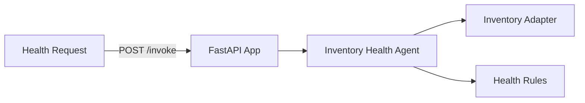

# Inventory Health Check Service

**Path**: `apps/inventory-health-check/`  
**Domain**: Inventory  
**Purpose**: Validate inventory consistency and anomalies

## Overview

Checks inventory signals for negative availability, missing warehouses, and reservation issues.

## Architecture



## Components

### 1. FastAPI Application (`main.py`)

**REST Endpoints**:
- `POST /invoke`
- `GET /health`

**MCP Tools**:
- `/inventory/health/context`
- `/inventory/health`

### 2. Inventory Health Agent (`agents.py`)

Orchestrates:
- Inventory context
- Health rule evaluation

**Current Status**: ✅ **IMPLEMENTED (mock adapters)**

### 3. Adapters

**Inventory Adapter**: SKU availability + warehouse stock  
**Analytics Adapter**: Health checks

**Current Status**: ⚠️ **PARTIAL** — Mock adapters return deterministic data

## What's Implemented

✅ MCP tool registration  
✅ Health check agent orchestration  
✅ Dockerfile + Bicep module

## What's NOT Implemented

❌ Real inventory integration  
❌ Foundry model integration for narratives  
❌ Observability dashboards for inventory quality

## Operational Playbooks

- [Agent latency spikes](../../playbooks/playbook-agent-latency-spikes.md)
- [Tool call failures](../../playbooks/playbook-tool-call-failures.md)
- [Adapter latency spikes](../../playbooks/playbook-adapter-latency-spikes.md)
- [Adapter failure](../../playbooks/playbook-adapter-failure.md)

## Sample Implementation

Replace mock inventory adapter with real implementation:

```python
from holiday_peak_lib.adapters.base import BaseAdapter
from holiday_peak_lib.adapters.inventory_adapter import InventoryConnector

class InventoryApiAdapter(BaseAdapter):
    async def _connect_impl(self, **kwargs):
        return None

    async def _fetch_impl(self, query):
        # Fetch inventory by SKU
        ...

    async def _upsert_impl(self, payload):
        return payload

    async def _delete_impl(self, identifier):
        return True

inventory = InventoryConnector(adapter=InventoryApiAdapter())
```
