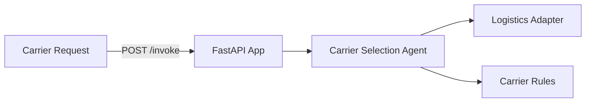

# Logistics Carrier Selection Service

**Path**: `apps/logistics-carrier-selection/`  
**Domain**: Logistics  
**Purpose**: Recommend carrier based on service level and constraints

## Overview

Selects an optimal carrier using shipment context and service-level rules.

## Architecture



## Components

### 1. FastAPI Application (`main.py`)

**REST Endpoints**:
- `POST /invoke`
- `GET /health`

**MCP Tools**:
- `/logistics/carrier/context`
- `/logistics/carrier/recommendation`

### 2. Carrier Selection Agent (`agents.py`)

Orchestrates:
- Logistics context
- Carrier recommendation rules

**Current Status**: ✅ **IMPLEMENTED (mock adapters)**

### 3. Adapters

**Logistics Adapter**: Shipment + events  
**Selector**: Carrier selection rules

**Current Status**: ⚠️ **PARTIAL** — Mock adapters return deterministic data

## What's Implemented

✅ MCP tool registration  
✅ Carrier selection agent orchestration  
✅ Dockerfile + Bicep module

## What's NOT Implemented

❌ Real carrier/OMS integrations  
❌ Foundry model integration for narratives  
❌ Observability dashboards for carrier performance

## Operational Playbooks

- [Tool call failures](../../playbooks/playbook-tool-call-failures.md)
- [Adapter failure](../../playbooks/playbook-adapter-failure.md)
- [Adapter latency spikes](../../playbooks/playbook-adapter-latency-spikes.md)
- [Adapter schema changes](../../playbooks/playbook-adapter-schema-changes.md)

## Sample Implementation

Use a real logistics adapter:

```python
from holiday_peak_lib.adapters.base import BaseAdapter
from holiday_peak_lib.adapters.logistics_adapter import LogisticsConnector

class CarrierApiAdapter(BaseAdapter):
    async def _connect_impl(self, **kwargs):
        return None

    async def _fetch_impl(self, query):
        # Query carrier API by tracking_id
        ...

    async def _upsert_impl(self, payload):
        return payload

    async def _delete_impl(self, identifier):
        return True

logistics = LogisticsConnector(adapter=CarrierApiAdapter())
```
