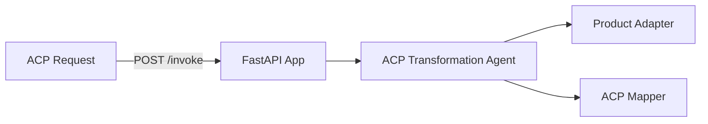

# Product Management ACP Transformation Service

**Path**: `apps/product-management-acp-transformation/`  
**Domain**: Product Management  
**Purpose**: Transform catalog products into ACP-compatible payloads

## Overview

Maps catalog products to ACP product feed fields to standardize partner ingestion.

## Architecture



## Components

### 1. FastAPI Application (`main.py`)

**REST Endpoints**:
- `POST /invoke`
- `GET /health`

**MCP Tools**:
- `/product/acp/transform`
- `/product/acp/product`

### 2. ACP Transformation Agent (`agents.py`)

Orchestrates:
- Product retrieval
- ACP mapping

**Current Status**: ✅ **IMPLEMENTED (mock adapters)**

### 3. Adapters

**Product Adapter**: Catalog product retrieval  
**Mapper**: ACP field mapping

**Current Status**: ⚠️ **PARTIAL** — Mock adapters return deterministic data

## What's Implemented

✅ MCP tool registration  
✅ ACP transformation agent orchestration  
✅ Dockerfile + Bicep module

## What's NOT Implemented

❌ Real product integrations  
❌ Foundry model integration for narrative validation  
❌ Observability dashboards for ACP feed quality

## Operational Playbooks

- [Tool call failures](../../playbooks/playbook-tool-call-failures.md)
- [Adapter failure](../../playbooks/playbook-adapter-failure.md)
- [Adapter latency spikes](../../playbooks/playbook-adapter-latency-spikes.md)
- [Agent latency spikes](../../playbooks/playbook-agent-latency-spikes.md)

## Sample Implementation

Replace mock product adapter with real catalog client:

```python
from holiday_peak_lib.adapters.base import BaseAdapter
from holiday_peak_lib.adapters.product_adapter import ProductConnector

class CatalogApiAdapter(BaseAdapter):
    async def _connect_impl(self, **kwargs):
        return None

    async def _fetch_impl(self, query):
        # Fetch product by SKU
        ...

    async def _upsert_impl(self, payload):
        return payload

    async def _delete_impl(self, identifier):
        return True

products = ProductConnector(adapter=CatalogApiAdapter())
```
