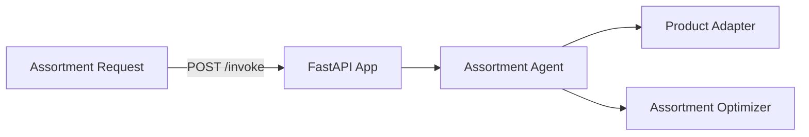

# Product Management Assortment Optimization Service

**Path**: `apps/product-management-assortment-optimization/`  
**Domain**: Product Management  
**Purpose**: Rank products and recommend assortment composition

## Overview

Scores products and recommends an optimal assortment set based on heuristic scoring.

## Architecture



## Components

### 1. FastAPI Application (`main.py`)

**REST Endpoints**:
- `POST /invoke`
- `GET /health`

**MCP Tools**:
- `/assortment/score`
- `/assortment/recommendations`

### 2. Assortment Optimization Agent (`agents.py`)

Orchestrates:
- Product retrieval
- Assortment scoring and recommendations

**Current Status**: ✅ **IMPLEMENTED (mock adapters)**

### 3. Adapters

**Product Adapter**: Catalog product retrieval  
**Optimizer**: Assortment scoring heuristics

**Current Status**: ⚠️ **PARTIAL** — Mock adapters return deterministic data

## What's Implemented

✅ MCP tool registration  
✅ Assortment optimization agent orchestration  
✅ Dockerfile + Bicep module

## What's NOT Implemented

❌ Real product integrations  
❌ Foundry model integration for decision support  
❌ Observability dashboards for assortment performance

## Operational Playbooks

- [Tool call failures](../../playbooks/playbook-tool-call-failures.md)
- [Adapter failure](../../playbooks/playbook-adapter-failure.md)
- [Adapter latency spikes](../../playbooks/playbook-adapter-latency-spikes.md)
- [Agent latency spikes](../../playbooks/playbook-agent-latency-spikes.md)

## Sample Implementation

Use a real product catalog adapter:

```python
from holiday_peak_lib.adapters.base import BaseAdapter
from holiday_peak_lib.adapters.product_adapter import ProductConnector

class CatalogApiAdapter(BaseAdapter):
    async def _connect_impl(self, **kwargs):
        return None

    async def _fetch_impl(self, query):
        # Retrieve products by SKU list
        ...

    async def _upsert_impl(self, payload):
        return payload

    async def _delete_impl(self, identifier):
        return True

products = ProductConnector(adapter=CatalogApiAdapter())
```
