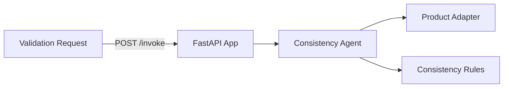

# Product Management Consistency Validation Service

**Path**: `apps/product-management-consistency-validation/`  
**Domain**: Product Management  
**Purpose**: Validate catalog completeness and consistency

## Overview

Checks product data for missing fields, invalid pricing, and incomplete media.

## Architecture



## Components

### 1. FastAPI Application (`main.py`)

**REST Endpoints**:
- `POST /invoke`
- `GET /health`

**MCP Tools**:
- `/product/consistency/check`
- `/product/consistency/product`

### 2. Consistency Agent (`agents.py`)

Orchestrates:
- Product retrieval
- Consistency validation

**Current Status**: ✅ **IMPLEMENTED (mock adapters)**

### 3. Adapters

**Product Adapter**: Catalog product retrieval  
**Validator**: Completeness rules

**Current Status**: ⚠️ **PARTIAL** — Mock adapters return deterministic data

## What's Implemented

✅ MCP tool registration  
✅ Consistency validation agent orchestration  
✅ Dockerfile + Bicep module

## What's NOT Implemented

❌ Real product integrations  
❌ Foundry model integration for remediation guidance  
❌ Observability dashboards for data quality

## Operational Playbooks

- [Tool call failures](../../playbooks/playbook-tool-call-failures.md)
- [Adapter failure](../../playbooks/playbook-adapter-failure.md)
- [Adapter latency spikes](../../playbooks/playbook-adapter-latency-spikes.md)
- [Agent latency spikes](../../playbooks/playbook-agent-latency-spikes.md)

## Sample Implementation

Replace mock product adapter with real catalog client:

```python
from holiday_peak_lib.adapters.base import BaseAdapter
from holiday_peak_lib.adapters.product_adapter import ProductConnector

class CatalogApiAdapter(BaseAdapter):
    async def _connect_impl(self, **kwargs):
        return None

    async def _fetch_impl(self, query):
        # Fetch product by SKU
        ...

    async def _upsert_impl(self, payload):
        return payload

    async def _delete_impl(self, identifier):
        return True

products = ProductConnector(adapter=CatalogApiAdapter())
```
