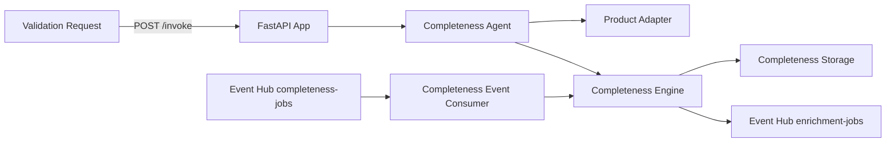

# Product Management Consistency Validation Service

**Path**: `apps/product-management-consistency-validation/`  
**Domain**: Product Management  
**Purpose**: Evaluate schema-driven catalog completeness and publish enrichment triggers for missing enrichable attributes

## Overview

Implements a schema-driven Completeness Engine that:
- evaluates products against category field definitions,
- computes weighted completeness scores,
- stores gap reports,
- triggers enrichment workflows for enrichable gaps below threshold.

## Architecture


```mermaid
graph LR
    Client[Validation Request] -->|POST /invoke| API[FastAPI App]
    API --> Agent[Completeness Agent]
    Agent --> Products[Product Adapter]
    Agent --> Engine[Completeness Engine]
    EH[Event Hub completeness-jobs] --> Consumer[Completeness Event Consumer]
    Consumer --> Engine[Completeness Engine]
    Engine --> Cosmos[Completeness Storage]
    Engine --> EH2[Event Hub enrichment-jobs]
```

## Components

### 1. FastAPI Application (`main.py`)

**REST Endpoints**:
- `POST /invoke`
- `GET /health`

**MCP Tools**:
- `/product/completeness/evaluate`

### 2. Completeness Agent (`agents.py`)

Orchestrates:
- Product retrieval
- Schema-driven completeness evaluation (`/invoke` flow)

### 3. Completeness Engine (`completeness_engine.py`)

Provides:
- `CategorySchema`, `FieldDefinition`, `FieldGap`, `GapReport`
- weighted completeness score computation
- nested dot-path field evaluation
- enrichable gap extraction

### 4. Completeness Event Consumer (`event_consumer.py`)

Consumes `completeness-jobs` and executes:
- load product
- load category schema
- evaluate completeness
- persist gap report
- publish `enrichment_requested` to `enrichment-jobs` when score is below `COMPLETENESS_THRESHOLD`

**Current Status**: ✅ **IMPLEMENTED**

### 5. Adapters

**Product Adapter**: Catalog product retrieval  
**Completeness Storage**: Cosmos-backed schema/gap-report adapter with in-memory fallback

**Current Status**: ✅ **IMPLEMENTED** — Completeness engine pipeline is active; storage supports local in-memory fallback for tests/dev

## What's Implemented

✅ MCP tool registration  
✅ Single-path completeness evaluation orchestration  
✅ Schema-driven completeness scoring pipeline  
✅ Completeness Event Hub consumer (`completeness-jobs`)  
✅ Enrichment trigger publishing (`enrichment-jobs`)  
✅ Cosmos/in-memory completeness storage adapter  
✅ Unit + integration tests for completeness engine and event flow  
✅ Dockerfile + Bicep module

## What's NOT Implemented

❌ Dedicated remediation model orchestration (currently only trigger publication)  
❌ Dedicated observability dashboards for completeness quality trends

## Operational Playbooks

- [Tool call failures](../../playbooks/playbook-tool-call-failures.md)
- [Adapter failure](../../playbooks/playbook-adapter-failure.md)
- [Adapter latency spikes](../../playbooks/playbook-adapter-latency-spikes.md)
- [Agent latency spikes](../../playbooks/playbook-agent-latency-spikes.md)

## Sample Implementation

Replace mock product adapter with real catalog client:

```python
from holiday_peak_lib.adapters.base import BaseAdapter
from holiday_peak_lib.adapters.product_adapter import ProductConnector

class CatalogApiAdapter(BaseAdapter):
    async def _connect_impl(self, **kwargs):
        return None

    async def _fetch_impl(self, query):
        # Fetch product by SKU
        ...

    async def _upsert_impl(self, payload):
        return payload

    async def _delete_impl(self, identifier):
        return True

products = ProductConnector(adapter=CatalogApiAdapter())
```
