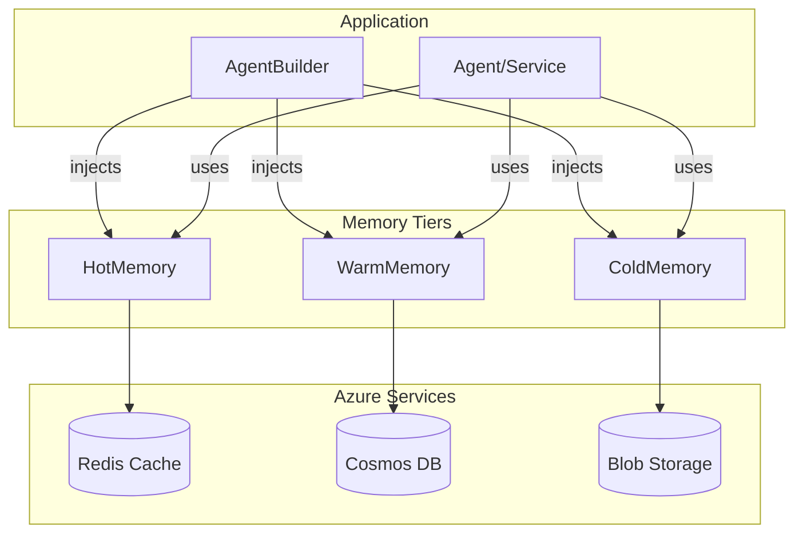

# Memory Component

**Path**: `lib/src/holiday_peak_lib/agents/memory/`  
**Design Pattern**: Tiered memory with explicit injection  
**Purpose**: Three-tier memory architecture (hot/warm/cold) injected into agents via `AgentBuilder`

## Overview

Provides a unified memory abstraction for agents to store and retrieve conversation context, user profiles, and operational state across three performance tiers:

- **Hot (Redis)**: <50ms latency for real-time session state and frequently accessed data
- **Warm (Cosmos DB)**: 100-500ms latency for user profiles, search history, and structured metadata
- **Cold (Blob Storage)**: Seconds latency for product images, catalog snapshots, and archival data

Applications inject only the tiers they need, avoiding unnecessary connections and costs.

## Architecture



## Configuration and Usage

Memory tiers are constructed explicitly and injected into agents via `AgentBuilder` or `build_service_app`.

```python
from holiday_peak_lib.agents.memory import HotMemory, WarmMemory, ColdMemory
from holiday_peak_lib.config import MemorySettings

settings = MemorySettings()

hot = HotMemory(settings.redis_url)
warm = WarmMemory(settings.cosmos_account_uri, settings.cosmos_database, settings.cosmos_container)
cold = ColdMemory(settings.blob_account_url, settings.blob_container)
```

**Env vars** (via `MemorySettings`):
- `REDIS_URL`
- `COSMOS_ACCOUNT_URI`
- `COSMOS_DATABASE`
- `COSMOS_CONTAINER`
- `BLOB_ACCOUNT_URL`
- `BLOB_CONTAINER`

## Tier Implementations

### HotMemory (Redis)

Implements `connect`, `get`, and `set` with TTL support using `redis.asyncio`.

### WarmMemory (Cosmos DB)

Implements `connect`, `upsert`, and `read` using `azure.cosmos.aio.CosmosClient` and `DefaultAzureCredential`.

### ColdMemory (Blob Storage)

Implements `connect`, `upload_text`, and `download_text` using `azure.storage.blob.aio.BlobServiceClient`.
        ...
```

## What's Implemented

✅ **HotMemory**: Redis-backed hot tier with `connect`, `get`, and `set` (TTL supported)  
✅ **WarmMemory**: Cosmos DB-backed warm tier with `connect`, `upsert`, and `read`  
✅ **ColdMemory**: Blob-backed cold tier with `connect`, `upload_text`, and `download_text`  
✅ **MemorySettings**: Environment-driven configuration for tier endpoints  

## What's NOT Implemented

❌ **Unified MemoryClient**: No single client that multiplexes tiers  
❌ **MemoryBuilder**: No fluent builder API in the current codebase  

**To Implement Redis**:
```python
from redis.asyncio import Redis

class RedisHotMemory:
    def __init__(self, host: str, port: int = 6380, password: Optional[str] = None, ssl: bool = True):
        self.client = Redis(
            host=host,
            port=port,
            password=password,
            ssl=ssl,
            decode_responses=True
        )
    
    async def get(self, key: str) -> Optional[str]:
        return await self.client.get(key)
    
    async def set(self, key: str, value: str, ttl: Optional[int] = None) -> None:
        if ttl:
            await self.client.setex(key, ttl, value)
        else:
            await self.client.set(key, value)
    
    async def delete(self, key: str) -> None:
        await self.client.delete(key)
    
    async def exists(self, key: str) -> bool:
        return await self.client.exists(key) > 0
```

**Cosmos DB / Blob Storage**: Implemented via `WarmMemory` and `ColdMemory` classes with Azure SDK clients and Entra ID credentials.

### Cascading Reads/Writes

❌ **No Automatic Promotion**: Hot miss doesn't fallback to warm/cold  
❌ **No Write-Through**: Setting in warm doesn't also update hot cache  
❌ **No Tiered Eviction**: No logic to demote cold data from hot→warm→cold  

No cascading reads/writes or automatic tier promotion/demotion are implemented by default.
    
    # Try warm
    if self.warm:
        doc = await self.warm.get(key)
        if doc:
            value = doc.get("value")
            # Promote to hot for future access
            if self.hot and value:
                await self.hot.set(key, value, ttl=300)  # 5-min cache
            return value
    
    # Try cold
    if self.cold:
        blob = await self.cold.get(key)
        if blob:
            value = blob.decode("utf-8")
            # Promote to hot+warm
            if self.hot:
                await self.hot.set(key, value, ttl=300)
            if self.warm:
                await self.warm.set(key, {"value": value})
            return value
    
    return None
```

### Compression

❌ **No Compression**: Blob storage stores raw bytes; no gzip for large objects  
❌ **No Automatic Detection**: Client doesn't compress if value > 1MB  

**Add Compression**:
```python
import gzip

class CompressedBlobMemory(BlobColdMemory):
    async def set(self, key: str, value: bytes, content_type: str = "application/octet-stream") -> None:
        # Compress if > 1MB
        if len(value) > 1_000_000:
            value = gzip.compress(value)
            key = f"{key}.gz"
        await super().set(key, value, content_type)
    
    async def get(self, key: str) -> Optional[bytes]:
        # Try with .gz suffix
        blob = await super().get(f"{key}.gz")
        if blob:
            return gzip.decompress(blob)
        
        # Fallback to uncompressed
        return await super().get(key)
```

### Batch Operations

❌ **No Multi-Get**: No `mget([key1, key2, key3])` for parallel reads  
❌ **No Multi-Set**: No `mset({key1: val1, key2: val2})` for atomic writes  

**Add Batch Support**:
```python
async def mget(self, keys: list[str], tier: MemoryTier) -> dict[str, Optional[str]]:
    """Get multiple keys in parallel."""
    results = await asyncio.gather(*[self.get(k, tier) for k in keys])
    return dict(zip(keys, results))

async def mset(self, items: dict[str, str], tier: MemoryTier, ttl: Optional[int] = None) -> None:
    """Set multiple keys in parallel."""
    await asyncio.gather(*[self.set(k, v, tier, ttl) for k, v in items.items()])
```

### Monitoring

❌ **No Hit/Miss Metrics**: No tracking of cache hit rate per tier  
❌ **No Latency Tracking**: No P95/P99 per tier  
❌ **No Connection Pool Stats**: No visibility into Redis/Cosmos connection health  

**Add Observability**:
```python
import time
from opencensus.ext.azure.log_exporter import AzureLogHandler

class ObservableMemoryClient(MemoryClient):
    async def get(self, key: str, tier: MemoryTier) -> Optional[str]:
        start = time.time()
        try:
            value = await super().get(key, tier)
            duration_ms = (time.time() - start) * 1000
            
            logger.info("memory.get", extra={
                "tier": tier.name,
                "hit": value is not None,
                "duration_ms": duration_ms
            })
            return value
        except Exception as e:
            logger.error("memory.get.error", exc_info=True, extra={"tier": tier.name})
            raise
```

### Connection Pooling

❌ **No Pool Limits**: Redis client doesn't configure `max_connections`  
❌ **No Retry Logic**: Cosmos calls don't retry on transient 429/503  

**Add Connection Pool**:
```python
from redis.asyncio import Redis, ConnectionPool

pool = ConnectionPool(
    host="redis.cache.windows.net",
    port=6380,
    password="***",
    max_connections=50,  # Limit concurrent connections
    socket_timeout=5.0
)

redis_client = Redis(connection_pool=pool, decode_responses=True)
```

## Extension Guide

### Adding a Custom Tier

To add a fourth tier (e.g., **Warm-Plus** with Azure Table Storage):

**Step 1**: Define protocol
```python
class WarmPlusMemory(Protocol):
    async def get(self, partition_key: str, row_key: str) -> Optional[dict]:
        ...
    
    async def set(self, partition_key: str, row_key: str, entity: dict) -> None:
        ...
```

**Step 2**: Implement client
```python
from azure.data.tables.aio import TableServiceClient

class TableWarmPlusMemory:
    def __init__(self, account_url: str, table_name: str, credential):
        self.service = TableServiceClient(account_url=account_url, credential=credential)
        self.table = self.service.get_table_client(table_name)
    
    async def get(self, partition_key: str, row_key: str) -> Optional[dict]:
        try:
            entity = await self.table.get_entity(partition_key, row_key)
            return dict(entity)
        except Exception:
            return None
```

**Step 3**: Add to builder
```python
class MemoryBuilder:
    def with_warm_plus(self, account_url: str, table: str, credential) -> "MemoryBuilder":
        self._warm_plus = TableWarmPlusMemory(account_url, table, credential)
        return self
    
    def build(self) -> MemoryClient:
        return MemoryClient(
            hot=self._hot,
            warm=self._warm,
            warm_plus=self._warm_plus,
            cold=self._cold
        )
```

### Customizing TTL Per Use Case

Default TTLs may not fit all scenarios. Expose TTL configuration:

```python
class MemoryConfig:
    """TTL presets for different use cases."""
    SESSION_TTL = 300  # 5 minutes (hot)
    USER_PROFILE_TTL = 86400  # 1 day (warm)
    SEARCH_HISTORY_TTL = 2592000  # 30 days (warm)
    CATALOG_SNAPSHOT_TTL = None  # No expiration (cold)

# Usage
await memory.set(
    f"session:{session_id}",
    session_data,
    tier=MemoryTier.HOT,
    ttl=MemoryConfig.SESSION_TTL
)
```

### Using Managed Identity

Avoid keys in code; use `DefaultAzureCredential`:

```python
from azure.identity.aio import DefaultAzureCredential

credential = DefaultAzureCredential()

memory = (
    MemoryBuilder()
    .with_warm(
        cosmos_endpoint="https://account.documents.azure.com",
        credential=credential  # No key
    )
    .with_cold(
        blob_account_url="https://storage.blob.core.windows.net",
        credential=credential
    )
    .build()
)
```

## Security Considerations

### Current State

⚠️ **Partial Security**:
- ✅ Redis supports password auth (enabled in builder)
- ✅ Cosmos/Blob accept `DefaultAzureCredential`
- ❌ **No Key Vault**: Connection strings in `.env` files
- ❌ **No Secret Rotation**: Static passwords; no auto-refresh
- ❌ **No Encryption at Rest**: Assumes Azure-managed encryption (not customer-managed keys)

### Recommendations

**Use Key Vault for Secrets**:
```python
from azure.keyvault.secrets.aio import SecretClient
from azure.identity.aio import DefaultAzureCredential

credential = DefaultAzureCredential()
kv_client = SecretClient(vault_url="https://vault.vault.azure.net", credential=credential)

redis_password = await kv_client.get_secret("redis-password")
cosmos_key = await kv_client.get_secret("cosmos-key")

memory = (
    MemoryBuilder()
    .with_hot(redis_host="...", password=redis_password.value)
    .with_warm(cosmos_endpoint="...", key=cosmos_key.value)
    .build()
)
```

**Enable Customer-Managed Keys (CMK)**:
- Cosmos: Configure with Key Vault key for encryption at rest
- Blob: Use CMK for BYOK (Bring Your Own Key)

**Least Privilege Access**:
- Redis: Use RBAC instead of password (Azure Cache for Redis supports Entra ID)
- Cosmos: Assign `Cosmos DB Data Reader/Writer` role, not account key
- Blob: Assign `Storage Blob Data Contributor`, not account key

## Observability

### Current State

⚠️ **Basic Logging Only**:
- ✅ Python `logging` configured for errors
- ❌ **No Structured Logs**: No JSON format with tier/key/latency
- ❌ **No Distributed Tracing**: No correlation IDs across tiers
- ❌ **No Metrics Dashboard**: No Azure Monitor dashboard for hit rates
- ❌ **No Alerts**: No alerts for cache misses > 50% or latency > SLA

### Recommendations

**Add Azure Monitor Integration**:
```python
from opencensus.ext.azure import metrics_exporter
from opencensus.stats import aggregation, measure, view

# Define metrics
hit_rate = measure.MeasureFloat("memory/hit_rate", "Cache hit rate", "%")
latency = measure.MeasureFloat("memory/latency", "Operation latency", "ms")

# Export to Azure Monitor
exporter = metrics_exporter.new_metrics_exporter(
    connection_string=os.getenv("APPLICATIONINSIGHTS_CONNECTION_STRING")
)

# Track hit rate
view_manager.register_view(view.View(
    "memory_hit_rate",
    "Cache hit rate per tier",
    ["tier"],
    hit_rate,
    aggregation.LastValueAggregation()
))
```

**Add Distributed Tracing**:
```python
from opentelemetry import trace
from opentelemetry.sdk.trace import TracerProvider
from opentelemetry.sdk.trace.export import BatchSpanProcessor
from azure.monitor.opentelemetry.exporter import AzureMonitorTraceExporter

tracer = trace.get_tracer(__name__)

class TracedMemoryClient(MemoryClient):
    async def get(self, key: str, tier: MemoryTier) -> Optional[str]:
        with tracer.start_as_current_span("memory.get") as span:
            span.set_attribute("tier", tier.name)
            span.set_attribute("key", key)
            
            value = await super().get(key, tier)
            span.set_attribute("hit", value is not None)
            return value
```

**Create Azure Monitor Dashboard**:
- Widget 1: Cache hit rate (last 24h) per tier
- Widget 2: P95 latency per tier
- Widget 3: Connection failures per service
- Widget 4: Redis memory usage (MB)

## Testing

### Current State

⚠️ **Unit Tests Only**:
- ✅ Builder tests (`test_memory_builder.py`): ~15 tests for fluent API
- ✅ Mock client tests (`test_memory_client.py`): ~20 tests for get/set/delete
- ❌ **No Integration Tests**: No tests with real Redis/Cosmos/Blob
- ❌ **No Load Tests**: No validation of 10k+ ops/sec throughput
- ❌ **No Failover Tests**: No chaos testing for Redis failover

### Recommendations

**Add Integration Tests**:
```python
import pytest
from testcontainers.redis import RedisContainer

@pytest.mark.integration
@pytest.mark.asyncio
async def test_redis_hot_memory_integration():
    # Start Redis in Docker
    with RedisContainer("redis:7") as redis:
        host, port = redis.get_connection_url().split(":")[-2:]
        
        memory = MemoryBuilder().with_hot(host=host, port=int(port)).build()
        
        # Test set/get
        await memory.set("test-key", "test-value", tier=MemoryTier.HOT)
        value = await memory.get("test-key", tier=MemoryTier.HOT)
        
        assert value == "test-value"
```

**Add Load Tests**:
```python
import asyncio
import time

async def load_test_hot_tier():
    """Test 10k reads/writes per second."""
    memory = MemoryBuilder().with_hot(host="localhost").build()
    
    start = time.time()
    tasks = []
    for i in range(10_000):
        tasks.append(memory.set(f"key-{i}", f"value-{i}", tier=MemoryTier.HOT))
    await asyncio.gather(*tasks)
    
    duration = time.time() - start
    print(f"10k writes: {duration:.2f}s ({10_000/duration:.0f} ops/sec)")
```

**Add Failover Tests**:
```bash
# Simulate Redis node failure
kubectl delete pod redis-master-0 -n memory

# Verify app reconnects and continues
pytest tests/integration/test_redis_failover.py
```

## Performance Tuning

### Current State

⚠️ **No Tuning Done**:
- ❌ **No Connection Pooling**: Each request creates new Redis connection
- ❌ **No Pipelining**: Redis commands sent individually (high latency)
- ❌ **No Compression**: Large values (>1MB) stored uncompressed
- ❌ **No Prefetching**: Warm tier not pre-loaded into hot tier

### Recommendations

**Enable Redis Pipelining**:
```python
async def mset_pipelined(self, items: dict[str, str], ttl: Optional[int] = None) -> None:
    """Set multiple keys in one round-trip."""
    pipe = self.client.pipeline()
    for key, value in items.items():
        if ttl:
            pipe.setex(key, ttl, value)
        else:
            pipe.set(key, value)
    await pipe.execute()
```

**Prefetch Hot Data**:
```python
async def warm_hot_cache(self, keys: list[str]) -> None:
    """Pre-load warm tier data into hot tier."""
    # Fetch from Cosmos in parallel
    docs = await asyncio.gather(*[self.warm.get(k) for k in keys])
    
    # Write to Redis pipeline
    hot_items = {k: doc["value"] for k, doc in zip(keys, docs) if doc}
    await self.hot.mset_pipelined(hot_items, ttl=300)
```

**Optimize Cosmos Queries**:
```python
# Use partition key in all queries
await memory.warm.query({"partition_key": user_id}, limit=100)

# Avoid cross-partition queries (slow + expensive RUs)
# BAD: SELECT * FROM c WHERE c.status = 'active'  (scans all partitions)
# GOOD: SELECT * FROM c WHERE c.user_id = 'user-123' AND c.status = 'active'
```

**Monitor RU Consumption**:
```bash
# Check Cosmos DB RU usage
az cosmosdb sql container show \
  --resource-group holiday-peak-hub \
  --account-name memory-cosmos \
  --database-name memory \
  --name user-profiles \
  --query "resource.provisionedThroughput"
```

## Runbooks (NOT PROVIDED)

**Operational playbooks needed**:

### Redis OOM (Out of Memory)
**Symptom**: Redis evictions, cache misses spike  
**Diagnosis**: Check `INFO memory` for `used_memory_peak`, `evicted_keys`  
**Remediation**: Scale Redis to higher tier or enable eviction policy (`allkeys-lru`)

### Cosmos High RU Consumption
**Symptom**: 429 rate limit errors, high latency  
**Diagnosis**: Check Azure Portal metrics for RU/s usage, identify hot partition  
**Remediation**: Scale container RUs, optimize queries to use partition key, implement retry with backoff

### Blob Storage Throttling
**Symptom**: 503 errors on blob uploads, slow cold tier reads  
**Diagnosis**: Check storage account metrics for throttled requests  
**Remediation**: Increase storage account limits, use CDN for frequently accessed blobs, implement exponential backoff

### Connection Pool Exhaustion
**Symptom**: Timeouts on get/set, "too many connections" errors  
**Diagnosis**: Check Redis `INFO clients` for `connected_clients`, compare to pool limit  
**Remediation**: Increase `max_connections` in pool config, audit app for connection leaks

### TTL Not Expiring
**Symptom**: Memory growth, stale data served  
**Diagnosis**: Check Cosmos TTL property enabled, Redis TTL with `TTL key`  
**Remediation**: Enable TTL on Cosmos container, verify Redis TTL set correctly in code

## Configuration

### Environment Variables

| Variable | Description | Default | Required |
|----------|-------------|---------|----------|
| `REDIS_HOST` | Redis endpoint | `localhost` | ✅ |
| `REDIS_PORT` | Redis port | `6379` (6380 for Azure) | ❌ |
| `REDIS_PASSWORD` | Redis auth | - | ✅ (prod) |
| `REDIS_SSL` | Use TLS | `true` | ❌ |
| `COSMOS_ENDPOINT` | Cosmos DB URI | - | ✅ |
| `COSMOS_KEY` | Cosmos DB key | - | ✅ (dev) |
| `COSMOS_DATABASE` | Database name | `memory` | ✅ |
| `COSMOS_CONTAINER` | Container name | `state` | ✅ |
| `BLOB_ACCOUNT_URL` | Storage account | - | ✅ |
| `BLOB_CONTAINER` | Container name | `memory` | ✅ |

**Prod Note**: Use Managed Identity instead of keys for Cosmos/Blob.

## Related Components

- [Agents](agents.md) — Primary consumer of memory for conversation context
- [Orchestration](orchestration.md) — Uses memory for SAGA state persistence
- [Adapters](adapters.md) — Can cache adapter responses in hot tier

## Related ADRs

- [ADR-002: Azure Services](../../adrs/adr-002-azure-services.md) — Rationale for Redis/Cosmos/Blob
- [ADR-004: Builder Pattern](../../adrs/adr-004-builder-pattern.md) — Memory tier configuration
- [ADR-008: Three-Tier Memory](../../adrs/adr-008-three-tier-memory.md) — Architecture and SLAs

---

**License**: MIT + Microsoft | **Author**: Ricardo Cataldi | **Last Updated**: December 30, 2025
