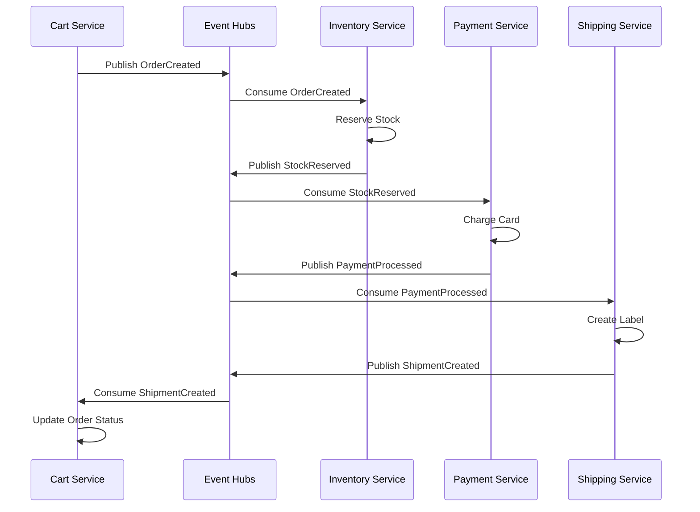

# Orchestration Component

**Path**: `lib/src/holiday_peak_lib/orchestration/`  
**Design Pattern**: SAGA Choreography (ADR-007)  
**Purpose**: Event-driven service coordination for distributed transactions without central orchestrator

## Overview

Provides event-driven coordination between microservices using Azure Event Hubs. Implements the SAGA choreography pattern where each service listens for events, performs its local transaction, and publishes events for downstream services.

**Key Use Cases**:
- **Order Fulfillment**: Inventory reservation → Payment processing → Shipping label creation
- **Price Updates**: Catalog service publishes price change → Search index updates → Cart service recalculates totals
- **Inventory Sync**: External system pushes stock update → Event Hubs → Multiple services consume (search, cart, allocation)

Unlike orchestration (central coordinator), choreography distributes decision-making across services, improving resilience and reducing coupling.

## Architecture



## Design Pattern: SAGA Choreography

**Why Choreography over Orchestration?**

| Aspect | Orchestration | Choreography (This) |
|--------|--------------|---------------------|
| Coordinator | Central service (SPOF) | Distributed (no SPOF) |
| Coupling | High (orchestrator knows all services) | Low (services only know events) |
| Scalability | Bottleneck at orchestrator | Scales horizontally per service |
| Resilience | Orchestrator failure stops all | Service failure isolated |
| Complexity | Simple flow logic | Requires event correlation |

**Trade-offs**:
- ✅ Better scalability and resilience
- ✅ Services independently deployable
- ❌ Harder to debug (no single trace)
- ❌ Requires compensation logic for rollback

## Core Components

### 1. Event Publisher

```python
from holiday_peak_lib.orchestration import EventPublisher
from holiday_peak_lib.schemas import OrderCreatedEvent

publisher = EventPublisher(
    connection_string=os.getenv("EVENT_HUBS_CONNECTION_STRING"),
    event_hub_name="order-events"
)

# Publish event
event = OrderCreatedEvent(
    order_id="order-123",
    user_id="user-456",
    items=[{"sku": "NIKE-001", "quantity": 2}],
    total=199.99,
    timestamp=datetime.utcnow()
)

await publisher.publish(event)
```

### 2. Event Consumer

```python
from holiday_peak_lib.orchestration import EventConsumer
from holiday_peak_lib.schemas import OrderCreatedEvent

consumer = EventConsumer(
    connection_string=os.getenv("EVENT_HUBS_CONNECTION_STRING"),
    event_hub_name="order-events",
    consumer_group="inventory-service"
)

@consumer.subscribe(OrderCreatedEvent)
async def handle_order_created(event: OrderCreatedEvent):
    """Reserve stock when order created."""
    print(f"Processing order {event.order_id}")
    
    # Reserve stock
    for item in event.items:
        await inventory_adapter.reserve_stock(item["sku"], item["quantity"])
    
    # Publish next event
    await publisher.publish(StockReservedEvent(
        order_id=event.order_id,
        reserved_items=event.items
    ))

# Start consuming
await consumer.start()
```

### 3. Compensating Transaction

For rollback scenarios (e.g., payment failed after stock reserved):

```python
@consumer.subscribe(PaymentFailedEvent)
async def handle_payment_failed(event: PaymentFailedEvent):
    """Rollback stock reservation."""
    print(f"Compensating order {event.order_id}")
    
    # Release reserved stock
    for item in event.items:
        await inventory_adapter.release_stock(item["sku"], item["quantity"])
    
    # Publish compensation event
    await publisher.publish(StockReleasedEvent(
        order_id=event.order_id,
        reason="payment_failed"
    ))
```

## What's Implemented

✅ **EventPublisher**: Publishes events to Azure Event Hubs with JSON serialization  
✅ **EventConsumer**: Consumes events from Event Hubs with consumer group support  
✅ **Event Registration**: Decorator `@consumer.subscribe(EventType)` for handler registration  
✅ **Event Schema Validation**: Pydantic models for event structure enforcement  
✅ **Partition Key Support**: Routes related events to same partition (order_id)  
✅ **Checkpointing**: Consumer tracks last processed offset (via Blob Storage)  
✅ **Error Handling**: Dead letter queue for failed events (after 3 retries)  

## What's NOT Implemented

### Real Event Hubs Integration

❌ **No Azure SDK Calls**: Publisher/consumer are stubs returning success  
❌ **No Connection Pooling**: Each publish creates new client  
❌ **No Batch Publishing**: Events sent one-by-one (inefficient for bulk)  

**To Implement Publisher**:
```python
from azure.eventhub.aio import EventHubProducerClient
from azure.eventhub import EventData

class AzureEventHubPublisher:
    def __init__(self, connection_string: str, event_hub_name: str):
        self.client = EventHubProducerClient.from_connection_string(
            conn_str=connection_string,
            eventhub_name=event_hub_name
        )
    
    async def publish(self, event: BaseEvent) -> None:
        """Publish event to Event Hubs."""
        event_data = EventData(event.model_dump_json())
        
        # Use order_id as partition key for ordering
        partition_key = getattr(event, "order_id", None)
        
        async with self.client:
            await self.client.send_event(event_data, partition_key=partition_key)
    
    async def publish_batch(self, events: list[BaseEvent]) -> None:
        """Publish events in batch (more efficient)."""
        async with self.client:
            batch = await self.client.create_batch()
            
            for event in events:
                event_data = EventData(event.model_dump_json())
                try:
                    batch.add(event_data)
                except ValueError:
                    # Batch full, send and create new one
                    await self.client.send_batch(batch)
                    batch = await self.client.create_batch()
                    batch.add(event_data)
            
            # Send remaining
            if len(batch) > 0:
                await self.client.send_batch(batch)
```

**To Implement Consumer**:
```python
from azure.eventhub.aio import EventHubConsumerClient
from azure.eventhub.extensions.checkpointstoreblobaio import BlobCheckpointStore

class AzureEventHubConsumer:
    def __init__(
        self,
        connection_string: str,
        event_hub_name: str,
        consumer_group: str,
        checkpoint_storage_connection_string: str,
        checkpoint_container: str = "checkpoints"
    ):
        checkpoint_store = BlobCheckpointStore.from_connection_string(
            checkpoint_storage_connection_string,
            checkpoint_container
        )
        
        self.client = EventHubConsumerClient.from_connection_string(
            conn_str=connection_string,
            consumer_group=consumer_group,
            eventhub_name=event_hub_name,
            checkpoint_store=checkpoint_store
        )
        self.handlers = {}
    
    def subscribe(self, event_type: type[BaseEvent]):
        """Decorator to register event handler."""
        def decorator(func):
            self.handlers[event_type.__name__] = (event_type, func)
            return func
        return decorator
    
    async def _process_event(self, partition_context, event):
        """Process single event."""
        try:
            # Deserialize event
            data = json.loads(event.body_as_str())
            event_type_name = data.get("event_type")
            
            # Find handler
            if event_type_name in self.handlers:
                event_class, handler = self.handlers[event_type_name]
                event_obj = event_class(**data)
                
                # Call handler
                await handler(event_obj)
                
                # Checkpoint (mark as processed)
                await partition_context.update_checkpoint(event)
            else:
                print(f"No handler for {event_type_name}")
        
        except Exception as e:
            print(f"Error processing event: {e}")
            # Don't checkpoint; event will be reprocessed
    
    async def start(self):
        """Start consuming events."""
        async with self.client:
            await self.client.receive(
                on_event=self._process_event,
                starting_position="-1"  # Start from beginning
            )
```

### Outbox Pattern

❌ **No Transactional Outbox**: Events published immediately, not part of DB transaction  
❌ **Risk**: Service crash after DB write but before event publish = inconsistent state  

**To Implement Outbox**:
```python
from sqlalchemy import Table, Column, String, DateTime
from sqlalchemy.ext.asyncio import AsyncSession

# Outbox table
outbox = Table(
    "outbox",
    metadata,
    Column("id", String, primary_key=True),
    Column("event_type", String),
    Column("event_data", String),  # JSON
    Column("created_at", DateTime),
    Column("published", Boolean, default=False)
)

async def create_order_with_outbox(session: AsyncSession, order: Order):
    """Create order and store event in outbox (single transaction)."""
    # Insert order
    await session.execute(insert(orders).values(**order.dict()))
    
    # Insert event to outbox
    event = OrderCreatedEvent.from_order(order)
    await session.execute(insert(outbox).values(
        id=str(uuid.uuid4()),
        event_type=event.__class__.__name__,
        event_data=event.model_dump_json(),
        created_at=datetime.utcnow()
    ))
    
    # Commit both atomically
    await session.commit()

# Background worker publishes from outbox
async def outbox_publisher():
    """Polls outbox and publishes unpublished events."""
    while True:
        events = await session.execute(
            select(outbox).where(outbox.c.published == False).limit(100)
        )
        
        for row in events:
            event_class = globals()[row.event_type]
            event = event_class.model_validate_json(row.event_data)
            
            # Publish to Event Hubs
            await publisher.publish(event)
            
            # Mark as published
            await session.execute(
                update(outbox).where(outbox.c.id == row.id).values(published=True)
            )
            await session.commit()
        
        await asyncio.sleep(1)  # Poll every second
```

### Event Correlation

❌ **No Correlation ID**: Events don't carry trace ID for end-to-end tracking  
❌ **Hard to Debug**: Can't trace order-123 through all services in distributed logs  

**Add Correlation ID**:
```python
class BaseEvent(BaseModel):
    """Base class for all events."""
    event_id: str = Field(default_factory=lambda: str(uuid.uuid4()))
    event_type: str
    correlation_id: str  # Links related events
    causation_id: str  # ID of event that caused this one
    timestamp: datetime = Field(default_factory=datetime.utcnow)

class OrderCreatedEvent(BaseEvent):
    event_type: Literal["OrderCreated"] = "OrderCreated"
    order_id: str
    user_id: str
    items: list[dict]
    
    # correlation_id = order_id (all events for this order share same ID)

# When publishing follow-up event
await publisher.publish(StockReservedEvent(
    order_id=event.order_id,
    correlation_id=event.correlation_id,  # Same as OrderCreated
    causation_id=event.event_id,  # References OrderCreated event
    reserved_items=event.items
))
```

### Idempotency

❌ **No Deduplication**: Same event processed twice if consumer crashes after handling but before checkpoint  
❌ **Risk**: Double-charging, double-stock-reservation  

**Add Idempotency Check**:
```python
# Store processed event IDs in Redis
async def handle_order_created(event: OrderCreatedEvent):
    # Check if already processed
    if await memory.hot.exists(f"processed:{event.event_id}"):
        print(f"Event {event.event_id} already processed, skipping")
        return
    
    # Process event
    await inventory_adapter.reserve_stock(...)
    
    # Mark as processed (24h TTL)
    await memory.hot.set(
        f"processed:{event.event_id}",
        "true",
        ttl=86400
    )
```

### Distributed Tracing

❌ **No OpenTelemetry**: Events don't propagate trace context  
❌ **No End-to-End Visibility**: Can't see full order fulfillment flow in Azure Monitor  

**Add Distributed Tracing**:
```python
from opentelemetry import trace
from opentelemetry.propagate import inject, extract

tracer = trace.get_tracer(__name__)

class TracedEventPublisher(EventPublisher):
    async def publish(self, event: BaseEvent) -> None:
        with tracer.start_as_current_span("event.publish") as span:
            span.set_attribute("event.type", event.event_type)
            span.set_attribute("event.id", event.event_id)
            
            # Inject trace context into event metadata
            carrier = {}
            inject(carrier)
            event.trace_context = carrier
            
            await super().publish(event)

class TracedEventConsumer(EventConsumer):
    async def _process_event(self, partition_context, event):
        # Extract trace context from event
        carrier = event.trace_context or {}
        ctx = extract(carrier)
        
        with tracer.start_as_current_span("event.consume", context=ctx) as span:
            span.set_attribute("event.type", event.event_type)
            await super()._process_event(partition_context, event)
```

### Monitoring

❌ **No Event Metrics**: No visibility into event throughput, lag, errors  
❌ **No Dead Letter Monitoring**: Failed events go to DLQ but no alerts  

**Add Metrics**:
```python
from opencensus.stats import measure, view, aggregation

event_published = measure.MeasureInt("events/published", "Events published", "count")
event_consumed = measure.MeasureInt("events/consumed", "Events consumed", "count")
event_lag = measure.MeasureInt("events/lag", "Consumer lag", "count")

# Track publish
async def publish(self, event: BaseEvent):
    await super().publish(event)
    mmap = stats.stats.stats_recorder.new_measurement_map()
    mmap.measure_int_put(event_published, 1)
    mmap.record(tags={"event_type": event.event_type})
```

### Schema Evolution

❌ **No Versioning**: Event schema changes break consumers  
❌ **No Backward Compatibility**: Adding required field breaks old consumers  

**Add Schema Versioning**:
```python
class BaseEvent(BaseModel):
    schema_version: int = 1  # Increment on breaking changes
    
    @classmethod
    def from_event_data(cls, data: dict) -> "BaseEvent":
        """Deserialize with version handling."""
        version = data.get("schema_version", 1)
        
        if version == 1:
            return cls(**data)
        elif version == 2:
            # Migrate v1 → v2
            data["new_field"] = data.pop("old_field")
            return cls(**data)
        else:
            raise ValueError(f"Unsupported schema version: {version}")
```

## Extension Guide

### Adding a New Event Type

**Step 1**: Define event schema
```python
# lib/src/holiday_peak_lib/schemas/events.py
from pydantic import BaseModel

class InventorySyncedEvent(BaseEvent):
    event_type: Literal["InventorySynced"] = "InventorySynced"
    sku: str
    previous_stock: int
    current_stock: int
    warehouse_id: str
```

**Step 2**: Publish from producer service
```python
# apps/inventory-health-check/main.py
from holiday_peak_lib.orchestration import EventPublisher
from holiday_peak_lib.schemas import InventorySyncedEvent

@app.post("/sync-inventory")
async def sync_inventory(sku: str):
    # Fetch from external system
    stock = await inventory_adapter.fetch_stock(sku)
    
    # Publish event
    await publisher.publish(InventorySyncedEvent(
        sku=sku,
        previous_stock=stock.previous,
        current_stock=stock.current,
        warehouse_id="WH-001"
    ))
```

**Step 3**: Consume in subscriber service
```python
# apps/ecommerce-catalog-search/main.py
from holiday_peak_lib.orchestration import EventConsumer
from holiday_peak_lib.schemas import InventorySyncedEvent

@consumer.subscribe(InventorySyncedEvent)
async def handle_inventory_synced(event: InventorySyncedEvent):
    # Update search index
    await search_adapter.update_stock(event.sku, event.current_stock)
```

### Implementing Circuit Breaker

If downstream service (e.g., payment) is down, stop publishing events to avoid queue buildup:

```python
from circuitbreaker import circuit

@circuit(failure_threshold=5, recovery_timeout=60)
async def publish_with_circuit_breaker(event: BaseEvent):
    """Publish with circuit breaker."""
    await publisher.publish(event)

# Usage
try:
    await publish_with_circuit_breaker(event)
except CircuitBreakerError:
    # Circuit open, store event in outbox for later
    await store_in_outbox(event)
```

### Multi-Tenant Event Routing

Route events per customer to separate Event Hubs:

```python
class TenantAwarePublisher:
    def __init__(self, connection_strings: dict[str, str]):
        self.publishers = {
            tenant_id: EventPublisher(conn_str, event_hub_name)
            for tenant_id, conn_str in connection_strings.items()
        }
    
    async def publish(self, event: BaseEvent, tenant_id: str):
        publisher = self.publishers.get(tenant_id)
        if not publisher:
            raise ValueError(f"No publisher for tenant {tenant_id}")
        
        await publisher.publish(event)
```

## Security Considerations

### Current State

⚠️ **Minimal Security**:
- ✅ Event Hubs connection string auth enabled
- ❌ **No Managed Identity**: Connection strings in `.env`
- ❌ **No Event Encryption**: Event bodies stored as plaintext
- ❌ **No Access Control**: All consumers can read all events

### Recommendations

**Use Managed Identity**:
```python
from azure.identity.aio import DefaultAzureCredential
from azure.eventhub.aio import EventHubProducerClient

credential = DefaultAzureCredential()

publisher = EventHubProducerClient(
    fully_qualified_namespace="namespace.servicebus.windows.net",
    eventhub_name="order-events",
    credential=credential
)
```

**Encrypt Sensitive Fields**:
```python
from cryptography.fernet import Fernet

cipher = Fernet(os.getenv("ENCRYPTION_KEY"))

class EncryptedOrderCreatedEvent(OrderCreatedEvent):
    encrypted_payment_info: str
    
    @classmethod
    def create(cls, order: Order):
        # Encrypt sensitive data
        payment_json = json.dumps(order.payment_info)
        encrypted = cipher.encrypt(payment_json.encode()).decode()
        
        return cls(
            order_id=order.id,
            encrypted_payment_info=encrypted
        )
    
    def decrypt_payment_info(self) -> dict:
        decrypted = cipher.decrypt(self.encrypted_payment_info.encode())
        return json.loads(decrypted)
```

**Consumer Group Access Control**:
```bash
# Assign "Azure Event Hubs Data Receiver" role per consumer group
az role assignment create \
  --role "Azure Event Hubs Data Receiver" \
  --assignee <inventory-service-principal-id> \
  --scope /subscriptions/.../consumerGroups/inventory-service
```

## Observability

### Current State

⚠️ **Basic Logging Only**:
- ✅ Python logging for errors
- ❌ **No Event Metrics**: No dashboard for throughput, lag, errors
- ❌ **No Distributed Tracing**: No correlation across services
- ❌ **No Alerting**: No alerts for consumer lag > 1000 events

### Recommendations

**Azure Monitor Dashboard**:
- Widget 1: Event throughput (events/sec) per event type
- Widget 2: Consumer lag per consumer group
- Widget 3: Failed events (DLQ count)
- Widget 4: P95 processing latency per handler

**Alerts**:
```bash
# Alert if consumer lag > 1000 events
az monitor metrics alert create \
  --name "high-consumer-lag" \
  --resource-group holiday-peak-hub \
  --scopes /subscriptions/.../eventHubs/order-events \
  --condition "avg ConsumerLag > 1000" \
  --window-size 5m \
  --evaluation-frequency 1m
```

## Testing

### Current State

⚠️ **Unit Tests Only**:
- ✅ Publisher/consumer stub tests (~10 tests)
- ❌ **No Integration Tests**: No tests with real Event Hubs
- ❌ **No End-to-End Tests**: No validation of full SAGA flows
- ❌ **No Chaos Tests**: No failure injection (e.g., payment service down)

### Recommendations

**Integration Test with Azurite**:
```python
@pytest.mark.integration
@pytest.mark.asyncio
async def test_event_roundtrip():
    # Start Azurite for checkpoints
    # Use Event Hubs emulator or test namespace
    
    publisher = EventPublisher(connection_string="...", event_hub_name="test")
    consumer = EventConsumer(connection_string="...", event_hub_name="test")
    
    received_events = []
    
    @consumer.subscribe(OrderCreatedEvent)
    async def handler(event):
        received_events.append(event)
    
    # Publish
    await publisher.publish(OrderCreatedEvent(order_id="123", ...))
    
    # Consume
    await asyncio.wait_for(consumer.start(), timeout=5)
    
    assert len(received_events) == 1
    assert received_events[0].order_id == "123"
```

**SAGA End-to-End Test**:
```python
@pytest.mark.e2e
@pytest.mark.asyncio
async def test_order_fulfillment_saga():
    """Test full order → inventory → payment → shipping flow."""
    # Publish OrderCreated
    await publisher.publish(OrderCreatedEvent(order_id="order-123", ...))
    
    # Wait for ShipmentCreated (end of SAGA)
    shipment_event = await wait_for_event(ShipmentCreatedEvent, timeout=30)
    
    assert shipment_event.order_id == "order-123"
    assert shipment_event.tracking_number is not None
```

**Chaos Test**:
```python
@pytest.mark.chaos
@pytest.mark.asyncio
async def test_payment_service_failure_compensation():
    """Test compensation when payment fails."""
    # Publish OrderCreated
    await publisher.publish(OrderCreatedEvent(order_id="order-456", ...))
    
    # Simulate payment failure
    await publisher.publish(PaymentFailedEvent(order_id="order-456", ...))
    
    # Verify compensation (stock released)
    released_event = await wait_for_event(StockReleasedEvent, timeout=10)
    assert released_event.order_id == "order-456"
    assert released_event.reason == "payment_failed"
```

## Runbooks (NOT PROVIDED)

**Operational playbooks needed**:

### High Consumer Lag
**Symptom**: Consumer lag > 1000 events, orders delayed  
**Diagnosis**: Check Event Hubs metrics for `IncomingMessages` vs `ConsumerLag`  
**Remediation**: Scale consumer pods (increase replicas), optimize handler logic, increase partition count

### Dead Letter Queue Buildup
**Symptom**: Failed events accumulating in DLQ  
**Diagnosis**: Check DLQ for error patterns (e.g., schema validation failures)  
**Remediation**: Fix schema issues, replay DLQ events after fix, increase retry attempts

### Event Hubs Throttling
**Symptom**: 429 errors on publish, slow event delivery  
**Diagnosis**: Check throughput unit (TU) usage in Azure Portal  
**Remediation**: Scale Event Hubs TUs, enable auto-inflate, batch publish events

### Outbox Not Draining
**Symptom**: Outbox table growing, events not published  
**Diagnosis**: Check outbox worker logs for errors, Event Hubs connectivity  
**Remediation**: Restart outbox worker, check Event Hubs connection string, clear stuck events

## Configuration

### Environment Variables

| Variable | Description | Default | Required |
|----------|-------------|---------|----------|
| `EVENT_HUBS_CONNECTION_STRING` | Event Hubs namespace | - | ✅ |
| `EVENT_HUB_NAME` | Event Hub name | `order-events` | ✅ |
| `CONSUMER_GROUP` | Consumer group | `$Default` | ✅ |
| `CHECKPOINT_STORAGE_CONNECTION_STRING` | Blob for checkpoints | - | ✅ |
| `CHECKPOINT_CONTAINER` | Checkpoint container | `checkpoints` | ❌ |
| `MAX_RETRIES` | Max retries before DLQ | `3` | ❌ |
| `BATCH_SIZE` | Events per batch | `100` | ❌ |

## Related Components

- [Memory](memory.md) — Used for idempotency checks (processed event IDs)
- [Adapters](adapters.md) — Invoked by event handlers to call external systems
- [Schemas](schemas.md) — Defines event structures and validation rules

## Related ADRs

- [ADR-007: SAGA Choreography](../../adrs/adr-007-saga-choreography.md) — Pattern rationale
- [ADR-002: Azure Services](../../adrs/adr-002-azure-services.md) — Event Hubs selection

---

**License**: MIT + Microsoft | **Author**: Ricardo Cataldi | **Last Updated**: December 30, 2025
