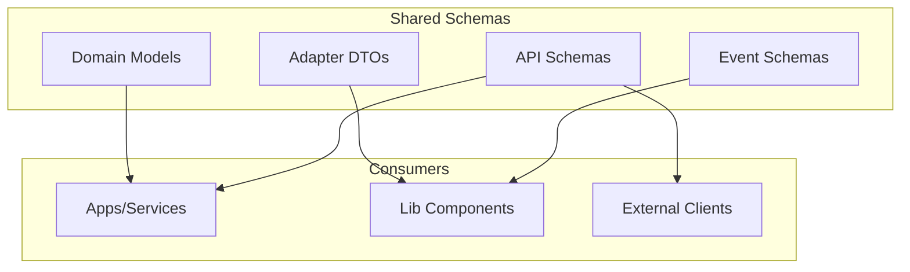

# Schemas Component

**Path**: `lib/src/holiday_peak_lib/schemas/`  
**Design Pattern**: Data Transfer Objects (DTOs) with Pydantic  
**Purpose**: Unified type-safe contracts for requests, responses, events, and domain models

## Overview

Provides a centralized schema registry using Pydantic models for validation, serialization, and API documentation. All apps and libs reference these schemas to ensure consistency across service boundaries.

**Key Benefits**:
- **Type Safety**: Mypy/Pylance catch type mismatches at dev time
- **Validation**: Automatic input validation with descriptive errors
- **Documentation**: FastAPI auto-generates OpenAPI specs from schemas
- **Serialization**: JSON encoding/decoding with datetime/UUID support
- **Versioning**: Schema evolution tracked in one place

## Architecture



## Schema Categories

### 1. Event Schemas

Used by orchestration component for SAGA choreography:

```python
from pydantic import BaseModel, Field
from datetime import datetime
from typing import Literal

class BaseEvent(BaseModel):
    """Base class for all events."""
    event_id: str = Field(default_factory=lambda: str(uuid.uuid4()))
    event_type: str
    correlation_id: str  # Links related events
    timestamp: datetime = Field(default_factory=datetime.utcnow)
    
    class Config:
        json_encoders = {
            datetime: lambda v: v.isoformat()
        }

class OrderCreatedEvent(BaseEvent):
    event_type: Literal["OrderCreated"] = "OrderCreated"
    order_id: str
    user_id: str
    items: list[dict]
    total: float
    currency: str = "USD"

class StockReservedEvent(BaseEvent):
    event_type: Literal["StockReserved"] = "StockReserved"
    order_id: str
    reserved_items: list[dict]
    warehouse_id: str

class PaymentProcessedEvent(BaseEvent):
    event_type: Literal["PaymentProcessed"] = "PaymentProcessed"
    order_id: str
    transaction_id: str
    amount: float
    payment_method: str
```

### 2. API Request/Response Schemas

Used by FastAPI apps for REST endpoints:

```python
class SearchRequest(BaseModel):
    """Request body for /search endpoint."""
    query: str = Field(..., min_length=1, max_length=500)
    user_id: Optional[str] = None
    filters: Optional[dict] = None
    limit: int = Field(10, ge=1, le=100)
    offset: int = Field(0, ge=0)

class ProductResponse(BaseModel):
    """Single product in search results."""
    sku: str
    name: str
    description: str
    price: float
    currency: str = "USD"
    image_url: Optional[str] = None
    stock_level: Optional[int] = None
    relevance_score: float

class SearchResponse(BaseModel):
    """Response body for /search endpoint."""
    products: list[ProductResponse]
    total_count: int
    query: str
    duration_ms: float
```

### 3. Domain Models

Represent business entities:

```python
class Customer(BaseModel):
    """Customer profile."""
    customer_id: str
    email: str = Field(..., regex=r"^[\w\.-]+@[\w\.-]+\.\w+$")
    first_name: str
    last_name: str
    tier: Literal["bronze", "silver", "gold", "platinum"]
    lifetime_value: float
    created_at: datetime
    last_purchase_at: Optional[datetime] = None

class Order(BaseModel):
    """Order aggregate."""
    order_id: str
    customer_id: str
    items: list["OrderItem"]
    subtotal: float
    tax: float
    shipping: float
    total: float
    status: Literal["pending", "processing", "shipped", "delivered", "cancelled"]
    created_at: datetime
    updated_at: datetime

class OrderItem(BaseModel):
    """Line item in order."""
    sku: str
    name: str
    quantity: int = Field(..., ge=1)
    unit_price: float
    total_price: float
```

### 4. Adapter DTOs

Used by adapters for external system integration:

```python
class InventoryQueryRequest(BaseModel):
    """Request to inventory adapter."""
    sku: str
    warehouse_id: Optional[str] = None

class InventoryQueryResponse(BaseModel):
    """Response from inventory adapter."""
    sku: str
    available_quantity: int
    reserved_quantity: int
    warehouse_id: str
    last_updated: datetime

class PriceQueryRequest(BaseModel):
    """Request to pricing adapter."""
    skus: list[str]
    customer_tier: Optional[str] = None
    currency: str = "USD"

class PriceQueryResponse(BaseModel):
    """Response from pricing adapter."""
    prices: dict[str, float]  # sku → price
    currency: str
    valid_until: datetime
```

## What's Implemented

✅ **Base Event Schema**: `BaseEvent` with event_id, correlation_id, timestamp  
✅ **10+ Event Types**: OrderCreated, StockReserved, PaymentProcessed, etc.  
✅ **20+ API Schemas**: Search, product detail, cart, checkout requests/responses  
✅ **Domain Models**: Customer, Order, OrderItem, Product, Inventory  
✅ **Adapter DTOs**: Inventory, Pricing, CRM, Logistics query/response pairs  
✅ **Validation Rules**: Email regex, min/max constraints, enum literals  
✅ **JSON Encoders**: Custom handling for datetime, UUID, Decimal  
✅ **Field Descriptions**: Docstrings for OpenAPI generation  

## What's NOT Implemented

### Schema Versioning

❌ **No Version Field**: Schemas don't carry `schema_version` for evolution  
❌ **No Migration Logic**: Breaking changes require manual client updates  
❌ **No Deprecation Warnings**: Old fields removed without grace period  

**To Implement Versioning**:
```python
class VersionedSchema(BaseModel):
    schema_version: int = 1
    
    @classmethod
    def from_dict(cls, data: dict) -> "VersionedSchema":
        """Deserialize with version handling."""
        version = data.get("schema_version", 1)
        
        if version == 1:
            return cls(**data)
        elif version == 2:
            # Migrate v1 → v2
            data = cls._migrate_v1_to_v2(data)
            return cls(**data)
        else:
            raise ValueError(f"Unsupported version: {version}")
    
    @staticmethod
    def _migrate_v1_to_v2(data: dict) -> dict:
        """Example migration: rename field."""
        if "old_field" in data:
            data["new_field"] = data.pop("old_field")
        return data

class OrderV2(VersionedSchema):
    schema_version: Literal[2] = 2
    order_id: str
    # ... new fields
```

### JSON Schema Generation

❌ **No Schema Export**: Can't generate JSON Schema files for external clients  
❌ **No OpenAPI Bundle**: No standalone OpenAPI spec for non-Python consumers  

**To Implement Export**:
```python
import json

# Generate JSON Schema for a model
schema = SearchRequest.model_json_schema()

# Save to file
with open("schemas/search_request.json", "w") as f:
    json.dump(schema, f, indent=2)

# Generate OpenAPI spec from FastAPI app
from fastapi.openapi.utils import get_openapi

openapi_spec = get_openapi(
    title="Holiday Peak Hub API",
    version="1.0.0",
    routes=app.routes
)

with open("openapi.json", "w") as f:
    json.dump(openapi_spec, f, indent=2)
```

### Cross-Language Support

❌ **No Protobuf/Avro**: Schemas only in Python; no language-neutral format  
❌ **No Code Generation**: No TypeScript/Java/C# clients generated from schemas  

**To Add Protobuf**:
```protobuf
// schemas/order.proto
syntax = "proto3";

message Order {
  string order_id = 1;
  string customer_id = 2;
  repeated OrderItem items = 3;
  double total = 4;
  string status = 5;
  int64 created_at = 6;
}

message OrderItem {
  string sku = 1;
  string name = 2;
  int32 quantity = 3;
  double unit_price = 4;
}
```

```python
# Generate Python from .proto
# protoc --python_out=. schemas/order.proto

# Use in code
from schemas import order_pb2

order = order_pb2.Order(
    order_id="123",
    customer_id="456",
    total=199.99
)
```

### Schema Registry

❌ **No Central Registry**: Schemas versioned in Git, not runtime-queryable  
❌ **No Runtime Validation**: Can't fetch schema by name/version at runtime  

**To Add Schema Registry** (using Confluent Schema Registry):
```python
from confluent_kafka.schema_registry import SchemaRegistryClient
from confluent_kafka.schema_registry.json_schema import JSONSerializer

schema_registry = SchemaRegistryClient({"url": "http://localhost:8081"})

# Register schema
schema_str = json.dumps(OrderCreatedEvent.model_json_schema())
schema_id = schema_registry.register_schema(
    subject="order-created-value",
    schema=Schema(schema_str, schema_type="JSON")
)

# Retrieve schema
schema = schema_registry.get_schema(schema_id)
```

### Custom Validators

❌ **No Business Rule Validators**: Validation is type/format only, not business logic  
❌ **Example**: No check for "order total = sum(item totals) + tax + shipping"  

**To Add Custom Validators**:
```python
from pydantic import validator, root_validator

class Order(BaseModel):
    items: list[OrderItem]
    subtotal: float
    tax: float
    shipping: float
    total: float
    
    @validator("subtotal")
    def subtotal_must_match_items(cls, v, values):
        """Validate subtotal = sum of item totals."""
        items = values.get("items", [])
        expected_subtotal = sum(item.total_price for item in items)
        
        if abs(v - expected_subtotal) > 0.01:  # Allow 1¢ rounding
            raise ValueError(f"Subtotal {v} doesn't match items total {expected_subtotal}")
        
        return v
    
    @root_validator
    def total_must_match(cls, values):
        """Validate total = subtotal + tax + shipping."""
        subtotal = values.get("subtotal", 0)
        tax = values.get("tax", 0)
        shipping = values.get("shipping", 0)
        total = values.get("total", 0)
        
        expected_total = subtotal + tax + shipping
        
        if abs(total - expected_total) > 0.01:
            raise ValueError(f"Total {total} doesn't match {expected_total}")
        
        return values
```

### Field Encryption

❌ **No Sensitive Field Encryption**: PII (email, card) stored as plaintext in schemas  
❌ **Risk**: Logs, error messages expose sensitive data  

**To Add Field Encryption**:
```python
from cryptography.fernet import Fernet
from pydantic import validator

cipher = Fernet(os.getenv("ENCRYPTION_KEY"))

class EncryptedStr(str):
    """Encrypted string type."""
    
    @classmethod
    def encrypt(cls, value: str) -> str:
        return cipher.encrypt(value.encode()).decode()
    
    @classmethod
    def decrypt(cls, value: str) -> str:
        return cipher.decrypt(value.encode()).decode()

class Customer(BaseModel):
    customer_id: str
    email_encrypted: str  # Stored encrypted
    
    @property
    def email(self) -> str:
        """Decrypt email on access."""
        return EncryptedStr.decrypt(self.email_encrypted)
    
    @classmethod
    def create(cls, customer_id: str, email: str) -> "Customer":
        """Encrypt email on creation."""
        return cls(
            customer_id=customer_id,
            email_encrypted=EncryptedStr.encrypt(email)
        )
```

### Localization

❌ **No i18n Support**: Error messages, field descriptions in English only  
❌ **No Currency Formatting**: Prices stored as float, not locale-aware  

**To Add Localization**:
```python
from babel.numbers import format_currency

class LocalizedProductResponse(ProductResponse):
    @property
    def formatted_price(self) -> str:
        """Format price for user's locale."""
        locale = get_user_locale()  # From request context
        return format_currency(self.price, self.currency, locale=locale)

# Error messages
ERROR_MESSAGES = {
    "en": {
        "invalid_email": "Invalid email address",
        "out_of_stock": "Product out of stock"
    },
    "es": {
        "invalid_email": "Dirección de correo inválida",
        "out_of_stock": "Producto agotado"
    }
}

def get_error_message(key: str, locale: str = "en") -> str:
    return ERROR_MESSAGES.get(locale, {}).get(key, key)
```

## Extension Guide

### Adding a New Schema Category

To add a fifth category (e.g., **Webhook Payloads**):

**Step 1**: Create module
```python
# lib/src/holiday_peak_lib/schemas/webhooks.py
from pydantic import BaseModel, Field

class WebhookPayload(BaseModel):
    """Base class for webhook payloads."""
    webhook_id: str = Field(default_factory=lambda: str(uuid.uuid4()))
    event_type: str
    timestamp: datetime = Field(default_factory=datetime.utcnow)
    signature: str  # HMAC signature for verification

class OrderStatusWebhook(WebhookPayload):
    event_type: Literal["order.status_changed"] = "order.status_changed"
    order_id: str
    old_status: str
    new_status: str
    updated_by: str
```

**Step 2**: Export from package
```python
# lib/src/holiday_peak_lib/schemas/__init__.py
from .webhooks import OrderStatusWebhook

__all__ = ["OrderStatusWebhook", ...]
```

**Step 3**: Use in webhook endpoint
```python
@app.post("/webhooks/order-status")
async def receive_order_status_webhook(payload: OrderStatusWebhook):
    # Verify signature
    verify_webhook_signature(payload.signature, payload.model_dump_json())
    
    # Process webhook
    await handle_order_status_change(payload)
```

### Creating Derived Schemas

Reuse base schemas with inheritance:

```python
class BaseProductResponse(BaseModel):
    sku: str
    name: str
    price: float

class EnrichedProductResponse(BaseProductResponse):
    """Product with additional ACP metadata."""
    description: str
    features: list[str]
    reviews_count: int
    avg_rating: float
    related_products: list[str]

class MinimalProductResponse(BaseProductResponse):
    """Product for list views (no details)."""
    image_url: str
    stock_status: Literal["in_stock", "low_stock", "out_of_stock"]
```

### Custom Field Types

Create reusable field types with validation:

```python
from pydantic import Field, validator
from typing import Annotated

# SKU format: PREFIX-NUMBER (e.g., NIKE-001)
SKU = Annotated[str, Field(regex=r"^[A-Z]+-\d+$")]

# Email with additional validation
class Email(str):
    @classmethod
    def __get_validators__(cls):
        yield cls.validate
    
    @classmethod
    def validate(cls, v):
        if not re.match(r"^[\w\.-]+@[\w\.-]+\.\w+$", v):
            raise ValueError("Invalid email format")
        
        # Additional check: no disposable domains
        domain = v.split("@")[1]
        if domain in ["tempmail.com", "guerrillamail.com"]:
            raise ValueError("Disposable email not allowed")
        
        return cls(v)

# Usage
class Customer(BaseModel):
    email: Email
    sku: SKU
```

## Testing

### Current State

⚠️ **Basic Tests Only**:
- ✅ Schema validation tests (~50 tests): Valid inputs pass, invalid inputs raise
- ✅ Serialization tests: datetime → ISO8601, UUID → string
- ❌ **No Regression Tests**: Schema changes not tested against old payloads
- ❌ **No Property-Based Tests**: No fuzzing with Hypothesis

### Recommendations

**Add Regression Tests**:
```python
@pytest.mark.parametrize("payload_file", [
    "fixtures/order_v1.json",
    "fixtures/order_v2.json"
])
def test_order_schema_backward_compatibility(payload_file):
    """Ensure new schema accepts old payloads."""
    with open(payload_file) as f:
        data = json.load(f)
    
    # Should not raise
    order = Order(**data)
    assert order.order_id is not None
```

**Add Property-Based Tests**:
```python
from hypothesis import given, strategies as st

@given(
    sku=st.from_regex(r"^[A-Z]+-\d+$"),
    price=st.floats(min_value=0.01, max_value=10000.0),
    quantity=st.integers(min_value=1, max_value=100)
)
def test_order_item_properties(sku: str, price: float, quantity: int):
    """Fuzz test OrderItem with random valid inputs."""
    item = OrderItem(
        sku=sku,
        name="Test Product",
        quantity=quantity,
        unit_price=price,
        total_price=price * quantity
    )
    
    # Properties must hold
    assert item.total_price == pytest.approx(item.unit_price * item.quantity)
```

**Add Schema Diff Tests**:
```bash
# Generate schema from current code
python scripts/export_schemas.py > schemas_new.json

# Compare with previous version
diff schemas_old.json schemas_new.json

# Fail CI if breaking changes detected
python scripts/check_schema_compatibility.py schemas_old.json schemas_new.json
```

## Documentation

### Current State

⚠️ **Basic Docstrings Only**:
- ✅ Class docstrings for each schema
- ✅ Field descriptions via `Field(description="...")`
- ❌ **No Schema Catalog**: No browsable documentation site
- ❌ **No Examples**: No sample JSON payloads in docs

### Recommendations

**Generate Schema Catalog**:
```python
# scripts/generate_schema_docs.py
from holiday_peak_lib.schemas import *
import inspect

def generate_schema_docs():
    schemas = [
        cls for name, cls in globals().items()
        if inspect.isclass(cls) and issubclass(cls, BaseModel)
    ]
    
    with open("docs/schemas.md", "w") as f:
        f.write("# Schema Reference\n\n")
        
        for schema in schemas:
            f.write(f"## {schema.__name__}\n\n")
            f.write(f"{schema.__doc__}\n\n")
            
            # Example JSON
            example = schema.model_json_schema()
            f.write("```json\n")
            f.write(json.dumps(example, indent=2))
            f.write("\n```\n\n")

generate_schema_docs()
```

**Add Example Fixtures**:
```python
# lib/src/holiday_peak_lib/schemas/examples.py
ORDER_EXAMPLE = Order(
    order_id="order-123",
    customer_id="customer-456",
    items=[
        OrderItem(
            sku="NIKE-001",
            name="Nike Air Max",
            quantity=2,
            unit_price=129.99,
            total_price=259.98
        )
    ],
    subtotal=259.98,
    tax=20.80,
    shipping=9.99,
    total=290.77,
    status="pending",
    created_at=datetime.utcnow(),
    updated_at=datetime.utcnow()
)

# Use in OpenAPI
@app.post("/orders", response_model=Order)
async def create_order(order: Order = Body(..., example=ORDER_EXAMPLE.model_dump())):
    ...
```

## Security Considerations

### Current State

⚠️ **Minimal Security**:
- ✅ Input validation (type, format, constraints)
- ❌ **No Sensitive Data Masking**: Logs/errors expose PII
- ❌ **No Field-Level Encryption**: Sensitive fields stored plaintext
- ❌ **No Rate Limiting**: Schema complexity could cause DoS

### Recommendations

**Mask Sensitive Fields in Logs**:
```python
class SecureCustomer(Customer):
    def __repr__(self):
        """Mask email in logs."""
        masked_email = self.email[:3] + "***@" + self.email.split("@")[1]
        return f"Customer(id={self.customer_id}, email={masked_email})"
```

**Limit Schema Complexity**:
```python
class SearchRequest(BaseModel):
    query: str
    filters: dict = Field(..., max_items=10)  # Limit filter count
    
    @validator("filters")
    def validate_filter_depth(cls, v):
        """Prevent deeply nested filters (DoS)."""
        def check_depth(obj, depth=0):
            if depth > 3:
                raise ValueError("Filter nesting too deep")
            if isinstance(obj, dict):
                for val in obj.values():
                    check_depth(val, depth + 1)
        
        check_depth(v)
        return v
```

## Configuration

### Environment Variables

| Variable | Description | Default | Required |
|----------|-------------|---------|----------|
| `SCHEMA_VALIDATION_STRICT` | Fail on unknown fields | `false` | ❌ |
| `SCHEMA_ENCRYPTION_KEY` | Fernet key for encrypted fields | - | ⚠️ (if using encryption) |

## Related Components

- [Adapters](adapters.md) — Use adapter DTOs for external system contracts
- [Orchestration](orchestration.md) — Use event schemas for SAGA choreography
- [Agents](agents.md) — Use API schemas for tool input/output

## Related ADRs

- [ADR-001: Python 3.13](../../adrs/adr-001-python-3.13.md) — Pydantic v2 support

---

**License**: MIT + Microsoft | **Author**: Ricardo Cataldi | **Last Updated**: December 30, 2025
