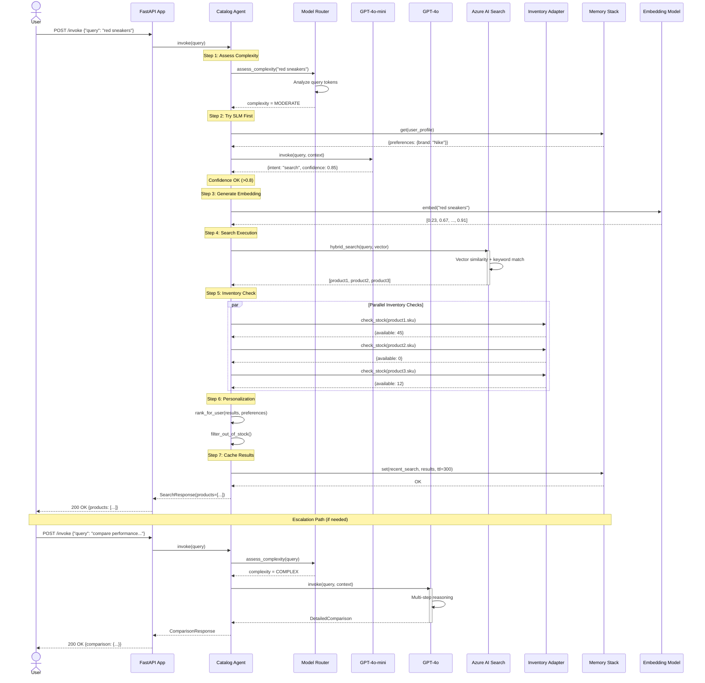

# Sequence Diagram: E-commerce Catalog Search Flow

This diagram illustrates the end-to-end flow for product search in the Holiday Peak Hub accelerator.

## Flow Overview

1. **User Query** → API Gateway
2. **SLM-First Routing** → Complexity assessment
3. **Search Execution** → Azure AI Search (vector + hybrid)
4. **Inventory Validation** → Check stock availability
5. **Personalization** → Rank based on user preferences
6. **Response Assembly** → Return ACP-aligned results

## Sequence Diagram



## Key Decision Points

### 1. Complexity Assessment
**Location**: Model Router  
**Decision**: Route to SLM or LLM based on query complexity
- **Simple/Moderate** → Try SLM first
- **Complex** → Skip directly to LLM

### 2. Confidence Check
**Location**: Agent  
**Decision**: Accept SLM response or escalate to LLM
- **Confidence > 0.8** → Return SLM response
- **Confidence ≤ 0.8** → Escalate to LLM

### 3. Inventory Filtering
**Location**: Agent  
**Decision**: Include/exclude out-of-stock items
- **Default**: Filter out items with `available = 0`
- **Optional**: Show out-of-stock with backorder info

### 4. Personalization Strategy
**Location**: Agent  
**Decision**: Apply user preferences to ranking
- **No profile** → Rank by relevance score only
- **Profile exists** → Boost preferred brands/categories

## Performance Characteristics

| Step | Target Latency | Optimization |
|------|----------------|--------------|
| Complexity assessment | < 10ms | Cached patterns |
| SLM invocation | < 500ms | Small model |
| Embedding generation | < 100ms | Batch embedding |
| Search execution | < 200ms | Indexed fields |
| Inventory check (parallel) | < 300ms | Async + connection pool |
| Personalization | < 50ms | In-memory ranking |
| **Total (P95)** | **< 1.2s** | |

## Error Handling

### Search Failures
```python
try:
    results = await search.hybrid_search(query, vector)
except SearchUnavailableError:
    # Fallback to cached popular products
    results = await memory.get("popular_products")
```

### Inventory Timeout
```python
try:
    stock = await asyncio.wait_for(
        inventory.check_stock(sku),
        timeout=0.5
    )
except asyncio.TimeoutError:
    # Assume in stock, but flag as uncertain
    stock = {"available": -1, "uncertain": True}
```

### Model Unavailable
```python
try:
    response = await llm.invoke(query)
except ModelThrottledError:
    # Fallback to SLM with best effort
    response = await slm.invoke(query, force=True)
```

## Observability

### Metrics Tracked
```python
# Request metrics
metrics.histogram("search.latency_ms", duration)
metrics.counter("search.requests", {"status": "success"})

# Model routing
metrics.counter("model.invocations", {"model": "slm|llm"})
metrics.counter("model.escalations")
metrics.histogram("model.confidence", confidence)

# Search quality
metrics.histogram("search.result_count", len(results))
metrics.counter("search.zero_results")
metrics.histogram("search.relevance_score", avg_score)

# Inventory checks
metrics.histogram("inventory.check_latency_ms", duration)
metrics.counter("inventory.out_of_stock", {"sku": sku})
```

### Distributed Tracing
```python
from opencensus.trace import tracer

with tracer.span(name="catalog_search") as span:
    span.add_attribute("query", query)
    span.add_attribute("user_id", user_id)
    
    with tracer.span(name="search_execution"):
        results = await search.hybrid_search(query, vector)
    
    with tracer.span(name="inventory_check"):
        await check_inventory_parallel(results)
```

## Related Documentation
- [ADR-013: SLM-First Model Routing](../adrs/adr-013-model-routing.md)
- [ADR-011: ACP Alignment for Catalog Search](../adrs/adr-011-acp-catalog-search.md)
- [E-commerce Catalog Search Component](../components/apps/ecommerce-catalog-search.md)
