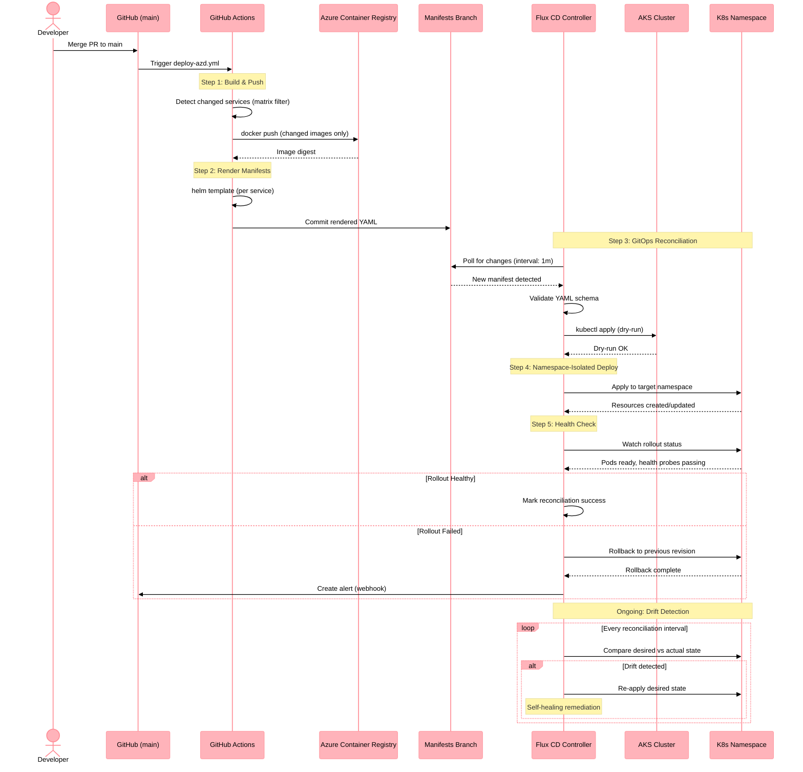

# Sequence Diagram: Flux CD GitOps Deployment

This diagram illustrates the GitOps deployment pipeline using Flux CD as implemented in ADR-033 (PR #785, #792).

## Flow Overview

1. **PR Merge** → Developer merges to `main`
2. **CI Build** → GitHub Actions builds and pushes container images to ACR
3. **Manifest Update** → Rendered Kubernetes manifests committed to manifests branch
4. **Flux Reconciliation** → Flux detects changes and applies to AKS clusters
5. **Health Check** → Flux validates rollout health before proceeding
6. **Self-Healing** → Flux auto-remediates drift from desired state

## Sequence Diagram

## Namespace Isolation (ADR-034)

Services are deployed to two isolated namespaces per ADR-034:

| Namespace | Services | Network Policy |
|-----------|----------|----------------|
| `holiday-peak-crud` | crud-service (1 service) | Allow: UI ingress, agent egress |
| `holiday-peak-agents` | All 26 agent services (eCommerce, CRM, Inventory, Logistics, Product Mgmt, Search, Truth Layer) | Allow: CRUD, Event Hubs, AI Search, Cosmos DB |

## Related

- [ADR-033: Helm Deployment Strategy](../adrs/adr-033-helm-deployment-strategy.md)
- [ADR-034: Namespace Isolation](../adrs/adr-034-namespace-isolation-strategy.md)
- [Infrastructure README](../../../.infra/README.md)
