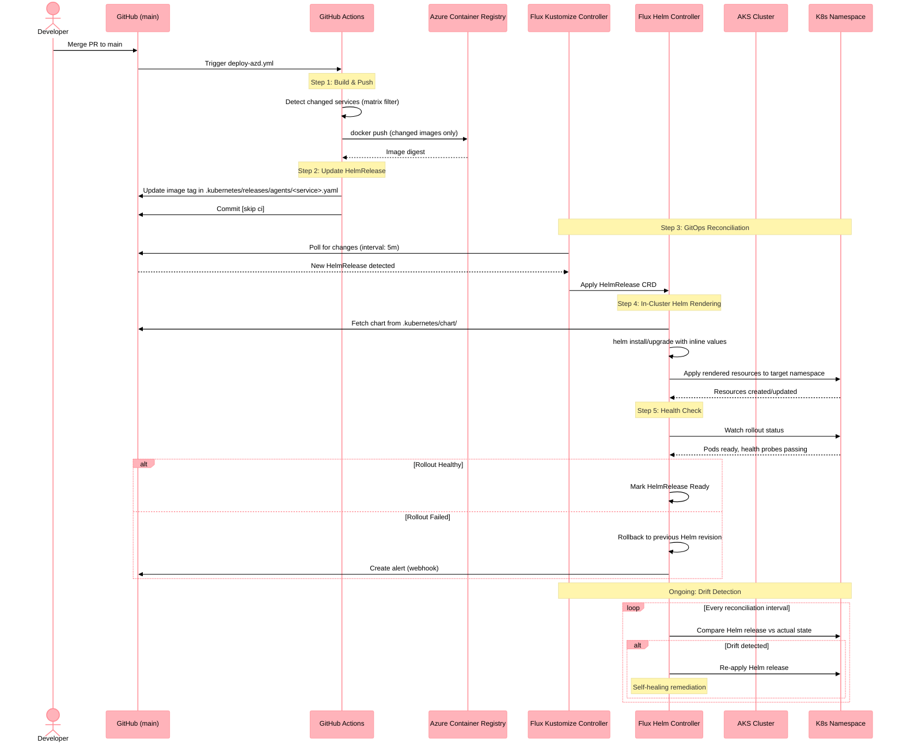
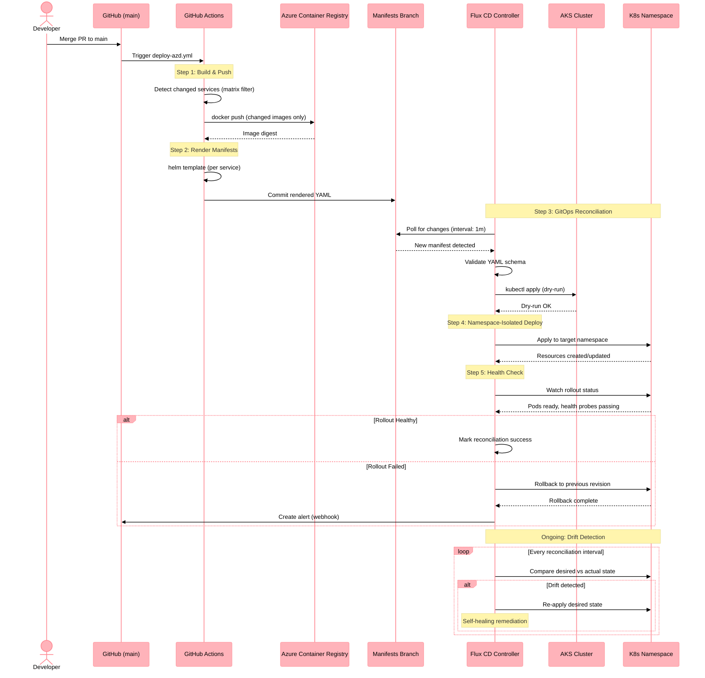

# Sequence Diagram: Flux CD GitOps Deployment

This diagram illustrates the GitOps deployment pipeline using Flux CD as implemented in ADR-017.

## Deployment Patterns

### Phase 2: HelmRelease (target state, pilot: ecommerce-catalog-search)

Services migrated to Phase 2 use Flux HelmRelease CRDs that render the shared Helm chart in-cluster.

1. **PR Merge** → Developer merges HelmRelease changes to `main`
2. **CI Build** → GitHub Actions builds and pushes container images to ACR
3. **HelmRelease Update** → Developer updates image tag in `.kubernetes/releases/agents/<service>.yaml`
4. **Flux Reconciliation** → Kustomize Controller applies HelmRelease CRD → Helm Controller renders chart in-cluster
5. **Health Check** → Flux validates rollout health
6. **Self-Healing** → Flux auto-remediates drift from desired state

### Phase 1: Rendered YAML (legacy, 25 services)

Services not yet migrated use the original pattern where CI renders Helm to static YAML.

1. **PR Merge** → Developer merges to `main`
2. **CI Build** → GitHub Actions builds and pushes container images to ACR
3. **Manifest Render** → `render-helm.sh` generates static YAML, CI commits to Git
4. **Flux Reconciliation** → Kustomize Controller applies rendered YAML to cluster

## Phase 2 Sequence Diagram (HelmRelease)

## Phase 1 Sequence Diagram (Rendered YAML — Legacy)

## Namespace Isolation (ADR-026)

Services are deployed to two isolated namespaces per ADR-026:

| Namespace | Services | Network Policy |
|-----------|----------|----------------|
| `holiday-peak-crud` | crud-service (1 service) | Allow: UI ingress, agent egress |
| `holiday-peak-agents` | All 26 agent services (eCommerce, CRM, Inventory, Logistics, Product Mgmt, Search, Truth Layer) | Allow: CRUD, Event Hubs, AI Search, Cosmos DB |

## Related

- [ADR-017: Helm Deployment Strategy](../adrs/adr-017-deployment-strategy.md)
- [ADR-026: Namespace Isolation](../adrs/adr-026-namespace-isolation-strategy.md)
- [Infrastructure README](../../../.infra/README.md)
