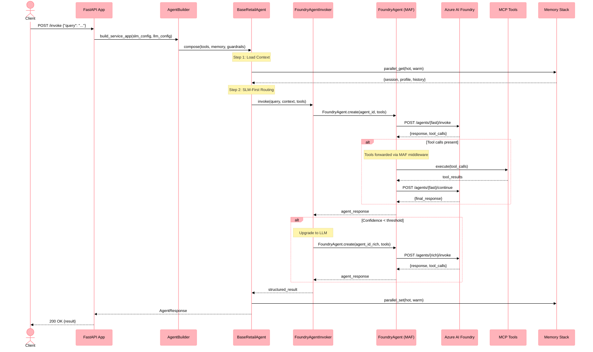

# Sequence Diagram: FoundryAgentInvoker Flow

This diagram illustrates the agent invocation flow using the Microsoft Agent Framework (MAF) `FoundryAgentInvoker`, which replaced the legacy `FoundryInvoker` in PR #802.

## Flow Overview

1. **Request** → FastAPI endpoint receives invoke request
2. **Agent Build** → `AgentBuilder` composes agent with tools, memory, and model config
3. **Model Routing** → SLM-first assessment, optional upgrade to LLM
4. **MAF Invocation** → `FoundryAgentInvoker` delegates to `FoundryAgent` runtime
5. **Tool Execution** → Tools forwarded through MAF middleware (not silently dropped)
6. **Response** → Structured result returned through the agent pipeline

## Sequence Diagram

## Key Design Decisions

- **MAF `FoundryAgent` runtime**: Tools are registered with the agent at creation time and forwarded through MAF middleware, solving the silent tool-dropping issue in the legacy `FoundryInvoker`.
- **Parallel memory I/O**: Hot and warm memory are read/written concurrently via `asyncio.gather`.
- **SLM-first with LLM upgrade**: Every request starts with the fast (SLM) model; only complex queries escalate to the rich (LLM) model.

## Related

- [ADR-010: Model Routing](../adrs/adr-010-model-routing.md)
- [Agent Library Reference](../components/libs/agents.md)
- [Components Overview](../components.md)
